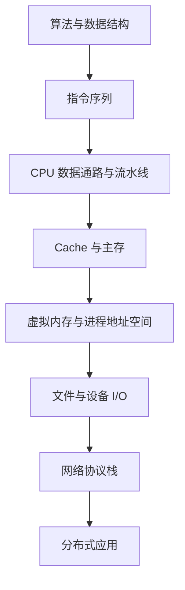

# 王道 408 知识体系

## 四科主线

| 科目 | 核心问题 | 知识主线 | 入口 |
|---|---|---|---|
| 数据结构 | 数据如何组织和处理 | 逻辑结构 → 存储结构 → 运算与复杂度 | [[数据结构目录]] |
| 计算机组成原理 | 指令如何在硬件上执行 | 数据表示 → 存储 → 指令 → CPU → I/O | [[组成原理目录]] |
| 操作系统 | 如何管理和抽象硬件资源 | 进程 → 内存 → 文件 → 设备 | [[操作系统目录]] |
| 计算机网络 | 主机如何跨网络通信 | 分层 → 链路 → 路由 → 端到端 → 应用 | [[计算机网络目录]] |

## 总体因果链

## 必须打通的关联

### 算法到机器执行

- 数据结构给出操作次数与渐近复杂度。
- 指令系统决定高级操作如何映射为机器指令。
- CPU、Cache 和存储层次决定常数开销与局部性效果。
- 操作系统的调度和虚拟内存会改变实际运行时延。

### 地址的不同含义

| 场景 | 地址/标识 | 解析者 |
|---|---|---|
| 数组或指针 | 逻辑位置、虚拟地址 | 编译器、CPU、MMU |
| Cache | 标记、组号、块内偏移 | Cache 控制器 |
| 虚拟内存 | 虚页号、页内偏移 | TLB、页表、MMU |
| 文件 | 文件偏移、逻辑块号 | 文件系统 |
| 网络 | MAC、IP、端口、域名 | 各层协议实体 |

### 并发与队列

- 栈和队列是中断、调用、缓冲和调度的基础结构。
- 进程同步关注共享状态的原子性和执行顺序。
- 网络可靠传输通过窗口、序号和确认管理并发在途数据。

## 复习时的四种表达

1. 概念题：给出定义、边界和对比对象。
2. 计算题：写出公式、单位、条件和中间步骤。
3. 过程题：画状态、表项、队列或报文时间线。
4. 算法题：说明输入输出、不变量、伪代码和复杂度。

## 导航

[[408考研复习总览]] · [[2027-408-考研学习计划]] · [[跨科关联索引]] · [[资料来源与版本说明]]

