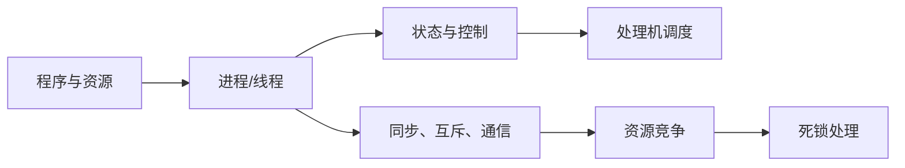
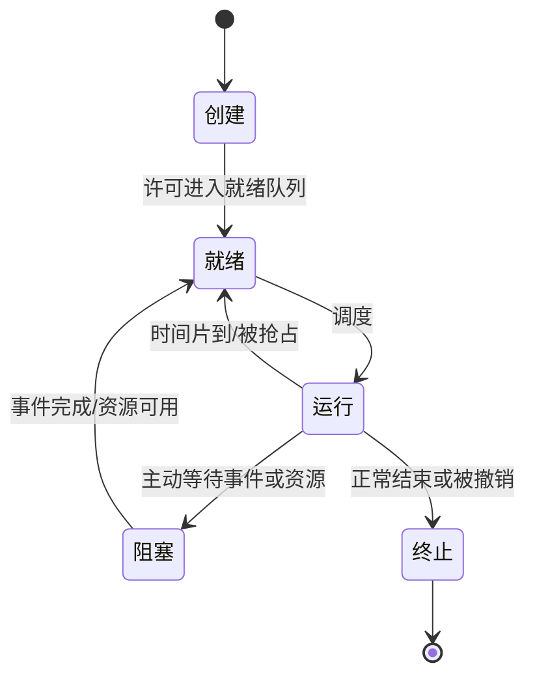

# 第2章 进程与线程

## 本章定位

本章是 408 操作系统的核心：用进程/线程描述并发活动，用调度分配 CPU，用同步机制约束执行顺序，用死锁理论分析资源等待。综合题必须把**状态、事件、队列和资源不变量**写清。

## 章节导航

1. 进程、PCB、状态与控制
2. 线程、处理器调度与指标
3. 同步互斥、信号量、管程与经典模型
4. 死锁条件、预防、避免、检测与解除

## 考点地图

| 模块 | 高频任务 | 必备工具 |
|---|---|---|
| 状态转换 | 判事件导致何种转换 | 状态图、队列变化 |
| 调度 | 算周转/等待/响应时间 | 甘特图、抢占点 |
| PV | 补信号量、判断阻塞与结果 | 资源含义、不变量、先同步后互斥 |
| 死锁 | 安全性与请求判断 | Need 矩阵、安全序列 |

> [!important] 408 必考
> PV 题先写“每个信号量代表什么”，再写初值和不变量。仅凭背代码填 P/V，遇到题目变形极易把同步、互斥或操作顺序写反。

## 核心知识框架



## 完整知识点

### 1. 进程与 PCB

进程是程序的一次执行过程。**在传统的未引入线程的操作系统中，进程既是资源分配的基本单位，也是处理机调度的基本单位；引入线程后，进程是资源分配的基本单位，线程成为处理机调度的基本单位。**进程实体/映像由程序段、数据段和 PCB 构成；PCB 是进程存在的唯一标志，记录 PID、状态、调度信息、内存映射、打开文件和资源清单。无线程模型的运行现场保存在 PCB 中；引入线程后，各线程的程序计数器、寄存器和栈等运行现场由相应 TCB 管理。

特征：动态性、并发性、独立性、异步性、结构性。程序是静态代码，进程是动态活动；同一程序可对应多个进程，一个进程也可在执行中装入多个程序。

### 2. 进程状态与转换



判断规则：

- 就绪：除 CPU 外运行条件均满足；阻塞：即使得到 CPU 也不能运行。
- 运行→阻塞通常是进程主动行为，如 `wait`、等待 I/O；阻塞→就绪由别的进程或中断完成。
- 不存在一般意义的阻塞→运行和就绪→阻塞直接转换。
- 创建态尚未取得所需资源，终止态等待 OS 回收 PCB。

挂起把进程映像换到外存：就绪挂起与阻塞挂起分别表示换出后的就绪和阻塞；阻塞挂起等到事件后转为就绪挂起，须换入后才成为活动就绪。

### 3. 进程控制与切换

创建、撤销、阻塞、唤醒、切换等操作以原语完成。无线程模型发生进程切换时，当前进程的程序计数器、寄存器和栈指针等处理机现场保存到 PCB；引入线程后，当前线程的程序计数器、寄存器和栈等处理机现场保存到 TCB，PCB 保留进程级状态、地址空间与资源信息，以及同线程表/TCB 的关联。切换时还要更新运行实体的状态与队列，选择并恢复下一运行实体。模式切换只改变特权级，开销小于进程或线程切换；线程切换是否涉及地址空间切换取决于线程是否同属一个进程。

### 4. 进程通信

- **共享存储**：双方映射共同区域，数据交换快，但必须另行同步。
- **消息传递**：直接或经信箱发送/接收消息，适合分布式和隔离地址空间。
- **管道**：内核缓冲区形成字节流；普通管道常用于有亲缘关系进程，读写端需同步。半双工指一个方向传输，双向通信可用两个管道。
- 低级通信传递状态或少量信息，高级通信可交换大量数据。

### 5. 线程与多线程模型

引入线程后，线程是处理机调度的基本单位，进程仍是资源分配的基本单位。同进程线程共享地址空间、代码、全局数据和打开文件；每个线程独有线程 ID、程序计数器、寄存器和栈。相对于创建、切换不同进程以及通过内核机制进行进程间通信，同一进程内的线程通常能降低创建、切换和通信成本。只有线程可被内核独立调度的一对一、多对多等模型，才可能让同一进程的多个线程同时在多核上运行；多对一模型的多个用户线程仅映射到一个内核线程，不能借此实现多核并行。

| 模型 | 特征 | 主要问题 |
|---|---|---|
| 多对一 | 多个用户线程映射一个内核线程 | 一个阻塞会阻塞全进程，不能多核并行 |
| 一对一 | 每个用户线程对应内核线程 | 并行与阻塞隔离好，管理开销较大 |
| 多对多 | 多个用户线程复用多个内核线程 | 兼顾并行与灵活性，实现复杂 |

用户级线程由线程库管理，内核不感知；内核级线程由 OS 调度。线程有用户级和内核级两种实现，不等于用户态和内核态。

### 6. 处理机调度

三级调度：高级/作业调度决定外存作业进入内存；中级/内存调度负责挂起与激活；低级的进程/线程调度从就绪队列选择 CPU 的下一个运行实体，具体称谓与调度单位依题设采用的无线程或多线程模型确定，频率最高。

不能调度或切换的典型时机：处理中断的关键阶段、执行不可中断原语、持有内核关键资源且切换会破坏一致性时。普通用户临界区不当然禁止调度。

调度指标：

$$
周转时间=完成时间-到达时间
$$

$$
带权周转时间=\frac{周转时间}{实际运行时间}
$$

$$
等待时间=周转时间-运行时间-I/O时间
$$

等待时间严格指进程在**就绪队列中等待处理机的累计时间**。上式只适用于从到达到完成的周转时间能够完整分解为“就绪等待时间 + CPU 实际运行时间 + 阻塞 I/O 时间”，且题目未另计创建、挂起、系统开销或其他阻塞时间的模型；条件不满足时，应在甘特图/状态时间线上逐段累计就绪区间。

响应时间是从提交请求到第一次获得响应的时间。

| 算法 | 抢占 | 优势 | 风险/条件 |
|---|---|---|---|
| FCFS | 否 | 简单、公平 | 对短作业不利，护航效应 |
| SJF | 通常否 | 已知服务时间时平均等待最小 | 长作业饥饿，服务时间靠预测 |
| SRTF | 是 | 新短作业可抢占 | 切换较多，长作业饥饿 |
| HRRN | 否 | 兼顾等待与服务时间 | 每次需计算响应比 |
| 优先级 | 可选 | 适合紧急任务 | 低优先级饥饿，可老化 |
| RR | 是 | 响应快、适合分时 | 时间片过大退化 FCFS，过小切换频繁 |
| 多级反馈队列 | 是 | 短作业优先且无需预知长度 | 参数设计复杂 |

HRRN 响应比：

$$
R=\frac{等待时间+要求服务时间}{要求服务时间}=1+\frac{等待时间}{要求服务时间}
$$

### 7. 同步、互斥与临界区

同步是直接制约关系，要求活动按先后次序合作；互斥是间接制约关系，源于竞争临界资源。访问临界资源的代码分进入区、临界区、退出区和剩余区。

软件/硬件方案评价遵循：空闲让进、忙则等待、有限等待、让权等待。Peterson 算法满足前 3 条但忙等；关中断只适合内核短临界区且不适合多处理器；TestAndSet、Swap 等原子指令实现自旋锁，仍会忙等。

### 8. 信号量语义与不变量

记录型信号量 `S` 含整数值和等待队列：

```text
wait(S):
    S.value = S.value - 1
    if S.value < 0: 当前进程进入 S 的等待队列并阻塞

signal(S):
    S.value = S.value + 1
    if S.value <= 0: 从 S 的等待队列唤醒一个进程
```

解释：在经典记录型信号量定义下，`S.value < 0` 时其绝对值表示正在该信号量队列中等待的进程数；`S.value > 0` 表示尚未被申请的许可数。**信号量值是许可与等待队列的编码，不总等于物理资源的即时计数**：存在阻塞等待者、已被唤醒但尚未继续执行者，或进程已经成功 P 而尚未完成配套 V 时，数值与实际空槽/成品数会有差异。P/wait 是申请许可或等待条件，V/signal 是归还许可或宣布事件。

常用守恒与约束：

- 容量为 $N$ 的有界缓冲区，令 $E$ 为未预留的空槽数、$F$ 为已发布且未被消费者预留的成品数、$P_{in}$ 为生产者成功 P(empty) 后至 V(full) 前已预留的槽数、$C_{in}$ 为消费者成功 P(full) 后至 V(empty) 前已预留但尚未释放的槽数，则全过程满足 $E+F+P_{in}+C_{in}=N$。在没有在途预留且没有等待/唤醒交接的稳定观察点，才可写成 `empty.value + full.value = N`；生产或消费正在两次同步操作之间时，不能把它当作全过程信号量恒等式。
- 二元互斥量 `mutex` 初值 1；任何时刻至多一个进程通过 P(mutex) 未执行 V(mutex)。
- 一次性前驱关系：前驱事件信号量初值 0，前驱完成 V，后继开始前 P。

#### 生产者—消费者

```text
semaphore empty = N, full = 0, mutex = 1

producer:
    produce(item)
    P(empty)
    P(mutex)
    put(item)
    V(mutex)
    V(full)

consumer:
    P(full)
    P(mutex)
    get(item)
    V(mutex)
    V(empty)
    consume(item)
```

必须先 P 同步信号量、后 P 互斥量。若先占 `mutex` 再等待 `empty/full`，对方无法进入缓冲区改变条件，会死锁。V 的顺序通常不影响正确性，但先释放互斥可缩短占用。

#### 读者—写者

读者优先模型中，`rw=1` 保护共享文件，`mutex=1` 保护 `readcount`：第一个读者 P(rw)，最后一个读者 V(rw)，写者直接 P/V(rw)。不变量是 `readcount>0` 时 `rw` 被读者群体占有。该方案可能使写者饥饿；增加闸门 `w=1`，读者和写者先竞争 `w`，可实现较公平的先来次序。

#### 哲学家进餐

直接让每人先拿左筷再拿右筷会形成环路。可破坏环路的方案：最多允许 4 人同时取筷；奇偶哲学家按相反顺序取；用互斥量一次检查并取得两支筷。写答案时明确筷子信号量初值均为 1，限制信号量初值为 $N-1$。

#### 吸烟者与前驱图

吸烟者问题用三个完成事件信号量表示供应组合，供应者依据轮次 V 对应信号量，再 P(done) 等待吸烟结束；各吸烟者 P 自己所需组合，完成后 V(done)。前驱图每条有向边可对应一个初值 0 的信号量：前驱 V，后继 P；多前驱节点须等待全部入边。

### 9. 管程

管程把共享数据、访问操作和初始化封装起来，任一时刻通常只允许一个进程在管程中活跃，因此天然保证互斥。条件变量没有数值，仅有等待队列；`x.wait()` 使调用者阻塞并释放管程，`x.signal()` 唤醒等待者。条件变量用于同步，管程入口互斥用于互斥，不要把条件变量当计数信号量。

> [!note] 理解补充
> Hoare 语义下 signal 后立即把管程交给被唤醒者；Mesa 语义下被唤醒者只变为可运行，重新进入后应再次检查条件，因此常写 `while (!condition) wait()`。

### 10. 死锁

死锁是多个进程因竞争资源形成循环等待，若无外力将永久不能推进。饥饿是某进程长期得不到服务但系统仍推进；死循环是程序逻辑错误。

四个必要条件：互斥、请求并保持、不剥夺、循环等待。四者同时成立只是死锁可能发生的条件。

| 策略 | 时机 | 方法 |
|---|---|---|
| 预防 | 分配规则预先限制 | 破坏四条件之一 |
| 避免 | 每次请求时判断 | 保持安全状态，银行家算法 |
| 检测 | 允许发生后周期检查 | 资源分配图或检测算法 |
| 解除 | 检测后处理 | 撤销、回退、剥夺资源 |

预防方法：资源共享可破坏互斥但并非所有资源适用；一次申请全部资源破坏请求并保持但利用率低；允许剥夺破坏不剥夺；按统一编号递增申请破坏循环等待。

#### 银行家算法

数据结构：`Available` 为现有可用量；`Max` 为最大需求；`Allocation` 为已分配；`Need = Max - Allocation`。

处理进程 $P_i$ 的请求 `Request_i`：

1. 检查 `Request_i <= Need_i`，否则超过声明。
2. 检查 `Request_i <= Available`，否则令其等待。
3. 试分配：Available 减请求，Allocation 加请求，Need 减请求。
4. 安全性算法令 `Work=Available`，反复找 `Need_i<=Work` 的未完成进程，假定完成并令 `Work+=Allocation_i`。
5. 全部可完成则状态安全、正式分配；否则回滚试分配。

安全状态保证存在至少一个安全序列；不安全状态不等于已经死锁，但继续分配可能导致死锁。

#### 死锁检测

每类资源一个实例时，资源分配图存在环是死锁的充要条件；多实例时存在环只说明可能死锁。多实例死锁检测按下列步骤进行，向量比较均为逐分量比较：

1. 令 `Work = Available`。若 `Allocation_i == 0`，置 `Finish[i] = true`；否则置 `Finish[i] = false`。
2. 在尚未完成的进程中寻找某个 $P_i$，满足 `Finish[i] == false` 且 `Request_i <= Work`。
3. 若找到，假定该进程取得所需资源、运行完成并归还已有资源，令 `Work = Work + Allocation_i`、`Finish[i] = true`，返回第 2 步继续扫描。
4. 若再也找不到满足条件的进程，算法终止。所有 `Finish[i] == false` 的进程构成死锁集合；若全部为 true，则当前没有检测到死锁。

> [!info] 技术更新
> 现代通用 OS 的调度器与同步原语比 408 模型复杂，例如优先级继承可缓解优先级反转。考试若未给特殊机制，仍按教材的状态、队列和信号量语义推导。

## 典型题型与方法

### 题型一：状态转换

逐事件判断“是否具备除 CPU 外所有条件”。时间片到：运行→就绪；请求未完成 I/O：运行→阻塞；I/O 完成：阻塞→就绪；高优先级到达是否抢占取决于算法。

### 题型二：调度计算

1. 按到达时刻列就绪集合。
2. 仅在算法允许的决策点重新选择；抢占算法还要比较剩余时间/优先级。
3. 画甘特图，记录首次运行和完成时刻。
4. 分别计算周转、带权周转、等待和响应时间，最后求平均。

### 题型三：PV 设计

1. 找同步关系与临界资源。
2. 为每个信号量写含义、初值和守恒关系。
3. 在“条件变真处 V、使用条件前 P”；互斥 P/V 紧包临界区。
4. 检查每条路径能否释放已申请资源，检查 P 顺序是否形成环路。
5. 用极端调度模拟：缓冲区全空、全满、多个进程同时到达。

### 题型四：银行家算法

先算 Need，处理请求时必须完成两次合法性检查、一次试分配和一次完整安全性检查。安全序列不唯一，找到一条即可证明安全；找不到要列出卡住时的 Work 和未完成集合。

## 易错点

- PCB 是进程存在的唯一标志，程序段不是。
- 阻塞→就绪通常不由阻塞进程自己完成。
- 进程切换、模式切换和调度不是同一概念。
- SJF 的最优结论依赖已知服务时间和给定评价指标。
- RR 时间片过大接近 FCFS，过小会增大切换开销。
- P 后负值表示阻塞，V 前后条件要按题目给定语义判断。
- 互斥量保护“操作过程”，同步量表达“资源数量或事件是否发生”。
- 管程条件变量不保存资源计数。
- 不安全不等于已死锁；有环在多实例资源图中也不必然死锁。
- 哲学家方案仅保证无死锁时，还要另查是否饥饿。

## 跨章节/跨科联系

- [[第1章-计算机系统概述]]：时钟中断与系统调用产生调度点。
- [[第3章-内存管理]]：中级调度对应挂起/换入，缺页使运行进程阻塞。
- [[第5章-输入输出管理]]：I/O 完成中断唤醒进程，设备分配也可能死锁。
- 数据结构：就绪队列、等待队列、优先队列直接决定调度实现。

## 本章复习清单

- [ ] 能画五状态及挂起状态图，并为每条边举事件。
- [ ] 能区分进程、线程、用户级线程与内核级线程。
- [ ] 能独立画甘特图并计算四类调度指标。
- [ ] 能解释 P/V 的数值语义和阻塞/唤醒条件。
- [ ] 能为生产者消费者、读写者、哲学家写出信号量含义与不变量。
- [ ] 能说明管程互斥和条件变量同步的分工。
- [ ] 能背出死锁四条件并完成银行家算法全流程。

## 自测问题

1. 运行进程发出 I/O 请求和 I/O 完成时，分别发生什么状态转换？
2. 为什么模式切换不必然是进程切换？
3. SJF 为什么理论最优却难以直接实现？
4. 生产者为何必须先 P(empty) 再 P(mutex)？
5. 读者优先模型的不变量是什么，写者为何可能饥饿？
6. 安全、不安全和死锁三种状态之间是什么关系？
7. 多实例资源分配图有环为什么不能直接断言死锁？

## 资料依据

- 《2026 操作系统考研复习指导》第 2 章：进程线程、调度、同步互斥与死锁。
- OCR 全文用于核对章节顺序和术语，结合本库原章节及复习笔记纠正识别错误。
- 管程语义和优先级继承仅作理解补充，不替代 408 信号量与管程模型。

## 前后章节导航

上一章：[[第1章-计算机系统概述]] · 目录：[[操作系统目录]] · 下一章：[[第3章-内存管理]]
