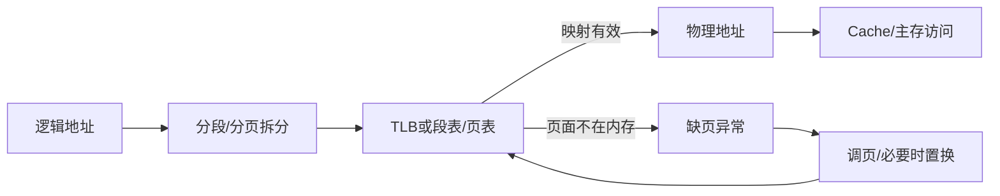

# 第3章 内存管理

## 本章定位

本章回答逻辑地址如何变成物理地址、内存不足时如何继续运行。地址转换题必须按“拆地址→查 TLB/页表→检查合法与有效位→形成物理地址→考虑 Cache”逐层判断，不能把缺页、TLB 未命中和 Cache 未命中混为一谈。

## 章节导航

1. 装入、链接、重定位、保护与共享
2. 连续分配、分页、分段与段页式
3. 请求分页、缺页处理、页框分配与置换
4. 工作集、抖动、内存映射文件与回收

## 考点地图

| 模块 | 核心条件 | 高频计算 |
|---|---|---|
| 连续分配 | 空闲区次序与碎片类型 | 分配/回收后空闲表 |
| 基本分页 | 页大小、页表级数、TLB 条件 | 地址字段、访存次数、页表容量 |
| 请求分页 | 有效位、权限位、脏位、是否有空闲框 | 缺页处理、有效访问时间 |
| 页面置换 | 页框数、局部/全局、算法规则 | 缺页次数、置换序列 |
| 工作集 | 窗口大小与驻留集 | 抖动原因与控制 |

> [!important] 408 必考
> TLB 未命中只表示还要查页表；页表项无效才可能缺页；Cache 未命中只表示到下一级存储器取数据。三者代价和处理者完全不同。

## 核心知识框架

## 完整知识点

### 1. 地址空间、装入与链接

逻辑地址由 CPU/程序生成，物理地址是主存单元地址。源程序经编译形成目标模块，经链接形成装入模块，再由装入程序放入内存。

- 静态链接：运行前把模块和库合成完整程序。
- 装入时动态链接：装入模块时解析外部引用。
- 运行时动态链接：首次调用模块时才装入并链接，节省空间且便于共享。
- 绝对装入：编译时已知地址；可重定位装入在装入时一次性改地址；动态运行时装入借助重定位寄存器在每次访问时变换，可移动进程。

覆盖由程序员把互斥执行的模块放入同一区域；交换由 OS 把整个进程移出/移入内存。虚拟存储以页或段为单位按需调入，三者粒度和控制者不同。

### 2. 内存保护与共享

连续分配可用基址/重定位寄存器和限长寄存器：逻辑地址先与限长比较，合法后加基址。分页用页表项中的访问权限、有效位和用户/内核位保护；分段便于按逻辑单位设置读写执行权限和共享。共享代码必须可重入，即执行中不修改自身，并为各进程保留独立数据。

### 3. 连续分配

| 方式 | 主要特点 | 碎片 |
|---|---|---|
| 单一连续 | 用户区只装一个程序 | 利用率低 |
| 固定分区 | 分区预先划定 | 内部碎片 |
| 动态分区 | 按进程实际大小切分 | 外部碎片 |

动态分区算法：首次适应从低地址找首个足够区；循环首次适应从上次位置继续；最佳适应选最小可用区，易留下小碎片；最坏适应选最大区，保留较大剩余区。回收时与前邻、后邻或两侧空闲区合并。紧凑可消除外部碎片，但要求动态重定位且移动开销大。

伙伴系统按 $2^k$ 大小拆分和合并，查找快但有内部碎片；408 若题干未引入，仍按给定分区算法作答。

### 4. 基本分页

页是逻辑地址空间固定大小块，页框/物理块是物理空间同样大小块。页面可装入任意页框，消除外部碎片，但最后一页可能有内部碎片。

若页面大小为 $L=2^k$ 字节，逻辑地址 $A$：

$$
p=\left\lfloor\frac{A}{L}\right\rfloor,\qquad d=A\bmod L
$$

页表查得页框号 $f$ 后：

$$
PA=f\times L+d
$$

地址转换步骤：

1. 根据页大小把逻辑地址分成页号和页内偏移。
2. 页号与页表长度比较，越界则地址越界异常。
3. 用页表基址和页号定位页表项，检查有效与权限。
4. 取页框号，与原偏移拼接成物理地址。

不含 TLB 时，一次数据访问通常先访页表再访数据，共 2 次访存；取指和操作数应按题目分别计数。

### 5. TLB 与多级页表

TLB 是页表项的相联高速缓存，命中可直接得到页框号；未命中查内存页表，若有效则通常回填 TLB。若 TLB 查找时间为 $t$、主存时间为 $m$、命中率为 $\alpha$，且 TLB 与页表串行查找：

$$
EAT=\alpha(t+m)+(1-\alpha)(t+2m)
$$

若题目说明并行查找或包含缺页率，必须按题设重建路径和概率，不能套式。

多级页表把页号再分级，使末级页表按需建立，解决大页表必须连续驻留的问题。$n$ 级页表且无 TLB 时，一次数据访问通常需 $n+1$ 次访存。每张页表不超过一页时，页表项数 = 页大小/页表项大小，据此确定每级索引位数。

反置页表按物理页框建立条目，记录所属进程与虚页号，条目少但查找需散列或相联机制。

> [!note] 理解补充
> 多级页表减少的是“当前进程实际需要建立的页表页”，不是改变虚拟地址空间可表示的页面总数；地址空间稀疏时收益最明显。

### 6. 分段与段页式

分段按程序逻辑划分变长段，逻辑地址为（段号，段内偏移）。段表项含段基址、段长和权限：先检查段号，再检验偏移 `< 段长`，合法后 `PA=段基址+偏移`。分段便于共享保护但产生外部碎片。

| 维度 | 分页 | 分段 |
|---|---|---|
| 目的 | 系统管理物理内存 | 满足程序逻辑组织 |
| 大小 | 固定 | 可变 |
| 地址 | 一维地址自动拆分 | 二维地址由程序显式给出 |
| 碎片 | 内部 | 外部 |
| 共享保护 | 以页为单位，不一定吻合逻辑 | 以逻辑段为单位，较自然 |

段页式先分段、段内再分页。地址为（段号、段内页号、页内偏移）；先查段表得到该段页表地址，再查页表得到页框号，最后拼接偏移。无快表时通常 3 次访存。

### 7. 虚拟内存与请求分页

虚拟内存建立在时间局部性和空间局部性上，使程序不必一次全部装入。特征：多次性、对换性、虚拟性。容量受计算机地址位数和外存容量限制，不是无限大。

请求页表项常含页框号、有效/存在位、访问位、修改/脏位、权限位与外存位置。地址转换中发现有效位为 0，触发缺页异常。

缺页处理：

1. 硬件保存现场，陷入内核；OS 检查访问是否合法。
2. 定位页面在外存的位置。
3. 有空闲页框则分配；没有则按范围和算法选择牺牲页。
4. 若牺牲页为脏页，先写回外存；更新其页表/TLB 状态。
5. 从外存读入所需页，等待期间可调度其他进程。
6. 更新页表、页框表并使相关 TLB 项失效或回填。
7. 恢复进程，重新执行引发缺页的指令。

一条指令可能跨页并访问多个操作数，因而可能产生多次缺页；重启必须保证指令效果可恢复。

### 8. 页框分配与调入策略

- 固定分配局部置换：驻留集固定，只换本进程页。
- 可变分配局部置换：依据缺页情况增减本进程驻留集。
- 可变分配全局置换：可从系统可换页框中选择，进程驻留集随之变化。

固定分配不能配全局置换，因为从别的进程取框会改变分配数。调入策略有预调页和请求调页；放置通常由分页机制任意选框。文件区与对换区的具体调入取决于页面来源和题设。

### 9. 页面置换算法

| 算法 | 淘汰规则 | 特点 |
|---|---|---|
| OPT | 未来最久不访问 | 理论下界，不能在线实现 |
| FIFO | 最早进入内存 | 简单，可能 Belady 异常 |
| LRU | 过去最久未访问 | 利用时间局部性，栈算法，无 Belady 异常 |
| CLOCK | 循环扫描访问位；1 清零，0 淘汰 | 近似 LRU，开销低 |
| 改进 CLOCK | 优先 `(访问位,修改位)=(0,0)`，再 `(0,1)` | 减少写回开销 |

改进 CLOCK 的 408 常用分轮规则如下。扫描指针始终沿环形队列向前延续：某轮完整扫描未找到牺牲页时，指针绕一周回到该轮起点；找到并置换后，指针移到被替换页框的下一页框，作为下次置换起点。

1. 第一轮从当前指针开始寻找首个 `(A,M)=(0,0)`，本轮不修改访问位；找到即淘汰。
2. 第一轮无结果时进行第二轮，寻找首个 `(0,1)`；扫描经过但未选中的页时把其访问位 `A` 清为 0，修改位 `M` 不变。找到 `(0,1)` 即淘汰。
3. 第二轮仍无结果时，因扫描已把经过页的 `A` 清零，进行第三轮，按延续的指针寻找 `(0,0)`，不清访问位；找到即淘汰。
4. 第三轮仍无结果时进行第四轮，寻找 `(0,1)`，必要时按第二轮规则清访问位；在非空驻留集中至迟本轮可选出牺牲页。

页面被访问时置 `A=1`，发生写操作时再置 `M=1`；换入新页的初始位按题目给定，未给时按教材约定处理。部分教材把“清 A”的时机或轮次合并描述，模拟题若明确给出变体，应以题设规则为准。

置换计算法：固定页框列，逐个读引用串；命中只更新算法状态，不计缺页；未命中先用空框，再按规则淘汰；每一步标记装入、命中或淘汰。FIFO 队列只在装入新页时变化；LRU 每次命中也更新新旧次序。

### 10. 工作集、缺页率与抖动

工作集 $W(t,\Delta)$ 是时刻 $t$ 前最近 $\Delta$ 次页面访问（或一段时间）涉及的不同页面集合，是程序当前局部性近似。驻留集是实际在内存的页面集合。若给进程的页框少于当前工作集，缺页频繁；系统因提高多道程度而不断剥夺页框，CPU 利用率反而下降，称抖动。

控制方法：按工作集分配足够页框、用缺页率上下阈值调节驻留集、降低多道程序度、采用局部置换避免一个进程扩散影响。

### 11. 页面回收、内存映射与共享

页面缓冲算法保留空闲页链和已修改页链，淘汰页暂不立即覆盖，若很快再次访问可快速恢复；脏页可批量写回。内存映射文件把文件区域映射进虚拟地址空间，访问转化为普通内存访问并按需调页，多个进程映射同一文件可共享物理页，但仍需同步。

### 12. TLB、Cache 与虚拟存储联合判断

完整路径：CPU 给虚拟地址 → TLB 命中或查页表 → 若缺页由 OS 调页 → 得物理地址 → 用物理地址或题设规定字段查 Cache → Cache 未命中访问主存。TLB 管“虚页到页框”，Cache 管“近期主存块副本”，虚拟存储管“主存与外存”。

> [!info] 技术更新
> 现代处理器常采用多级 TLB、页表遍历缓存和大页；OS 也可能采用写时复制与地址空间随机化。408 题若未特别说明，仍采用题干给出的单级/多级页表、理想 TLB 与基本请求分页模型。

## 典型题型与方法

### 题型一：地址字段与页表容量

先把容量都转成 2 的幂。偏移位数 = $\log_2$ 页大小；页号位数 = 虚拟地址位数 − 偏移位数；物理页框号位数 = 物理地址位数 − 偏移位数。页表项大小必须按题给定或能容纳页框号及控制位后向字节边界取整。

### 题型二：逐级地址转换

列出虚拟地址各字段，按外层到内层计算每级页表项地址，检查权限与有效位，再形成物理地址。问访存次数时确认页表/TLB/Cache 初始状态、是否把最终数据访问计入、页表项是否跨块。

### 题型三：有效访问时间

画概率树：TLB 命中、TLB 未命中但页在内存、缺页（干净/脏页）。每条路径把 TLB、页表、内存、磁盘和重启成本完整相加，再乘概率；极低缺页率也可能因磁盘代价显著影响结果。

### 题型四：置换与抖动

用表格逐项模拟引用串。题问是否 Belady 异常时需分别计算不同页框数的 FIFO 缺页数；不能因 FIFO“可能发生”就断言当前串发生。抖动题同时说明原因、现象与控制手段。

## 易错点

- 页大小与页框大小相等，页号不是物理块号。
- 页内偏移在转换中保持不变。
- 页表本身也占内存，多级页表节省的是无需建立的下级页表。
- TLB 命中率公式取决于串行/并行查找条件。
- 缺页异常处理后通常重新执行原指令。
- FIFO 队列命中时不移动，LRU 次序命中时要更新。
- OPT 看未来，LRU 看过去；CLOCK 的访问位为 1 时先清零而非立即淘汰。
- 分段先检查段长，分页主要检查页号越界和页表项权限。
- 工作集不等于驻留集，虚拟地址空间大小也不等于可用物理内存。

## 跨章节/跨科联系

- [[第2章-进程与线程]]：缺页使进程阻塞，页框不足影响多道程度与调度。
- [[第4章-文件管理]]：内存映射文件、页缓存和磁盘块共同影响访盘次数。
- 组成原理：TLB、Cache、主存、辅存构成层次；地址字段与存储芯片容量计算共用位运算。

## 本章复习清单

- [ ] 能区分三种装入、三种链接、覆盖、交换和虚拟存储。
- [ ] 能模拟动态分区分配与回收并识别内外碎片。
- [ ] 能完成单级、多级、分段和段页式地址转换。
- [ ] 能按题设计算 TLB 有效访问时间和访存次数。
- [ ] 能口述缺页处理七步及脏页额外开销。
- [ ] 能逐项模拟 OPT、FIFO、LRU、CLOCK。
- [ ] 能解释工作集、驻留集、缺页率与抖动的关系。

## 自测问题

1. 为什么动态重定位是进程移动的必要条件？
2. TLB 未命中、缺页和 Cache 未命中分别由谁处理？
3. 两级页表为何可能节省空间，又为何增加访问次数？
4. 请求分页中访问位和修改位分别服务什么决策？
5. 哪些置换算法属于栈算法，Belady 异常为何只说“可能”？
6. 系统提高多道程度为何可能降低 CPU 利用率？
7. 内存映射文件第一次访问某页时可能经历哪些步骤？

## 资料依据

- 《2026 操作系统考研复习指导》第 3 章：内存管理与虚拟内存管理。
- OCR 文本用于术语、公式与题型核对；结合本库原章节修正乱码和识别误差。
- 大页、写时复制等仅为现代实现提示，所有应试计算遵循题干模型。

## 前后章节导航

上一章：[[第2章-进程与线程]] · 目录：[[操作系统目录]] · 下一章：[[第4章-文件管理]]
