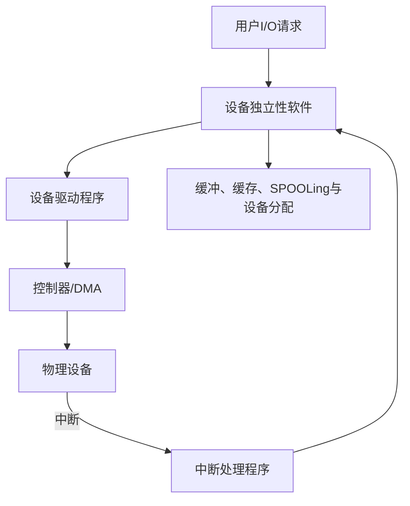

# 第5章 输入输出管理

## 本章定位

本章说明 OS 如何屏蔽设备差异、组织数据传输并调度外存请求。做计算题时要分开三类时间：设备与 CPU 的流水时间、磁盘寻道/旋转/传输时间、调度算法产生的磁头移动量。

## 章节导航

1. I/O 设备、控制器、控制方式与软件层次
2. 设备独立性、分配、缓冲与 SPOOLing
3. 磁盘结构、格式化、调度与可靠性
4. 固态硬盘的读写、擦除与磨损均衡

## 考点地图

| 模块 | 核心条件 | 高频任务 |
|---|---|---|
| I/O 控制 | 数据单位、CPU 是否忙等、中断频率 | 四种方式比较 |
| 缓冲 | 输入、处理、传送能否重叠 | 单/双缓冲时间 |
| SPOOLing | 磁盘井、外围进程、独占设备 | 判断作用与组成 |
| 磁盘调度 | 初始磁头、方向、边界规则 | 移动序列和总道数 |
| 旋转延迟 | 扇区编号、转速、交错/错位 | 存取时间与布局 |

> [!important] 408 必考
> 对**初始时刻给定且扫描途中无新请求到达的静态请求集合**，SCAN 与 LOOK 在同一方向内的请求服务次序相同，区别是无更远请求时是否仍走到物理端点；若途中动态到达新请求，两者的折返时机与后续服务次序可能变化。C-SCAN/C-LOOK 回程通常不服务，但回程移动量是否计入总寻道必须按题意计算。

## 核心知识框架

## 完整知识点

### 1. I/O 设备与接口

按交换单位可分块设备（磁盘，按块传输，常支持随机访问）和字符设备（键盘、串口，字符流）；按使用特性可分人机交互、存储、通信设备；按共享属性可分独占、共享和虚拟设备。

设备控制器是 CPU 与设备的接口，包含控制逻辑、数据缓冲寄存器、状态寄存器和控制寄存器。CPU 通过 I/O 端口访问寄存器：独立编址使用专门 I/O 指令，统一编址/内存映射 I/O 使用普通访存指令但相应地址通常不可缓存。

控制器接收命令、交换数据、报告状态、识别地址并进行差错检测。驱动程序把 OS 的抽象请求翻译成具体控制器命令。

### 2. 四种 I/O 控制方式

| 方式 | 数据路径与通知 | CPU 参与 | 适用特点 |
|---|---|---|---|
| 程序直接控制 | CPU 轮询状态并逐字传数据 | 全程忙等 | 简单、效率低 |
| 中断驱动 | 设备就绪时中断，CPU 在中断中逐字/少量传送 | 每次就绪均介入 | 可与设备并行但中断多 |
| DMA | 控制器在设备与主存间按块传送 | CPU 负责初始化和结束处理 | 高速块设备 |
| 通道 | 专用处理机执行通道程序并管理多个设备 | CPU 干预最少 | 大型系统、多设备 |

DMA 步骤：CPU 设置主存地址、设备地址、方向和计数并启动；DMA 控制器竞争总线，直接在设备与主存间传送并更新地址/计数；块完成或出错后中断 CPU。DMA 窃取总线周期会短暂延迟 CPU 访存，但 CPU 不逐字搬运。

### 3. I/O 软件层次

从上到下：

1. 用户层 I/O 软件：库函数、格式化、假脱机接口。
2. 设备独立性软件：统一命名、权限、分配、缓冲、错误处理与逻辑设备映射。
3. 设备驱动程序：设置寄存器、启动设备、检查状态。
4. 中断处理程序：保存现场、确认中断、取状态、唤醒等待进程。
5. 硬件：控制器与设备。

上层提供统一策略，下层处理设备细节。设备驱动通常属于内核，但具体结构以题干为准。

### 4. I/O 接口语义

- 阻塞 I/O：调用进程等待操作完成，状态通常变阻塞。
- 非阻塞 I/O：调用立即返回当前结果或“尚未就绪”，程序可重试。
- 异步 I/O：提交后继续执行，完成时由信号、回调或事件通知。

阻塞/非阻塞描述调用是否等待；同步/异步描述完成通知和控制流，两组概念不宜简单画等号。

### 5. 设备独立性与设备分配

设备独立性使应用使用逻辑设备名，不依赖具体物理设备；OS 通过逻辑设备表把逻辑名映射到驱动入口和物理设备。

典型分配数据结构：系统设备表 SDT、设备控制表 DCT、控制器控制表 COCT、通道控制表 CHCT，记录状态、队列和连接关系。

独占设备分配步骤：

1. 根据逻辑设备名查映射和 SDT，选择物理设备。
2. 检查设备状态与分配策略；忙则入设备等待队列。
3. 分配设备对应控制器，忙则等待。
4. 若有通道，再分配通道。
5. 建立占用关系，驱动程序启动 I/O；完成后逆序释放并唤醒等待者。

静态分配在进程运行前一次取得资源，可预防某些死锁但利用率低；动态分配灵活却需考虑安全性和分配顺序。

### 6. 缓存与缓冲

缓存保存数据副本以减少对慢速层访问，命中可跳过慢设备；缓冲暂存传输中的数据，以匹配速度、传输单位和时序，未必保存可重复使用副本。

缓冲目的：缓和速度不匹配、减少 CPU 中断频率、解决数据粒度差异、提高 CPU 与设备并行性。实现有单缓冲、双缓冲、循环缓冲和缓冲池。

设设备输入一块耗时 $T$，用户处理一块耗时 $C$，把缓冲内容复制到用户区耗时 $M$。连续处理 $n$ 块，典型单缓冲在稳态每块周期为 $\max(T,C)+M$，总时间还要按题目给出的首块填充和末块处理精确展开；若复制可与输入或计算重叠，公式会变化。

双缓冲使设备可在一个缓冲写入时，进程处理另一个缓冲，稳态吞吐受较慢阶段限制。计算方法：画设备、复制、处理三条时间线，明确缓冲何时空闲，不能只背一个固定公式。

### 7. SPOOLing

SPOOLing 用磁盘上的输入井、输出井和内存缓冲，把低速独占设备改造为可由多个进程共享使用的虚拟设备。预输入程序把设备输入送入输入井；缓输出程序把输出井作业送往设备；井管理程序维护队列。

打印时，用户进程把输出写入磁盘输出井并生成请求项，很快返回；后台输出进程按序驱动真实打印机。SPOOLing 实现联机条件下的脱机输入输出思想，需要多道程序设计和外存支持；它不把物理打印机变成真正可并行打印的设备，只让多个用户并发提交作业。

### 8. 一次 I/O 的完整路径

用户执行 `read` → 系统调用进入内核 → 文件系统把文件偏移映射为逻辑块 → 块层检查缓存并形成设备请求 → 设备独立层选择设备、排队 → 驱动设置控制器/DMA → 设备传输 → 完成中断 → 中断处理确认状态并唤醒进程 → 数据复制/映射到用户空间 → 系统调用返回。

若缓存命中，可能不启动设备；若采用内存映射，访问路径可能以缺页异常开始。

### 9. 磁盘结构与访问时间

磁盘由盘片、磁道、扇区、柱面和磁头组成。一个柱面是各盘面相同半径的磁道集合。逻辑块经控制器映射到物理扇区。

$$
T_a=T_s+T_r+T_t
$$

其中 $T_s$ 为寻道时间，$T_r$ 为旋转延迟，$T_t$ 为传输时间。平均旋转延迟通常为半圈：若转速 $R$ rpm，平均旋转延迟为 $30/R$ 秒；传输一个扇区约为一圈时间除以每磁道扇区数。实际题还可能计控制器开销和排队时间。

### 10. 磁盘调度算法

| 算法 | 服务规则 | 性能特征 |
|---|---|---|
| FCFS | 按到达次序 | 公平，移动量可能大 |
| SSTF | 选离当前磁头最近请求 | 平均寻道较小，远端请求可能饥饿 |
| SCAN | 沿当前方向服务，至端点后反向 | 较 SSTF 不易使远端请求饥饿，但等待时间仍有位置偏差 |
| LOOK | 沿方向至最远请求后反向 | 避免走无请求区 |
| C-SCAN | 单向服务，至端点后快速返回另一端 | 改善不同磁道位置的等待均匀性，回程不服务 |
| C-LOOK | 单向服务至最远请求，跳到另一端最远请求 | 减少无请求区移动 |

计算步骤：

1. 标出当前磁道、请求集合、初始方向和磁道边界。
2. 按算法写完整服务/移动序列；同距请求按题设或到达次序处理。
3. 相邻位置差的绝对值求和，包含算法要求的端点或回程移动。
4. 平均寻道长度 = 总移动量/请求数；若请求动态到达，必须按到达时刻更新可选集合。

磁盘调度主要优化寻道，不直接消除旋转延迟。扇区交错编号让处理一个扇区后的控制时间不致错过下一个；不同盘面/磁道错位命名可减少切换后的旋转等待。

### 11. 磁盘管理与可靠性

低级格式化划分扇区并写控制信息；分区建立逻辑卷；逻辑格式化创建文件系统元数据。引导块存放启动代码。坏块可由控制器维护备用扇区和坏块表，对 OS 隐藏替换；简单系统也可由文件系统标记不可分配。

RAID 通过条带、镜像和校验提高性能或可靠性。RAID 0 仅条带无冗余；RAID 1 镜像；带分布式校验的级别可容忍一定磁盘故障。RAID 不是备份，不能防误删、恶意修改或阵列整体损坏。

### 12. 固态硬盘

SSD 由闪存芯片和控制器组成，无机械寻道与旋转延迟。以页为单位读写，以块为单位擦除；页通常不能原地覆盖，更新先写新页并把旧页标无效。闪存转换层 FTL 维护逻辑页到物理页映射，垃圾回收搬移有效页并擦除块。

磨损均衡把擦写分散到不同块；预留空间和 TRIM 有助于控制器回收无效页。SSD 仍有写放大、擦写寿命和垃圾回收延迟。

> [!note] 理解补充
> 对 HDD，逻辑上连续的数据通常有助于减少寻道和旋转等待；对 SSD，随机访问差距小，但写入布局仍受擦除块、并行通道和垃圾回收影响。

> [!info] 技术更新
> Linux 内核官方文档使用块多队列框架处理现代多核与高速存储，NVMe 设备具有多提交/完成队列。408 未给这些条件时，仍按单请求队列和经典磁盘调度算法计算。

## 典型题型与方法

### 题型一：I/O 控制方式辨析

看三个量：CPU 是否忙等、每个数据单位是否中断、设备与主存是否直接传输。DMA 是按块直传但仍需 CPU 初始化和完成中断；通道能执行更完整的 I/O 程序。

### 题型二：缓冲时间

先画资源占用时间线，标出设备、缓冲、用户区和 CPU。首块没有前驱重叠，末块还有尾部处理；中间稳态才可用最大阶段时间。缓冲数量不足时还要检查设备是否因缓冲未释放而停顿。

### 题型三：磁盘存取时间

分别求寻道、旋转、传输，统一毫秒/秒。平均旋转延迟只在扇区位置随机时取半圈；若给出当前扇区和目标扇区，要按旋转方向算确切角距离。

### 题型四：磁盘调度

严格写序列再求差。SCAN/C-SCAN 先确认是否要求走到 0 或最大磁道；LOOK/C-LOOK 只走到该方向最远请求。若回程不服务，不代表回程距离不计。

## 易错点

- 控制器是硬件，驱动程序是软件；设备独立层位于驱动之上。
- 中断驱动减少忙等，但每次传输仍可能频繁中断。
- DMA 不是 CPU 完全不参与，也不等同于 Cache 与主存传输。
- 缓冲与缓存目的不同，同一内存区域在不同语境可承担不同角色。
- SPOOLing 的输入/输出井在外存，内存中另有缓冲和请求队列。
- 逻辑设备独立性不意味着所有设备都支持相同操作。
- SCAN 的物理端点、LOOK 的最远请求点不能混淆。
- 磁头总移动量是相邻位置差之和，不能只算首尾差。
- 平均旋转延迟的半圈假设必须满足随机位置条件。
- SSD 不需要磁盘寻道算法，但仍需要 I/O 调度和队列管理。

## 跨章节/跨科联系

- [[第1章-计算机系统概述]]：中断、特权指令与系统调用构成 I/O 控制入口。
- [[第2章-进程与线程]]：阻塞 I/O 改变进程状态，设备队列也涉及调度与死锁。
- [[第3章-内存管理]]：DMA 读写主存，内存映射 I/O 和一致性涉及地址与 Cache。
- [[第4章-文件管理]]：文件逻辑块经块层和驱动变成设备请求。
- 组成原理：总线仲裁、中断响应、DMA 控制器与磁盘编码是硬件基础。

## 本章复习清单

- [ ] 能从数据路径、CPU 干预和中断频率比较四种控制方式。
- [ ] 能口述五层 I/O 软件结构和一次完整 `read` 路径。
- [ ] 能说明逻辑设备映射和独占设备分配步骤。
- [ ] 能画时间线计算单/双缓冲处理时间。
- [ ] 能解释 SPOOLing 的组成、条件和“虚拟设备”含义。
- [ ] 能计算寻道、旋转、传输时间并区分适用条件。
- [ ] 能模拟六种磁盘调度并准确计总移动量。
- [ ] 能比较 HDD 与 SSD 的访问和写入机制。

## 自测问题

1. 中断驱动和 DMA 在数据搬运者与中断频率上有何区别？
2. 阻塞 I/O 与异步 I/O 分别描述什么维度？
3. 双缓冲何时仍不能完全掩盖设备输入时间？
4. SPOOLing 为什么能让多个进程共享一台打印机？
5. LOOK 和 SCAN、C-LOOK 和 C-SCAN 各少走了哪段路径？
6. 回程不服务是否意味着回程距离不计入磁头移动量？
7. SSD 为何不能原地覆盖，垃圾回收为何会造成写放大？

## 资料依据

- 《2026 操作系统考研复习指导》第 5 章：I/O 管理、设备独立性、磁盘与 SSD。
- OCR 文本用于考点、公式和真题模型核对，结合本库原章节纠正识别错误。
- 块多队列与 NVMe 说明参考 Linux 内核官方文档，仅作为技术更新。

## 前后章节导航

上一章：[[第4章-文件管理]] · 目录：[[操作系统目录]] · 返回：[[../00-总览/408考研复习总览|408 考研复习总览]]
