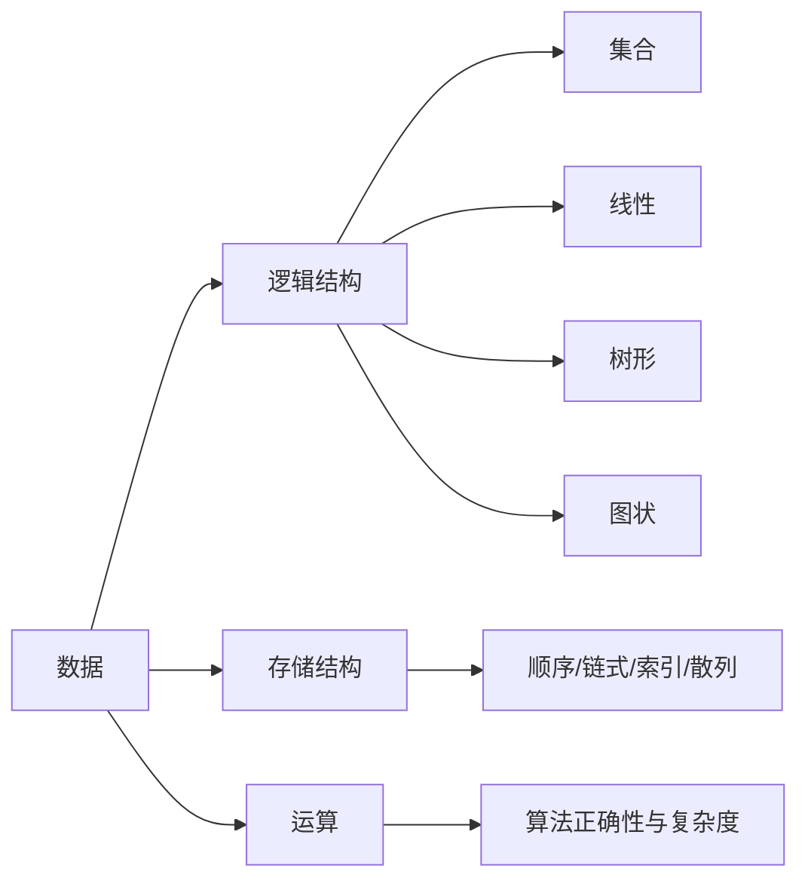

# 第1章 绪论

## 本章定位

本章建立全书语言体系：用抽象数据类型描述“做什么”，用数据结构说明“怎样组织”，用算法评价回答“代价多大”。统考最常考循环、递归的时间复杂度，也会考逻辑结构与存储结构的辨析。

> [!important] 408 必考
> 能从程序执行次数写出渐进复杂度；分清最好、平均、最坏复杂度；识别递归额外栈空间。

> [!note] 理解补充
> 渐进记号不计常数与低阶项，适合比较增长率，不代表任意规模下的精确运行时间。

> [!info] 技术更新
> 工程性能还受缓存、分支预测、并行度与输入分布影响；408 默认 RAM 模型，以基本操作次数为尺度。

## 章节导航

- [[数据结构目录|课程目录]]
- 本章：概念、ADT、算法特性、时间与空间复杂度
- 下一章：[[第2章-线性表|线性表]]把 ADT 落到顺序与链式存储

## 考点地图

| 模块 | 核心问题 | 常见题型 |
|---|---|---|
| 数据结构三要素 | 逻辑、存储、运算如何区分 | 概念选择 |
| ADT | 接口是否依赖实现 | 判断、设计 |
| 时间复杂度 | 基本操作执行多少次 | 循环、递归分析 |
| 空间复杂度 | 额外空间是否随规模增长 | 原地算法、递归栈 |

## 核心知识框架



## 完整知识点

### 基本概念与三要素

- **数据**是信息的载体；**数据元素**是处理的基本单位；**数据项**是构成元素的不可分割最小单位。
- **数据对象**是具有相同性质的数据元素集合；**数据类型**规定值集合及其允许的操作。
- **数据结构**是相互之间存在一种或多种特定关系的数据元素集合。
- 逻辑结构只描述元素关系：集合、线性结构、树形结构、图状结构。
- 存储结构描述逻辑关系在计算机中的表示：顺序存储借助相邻地址，链式存储借助指针，索引存储建立附加索引，散列存储由关键字直接计算地址。
- 数据运算包括定义与实现。相同逻辑结构在不同存储结构上，运算实现和复杂度可能不同。

### 抽象数据类型 ADT

ADT 由数据对象、数据关系和基本操作组成，封装实现细节。接口描述前置条件、输入、结果和失败情形。例如线性表的 `Insert(i,e)` 只规定在合法位置插入，不限定使用数组或链表。

```text
ADT LinearList
  Init() -> empty list
  Length(L) -> integer
  GetElem(L, i) -> element or error
  Insert(L, i, e) -> success or error
  Delete(L, i) -> deleted element or error
end ADT
```

边界必须显式：若表长为 $n$，取元素要求 $1\le i\le n$，插入位置要求 $1\le i\le n+1$。

### 算法及其特性

算法具有有穷性、确定性、可行性、输入和输出。好算法还追求正确性、可读性、健壮性与高效率。程序可以长期运行，算法本身必须在有限步骤后终止。

### 渐进复杂度

设基本操作次数为 $T(n)$：

$$
T(n)=O(f(n)) \iff \exists c,n_0>0,\ \forall n\ge n_0,\ 0\le T(n)\le cf(n)
$$

$O$ 给渐进上界，$\Omega$ 给下界，$\Theta$ 给同阶紧确界。统考问“时间复杂度”通常写最紧的 $O$ 级别。增长率常用次序：

$$
O(1)<O(\log n)<O(n)<O(n\log n)<O(n^2)<O(n^3)<O(2^n)<O(n!)
$$

分析规则：顺序语句相加取最大阶；嵌套循环相乘；条件分支的最坏复杂度取较大分支；对数底数是常数时不影响渐进阶。

```text
// 等差变化：执行约 n/d 次
for i <- 0 to n-1 step d
    visit(i)

// 等比变化：前提 n>=1 且 b>1，执行 floor(log_b n)+1 次
i <- 1
while i <= n
    visit(i)
    i <- i * b
```

上面的等比循环必须满足 $n\ge1$、$b>1$；若 $b=1$，变量不增长；若 $0<b<1$，变量递减，均不能用 $O(\log_b n)$ 结论。

若内层边界依赖外层，应求和。例如：

$$
\sum_{i=1}^{n}i=\frac{n(n+1)}2=\Theta(n^2),\qquad
\sum_{i=1}^{n}\log i=\Theta(n\log n)
$$

### 递归复杂度

- $T(n)=T(n-1)+O(1)=O(n)$。
- $T(n)=T(n/2)+O(1)=O(\log n)$。
- $T(n)=2T(n/2)+O(n)=O(n\log n)$。
- 朴素 Fibonacci 满足 $T(n)=T(n-1)+T(n-2)+O(1)$，为指数级。

递归空间看**最大同时活动调用深度**，不是总调用次数。尾递归在 408 语境下仍通常按调用栈计，除非题目明确编译器优化。

### 空间复杂度

空间复杂度关注除输入数据外的辅助空间。固定数量变量为 $O(1)$；长度为 $n$ 的辅助数组为 $O(n)$；递归深度 $h$ 的栈为 $O(h)$。原地算法通常指辅助空间 $O(1)$，不等同于完全不使用额外变量。

## 典型题型与解题方法

### 循环计数

先锁定最深层基本操作，再写循环变量变化序列。加法更新对应线性次数，乘除更新对应对数次数；有关联的嵌套循环写求和，不能机械相乘。

### 递归分析

分别画“递归树的总工作量”和“最长路径的栈深度”。时间求所有结点代价之和，空间只求一条最深路径。

### 结构辨析

回答“数组还是链表”属于存储结构；回答“前驱后继关系”属于逻辑结构；回答“插入、删除、查找”属于运算。

## 易错点

- $n/2$ 次循环仍为 $O(n)$；$2n^2+3n$ 为 $O(n^2)$。
- 两个顺序循环是复杂度相加，不是相乘。
- `while(i<n) i*=2` 是 $O(\log n)$；若从 `i=0` 开始则无法推进，是边界错误。
- 最坏、平均、最好必须按题意区分，不能默认都是同一个量级。
- 输入本身占用的存储通常不计入辅助空间。

## 跨章节/跨科联系

- [[第2章-线性表]]体现同一 ADT 的不同存储实现。
- [[第5章-树与二叉树]]与[[第8章-排序]]大量使用递归式。
- 操作系统的调度、页面置换和计算机网络的路由算法都依赖数据结构；组成原理中的局部性解释顺序存储的缓存优势。

## 本章复习清单

- [ ] 能说出数据结构三要素和四类逻辑结构
- [ ] 能用前置条件描述一个 ADT 操作
- [ ] 能计算等差、等比和相关嵌套循环复杂度
- [ ] 能区分 $O$、$\Omega$、$\Theta$
- [ ] 能分别求递归时间与递归栈空间
- [ ] 能说明原地算法的含义

## 自测问题

1. 链表是逻辑结构还是存储结构？为什么？
2. `for(i=1;i<=n;i*=3)` 执行多少数量级？
3. 为什么递归树有 $O(n)$ 个结点时，栈空间不一定是 $O(n)$？
4. 若 $T(n)=T(n/2)+n$，其渐进复杂度是什么？
5. ADT 与具体编程语言中的类有何联系与区别？

## 资料依据

- 《2026 年数据结构考研复习指导》（王道论坛）第 1 章 OCR 归纳，已校正公式和术语。
- 现有“408-考研/数据结构”长篇笔记的复杂度例题框架。
- “408-考研复习/01-数据结构”简版笔记的考点清单。

## 前后章节导航

- 上一页：[[数据结构目录|数据结构目录]]
- 下一章：[[第2章-线性表|第2章 线性表]]
