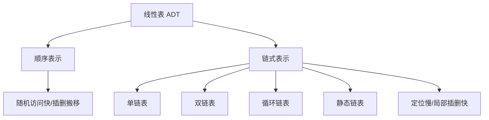

# 第2章 线性表

## 本章定位

线性表是算法题的基本载体。重点不是背代码，而是守住下标、空表、首尾结点和指针修改顺序，并能根据操作特征选择顺序表或链表。

> [!important] 408 必考
> 顺序表插删、单链表查找插删、头插与尾插、双链表指针修改、链表综合算法。

> [!note] 理解补充
> 带头结点能统一空表与首元结点操作；头结点不存有效数据，也不计入表长。

> [!info] 技术更新
> 现代机器上连续数组缓存友好，小规模频繁遍历时可能胜过理论插入更优的链表。

## 章节导航

- 前置：[[第1章-绪论|ADT 与复杂度]]
- 本章：线性表定义、顺序表、各类链表、选型与综合算法
- 后续：[[第3章-栈队列数组|栈、队列和数组]]是受限线性表及其应用

## 考点地图

| 结构 | 随机访问 | 已知位置插删 | 关键边界 |
|---|---:|---:|---|
| 顺序表 | $O(1)$ | $O(n)$ | 容量、下标、移动方向 |
| 单链表 | $O(n)$ | 已知前驱 $O(1)$ | 空表、首元、尾结点 |
| 双链表 | $O(n)$ | 已知结点 $O(1)$ | 四条指针语句次序 |
| 循环链表 | $O(n)$ | $O(1)$ | 终止条件不再是 `NULL` |
| 静态链表 | $O(n)$ | $O(1)$ | 游标与备用链表 |

## 核心知识框架



## 完整知识点

### 定义与基本操作

线性表 $L=(a_1,a_2,\ldots,a_n)$ 中，除首元外每个元素有唯一直接前驱，除尾元外每个元素有唯一直接后继。常见操作有初始化、销毁、判空、求长、按位查找、按值查找、插入、删除和输出。

### 顺序表

元素连续存放，若每个元素占 $l$ 字节，首地址为 $LOC(L)$，从 0 开始的数组下标为 $i-1$：

$$
LOC(a_i)=LOC(L)+(i-1)l
$$

静态分配容量固定；动态分配可扩容，但扩容可能重新分配并复制。顺序表支持 $O(1)$ 按位访问，按值查找为 $O(n)$。表长为 $n$ 时，在固定第 $i$ 位插入精确移动 $n-i+1$ 个元素；删除固定第 $i$ 个元素精确移动 $n-i$ 个元素。若所有合法位置等概率，插入平均移动 $n/2$ 个，删除平均移动 $(n-1)/2$ 个。

```text
Insert(S, i, x):              // 逻辑位置从 1 开始
    if i < 1 or i > S.length + 1: return false
    if S.length = S.capacity: return false
    for j <- S.length downto i:
        S.data[j] <- S.data[j-1]
    S.data[i-1] <- x
    S.length <- S.length + 1
    return true

Delete(S, i, out x):
    if i < 1 or i > S.length: return false
    x <- S.data[i-1]
    for j <- i to S.length-1:
        S.data[j-1] <- S.data[j]
    S.length <- S.length - 1
    return true
```

插入从后向前搬移以免覆盖；删除从前向后搬移。空表不能删除，满表不能插入。

### 单链表

结点含 `data` 与 `next`。带头结点时 `head->next` 指向首元；空表条件为 `head->next == NULL`。不带头结点时修改首元可能需要修改头指针。

```text
GetElem(head, i):
    if i < 1: return NULL
    p <- head.next
    j <- 1
    while p != NULL and j < i:
        p <- p.next; j <- j + 1
    return p

InsertAfter(p, x):
    if p = NULL: return false
    s <- new Node(x)
    s.next <- p.next
    p.next <- s
    return true

DeleteAfter(p, out x):
    if p = NULL or p.next = NULL: return false
    q <- p.next
    x <- q.data
    p.next <- q.next
    free(q)
    return true
```

前插结点可通过找前驱实现；若允许交换数据，可在目标结点后插入新结点并交换两结点数据，但这不适合结点身份有外部引用的场景。

头插法建表得到输入逆序，时间 $O(n)$；尾插法保持输入顺序，必须维护尾指针，否则反复找尾会退化为 $O(n^2)$。

### 双链表、循环链表与静态链表

双链表结点含 `prior` 和 `next`。在 `p` 后插入 `s`：

```text
s.next <- p.next
if p.next != NULL: p.next.prior <- s
s.prior <- p
p.next <- s
```

删除 `p` 的后继 `q`：先令 `p.next <- q.next`，若 `q.next != NULL` 再令 `q.next.prior <- p`，最后释放 `q`。空指针检查不能遗漏。

循环单链表最后结点指回头结点；判尾常用 `p->next == head`。仅设尾指针 `rear` 且采用带头结点表示时，`rear->next` 是头结点；仅在表非空时，首元才是 `rear->next->next`。表头与表尾插入都可 $O(1)$。循环双链表空表满足 `head->next=head` 且 `head->prior=head`。

静态链表用数组下标模拟指针，`next` 是游标；适合不支持指针或需要固定内存池的环境，随机访问优势已经丢失。

### 顺序表与链表选型

- 长度稳定、频繁按位访问、需要缓存局部性：顺序表。
- 长度变化大、无法预估容量、在已定位处频繁插删：链表。
- 链表“插删 $O(1)$”的前提是操作位置或其前驱已经给出；若先查找，总复杂度仍为 $O(n)$。

### 高频综合算法

**删除有序表重复元素**：用双指针 `i` 指向已去重尾，`j` 扫描；新值写入 `++i`，最终长度为 `i+1`，时间 $O(n)$、空间 $O(1)$。

**单链表逆置**：

```text
Reverse(head):
    p <- head.next
    head.next <- NULL
    while p != NULL:
        q <- p.next
        p.next <- head.next
        head.next <- p
        p <- q
```

**找倒数第 $k$ 个结点**：快指针先走 $k$ 步，再与慢指针同步；若不足 $k$ 步则失败。需明确带头结点口径。

**判断环**：快慢指针相遇则有环；相遇后一个指针回到表头，两者同速前进，再次相遇处为环入口。

**两链表公共结点**：按长度差让长链先走，随后同步比较结点地址；比较数据值不能证明结点共享。

**合并两个有序链表**：维护尾指针逐个摘取较小结点，时间 $O(m+n)$，可复用原结点做到 $O(1)$ 辅助空间。

### 链表核心算法规格

以下算法均采用带头结点单链表；`first` 表示 `head.next`。若接口约定不同，需同步修改初始化与终止条件。

```text
KthFromEnd(head, k):
    // 前提：链表无环；k 为从 1 开始的正整数
    if head = NULL or k <= 0: return NULL
    fast <- head.next
    for step <- 1 to k:
        if fast = NULL: return NULL       // 长度不足 k
        fast <- fast.next
    slow <- head.next
    while fast != NULL:
        fast <- fast.next
        slow <- slow.next
    return slow
```

时间 $O(n)$、空间 $O(1)$；适用于无环单链表。空表、$k\le0$ 或 $k>n$ 均返回失败。

```text
CycleEntry(head):
    // 前提：head 是有效头结点
    if head = NULL: return NULL
    slow <- head.next; fast <- head.next
    repeat:
        if fast = NULL or fast.next = NULL: return NULL
        slow <- slow.next
        fast <- fast.next.next
    until slow = fast
    p <- head.next
    while p != slow:
        p <- p.next; slow <- slow.next
    return p
```

无环、空表返回 `NULL`；有环返回入口结点。时间 $O(n)$、空间 $O(1)$；适用于只读链表，算法不破坏链接。

```text
FirstCommonNode(headA, headB):
    // 前提：两个单链表均无环；公共部分按结点地址共享
    if headA = NULL or headB = NULL: return NULL
    lenA <- Length(headA); lenB <- Length(headB)
    p <- headA.next; q <- headB.next
    if lenA > lenB: advance p by lenA-lenB steps
    else: advance q by lenB-lenA steps
    while p != q:
        p <- p.next; q <- q.next
    return p                              // 无公共结点时二者同为 NULL
```

时间 $O(m+n)$、空间 $O(1)$；比较的是结点地址。若链表可能有环，必须先分类处理环入口，不能直接套用。

```text
MergeSorted(headA, headB):
    // 前提：两表无环、非降序、结点互不共享，均带头结点
    if headA = NULL or headB = NULL: return NULL
    p <- headA.next; q <- headB.next
    headA.next <- NULL; tail <- headA
    while p != NULL and q != NULL:
        if p.data <= q.data:              // 相等时先取 A，保持跨表稳定性
            next <- p.next; tail.next <- p; p <- next
        else:
            next <- q.next; tail.next <- q; q <- next
        tail <- tail.next
    if p != NULL: tail.next <- p
    else: tail.next <- q
    headB.next <- NULL
    return headA
```

时间 $O(m+n)$、辅助空间 $O(1)$；复用原结点，因此调用后原两表不再保持原结构。若需要保留输入，应复制结点并使用 $O(m+n)$ 新空间。

## 典型题型与解题方法

1. **写插删代码**：先写合法区间，再确定移动或改链方向，最后更新长度并释放资源。
2. **链表综合题**：优先考虑快慢指针、哨兵头结点、原地摘链；先画三结点局部图再写赋值。
3. **复杂度比较**：把“定位成本”和“执行插删成本”分开计算。
4. **数组原地题**：识别稳定删除、区间逆置、双指针覆盖三类模板。

## 易错点

- 第 $i$ 个元素对应数组下标 $i-1$；第 $i$ 位插入的合法上界是 $n+1$。
- `p=p->next` 后再释放原后继会丢失地址，应先保存 `q`。
- 单链表删除给定结点的 $O(1)$ 技巧不能用于尾结点。
- 循环链表遍历终止条件不能写 `p==NULL`。
- 双链表插入四条语句若先覆盖 `p->next`，可能失去原后继。

## 跨章节/跨科联系

- [[第3章-栈队列数组]]的链栈、链队列直接复用链表操作。
- [[第7章-查找]]的散列拉链法与 [[第6章-图]]的邻接表以链表组织冲突或邻接点。
- 操作系统空闲块链表、文件系统链式分配体现链式结构；缓存局部性联系组成原理。

## 本章复习清单

- [ ] 能写顺序表插入、删除并说明移动次数
- [ ] 能区分带头结点与不带头结点的空表条件
- [ ] 能手写单链表建表、插入、删除、逆置
- [ ] 能正确修改双链表四条指针
- [ ] 能处理循环链表的判空与判尾
- [ ] 能完成倒数第 $k$ 个、判环、公共结点、合并题

## 自测问题

1. 为什么顺序表插入必须从后向前移动？
2. “链表插入一定是 $O(1)$”错在何处？
3. 只给单链表某结点指针，哪些情况下不能 $O(1)$ 删除？
4. 如何用 $O(1)$ 空间稳定删除顺序表中所有值为 $x$ 的元素？
5. 循环单链表只设尾指针有何优势？

## 资料依据

- 《2026 年数据结构考研复习指导》（王道论坛）第 2 章 OCR 归纳。
- 现有长篇笔记中的顺序表、链表算法与真题分类。
- 简版笔记中的边界条件和结构对照表。

## 前后章节导航

- 上一章：[[第1章-绪论|第1章 绪论]]
- 下一章：[[第3章-栈队列数组|第3章 栈、队列和数组]]
