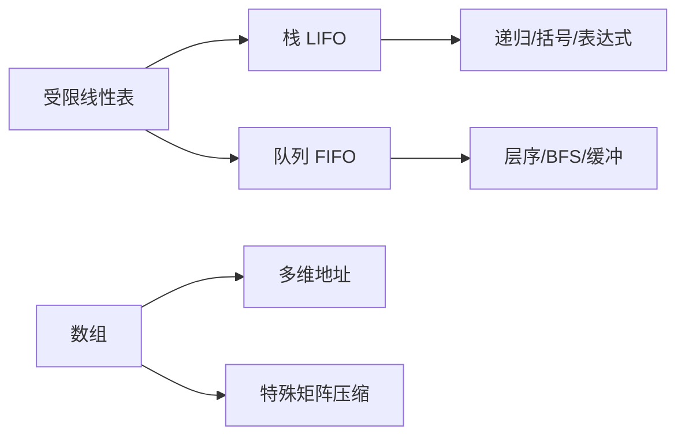

# 第3章 栈、队列和数组

## 本章定位

栈和队列是操作受限的线性表，也是递归、表达式、遍历与调度的基础；数组部分重点考地址计算和特殊矩阵压缩下标。

> [!important] 408 必考
> 循环队列判空判满、栈的出栈序列、表达式转换求值、矩阵压缩地址计算。

> [!note] 理解补充
> “栈顶/队头在哪一端”由实现约定决定；判断代码必须先确认指针含义。

> [!info] 技术更新
> 工程库中的动态数组、双端队列常采用分段连续存储，以折中扩容、随机访问和缓存性能。

## 章节导航

- 前置：[[第2章-线性表|线性表存储与边界]]
- 本章：栈、队列、应用、数组与矩阵压缩
- 后续：[[第4章-串|串]]继续研究线性序列上的模式匹配

## 考点地图

| 模块 | 不变量 | 高频计算 |
|---|---|---|
| 栈 | LIFO，只在栈顶操作 | 合法出栈序列、Catalan 数 |
| 队列 | FIFO，队尾入、队头出 | 循环队列长度、判满 |
| 表达式 | 运算符优先级与结合性 | 中缀转后缀、后缀求值 |
| 数组 | 行优先或列优先 | 元素地址 |
| 压缩矩阵 | 只存有效区域 | 二维下标映射一维下标 |

## 核心知识框架



## 完整知识点

### 栈

基本操作为 `InitStack`、`StackEmpty`、`Push`、`Pop`、`GetTop`。顺序栈常令 `top=-1` 表示空，入栈先 `++top`，出栈后 `--top`；若约定 `top` 指向下一空位，则空栈为 0，代码不可混用。

```text
Push(S, x):
    if S.top = capacity-1: return false
    S.top <- S.top + 1
    S.data[S.top] <- x
    return true

Pop(S, out x):
    if S.top = -1: return false
    x <- S.data[S.top]
    S.top <- S.top - 1
    return true
```

链栈通常以表头为栈顶，入栈和出栈均为 $O(1)$，无需头结点。两栈共享数组时从两端向中间增长，满条件为 `top1+1==top2`，能提高空间利用率。

$n$ 个不同元素按固定入栈次序所得合法出栈序列数为 Catalan 数：

$$
C_n=\frac{1}{n+1}\binom{2n}{n}
$$

验证具体序列可模拟：按入栈次序压栈，栈顶等于目标序列当前元素时持续弹出，最终全部匹配才合法。

### 队列

顺序队列若不循环使用会产生假溢出。循环队列常牺牲一个单元：

$$
\text{empty}: front=rear,\quad
\text{full}: (rear+1)\bmod M=front
$$

$$
\text{length}=(rear-front+M)\bmod M
$$

```text
EnQueue(Q, x):
    if (Q.rear + 1) mod M = Q.front: return false
    Q.data[Q.rear] <- x
    Q.rear <- (Q.rear + 1) mod M
    return true

DeQueue(Q, out x):
    if Q.front = Q.rear: return false
    x <- Q.data[Q.front]
    Q.front <- (Q.front + 1) mod M
    return true
```

其他判满方案包括增加 `size` 计数器，或增加最近一次操作标志，此时可使用全部 $M$ 个单元。

带头结点链队列空表时 `front==rear==head`。入队在尾部插入并更新 `rear`；出队删除首元，若删除后为空，必须令 `rear=front`，避免尾指针悬空。

双端队列允许两端插删；输入受限双端队列只允许一端输入，输出受限只允许一端输出。判断序列时按允许操作模拟。

### 栈与队列的应用

**括号匹配**：遇左括号入栈；遇右括号时若栈空或类型不配则失败；扫描结束还要求栈空。时间 $O(n)$、空间 $O(n)$。

**中缀转后缀**：操作数直接输出；左括号入栈；右括号弹到左括号；普通运算符弹出栈顶优先级更高的运算符，以及同优先级且当前运算符左结合的运算符，再入栈。扫描结束清空栈。

**后缀求值**：操作数入栈；遇二元运算符先弹出右操作数 $b$，再弹出左操作数 $a$，计算 $a\ operator\ b$ 后压回。减法和除法次序不能反。

### 表达式核心算法规格

假设输入已经词法切分为数字、左括号、右括号和二元运算符；一元负号应在词法阶段并入负数或转成专门的一元运算符。`leftAssoc(op)` 表示左结合，`priority` 返回优先级。

```text
InfixToPostfix(tokens):
    output <- empty sequence
    ops <- empty stack
    expectOperand <- true
    for each token t in tokens:
        if t is operand:
            if not expectOperand: return error("missing operator")
            append t to output
            expectOperand <- false
        else if t = '(':
            if not expectOperand: return error("missing operator before (")
            push(ops, t)
        else if t = ')':
            if expectOperand: return error("missing operand before )")
            while ops not empty and top(ops) != '(':
                append pop(ops) to output
            if ops empty: return error("unmatched )")
            pop(ops)
            expectOperand <- false
        else if t is binary operator:
            if expectOperand: return error("missing left operand")
            while ops not empty and top(ops) != '(' and
                  (priority(top(ops)) > priority(t) or
                   (priority(top(ops)) = priority(t) and leftAssoc(t))):
                append pop(ops) to output
            push(ops, t)
            expectOperand <- true
        else:
            return error("illegal token")
    if tokens empty or expectOperand: return error("incomplete expression")
    while ops not empty:
        if top(ops) = '(': return error("unmatched (")
        append pop(ops) to output
    return output
```

每个词元至多入栈出栈一次，时间 $O(n)$、空间 $O(n)$；适用于已知优先级与结合性的中缀表达式。括号不匹配、相邻操作数、缺操作数或非法词元均报告失败。

```text
EvalPostfix(tokens):
    values <- empty stack
    for each token t in tokens:
        if t is operand:
            push(values, numericValue(t))
        else if t is binary operator:
            if size(values) < 2: return error("missing operand")
            b <- pop(values)
            a <- pop(values)
            if t = '/' and b = 0: return error("division by zero")
            r <- Apply(t, a, b)
            if arithmetic overflow: return error("overflow")
            push(values, r)
        else:
            return error("illegal token")
    if size(values) != 1: return error("malformed postfix expression")
    return pop(values)
```

时间 $O(n)$、空间 $O(n)$；适用于二元运算符后缀式。整数除法、浮点除法与溢出规则必须由题目或接口明确。

递归调用由系统栈保存参数、局部变量与返回地址；层序遍历和 BFS 使用队列；打印机缓冲体现 FIFO，函数调用体现 LIFO。

### 数组地址计算

二维数组 $A[m][n]$，每元素占 $L$ 字节，以 0 为下界：

$$
LOC_{row}(A[i][j])=LOC(A)+(in+j)L
$$

$$
LOC_{col}(A[i][j])=LOC(A)+(jm+i)L
$$

若下界不是 0，先将每维下标减去对应下界。

### 特殊矩阵压缩

对称矩阵只存下三角（含主对角线），按行优先、0 基下标，若 $i\ge j$：

$$
k=\frac{i(i+1)}2+j
$$

若 $i<j$，访问其对称元素 $A[j][i]$。使用 1 基下标且数组从 0 存储时，对 $i\ge j$ 有 $k=i(i-1)/2+j-1$。

下三角矩阵在有效区外统一为常量；压缩数组需额外一个位置存常量。三对角矩阵只存满足 $|i-j|\le1$ 的元素，按行优先、1 基矩阵下标映射为：

$$
k=2i+j-3
$$

其中 $k$ 为 0 基一维下标。反解可先由 $k$ 定位所在行，再根据行首偏移求列，边界行需单独校验。

稀疏矩阵可用三元组 `(row,col,value)` 或十字链表。三元组节省零元素空间但随机访问慢；十字链表适合行列插删和矩阵动态变化。

## 典型题型与解题方法

1. **循环队列**：先写清 `front`、`rear` 指向有效元素还是空位，再套判空、判满、长度公式。
2. **出栈序列**：模拟入栈并尽可能匹配弹出；只看局部逆序容易误判。
3. **表达式**：转换时维护运算符栈，求值时维护操作数栈；写清结合性和操作数弹出次序。
4. **矩阵压缩**：先确定存上三角还是下三角、行优先还是列优先、二维与一维下标基准，再数前面完整行的元素。

## 易错点

- 牺牲单元的循环队列最多存 $M-1$ 个元素。
- 链队列删除最后一个数据结点后必须同步修正尾指针。
- 栈混洗不是任意排列；固定入栈次序存在禁形。
- 后缀求值第一次弹出的是右操作数。
- 矩阵题最常错在 0 基与 1 基混用，以及把矩阵阶数当作每元素字节数。

## 跨章节/跨科联系

- [[第5章-树与二叉树]]的递归遍历用栈，层序遍历用队列。
- [[第6章-图]]的 DFS/BFS 分别依赖栈/队列。
- 操作系统的进程调度、缓冲区，组成原理的中断现场保存均体现栈队列思想。

## 本章复习清单

- [ ] 能按两种 `top` 约定写顺序栈
- [ ] 能判断栈的合法输出序列并使用 Catalan 公式
- [ ] 能写牺牲一个单元的循环队列公式与代码
- [ ] 能处理中缀转后缀和后缀求值
- [ ] 能计算行优先、列优先数组地址
- [ ] 能推导对称矩阵、三角矩阵、三对角矩阵下标

## 自测问题

1. 长度为 $M$ 的循环队列为何常只能存 $M-1$ 个元素？
2. 共享栈在什么条件下判满？
3. 后缀表达式 `5 2 3 * -` 的结果是什么？
4. 对称矩阵存下三角时，访问上三角元素如何映射？
5. 链队列删除最后一个结点时为何要修改 `rear`？

## 资料依据

- 《2026 年数据结构考研复习指导》（王道论坛）第 3 章 OCR 归纳。
- 现有长篇笔记中的循环队列、表达式与矩阵压缩专题。
- 简版笔记的公式和易错点索引。

## 前后章节导航

- 上一章：[[第2章-线性表|第2章 线性表]]
- 下一章：[[第4章-串|第4章 串]]
