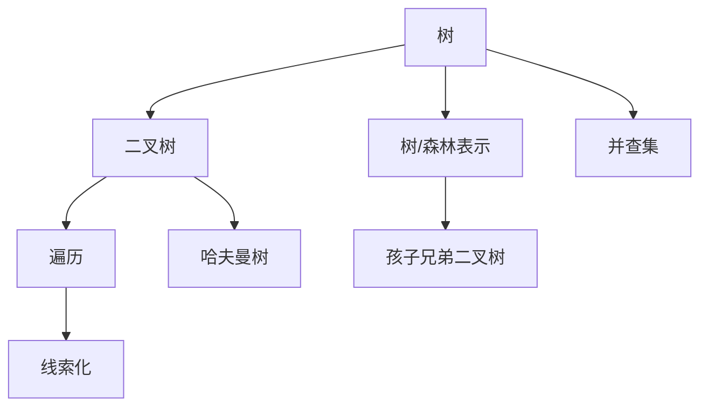

# 第5章 树与二叉树

## 本章定位

树是 408 数据结构的核心枢纽，连接递归、查找、排序和图。必须掌握性质计算、遍历与构造、线索化、树森林转换、哈夫曼树和并查集。

> [!important] 408 必考
> 二叉树结点数量关系、遍历序列、递归/非递归算法、线索二叉树、哈夫曼 WPL、并查集优化。

> [!note] 理解补充
> 遍历算法的时间通常为 $O(n)$，但辅助空间由树高 $h$ 决定；退化树可达 $O(n)$。

> [!info] 技术更新
> 工程实现常用迭代遍历避免深树栈溢出；并查集的路径压缩与按秩合并在大规模连通性处理中近似常数。

## 章节导航

- 前置：[[第3章-栈队列数组|栈与队列]]支撑遍历
- 本章：树、二叉树、线索、树森林、哈夫曼、并查集
- 后续：[[第6章-图|图]]把层次关系推广为任意多对多关系

## 考点地图

| 模块 | 高频任务 | 核心工具 |
|---|---|---|
| 性质 | 结点数、高度、空指针数 | 度数求和、层数上界 |
| 遍历 | 序列转换、算法设计 | 栈、队列、递归 |
| 线索 | 前驱后继 | 标志域与遍历次序 |
| 树森林 | 转换与遍历对应 | 孩子兄弟表示 |
| 哈夫曼 | 构造、WPL、编码 | 贪心 |
| 并查集 | 合并、判连通 | 双亲数组 |

## 核心知识框架



## 完整知识点

### 树的概念与性质

树是 $n\ge0$ 个结点的有限集。非空树有唯一根，其余结点分成互不相交的子树。结点的度是孩子数，树的度是最大结点度；深度从根向下计，高度从叶向上计，具体从 0 还是 1 起按题设。

边数等于结点数减一；所有结点度数之和等于边数。当 $m>1$ 时，度为 $m$ 的树第 $i$ 层最多 $m^{i-1}$ 个结点，前 $h$ 层最多 $(m^h-1)/(m-1)$ 个结点；当 $m=1$ 时每层最多一个结点，前 $h$ 层最多 $h$ 个结点。

### 二叉树性质与存储

二叉树每个结点有有序的左右子树。设度为 0、1、2 的结点数为 $n_0,n_1,n_2$：

$$
n_0=n_2+1
$$

第 $i$ 层最多 $2^{i-1}$ 个结点；高为 $h$（根为第 1 层）最多 $2^h-1$ 个结点。含 $n$ 个结点的完全二叉树高度为 $\lfloor\log_2 n\rfloor+1$。

完全二叉树按 1 基顺序编号：结点 $i$ 的双亲为 $\lfloor i/2\rfloor$，左孩子 $2i$，右孩子 $2i+1$，存在条件是不超过 $n$。顺序存储适合完全二叉树；普通二叉树用二叉链表，$n$ 个结点有 $n+1$ 个空链域。

满二叉树每层都满；完全二叉树只允许最下一层从左连续缺失。完全二叉树中度为 1 的结点至多一个，且只可能有左孩子。

### 遍历与构造

先序 NLR、中序 LNR、后序 LRN；层序从上到下、同层从左到右。

```text
Preorder(T):
    if T = NULL: return
    visit(T)
    Preorder(T.left)
    Preorder(T.right)

LevelOrder(T):
    if T = NULL: return
    enqueue(Q, T)
    while Q not empty:
        p <- dequeue(Q); visit(p)
        if p.left != NULL: enqueue(Q, p.left)
        if p.right != NULL: enqueue(Q, p.right)
```

非递归中序：沿左链压栈，栈空且当前为空时结束；弹栈访问后转右子树。后序非递归可用双栈，或单栈加 `lastVisited` 判断右子树是否处理。

先序+中序或后序+中序能唯一确定二叉树，递归以先序首/后序尾为根切分中序。只有先序+后序通常不能唯一确定；若已知每个内部结点度为 2，则可以唯一确定。

### 线索二叉树

利用空链域保存遍历前驱和后继，增加 `ltag/rtag`：0 表示孩子，1 表示线索。中序线索化按中序遍历维护前驱 `pre`：当前结点左空则左线索指向 `pre`；若 `pre` 的右空，则其右线索指向当前结点。

中序后继：若 `rtag==1`，直接取 `rchild`；否则进入右子树后沿真实左孩子走到底。先序线索树找后继容易，找前驱往往需双亲信息；后序线索树相反，必须结合题设存储结构判断能否直接完成。

### 树、森林及转换

树的存储有双亲表示、孩子表示和孩子兄弟表示。孩子兄弟表示中左指针指第一个孩子，右指针指下一个兄弟，从而转成二叉树。

- 树的先根遍历对应其二叉树的先序遍历。
- 树的后根遍历对应其二叉树的中序遍历。
- 森林的先序遍历对应转换后二叉树先序；森林的中序遍历对应转换后二叉树中序。

树转二叉树口诀是“左孩子、右兄弟”；森林各树根通过右指针相连。

### 哈夫曼树与编码

带权路径长度：

$$
WPL=\sum_{i=1}^{n}w_i l_i
$$

每次选权值最小的两棵树合并，新根权值为二者之和，重复至一棵树。所有合并产生的新权值之和也等于 WPL。权值相同可能得到不同形态，但最小 WPL 相同。

哈夫曼树无度为 1 的结点，$n$ 个叶结点共有 $2n-1$ 个结点。左边编码 0、右边编码 1（也可反约定），得到前缀编码，任何编码都不是另一编码的前缀，便于即时译码。哈夫曼编码最小化带权平均码长，不保证每个字符码长最短。

### 并查集

用双亲数组表示互不相交集合，根可存负的集合大小或秩。

```text
Find(S, x):
    if S[x] < 0: return x
    S[x] <- Find(S, S[x])       // 路径压缩
    return S[x]

Union(S, a, b):
    ra <- Find(S, a); rb <- Find(S, b)
    if ra = rb: return
    if S[ra] > S[rb]: swap(ra, rb)  // 负值更小者集合更大
    S[ra] <- S[ra] + S[rb]
    S[rb] <- ra
```

朴素查找最坏 $O(n)$；路径压缩配合按秩/按大小合并，均摊 $O(\alpha(n))$。并查集擅长动态合并与连通性判断，不支持高效拆分，也不能直接给出两点间路径。

### 树算法完整规格

下列二叉树结点含 `left/right`，空树以 `NULL` 表示；遍历不接受含线索指针却未检查标志域的树。

```text
InorderIter(root):
    S <- empty stack
    p <- root
    while p != NULL or S not empty:
        while p != NULL:
            push(S, p)
            p <- p.left
        p <- pop(S)
        visit(p)
        p <- p.right
```

空树直接结束；每个结点入栈一次，时间 $O(n)$、空间 $O(h)$。适用于普通二叉链树，可避免递归调用开销。

```text
PostorderIter(root):
    S <- empty stack
    p <- root; last <- NULL
    while p != NULL or S not empty:
        if p != NULL:
            push(S, p)
            p <- p.left
        else:
            topNode <- top(S)
            if topNode.right != NULL and last != topNode.right:
                p <- topNode.right
            else:
                visit(topNode)
                last <- pop(S)
```

空树直接结束；`last` 防止右子树重复进入。时间 $O(n)$、空间 $O(h)$，适用于需要“左右子树完成后再处理根”的场景。

```text
BuildFromPreIn(pre, in, preL, preR, inL, inR, index):
    // index[value] 给出 value 在中序中的唯一位置
    if preL > preR: return NULL
    if preR-preL != inR-inL: return error("length mismatch")
    rootValue <- pre[preL]
    if rootValue not in index: return error("inconsistent traversal")
    k <- index[rootValue]
    if k < inL or k > inR: return error("inconsistent traversal")
    leftSize <- k-inL
    root <- new Node(rootValue)
    root.left <- BuildFromPreIn(pre, in, preL+1, preL+leftSize,
                                inL, k-1, index)
    if child build failed: free constructed subtree; return error
    root.right <- BuildFromPreIn(pre, in, preL+leftSize+1, preR,
                                 k+1, inR, index)
    if child build failed: free constructed subtree; return error
    return root
```

前提是关键字互异、两个序列长度相等且元素集合相同。哈希索引使时间 $O(n)$、递归空间 $O(h)$，另需 $O(n)$ 索引；不建索引则最坏 $O(n^2)$。后序+中序构造只需把根改为后序末项并重新切分边界。

```text
ThreadInorder(p, ref pre):
    if p = NULL: return
    ThreadInorder(p.left, pre)
    if p.left = NULL:
        p.ltag <- 1; p.left <- pre
    else: p.ltag <- 0
    if pre != NULL and pre.right = NULL:
        pre.rtag <- 1; pre.right <- p
    else if pre != NULL:
        pre.rtag <- 0
    pre <- p
    ThreadInorder(p.right, pre)

CreateInorderThreads(root):
    pre <- NULL
    ThreadInorder(root, pre)
    if pre != NULL and pre.right = NULL:
        pre.rtag <- 1; pre.right <- NULL
    else if pre != NULL:
        pre.rtag <- 0
```

前提是输入为尚未线索化的普通二叉树，标志域可写；代码会为真实左右孩子显式写 `tag=0`，为空的链域写 `tag=1`，不依赖标志域初值。空树成功但无操作。时间 $O(n)$、递归空间 $O(h)$。线索化后普通递归必须只沿 `tag=0` 的孩子链接。

```text
BuildHuffman(weights):
    // weights 含 n 个非负权；叶结点身份必须保留
    if weights empty: return error("no symbol")
    H <- empty min-heap
    for each (symbol, weight) in weights:
        push(H, new Leaf(symbol, weight))
    if size(H) = 1:
        return pop(H)                    // 唯一符号可另约定码字为 0
    while size(H) > 1:
        x <- popMin(H); y <- popMin(H)
        parent <- new Node(x.weight+y.weight, x, y)
        push(H, parent)
    return pop(H)
```

用最小堆时构造时间 $O(n\log n)$、树本身空间 $O(n)$、堆空间 $O(n)$；已排序队列可实现线性合并流程。适用于已知符号频率的最优前缀编码。负权无意义；相同权值允许不同但同样最优的树。生成编码时 DFS，左/右边分别附加 0/1，叶结点输出路径；时间与输出码长总和同阶。

## 典型题型与解题方法

1. **结点计数**：同时写结点总数与边数方程，利用度数求和。
2. **由序列构树**：先定根，再在中序中切左右区间；每层区间边界必须一致。
3. **遍历算法**：先写空树边界；求高度、结点数、平衡性适合后序，因为结果依赖左右子树。
4. **线索题**：先确定遍历次序，再判断指针是孩子还是线索。
5. **哈夫曼题**：每轮只取当前森林中两个最小权；用合并权值和复核 WPL。
6. **并查集题**：画双亲数组变化，区分路径压缩发生于 `Find`，按大小合并发生于 `Union`。

## 易错点

- 二叉树不是度为 2 的有序树，两者对空子树位置的定义不同。
- 完全二叉树的叶结点不一定都在同一层。
- 遍历序列中的“相邻”通常不代表父子关系。
- 线索指针不可当孩子递归，否则可能形成循环。
- 哈夫曼编码的左右 0/1 可交换；计算 WPL 看权与路径长度。
- 并查集数组中的负值若表示大小，比较合并方向时符号容易反。

## 跨章节/跨科联系

- [[第7章-查找]]的 BST、AVL、红黑树、B 树以本章遍历与高度为基础。
- [[第8章-排序]]的堆是完全二叉树，[[第6章-图]]的 Kruskal 用并查集判环。
- 哈夫曼编码联系计算机组成原理中的信息表示与压缩。

## 本章复习清单

- [ ] 能用度数方程求各类结点数
- [ ] 能写四种遍历及非递归中序
- [ ] 能由中序与先序/后序唯一构树
- [ ] 能判断线索的前驱后继
- [ ] 能完成树、森林、二叉树转换
- [ ] 能构造哈夫曼树并算 WPL
- [ ] 能写带路径压缩与按大小合并的并查集

## 自测问题

1. 为什么二叉链表有 $n+1$ 个空链域？
2. 哪两类遍历序列通常能唯一确定二叉树？
3. 中序线索树如何找某结点后继？
4. 哈夫曼树为何没有度为 1 的结点？
5. 路径压缩与按秩合并分别优化哪个操作阶段？

## 资料依据

- 《2026 年数据结构考研复习指导》（王道论坛）第 5 章 OCR 归纳。
- 现有长篇笔记的遍历、线索、哈夫曼与并查集专题。
- 简版笔记中的性质公式和转换对应关系。

## 前后章节导航

- 上一章：[[第4章-串|第4章 串]]
- 下一章：[[第6章-图|第6章 图]]
