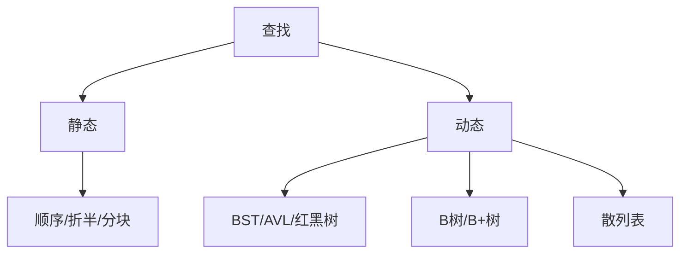

# 第7章 查找

## 本章定位

查找章比较静态与动态查找结构，核心评价指标是平均查找长度 ASL。应把“结构性质—操作过程—失败边界—复杂度”连起来，而非只记树高。

> [!important] 408 必考
> 折半判定树、BST 删除、AVL 旋转、红黑树性质、B/B+ 树、散列冲突与 ASL。

> [!note] 理解补充
> ASL 是关键字比较次数的期望；成功与失败的概率空间、计数口径不同，必须分开计算。

> [!info] 技术更新
> 数据库索引常用 B+ 树，内存字典常用散列表；工程实现还考虑缓存、并发和哈希拒绝服务防护。

## 章节导航

- 前置：[[第5章-树与二叉树|树高与遍历]]
- 本章：线性查找、树形查找、多路树、散列
- 后续：[[第8章-排序|排序]]为查找提供有序数据和索引基础

## 考点地图

| 结构 | 查找 | 动态更新 | 适用场景 |
|---|---:|---:|---|
| 顺序查找 | $O(n)$ | 简单 | 无序小表 |
| 折半查找 | $O(\log n)$ | 数组更新慢 | 有序顺序表 |
| BST | 平均 $O(\log n)$ | 方便 | 动态有序集合 |
| AVL/红黑树 | $O(\log n)$ | 旋转维护 | 内存动态索引 |
| B/B+ 树 | $O(\log_t n)$ 次结点访问（本章最小度 $t$ 模型） | 分裂合并 | 外存索引 |
| 散列表 | 平均 $O(1)$ | 方便 | 等值查询 |

## 核心知识框架



## 完整知识点

### 基本概念与 ASL

查找表是同类型记录集合。**关键字**是记录中用于查找或排序的数据项，可以唯一也可以不唯一；**主关键字**能够唯一标识一条记录，**次关键字**不能唯一标识记录。静态查找只查，动态查找还要插删。平均查找长度：

$$
ASL=\sum_{i=1}^{n}P_iC_i
$$

$P_i$ 是查找目标的概率，$C_i$ 是关键字比较次数。等概率时取比较次数算术平均。失败 ASL 的概率通常落在 $n+1$ 个间隙或散列表的失败起点上，不能直接复用成功公式。

### 顺序、折半与分块查找

无序表顺序查找成功等概率 $ASL=(n+1)/2$，失败比较 $n$ 次。设置哨兵可省去每轮越界判断，不改渐进复杂度。

```text
BinarySearch(A, n, key):       // 升序，0 基
    low <- 0; high <- n-1
    while low <= high:
        mid <- low + (high-low) div 2
        if A[mid] = key: return mid
        if A[mid] < key: low <- mid+1
        else: high <- mid-1
    return -1
```

折半要求有序且支持随机访问，因此适合顺序表，不适合链表。判定树是一棵平衡 BST；成功比较次数为结点层数，失败比较次数对应外部结点路径。含 $n$ 个元素时树高为 $\lfloor\log_2 n\rfloor+1$。

分块查找要求块间有序，块内可无序。先查索引再顺序查块。若长度 $n$ 等分为 $b$ 块、每块 $s=n/b$，两阶段均顺序查且等概率，成功 ASL 近似：

$$
ASL\approx\frac{b+1}{2}+\frac{s+1}{2}
$$

取 $b\approx s\approx\sqrt n$ 较优；索引折半可进一步降低索引查找代价。

### 二叉排序树 BST

左子树关键字小于根，右子树大于根（重复关键字规则由实现约定），中序遍历有序。查找与插入沿一条根到叶路径，复杂度 $O(h)$；随机形态平均 $O(\log n)$，最坏退化为 $O(n)$。

删除：叶结点直接删；仅一棵子树则让双亲链接该子树；有两棵子树则用中序前驱或后继替换，再删除那个至多一个孩子的结点。若结点含外部身份语义，需区分复制关键字与真正移植结点。

### AVL 树

任一结点平衡因子 $BF=h_L-h_R\in\{-1,0,1\}$。插入后从新结点向上找到第一个失衡祖先：

| 类型 | 插入路径 | 调整 |
|---|---|---|
| LL | 左孩子的左子树 | 右单旋 |
| RR | 右孩子的右子树 | 左单旋 |
| LR | 左孩子的右子树 | 先左后右 |
| RL | 右孩子的左子树 | 先右后左 |

高为 $h$ 的 AVL 最少结点数（空树高 0、单结点高 1）：

$$
N_h=N_{h-1}+N_{h-2}+1,\quad N_0=0,N_1=1
$$

故高度 $O(\log n)$。插入通常只需修复最低失衡点；删除可能使多个祖先继续失衡，需一路向上检查。

### 红黑树

性质：结点红或黑；根黑；叶哨兵 `NIL` 黑；红结点孩子均黑；任一结点到后代 `NIL` 的路径黑结点数相同。由此最长路径不超过最短路径两倍，高度不超过 $2\log_2(n+1)$。

插入结点先着红，避免立即改变黑高；若父红，则根据叔父颜色重着色或旋转。删除黑结点可能造成“双黑”，根据兄弟及其孩子颜色旋转和重着色。红黑树平衡弱于 AVL，但更新旋转通常更少，适合频繁插删。

### B 树

$m$ 阶 B 树的每个实际结点（包括实际终端结点）最多有 $m-1$ 个关键字；除根外每个实际结点至少有 $\lceil m/2\rceil-1$ 个关键字；非空根至少有 1 个关键字。孩子数约束只适用于非终端实际结点：含 $k$ 个关键字时有 $k+1$ 个实际孩子，因此最多有 $m$ 个、除根外至少有 $\lceil m/2\rceil$ 个实际孩子；根若不是终端结点则至少有两个实际孩子。平衡性要求所有实际终端结点处于同一层。外部失败结点不存关键字，也不是实际分配的树结点。

查找在结点内顺序或折半比较，再沿子树指针下降。插入总在实际终端结点，溢出时以中间关键字上升并分裂，可能连锁至根使树高加一。删除内部关键字时可与前驱/后继替换；下溢时向足量兄弟借关键字并经双亲旋转，否则与兄弟及双亲分隔关键字合并，可能连锁使根收缩。

树高主要决定磁盘 I/O。若根为第 1 层，除根外每结点最少分支 $t=\lceil m/2\rceil$，高度上界可由最少关键字数量反推。

### B+ 树

B+ 树非叶结点只保存索引，所有记录或记录指针在叶结点；叶结点按关键字有序并链接，适合范围查询。一个关键字可同时出现在上层索引和叶结点。查找无论成功通常都到叶层，路径长度稳定。

B 树关键字只出现一次且非叶也可命中记录；B+ 树扇出更大、树更矮、范围扫描更高效，是数据库与文件系统索引常见结构。

### 散列表

散列函数把关键字映射到表地址。目标是计算快、分布均匀。常见方法：直接定址、除留余数 $H(key)=key\bmod p$（$p$ 常取不大于表长的质数）、数字分析、平方取中。

冲突处理：

- 开放定址：$H_i=(H(key)+d_i)\bmod m$。线性探测 $d_i=i$ 易产生一次聚集；平方探测减少聚集但不保证探遍所有槽；双散列 $d_i=iH_2(key)$ 探测更均匀。
- 拉链法：同地址记录放入链表，适合动态集合和较高装填因子，删除简单。

装填因子：

$$
\alpha=\frac{\text{表中记录数}}{\text{散列表长度}}
$$

开放定址必须保留空槽，删除不能直接置空，否则会截断探测链，应设删除标记。ASL 需按具体表逐项模拟：成功从各关键字初始地址探测至其位置；失败从题设允许的每个初始地址探测至第一个真正空槽。拉链法是否把链表结点关键字比较、空指针检查计入 ASL，服从题目口径。

### 动态查找算法完整规格

以下树算法默认关键字互异；若允许重复，接口必须固定“计数、放左或放右”中的一种规则。

```text
BSTInsert(ref root, key):
    parent <- NULL; p <- root
    while p != NULL:
        parent <- p
        if key = p.key: return false
        if key < p.key: p <- p.left else: p <- p.right
    x <- new Node(key); x.parent <- parent
    if parent = NULL: root <- x
    else if key < parent.key: parent.left <- x
    else: parent.right <- x
    return true

BSTDelete(ref root, key):
    z <- BSTSearch(root,key)
    if z = NULL: return false
    if z.left = NULL: Transplant(root,z,z.right)
    else if z.right = NULL: Transplant(root,z,z.left)
    else:
        y <- Minimum(z.right)
        if y.parent != z:
            Transplant(root,y,y.right)
            y.right <- z.right; y.right.parent <- y
        Transplant(root,z,y)
        y.left <- z.left; y.left.parent <- y
    free(z); return true
```

`Transplant` 用新子树替换旧子树并同步双亲，允许新子树为空。插删时间 $O(h)$、迭代空间 $O(1)$；适用于动态有序集合，退化树最坏 $O(n)$。

```text
Height(x):
    if x = NULL: return 0
    return x.height

UpdateHeight(x):
    x.height <- 1 + max(Height(x.left), Height(x.right))

RotateLeft(x):
    y <- x.right
    if y = NULL: return error
    x.right <- y.left
    if y.left != NULL: y.left.parent <- x
    oldParent <- x.parent
    y.left <- x; x.parent <- y
    y.parent <- oldParent
    UpdateHeight(x); UpdateHeight(y)
    return y

RotateRight(y):
    x <- y.left
    if x = NULL: return error
    y.left <- x.right
    if x.right != NULL: x.right.parent <- y
    oldParent <- y.parent
    x.right <- y; y.parent <- x
    x.parent <- oldParent
    UpdateHeight(y); UpdateHeight(x)
    return x

AVLRebalance(x):
    UpdateHeight(x)
    bf <- Height(x.left)-Height(x.right)
    if bf > 1:
        if Height(x.left.left) < Height(x.left.right):
            x.left <- RotateLeft(x.left); x.left.parent <- x
        return RotateRight(x)
    if bf < -1:
        if Height(x.right.right) < Height(x.right.left):
            x.right <- RotateRight(x.right); x.right.parent <- x
        return RotateLeft(x)
    return x

AVLInsertNode(x, key, parent, ref inserted):
    if x = NULL:
        inserted <- true
        z <- new Node(key,height=1,parent=parent)
        return z
    if key = x.key: inserted <- false; return x
    if key < x.key:
        x.left <- AVLInsertNode(x.left,key,x,inserted)
    else:
        x.right <- AVLInsertNode(x.right,key,x,inserted)
    if not inserted: return x
    newRoot <- AVLRebalance(x)
    return newRoot

AVLInsert(ref root, key):
    inserted <- false
    root <- AVLInsertNode(root,key,NULL,inserted)
    if root != NULL: root.parent <- NULL
    return inserted

AVLDeleteNode(x, key, ref deleted):
    if x = NULL: deleted <- false; return NULL
    if key < x.key:
        x.left <- AVLDeleteNode(x.left,key,deleted)
        if x.left != NULL: x.left.parent <- x
    else if key > x.key:
        x.right <- AVLDeleteNode(x.right,key,deleted)
        if x.right != NULL: x.right.parent <- x
    else:
        deleted <- true
        if x.left = NULL or x.right = NULL:
            child <- x.left if x.left != NULL else x.right
            if child != NULL: child.parent <- x.parent
            free(x); return child
        successor <- Minimum(x.right)
        x.key <- successor.key
        childDeleted <- false
        x.right <- AVLDeleteNode(x.right,successor.key,childDeleted)
        if x.right != NULL: x.right.parent <- x
    if not deleted: return x
    newRoot <- AVLRebalance(x)
    return newRoot

AVLDelete(ref root, key):
    deleted <- false
    root <- AVLDeleteNode(root,key,deleted)
    if root != NULL: root.parent <- NULL
    return deleted
```

前提是树已满足 AVL 与 BST 性质，空树高度为 0、叶结点高度为 1，关键字互异。递归返回时每个祖先都先更新高度再检查平衡；删除后不会在首次旋转处停止，而会沿整条返回路径持续再平衡。插入、删除时间均为 $O(\log n)$，递归空间 $O(\log n)$；重复插入和删除不存在关键字返回 `false` 且不改树。AVL 适合查找频率高且要求严格高度界的内存有序集合。

```text
RBInit(T):
    T.NIL <- new sentinel Node
    T.NIL.color <- BLACK
    T.NIL.left <- T.NIL; T.NIL.right <- T.NIL; T.NIL.parent <- T.NIL
    T.root <- T.NIL

RBRotateLeft(T, x):
    y <- x.right
    if y = T.NIL: return error
    x.right <- y.left
    if y.left != T.NIL: y.left.parent <- x
    y.parent <- x.parent
    if x.parent = T.NIL: T.root <- y
    else if x = x.parent.left: x.parent.left <- y
    else: x.parent.right <- y
    y.left <- x; x.parent <- y

RBRotateRight(T, y):
    x <- y.left
    if x = T.NIL: return error
    y.left <- x.right
    if x.right != T.NIL: x.right.parent <- y
    x.parent <- y.parent
    if y.parent = T.NIL: T.root <- x
    else if y = y.parent.left: y.parent.left <- x
    else: y.parent.right <- x
    x.right <- y; y.parent <- x

RBInsertFix(T, z):
    while z.parent.color = RED:
        if z.parent = z.parent.parent.left:
            y <- z.parent.parent.right
            if y.color = RED:
                z.parent.color <- BLACK; y.color <- BLACK
                z.parent.parent.color <- RED; z <- z.parent.parent
            else:
                if z = z.parent.right: z <- z.parent; RBRotateLeft(T,z)
                z.parent.color <- BLACK; z.parent.parent.color <- RED
                RBRotateRight(T,z.parent.parent)
        else:
            y <- z.parent.parent.left
            if y.color = RED:
                z.parent.color <- BLACK; y.color <- BLACK
                z.parent.parent.color <- RED; z <- z.parent.parent
            else:
                if z = z.parent.left: z <- z.parent; RBRotateRight(T,z)
                z.parent.color <- BLACK; z.parent.parent.color <- RED
                RBRotateLeft(T,z.parent.parent)
    T.root.color <- BLACK

RBInsert(T, key):
    y <- T.NIL; x <- T.root
    while x != T.NIL:
        y <- x
        if key = x.key: return false
        if key < x.key: x <- x.left else: x <- x.right
    z <- new Node(key)
    z.color <- RED; z.left <- T.NIL; z.right <- T.NIL; z.parent <- y
    if y = T.NIL: T.root <- z
    else if key < y.key: y.left <- z
    else: y.right <- z
    RBInsertFix(T,z)
    return true
```

所有缺失孩子均指向共享黑色 `NIL`，不得用普通空指针取颜色；新普通结点初始化为红色，左右孩子初始化为 `T.NIL`。

```text
RBTransplant(T, u, v):
    if u.parent = T.NIL: T.root <- v
    else if u = u.parent.left: u.parent.left <- v
    else: u.parent.right <- v
    v.parent <- u.parent

RBMinimum(T, x):
    while x.left != T.NIL: x <- x.left
    return x

RBDeleteFix(T, x):
    while x != T.root and x.color = BLACK:
        if x = x.parent.left:
            w <- x.parent.right
            if w.color = RED:
                w.color <- BLACK; x.parent.color <- RED
                RBRotateLeft(T,x.parent); w <- x.parent.right
            if w.left.color = BLACK and w.right.color = BLACK:
                w.color <- RED; x <- x.parent
            else:
                if w.right.color = BLACK:
                    w.left.color <- BLACK; w.color <- RED
                    RBRotateRight(T,w); w <- x.parent.right
                w.color <- x.parent.color; x.parent.color <- BLACK
                w.right.color <- BLACK; RBRotateLeft(T,x.parent)
                x <- T.root
        else:
            w <- x.parent.left
            if w.color = RED:
                w.color <- BLACK; x.parent.color <- RED
                RBRotateRight(T,x.parent); w <- x.parent.left
            if w.right.color = BLACK and w.left.color = BLACK:
                w.color <- RED; x <- x.parent
            else:
                if w.left.color = BLACK:
                    w.right.color <- BLACK; w.color <- RED
                    RBRotateLeft(T,w); w <- x.parent.left
                w.color <- x.parent.color; x.parent.color <- BLACK
                w.left.color <- BLACK; RBRotateRight(T,x.parent)
                x <- T.root
    x.color <- BLACK

RBDelete(T, key):
    z <- T.root
    while z != T.NIL and z.key != key:
        if key < z.key: z <- z.left else: z <- z.right
    if z = T.NIL: return false
    y <- z; originalColor <- y.color
    if z.left = T.NIL:
        x <- z.right
        RBTransplant(T,z,z.right)
    else if z.right = T.NIL:
        x <- z.left
        RBTransplant(T,z,z.left)
    else:
        y <- RBMinimum(T,z.right); originalColor <- y.color; x <- y.right
        if y.parent = z:
            x.parent <- y
        else:
            RBTransplant(T,y,y.right)
            y.right <- z.right; y.right.parent <- y
        RBTransplant(T,z,y)
        y.left <- z.left; y.left.parent <- y
        y.color <- z.color
    free(z)
    if originalColor = BLACK: RBDeleteFix(T,x)
    return true
```

`RBTransplant` 即使接入 `T.NIL` 也更新其双亲，使删除修复能沿父链工作。删除记录真正移走结点的原颜色，仅当它为黑时修复。前提是已由 `RBInit` 建立唯一黑色哨兵且所有普通结点孩子均指向该哨兵。红黑查找、插入、删除均为 $O(\log n)$，旋转与修复额外空间 $O(1)$；重复插入和删除不存在键返回 `false`，适合频繁更新的内存有序映射。

### B 树与 B+ 树操作规格

> [!note] 408 伪代码前提
> 以下 B 树与 B+ 树算法统一假定所有结点分配成功。内存耗尽属于实现层异常，不在 408 算法伪代码模型内；算法只讨论查找、插入、删除及结构修复本身。

#### B 树：统一采用 CLRS 最小度 $t$ 模型

以下伪代码限定 $t\ge2$：每个结点最多 $2t-1$ 个关键字、$2t$ 个孩子；除根外至少 $t-1$ 个关键字，内部结点至少 $t$ 个孩子。所有叶结点同层，关键字互异。

> [!note] 叶结点术语口径
> 本节遵循 CLRS：`leaf=true` 的叶结点是实际存在、保存关键字且没有实际孩子的终端结点，插入直接发生在这种叶结点。王道常把这些实际结点称为“终端结点”，把其下一层空指针概念化为不存信息的“外部叶结点/查找失败结点”。外部失败结点不实际分配、不占磁盘块，也不参与本节结点上下限计数；两种画法只差一层概念化失败结点。

```text
BTreeSplitChild(x, i, t):
    // x.child[i]=y 恰有 2t-1 个关键字；x 自身未满
    y <- x.child[i]
    z <- new Node(leaf=y.leaf)
    move y.key[t..2t-2] to z.key[0..t-2]
    middle <- y.key[t-1]
    keep only y.key[0..t-2]
    if not y.leaf:
        move y.child[t..2t-1] to z.child[0..t-1]
        keep only y.child[0..t-1]
    insert z as x.child[i+1]
    insert middle as x.key[i]

BTreeInsertNonFull(x, key, t):
    if x.leaf:
        insert key into x.keys in sorted position
        return true
    else:
        i <- LowerBound(x.keys,key)
        if x.child[i].keyCount = 2t-1:
            BTreeSplitChild(x,i,t)
            if key = x.key[i]: return false
            if key > x.key[i]: i <- i+1
        return BTreeInsertNonFull(x.child[i],key,t)

BTreeInsert(T, key, t):
    if t < 2: return error("invalid minimum degree")
    if T.root = NULL:
        T.root <- new leaf Node containing key
        return true
    if BTreeSearch(T.root,key) succeeds: return false
    if T.root.keyCount = 2t-1:
        s <- new internal Node
        s.child[0] <- T.root
        T.root <- s
        BTreeSplitChild(s,0,t)
    return BTreeInsertNonFull(T.root,key,t)
```

```text
BTreeBorrowFromPrev(x, i):
    child <- x.child[i]; left <- x.child[i-1]
    prepend x.key[i-1] to child.keys
    if not child.leaf:
        move left.lastChild to front of child.children
    x.key[i-1] <- remove and return left.lastKey

BTreeBorrowFromNext(x, i):
    child <- x.child[i]; right <- x.child[i+1]
    append x.key[i] to child.keys
    if not child.leaf:
        move right.firstChild to end of child.children
    x.key[i] <- remove and return right.firstKey

BTreeMergeChildren(x, i):
    left <- x.child[i]; right <- x.child[i+1]
    append x.key[i] and all right.keys to left.keys
    if not left.leaf: append all right.children to left.children
    remove x.key[i] and x.child[i+1]
    free right
    return left

BTreePrepareChild(x, i, t):
    // x.child[i] 当前只有 t-1 个关键字；返回下降目标的新下标
    if i > 0 and x.child[i-1].keyCount >= t:
        BTreeBorrowFromPrev(x,i); return i
    if i < x.keyCount and x.child[i+1].keyCount >= t:
        BTreeBorrowFromNext(x,i); return i
    if i < x.keyCount:
        BTreeMergeChildren(x,i); return i
    BTreeMergeChildren(x,i-1); return i-1

BTreeDeleteFromNode(x, key, t):
    i <- LowerBound(x.keys,key)
    if i < x.keyCount and x.key[i] = key:
        if x.leaf:
            remove x.key[i]; return true
        left <- x.child[i]; right <- x.child[i+1]
        if left.keyCount >= t:
            pred <- maximum key in left subtree
            x.key[i] <- pred
            return BTreeDeleteFromNode(left,pred,t)
        if right.keyCount >= t:
            succ <- minimum key in right subtree
            x.key[i] <- succ
            return BTreeDeleteFromNode(right,succ,t)
        merged <- BTreeMergeChildren(x,i)
        return BTreeDeleteFromNode(merged,key,t)
    if x.leaf: return false
    childIndex <- i
    if x.child[childIndex].keyCount = t-1:
        childIndex <- BTreePrepareChild(x,childIndex,t)
    return BTreeDeleteFromNode(x.child[childIndex],key,t)

BTreeDelete(T, key, t):
    if t < 2 or T.root = NULL: return false
    deleted <- BTreeDeleteFromNode(T.root,key,t)
    if T.root.keyCount = 0 and not T.root.leaf:
        old <- T.root; T.root <- old.child[0]; free old
    return deleted
```

删除在下降前保证目标孩子至少有 $t$ 个关键字，因而一次向下即可完成；根允许少于 $t-1$ 个关键字。查找、插入、删除需要 $O(h)=O(\log_t n)$ 次结点访问，结点内数组移动为 $O(t)$，递归空间 $O(h)$。它适用于块设备索引；重复插入、删除不存在关键字返回 `false`。

> [!warning] 与王道 $m$ 阶定义的换算
> 王道定义最大孩子数为任意 $m$，除根外最少孩子数为 $\lceil m/2\rceil$。上面的 CLRS 模型只直接对应偶数阶 $m=2t$。当 $m$ 为奇数时，满结点有 $m-1$ 个关键字，若在下降前直接分裂，提升一个关键字后无法保证两侧都至少有 $\lceil m/2\rceil-1$ 个关键字；任意奇数 $m$ 阶实现应先允许临时溢出到 $m$ 个关键字再分裂。本节伪代码不用于奇数 $m$ 阶树。

#### B+ 树：最小度 $t$ 与叶链模型

本节规定 $t\ge2$：非根内部结点有 $t..2t$ 个孩子，关键字始终由孩子最小关键字重建；叶结点有 $t-1..2t-1$ 条记录，所有记录只在叶中，叶以 `prev/next` 双向链接。根可为叶；非叶根至少两个孩子。

```text
BPlusRebuildKeys(x):
    // x 是内部结点，separator[i-1] 等于 child[i] 子树最小关键字
    clear x.keys
    for i <- 1 to x.childCount-1:
        append MinimumKey(x.child[i]) to x.keys

BPlusRefreshToRoot(x):
    while x.parent != NULL:
        BPlusRebuildKeys(x.parent)
        x <- x.parent

BPlusFindLeaf(T, key):
    x <- T.root
    if x = NULL: return NULL
    while not x.leaf:
        i <- UpperBound(x.keys,key)
        x <- x.child[i]
    return x

BPlusSearch(T, key):
    leaf <- BPlusFindLeaf(T,key)
    if leaf = NULL: return NOT_FOUND
    i <- LowerBound(leaf.keys,key)
    if i < leaf.recordCount and leaf.key[i] = key: return leaf.record[i]
    return NOT_FOUND

BPlusRangeSearch(T, low, high):
    if low > high: return error("invalid range")
    result <- empty sequence
    leaf <- BPlusFindLeaf(T,low)
    while leaf != NULL:
        for each record r in leaf from LowerBound(leaf.keys,low):
            if r.key > high: return result
            append r to result
        leaf <- leaf.next
    return result
```

```text
BPlusInsertChildAfter(T, left, right, t):
    if left.parent = NULL:
        root <- new internal Node
        root.children <- [left,right]
        left.parent <- root; right.parent <- root
        BPlusRebuildKeys(root); T.root <- root; return true
    p <- left.parent
    insert right immediately after left in p.children
    right.parent <- p; BPlusRebuildKeys(p)
    if p.childCount <= 2t: BPlusRefreshToRoot(p); return true
    return BPlusSplitInternal(T,p,t)

BPlusSplitLeaf(T, leaf, t):
    // leaf 临时有 2t 条记录
    right <- new leaf Node
    move leaf.record[t..2t-1] to right.records
    keep leaf.record[0..t-1]
    right.next <- leaf.next
    if right.next != NULL: right.next.prev <- right
    leaf.next <- right; right.prev <- leaf
    return BPlusInsertChildAfter(T,leaf,right,t)

BPlusSplitInternal(T, x, t):
    // x 临时有 2t+1 个孩子
    right <- new internal Node
    move x.child[t..2t] to right.children and reset their parent to right
    keep x.child[0..t-1]
    BPlusRebuildKeys(x); BPlusRebuildKeys(right)
    return BPlusInsertChildAfter(T,x,right,t)

BPlusInsert(T, record, t):
    if t < 2: return error("invalid minimum degree")
    if T.root = NULL:
        T.root <- new leaf containing record; return true
    leaf <- BPlusFindLeaf(T,record.key)
    if LowerBound finds equal key: return false
    insert record in leaf by key order
    if leaf.recordCount <= 2t-1:
        BPlusRefreshToRoot(leaf); return true
    return BPlusSplitLeaf(T,leaf,t)
```

```text
BPlusRemoveChild(p, child):
    remove child from p.children
    BPlusRebuildKeys(p)

BPlusFixInternal(T, x, t):
    if x = T.root:
        if x.childCount = 1:
            T.root <- x.child[0]; T.root.parent <- NULL; free x
        else: BPlusRebuildKeys(x)
        return
    if x.childCount >= t:
        BPlusRebuildKeys(x); BPlusRefreshToRoot(x); return
    p <- x.parent; i <- index of x in p.children
    left <- p.child[i-1] if i > 0 else NULL
    right <- p.child[i+1] if i+1 < p.childCount else NULL
    if left != NULL and left.childCount > t:
        move left.lastChild to front of x.children; reset moved child.parent
        BPlusRebuildKeys(left); BPlusRebuildKeys(x); BPlusRefreshToRoot(x); return
    if right != NULL and right.childCount > t:
        move right.firstChild to end of x.children; reset moved child.parent
        BPlusRebuildKeys(right); BPlusRebuildKeys(x); BPlusRefreshToRoot(x); return
    if left != NULL:
        move all x.children to end of left.children and reset their parents
        BPlusRemoveChild(p,x); free x; BPlusRebuildKeys(left)
    else:
        move all right.children to end of x.children and reset their parents
        BPlusRemoveChild(p,right); free right; BPlusRebuildKeys(x)
    BPlusFixInternal(T,p,t)

BPlusFixLeaf(T, leaf, t):
    if leaf = T.root or leaf.recordCount >= t-1:
        BPlusRefreshToRoot(leaf); return
    p <- leaf.parent; i <- index of leaf in p.children
    left <- p.child[i-1] if i > 0 else NULL
    right <- p.child[i+1] if i+1 < p.childCount else NULL
    if left != NULL and left.recordCount > t-1:
        move left.lastRecord to front of leaf.records
        BPlusRefreshToRoot(leaf); return
    if right != NULL and right.recordCount > t-1:
        move right.firstRecord to end of leaf.records
        BPlusRefreshToRoot(right); return
    if left != NULL:
        append all leaf.records to left.records
        left.next <- leaf.next
        if leaf.next != NULL: leaf.next.prev <- left
        BPlusRemoveChild(p,leaf); free leaf
    else:
        append all right.records to leaf.records
        leaf.next <- right.next
        if right.next != NULL: right.next.prev <- leaf
        BPlusRemoveChild(p,right); free right
    BPlusFixInternal(T,p,t)

BPlusDelete(T, key, t):
    if t < 2 or T.root = NULL: return false
    leaf <- BPlusFindLeaf(T,key)
    i <- LowerBound(leaf.keys,key)
    if i = leaf.recordCount or leaf.key[i] != key: return false
    remove leaf.record[i]
    BPlusFixLeaf(T,leaf,t)
    return true
```

B+ 树单点查找、插入、删除均为 $O(h)=O(\log_t n)$ 次结点访问，结点内移动为 $O(t)$；范围查找为 $O(\log_t n+k)$，$k$ 为输出记录数。递归修复空间 $O(h)$，叶链扫描额外空间 $O(1)$（不计输出）。它适用于外存等值与范围索引；重复插入和删除不存在键返回 `false`；合并必须同步维护 `prev/next` 和全部父分隔键。

### 散列探测规格

```text
HashSearch(table, key):
    // OPEN/CLOSED/DELETED 三种槽状态；Probe 必须覆盖约定探测序列
    for i <- 0 to m-1:
        pos <- Probe(key,i) mod m
        if table[pos].state = OPEN: return NOT_FOUND
        if table[pos].state = CLOSED and table[pos].key = key: return pos
    return NOT_FOUND

HashInsert(table, key):
    firstDeleted <- -1
    for i <- 0 to m-1:
        pos <- Probe(key,i) mod m
        if state is CLOSED and key matches: return false
        if state is DELETED and firstDeleted = -1: firstDeleted <- pos
        if state is OPEN:
            target <- firstDeleted if firstDeleted != -1 else pos
            store key at target; state <- CLOSED; return true
    if firstDeleted != -1: store key there; state <- CLOSED; return true
    return error("table full or probe cycle exhausted")

HashDelete(table,key):
    pos <- HashSearch(table,key)
    if pos = NOT_FOUND: return false
    table[pos].state <- DELETED; return true
```

每次操作最坏 $O(m)$、额外空间 $O(1)$，平均性能依赖装填因子与散列均匀性。开放定址要求探测序列能覆盖需要的槽；高装填因子应扩容并重新散列。拉链法搜索指定桶链，平均 $O(1+\alpha)$、最坏 $O(n)$，适合未知增长和频繁删除。

## 典型题型与解题方法

1. **ASL**：先列概率样本空间，再为每个目标写比较次数，成功与失败分表计算。
2. **BST/AVL**：按插入序列逐个构树；失衡时找最低失衡祖先，根据从祖先到新结点前两步判型。
3. **红黑树**：先检查五条性质与黑高，再讨论颜色冲突，不把它当 AVL 精确平衡。
4. **B 树插删**：始终围绕最小/最大关键字数检查上溢下溢，分裂的中间关键字上升。
5. **散列表**：写原地址、探测序列、比较次数三列；取模必须在每一步完成。

## 易错点

- 折半查找的循环条件应为 `low<=high`；中点公式应避免加法溢出。
- BST 性能由树高决定，不由是否使用链式存储决定。
- AVL 的 LR/RL 是双旋，不是把两个结点简单交换。
- 红黑树根到叶的“叶”指黑色 `NIL` 哨兵。
- $m$ 阶 B 树的 $m$ 是最大子树数，不是最大关键字数。
- 开放定址删除置空会导致后续关键字查找提前失败。

## 跨章节/跨科联系

- [[第5章-树与二叉树]]提供树性质；[[第8章-排序]]提供有序序列以支持折半和分块索引。
- 数据库范围查询偏爱 B+ 树，等值缓存偏爱散列；操作系统页表中的多级索引体现外存/大规模索引思想。
- 安全上，恶意构造大量哈希冲突可使平均 $O(1)$ 退化为 $O(n)$。

## 本章复习清单

- [ ] 能分别计算成功与失败 ASL
- [ ] 能画折半查找判定树
- [ ] 能完成 BST 插入、删除
- [ ] 能识别 AVL 四种旋转并更新高度
- [ ] 能用性质判断红黑树是否合法
- [ ] 能模拟 B 树分裂、借位、合并
- [ ] 能比较 B 树与 B+ 树
- [ ] 能构造散列表并计算探测 ASL

## 自测问题

1. 折半查找为何不适用于单链表？
2. AVL 删除为何可能连续调整多个祖先？
3. 红黑树如何保证高度为 $O(\log n)$？
4. B+ 树为何更适合范围查询？
5. 开放定址删除为什么需要墓碑标记？

## 资料依据

- 《2026 年数据结构考研复习指导》（王道论坛）第 7 章 OCR 归纳。
- 现有长篇笔记的 ASL、平衡树、多路树与散列表专题。
- 简版笔记中的结构对比和复杂度总结。

## 前后章节导航

- 上一章：[[第6章-图|第6章 图]]
- 下一章：[[第8章-排序|第8章 排序]]
