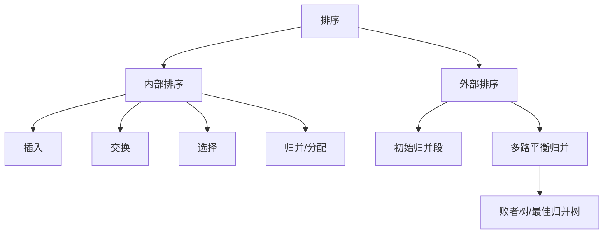

# 第8章 排序

## 本章定位

排序章既考过程模拟，也考复杂度、稳定性、空间和适用场景的横向比较。外部排序重点是 I/O 趟数、多路归并、败者树、置换选择与最佳归并树。

> [!important] 408 必考
> 各内部排序一趟结果、稳定性与复杂度；快速排序划分；建堆调整；归并；外部归并趟数和最佳归并树。

> [!note] 理解补充
> 稳定性只对相等关键字有意义，是算法性质；同一种思想的不同实现可能改变稳定性。

> [!info] 技术更新
> 标准库常使用混合排序：小区间插入排序、快速排序内省化、对象排序使用稳定归并类算法，以兼顾最坏界与真实数据分布。

## 章节导航

- 前置：[[第5章-树与二叉树|完全二叉树]]、[[第7章-查找|有序结构]]
- 本章：内部排序比较与外部排序
- 终点：返回[[数据结构目录|数据结构目录]]综合复习

## 考点地图

| 类别 | 算法 | 核心动作 |
|---|---|---|
| 插入 | 直接、折半、希尔 | 将当前记录插入已排序子序列 |
| 交换 | 冒泡、快速 | 逆序交换或划分 |
| 选择 | 简单选择、堆 | 每趟选择极值 |
| 归并/分配 | 归并、计数、基数 | 合并有序段或按键值分配收集 |
| 外部排序 | 多路归并 | 减少磁盘 I/O 趟数 |

## 核心知识框架



## 完整知识点

### 基本概念

内部排序中全部记录可同时驻留内存；外部排序需内外存交换。稳定排序保持相等关键字记录的原相对次序。衡量指标包括比较次数、移动次数、时间、辅助空间、稳定性以及对初始序列的敏感性。

### 插入排序

**直接插入排序**：第 $i$ 趟将 `A[i]` 插入 `A[0..i-1]`。

```text
InsertionSort(A, n):
    for i <- 1 to n-1:
        x <- A[i]; j <- i-1
        while j >= 0 and A[j] > x:
            A[j+1] <- A[j]; j <- j-1
        A[j+1] <- x
```

最好 $O(n)$，平均/最坏 $O(n^2)$，空间 $O(1)$，稳定。适合小规模或基本有序序列；移动次数与逆序对密切相关。

**折半插入**只用折半定位插入位置，比较次数降为 $O(n\log n)$，移动仍为 $O(n^2)$，总时间仍 $O(n^2)$；为保持稳定，相等时应插到已有相等元素之后。

**希尔排序**按递减增量分组插入，最后增量为 1。性能依赖增量序列，常见分析下最坏仍可到 $O(n^2)$，空间 $O(1)$，不稳定；适合中等规模，统考通常不给统一精确平均界。

### 交换排序

**冒泡排序**从一端扫描相邻逆序对并交换，每趟把一个极值送到最终位置。最好有提前退出标志时 $O(n)$，平均/最坏 $O(n^2)$，空间 $O(1)$，稳定。若某趟无交换即可结束。

**快速排序**选枢轴划分，使左侧不大于枢轴、右侧不小于枢轴，再递归两侧。

```text
QuickSort(A, low, high):
    if low >= high: return
    p <- Partition(A, low, high)
    QuickSort(A, low, p-1)
    QuickSort(A, p+1, high)
```

平均 $O(n\log n)$，最坏 $O(n^2)$；递归栈平均 $O(\log n)$、最坏 $O(n)$；不稳定。初始有序且固定取端点可能最坏，随机枢轴、三数取中和三向划分可改善。为了限制栈深，可优先递归较短区间、循环处理较长区间。

### 选择排序

**简单选择排序**每趟从未排序区选最小值与首位置交换，比较次数恒为 $n(n-1)/2$，时间 $O(n^2)$，移动少，空间 $O(1)$，不稳定。

**堆排序**以完全二叉树数组表示。升序构建大根堆，根与末尾交换，缩小堆并向下调整。

```text
SiftDown(A, root, end):
    x <- A[root]
    child <- 2*root+1
    while child <= end:
        if child+1 <= end and A[child] < A[child+1]: child <- child+1
        if x >= A[child]: break
        A[root] <- A[child]
        root <- child; child <- 2*root+1
    A[root] <- x
```

自最后一个非叶结点向前调整，建堆 $O(n)$；总时间最好/平均/最坏均 $O(n\log n)$，空间 $O(1)$，不稳定。适合数据量大、要求最坏界且内存紧张；小规模缓存表现通常不如快速排序。

### 归并、计数与基数排序

**二路归并排序**递归二分，再用辅助数组线性合并。时间始终 $O(n\log n)$，空间 $O(n)$，稳定；链表实现可减少结点移动。合并相等关键字时先取左段元素以保持稳定。

**计数排序**统计有限整数键范围 $[0,k]$ 的频数并求前缀和。时间 $O(n+k)$，空间 $O(k)$；按原序列从后向前放入输出数组可稳定。适合键域不大且可离散映射的整数，不是基于比较的排序。

**基数排序**按各位进行稳定的分配与收集。最低位优先 LSD 要求每一位排序稳定；若 $d$ 趟、基数 $r$，时间 $O(d(n+r))$，空间 $O(n+r)$（链式桶实现口径可能写 $O(r)$ 的附加桶指针），稳定。适合位数有限的整数或定长字符串。

### 内部排序总表

| 算法 | 最好 | 平均 | 最坏 | 辅助空间 | 稳定 | 适用性 |
|---|---:|---:|---:|---:|:---:|---|
| 直接插入 | $n$ | $n^2$ | $n^2$ | $1$ | 是 | 小规模、基本有序 |
| 折半插入 | $n\log n$ 比较 | $n^2$ | $n^2$ | $1$ | 是 | 比较昂贵、移动仍多 |
| 希尔 | 依增量 | 依增量 | 常记 $n^2$ | $1$ | 否 | 中等规模 |
| 冒泡 | $n$ | $n^2$ | $n^2$ | $1$ | 是 | 基本有序、教学实现 |
| 快速 | $n\log n$ | $n\log n$ | $n^2$ | 平均 $\log n$ | 否 | 通用内存排序 |
| 简单选择 | $n^2$ | $n^2$ | $n^2$ | $1$ | 否 | 移动代价高 |
| 堆排序 | $n\log n$ | $n\log n$ | $n\log n$ | $1$ | 否 | 最坏界、内存紧 |
| 二路归并 | $n\log n$ | $n\log n$ | $n\log n$ | $n$ | 是 | 稳定、链表、外排基础 |
| 计数排序 | $n+k$ | $n+k$ | $n+k$ | $k$ 或 $n+k$ | 是 | 小整数键域 |
| 基数排序 | $d(n+r)$ | $d(n+r)$ | $d(n+r)$ | $n+r$ | 是 | 多关键字/定长位 |

每趟至少确定一个最终位置：冒泡、简单选择、堆排序；快速排序每趟确定枢轴；插入、希尔、归并每趟形成更长有序段但元素不一定到最终位置。

### 外部排序

基本过程：把内存能容纳的记录分别内部排序，生成初始归并段；再进行多路归并直到一个有序文件。若初始归并段数为 $r$，$k$ 路平衡归并趟数：

$$
\lceil\log_k r\rceil
$$

外排总时间主要由读写 I/O、内部排序和归并比较组成。增大归并路数减少趟数，但普通选择最小记录的比较成本增加；**败者树**把 $k$ 路选择从 $O(k)$ 降为 $O(\log k)$，调整时记录比较中的败者，根部给出全局胜者。

**置换—选择排序**用输入缓冲、工作区和输出缓冲生成平均长度大于内存容量的初始归并段：输出当前工作区最小可接续记录；小于本段最后输出值的记录被冻结到下一段。输入分布影响段长。

**最佳归并树**用哈夫曼思想安排不同长度归并段，使读写总量最小。$k$ 路归并若初始段数不满足严格 $k$ 叉树条件，要补长度为 0 的虚段：

$$
(r-1)\bmod(k-1)=0
$$

若不成立，补足使其成立的最少虚段，再每次合并 $k$ 个最小权段。虚段应参与最早合并，不产生实际 I/O。

### 排序算法完整规格

以下内部排序均处理数组 `A[0..n-1]`；空数组和单元素数组直接成功。比较器必须满足严格弱序，否则结果没有一致定义。

```text
BubbleSort(A,n):
    for end <- n-1 downto 1:
        changed <- false
        for j <- 0 to end-1:
            if A[j] > A[j+1]: swap(A[j],A[j+1]); changed <- true
        if not changed: break

SelectionSort(A,n):
    for i <- 0 to n-2:
        minPos <- i
        for j <- i+1 to n-1:
            if A[j] < A[minPos]: minPos <- j
        if minPos != i: swap(A[i],A[minPos])

ShellSort(A,n,gaps):
    // gaps 为严格递减正整数序列，末项必须为 1
    if gaps invalid: return error
    for each gap in gaps:
        for i <- gap to n-1:
            x <- A[i]; j <- i
            while j >= gap and A[j-gap] > x:
                A[j] <- A[j-gap]; j <- j-gap
            A[j] <- x
```

冒泡最好 $O(n)$、平均/最坏 $O(n^2)$、空间 $O(1)$、稳定，适合基本有序小表。选择始终 $O(n^2)$、空间 $O(1)$、不稳定，适合移动代价高而比较便宜。希尔空间 $O(1)$、不稳定，时间依增量且常用最坏界 $O(n^2)$，适合中等规模；增量非法时拒绝执行。

```text
Partition(A, low, high):
    // 前提：0 <= low <= high < n；使用首元素枢轴的挖坑法
    pivot <- A[low]
    i <- low; j <- high
    while i < j:
        while i < j and A[j] >= pivot: j <- j-1
        if i < j: A[i] <- A[j]; i <- i+1
        while i < j and A[i] <= pivot: i <- i+1
        if i < j: A[j] <- A[i]; j <- j-1
    A[i] <- pivot
    return i
```

单次划分时间 $O(high-low+1)$、空间 $O(1)$；`low>high` 或下标越界应报告失败。相等元素被分别停留或跨过的规则由比较条件固定，本实现不稳定。完整快速排序平均 $O(n\log n)$、最坏 $O(n^2)$，递归空间平均 $O(\log n)$、最坏 $O(n)$。

```text
Merge(A, left, mid, right, temp):
    // 前提：A[left..mid] 与 A[mid+1..right] 已非降序，temp 容量足够
    if left < 0 or left > mid or mid >= right or right >= n: return error
    i <- left; j <- mid+1; k <- left
    while i <= mid and j <= right:
        if A[i] <= A[j]: temp[k] <- A[i]; i <- i+1
        else: temp[k] <- A[j]; j <- j+1
        k <- k+1
    while i <= mid: temp[k] <- A[i]; i <- i+1; k <- k+1
    while j <= right: temp[k] <- A[j]; j <- j+1; k <- k+1
    for k <- left to right: A[k] <- temp[k]

MergeSort(A,left,right,temp):
    if left >= right: return
    mid <- left + (right-left) div 2
    MergeSort(A,left,mid,temp)
    MergeSort(A,mid+1,right,temp)
    Merge(A,left,mid,right,temp)
```

`Merge` 时间 $O(right-left+1)$；完整归并时间 $O(n\log n)$、辅助数组 $O(n)$、递归栈 $O(\log n)$，稳定。适合要求稳定最坏界的内存排序，也是外排基础；临时数组分配失败应在排序开始前报告。

```text
CountingSort(A,n,minKey,maxKey):
    if minKey > maxKey: return error
    k <- maxKey-minKey+1
    if k cannot be allocated: return error
    count[0..k-1] <- 0
    for each x in A:
        if x < minKey or x > maxKey: return error
        count[x-minKey] <- count[x-minKey]+1
    for i <- 1 to k-1: count[i] <- count[i]+count[i-1]
    output[0..n-1]
    for i <- n-1 downto 0:
        p <- A[i]-minKey
        output[count[p]-1] <- A[i]
        count[p] <- count[p]-1
    copy output to A
```

时间 $O(n+k)$、空间 $O(n+k)$、稳定；适用于可映射到不大整数区间的关键字。键域过大时空间不可接受。

```text
RadixSortLSD(A,n,base,digits):
    // 前提：元素为非负整数；base >= 2；digits 足以覆盖最大值
    if base < 2 or digits < 0 or any key negative: return error
    factor <- 1
    for pass <- 1 to digits:
        count[0..base-1] <- 0
        for i <- 0 to n-1:
            digit <- (A[i] div factor) mod base
            count[digit] <- count[digit]+1
        for d <- 1 to base-1: count[d] <- count[d]+count[d-1]
        for i <- n-1 downto 0:
            digit <- (A[i] div factor) mod base
            output[count[digit]-1] <- A[i]
            count[digit] <- count[digit]-1
        copy output to A
        if pass < digits:
            if factor*base overflows: return error
            factor <- factor*base
```

时间 $O(d(n+r))$、空间 $O(n+r)$、稳定；适用于定长数字或可逐位编码的关键字。负数需先分组或采用明确的有符号编码。

### 外部排序核心伪代码

记一个磁盘块可容纳 $B$ 条记录，算法可使用的内存为 $M$ 条记录槽；$k$ 路归并需要 $k$ 个输入块、1 个输出块和选择结构 $S(k)=\Theta(k)$ 个记录槽，因此必须满足

$$
M\ge(k+1)B+S(k)
$$

该约束给出可用归并路数的上界，不能只为减少趟数而任意增大 $k$。

```text
CreateInitialRuns(input, memoryCapacity):
    if memoryCapacity <= 0: return error
    runs <- empty list
    while input has record:
        buffer <- read at most memoryCapacity records
        InternalSort(buffer)
        run <- write buffer sequentially to new run file
        if read/write failed: close files and return error
        append run to runs
    return runs

MergeKRuns(runs, output, B):
    // 前提：1 <= size(runs) <= k，每个归并段内部非降序；每路至少一个输入缓冲
    allocate one B-record input block for each run and one B-record output block
    H <- empty min-heap ordered by (key,runId,serial)
    for each run r:
        if ReadNext(r,x) succeeds: push(H,(x,r,serial=0))
        else if failure is not end-of-file: return error
    while H not empty:
        (x,r,s) <- popMin(H)
        if Write(output,x) fails: return error
        if ReadNext(r,y) succeeds: push(H,(y,r,s+1))
        else if failure is not end-of-file: return error
    flush output; if flush fails: return error
    return success

ExternalMergeSort(input,M,B,k):
    if B <= 0 or M <= 0 or k < 2: return error
    if M < (k+1)*B + S(k): return error("insufficient merge memory")
    runs <- CreateInitialRuns(input,M)
    if runs failed or runs empty: return corresponding result
    while size(runs) > 1:
        nextRuns <- empty list
        partition runs in consecutive groups of at most k
        for each group g:
            out <- create temporary run
            if creation fails or MergeKRuns(g,out,B) fails: clean current temporaries; return error
            append out to nextRuns
        delete only consumed temporary runs owned by this operation
        runs <- nextRuns
    return runs[0]
```

建段内部排序取决于所选算法；归并每趟读写全部 $N$ 条记录，等长初始段共 $r$ 个时为 $\lceil\log_k r\rceil$ 趟。堆选择每条输出 $O(\log k)$，败者树具有同阶选择代价且常数更适合多路归并；归并缓冲与选择结构占 $O(kB+k)$ 条记录槽，生成初始段的内部排序占 $O(M)$。算法适用于数据不能全部装入内存的文件；I/O 失败时必须保留原输入并只清理由本次操作创建的临时文件。

```text
ReplacementSelection(input,M):
    if M <= 0: return error
    active <- min-heap of first at most M input records
    frozen <- empty collection; runs <- empty list
    while active not empty or frozen not empty:
        open new run; last <- negative infinity
        while active not empty:
            x <- popMin(active); write x; last <- x.key
            if input has next record y:
                if y.key >= last: push(active,y)
                else: add y to frozen
            else if input read failed: return error
        close current run; append it to runs
        build active min-heap from frozen; clear frozen
    return runs
```

每条记录参与堆操作，时间 $O(N\log M)$、内存 $O(M)$；适用于生成长于内存容量的初始归并段。空输入返回空段集合，写失败立即报告并清理未完成段。

## 典型题型与解题方法

1. **给一趟结果识别算法**：看是否形成前缀有序、极值归位、枢轴分区、堆结构或相邻有序段。
2. **比较选型**：先看数据规模与初始有序度，再看稳定性、最坏界、空间和键域。
3. **快速划分**：严格按题给 partition 代码模拟；不同实现中相等元素处理和一趟结果不同。
4. **堆调整**：数组下标先定 0 基/1 基，每次选择更大孩子，下沉到满足堆序。
5. **外排**：先算初始段数，再算归并趟数；非等长段求 I/O 最优时画最佳归并树并补虚段。

## 易错点

- 折半插入没有减少元素移动数量，因此总时间仍为 $O(n^2)$。
- 快速排序不是原地 $O(1)$ 空间：递归栈必须计入。
- 建堆是 $O(n)$，不是把每个结点的 $O(\log n)$ 简单相乘得出的紧确界。
- “每趟有序”不等于“每趟有元素最终归位”。
- 基数排序各位的分配收集必须稳定。
- 增加外排归并路数会减少趟数，但缓冲区和选择结构也需相应资源。

## 跨章节/跨科联系

- [[第5章-树与二叉树]]的完全二叉树对应堆，哈夫曼树对应最佳归并树。
- [[第7章-查找]]的折半、分块与索引依赖有序序列。
- 外部排序的核心代价是磁盘 I/O，联系操作系统缓冲、文件系统和组成原理的存储层次。

## 本章复习清单

- [ ] 能手写直接插入、冒泡、快速划分、堆调整、二路归并
- [ ] 能填写所有内部排序的复杂度、空间、稳定性
- [ ] 能按规模、有序度、稳定性和空间选择算法
- [ ] 能解释建堆为何是 $O(n)$
- [ ] 能计算 $k$ 路归并趟数
- [ ] 能说明败者树和置换选择的作用
- [ ] 能构造含虚段的最佳归并树

## 自测问题

1. 哪些排序在序列基本有序时可接近 $O(n)$？
2. 快速排序如何降低最坏划分和栈溢出的风险？
3. 堆排序与简单选择排序都属选择类，为何复杂度不同？
4. 为什么 LSD 基数排序要求位排序稳定？
5. 最佳归并树为什么要补长度为 0 的虚段？

## 资料依据

- 《2026 年数据结构考研复习指导》（王道论坛）第 8 章 OCR 归纳。
- 现有长篇笔记的内排序比较表与外排序专题。
- 简版笔记中的稳定性、复杂度和适用场景清单。

## 前后章节导航

- 上一章：[[第7章-查找|第7章 查找]]
- 返回：[[数据结构目录|数据结构目录]]
