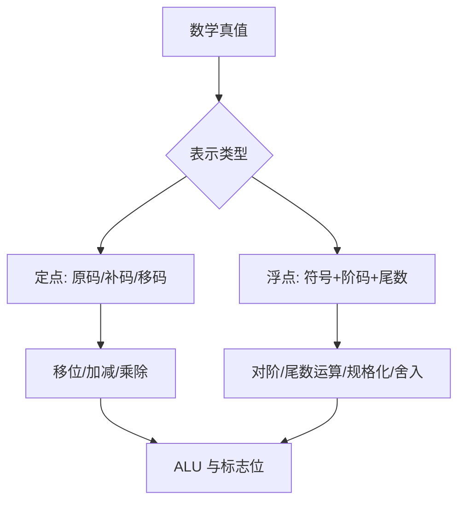

# 第2章 数据的表示和运算

## 本章定位

本章研究“有限位宽如何表示并运算无限数学对象”。所有题都要先锁定**编码、位宽、有无符号、舍入方式**，再做位级运算；结果必须说明是否可表示、是否溢出以及标志位含义。

## 章节导航

- [[#进位计数制与转换]]
- [[#定点数编码与范围]]
- [[#移位与定点四则运算]]
- [[#IEEE 754 浮点数]]
- [[#ALU 与加法器]]
- [[#数据存放、端序与对齐]]

## 考点地图

| 模块 | 高频任务 | 核心约束 |
|---|---|---|
| 进制转换 | 整数/小数、二八十六进制 | 小数可能无限循环 |
| 定点编码 | 真值、原反补移码、范围 | 符号位是否参与运算 |
| 加减 | 补码、标志位、溢出 | 固定位宽丢弃最高进位 |
| 乘除 | 位宽、部分积、余数 | 乘积常需双倍位宽 |
| 浮点 | 编码、分类、加减、舍入 | 阶码偏置与隐藏位 |
| ALU | 加法器、功能选择、标志 | 组合逻辑，不存状态 |

> [!important] 408 必考
> 进制转换、原反补移码、定宽移位与四则运算、CF/OF/ZF/SF、IEEE 754 分类与加减步骤、加法器和 ALU 是本章考试主线。所有结论都必须绑定编码和位宽，浮点题必须显式写对阶、尾数运算、规格化、舍入与溢出判断。

> [!note] 理解补充
> C 语言整数转换、大小端、自然对齐、保护位/舍入位/粘滞位用于把位级规则连接到程序与存储。它们用于解释为什么同一位串会有不同真值、为什么舍入会丢信息，不改变教材规定的补码和 IEEE 754 推导流程。

> [!info] 技术更新
> 现实处理器还支持半精度、脑浮点、融合乘加和向量整数/浮点运算；融合乘加只在最终阶段舍入一次，可能与分开的乘法再加法结果不同。408 若未明确给出这些格式或指令，仍按教材给定的定点位宽、binary32/binary64 与逐步运算口径作答。

## 核心知识框架

## 完整知识点

### 进位计数制与转换

基数为 $r$ 的数：

$$
(K_n\cdots K_0.K_{-1}\cdots K_{-m})_r=\sum_{i=-m}^{n}K_ir^i,\quad 0\le K_i<r
$$

- $r$ 进制转十进制：按权展开。
- 十进制整数转 $r$ 进制：除 $r$ 取余，余数逆序。
- 十进制小数转 $r$ 进制：乘 $r$ 取整，整数部分顺序排列；有限位宽时按题意截断或舍入。
- 二进制与八/十六进制：小数点两侧分别按 3/4 位分组，不足处补 0。

$n$ 位无符号整数范围为 $[0,2^n-1]$。十进制整数 $N>0$ 所需最少二进制位数为 $\lfloor\log_2N\rfloor+1$。

### 定点数编码与范围

以下设总位数为 $n$（含一位符号位），整数真值为 $x$：

| 编码 | 正数 | 负数获得方法 | 范围 | 零 |
|---|---|---|---|---|
| 原码 | 符号 0 + 数值 | 符号置 1，数值不变 | $[-(2^{n-1}-1),2^{n-1}-1]$ | 两个 |
| 反码 | 同原码 | 原码除符号位逐位取反 | 同原码 | 两个 |
| 补码 | 同原码 | 原码除符号位取反加 1 | $[-2^{n-1},2^{n-1}-1]$ | 一个 |
| 移码 | $x+2^{n-1}$（常见偏置） | 按偏置编码 | 与补码真值范围相应 | 一个 |

补码的位权解释最可靠：

$$
x=-b_{n-1}2^{n-1}+\sum_{i=0}^{n-2}b_i2^i
$$

补码的相反数：全部位取反再加 1，仍限制在 $n$ 位。最小负数 $100\cdots0$ 取负后仍为自身，数学结果 $2^{n-1}$ 不可表示，属于溢出。

符号扩展：补码扩展高位复制符号位；无符号数高位补 0。截短整数时保留低位，只有被删高位都是合法扩展位时数值才不变。

### C 语言整数与类型转换

在常见定长模型下，相同位串解释为 signed 或 unsigned 时位本身不变、真值改变。$n$ 位补码负数 $x$ 转无符号数：

$$
u=x+2^n
$$

不同长度转换通常先做长度扩展再按目标类型解释；有符号转长做符号扩展，无符号转长补 0。表达式混合有无符号数时须依据题设的 C 转换规则，不能凭数学直觉比较。

### 移位与定点四则运算

#### 移位

| 操作 | 高位补入 | 低位移出 | 数值意义（无溢出时） |
|---|---|---|---|
| 逻辑左移 | 0 | 最高位 | 无符号乘 2 |
| 逻辑右移 | 0 | 最低位 | 无符号除 2 向下取整 |
| 算术左移 | 0 | 最高位 | 补码乘 2，可能溢出 |
| 算术右移 | 符号位 | 最低位 | 补码除 2，向负无穷舍入 |

循环移位把移出位送回另一端；带进位循环还把进位标志作为额外一位。

#### 补码加减

$$
[x+y]_{补}=([x]_{补}+[y]_{补})\bmod 2^n
$$

减法转为 $x-y=x+(-y)$。最高位进位丢弃，得到模 $2^n$ 的结果；是否溢出另判。

有符号溢出只可能发生在**同号相加得异号**，或**异号相减且结果符号异常**。设符号位的进位为 $C_n$、进入符号位的进位为 $C_{n-1}$：

$$
OF=C_n\oplus C_{n-1}
$$

常见标志：

| 标志 | 含义 | 判定 |
|---|---|---|
| ZF | 结果为 0 | 结果各位全 0 |
| SF | 结果符号 | 结果最高位 |
| CF | 无符号进/借位 | 加法最高进位；减法口径依电路定义 |
| OF | 有符号溢出 | 符号规则或异或进位 |

CF 服务无符号数，OF 服务补码有符号数，二者可不同。

#### 乘法

无符号阵列/移位乘法按乘数每位决定是否加被乘数并移位。两个 $n$ 位数的完整乘积最多需 $2n$ 位。补码乘法可用 Booth 思想根据相邻乘数位执行加、减或不操作，再算术右移。

若只保留低 $n$ 位，判断溢出：无符号完整乘积高 $n$ 位应全 0；有符号完整乘积高半部应是低半部符号位的全符号扩展。

#### 除法

除法通过试商、减除数和移位生成商，$n$ 位被除数除以 $n$ 位除数时商通常为 $n$ 位、余数与除数同宽或多一保护位。整数关系：

$$
x=q\times y+r,\qquad |r|<|y|
$$

除数不能为 0。补码最小负数除以 $-1$ 的数学结果超出正数上界，也会溢出。

### IEEE 754 浮点数

#### 格式与分类

| 格式 | 总位数 | 阶码位 $k$ | 尾数字段 $f$ | 偏置 Bias |
|---|---:|---:|---:|---:|
| binary32 | 32 | 8 | 23 | 127 |
| binary64 | 64 | 11 | 52 | 1023 |

规格化数：

$$
x=(-1)^s\times(1.f)_2\times2^{E-Bias},\quad 0<E<2^k-1
$$

| 阶码字段 $E$ | 尾数字段 | 类别 | 有效数 |
|---|---|---|---|
| 0 | 0 | $\pm0$ | 0 |
| 0 | 非 0 | 非规格化数 | $0.f$，实际阶为 $1-Bias$ |
| $1\sim2^k-2$ | 任意 | 规格化数 | $1.f$ |
| 全 1 | 0 | $\pm\infty$ | — |
| 全 1 | 非 0 | NaN | — |

binary32 最大有限数为 $(2-2^{-23})2^{127}$，最小正规格化数为 $2^{-126}$，最小正非规格化数为 $2^{-149}$。

#### 十进制数编码步骤

1. 写符号位 $s$。
2. 把绝对值转二进制并规格化为 $1.f\times2^e$。
3. 阶码字段 $E=e+Bias$。
4. 去掉隐藏的首位 1，尾数字段按舍入方式保留。
5. 检查上溢、下溢以及 0/非规格化边界。

#### 浮点加减五步

1. **对阶**：小阶向大阶看齐，小阶尾数右移；保留保护位、舍入位和粘滞位。
2. **尾数运算**：按符号做加减。
3. **规格化**：溢出右规并阶加 1；前导 0 左规并阶减小。
4. **舍入**：常考就近舍入、向 0、向 $+\infty$、向 $-\infty$。
5. **判溢出**：阶码过大上溢，过小进入非规格化或下溢为 0。

IEEE 754 的默认舍入方式是 **roundTiesToEven（就近舍入，遇中点取偶）**：先选距离精确值最近的可表示数；若精确值恰好位于两个可表示数正中间，则选择保留部分最低有效位为 0（偶数）的那个。

用保护位 $G$、舍入位 $R$、粘滞位 $S$ 判断时：$G$ 是保留字段后的第 1 个被舍弃位，$R$ 是第 2 个被舍弃位，$S$ 是其余所有被舍弃位的逻辑或。记保留结果最低有效位为 $L$，roundTiesToEven 的进位条件为：

$$
Increment=G\land(R\lor S\lor L)
$$

- $G=0$：被舍部分小于半个 ULP，不进位。
- $G=1$ 且 $R\lor S=1$：大于半个 ULP，进位。
- $G=1,R=0,S=0$：恰好在中点；仅当 $L=1$ 时进位，使最终最低有效位变为 0。

例如保留到 `1.010` 时，精确尾数 `1.010100…` 是中点且 $L=0$，结果仍为 `1.010`；精确尾数 `1.011100…` 是中点且 $L=1$，结果进位为 `1.100`。两例最终最低有效位均为偶数位 0。

浮点乘除一般先处理符号，阶码相加/相减并校正偏置，尾数相乘/相除，再规格化、舍入和判溢出。

> [!warning] 浮点规律
> 浮点运算通常不满足结合律；大数与很小数相加可能因对阶丢失小数。表示范围由阶码主导，精度由有效数位数主导。

### ALU 与加法器

ALU 是组合逻辑部件，根据功能选择信号完成算术、逻辑、移位等操作，并产生标志。它本身不保存操作数。

一位全加器：

$$
S_i=A_i\oplus B_i\oplus C_i
$$

$$
C_{i+1}=A_iB_i+(A_i\oplus B_i)C_i
$$

串行进位加法器结构简单但进位延迟随位数增长。并行先行进位定义生成 $G_i=A_iB_i$、传递 $P_i=A_i\oplus B_i$，由 $C_{i+1}=G_i+P_iC_i$ 展开并行计算进位。

用加法器统一加减：对 $B$ 各位与控制信号 `Sub` 异或，同时令最低进位 $C_0=Sub$；`Sub=1` 时得到 $A+\overline B+1=A-B$。

### 数据存放、端序与对齐

- **大端**：多字节对象的最高有效字节放在低地址。
- **小端**：最低有效字节放在低地址。
- 端序只改变字节在内存中的排列，不改变一个字节内部的位序，也不改变寄存器中的数学值。
- 按边界对齐时，长度为 $m$ B 的对象常要求起始地址是 $m$ 的整数倍（具体依 ISA/题设）。结构体还可能含填充字节。

## 典型题型与方法

### 题型一：补码真值与扩展

先写位宽，再用负权公式读值。扩展前后分别求真值校验；补码负数扩展必须补 1。

### 题型二：标志位

按固定位宽完成加法，保留最高进位用于 CF，结果最高位用于 SF，全零用于 ZF，再按同号规则求 OF。不要根据十进制直觉跳算。

### 题型三：IEEE 754 解码

拆 $s/E/f$ → 分类 → 求实际阶 → 补隐藏位 → 代公式。遇到 $E=0$ 或全 1 必须走特殊分支。

### 题型四：浮点加减

在草稿上显式写出阶差、尾数右移位数、保护/舍入/粘滞位、规格化次数和最终阶码；只写十进制结果通常无法覆盖舍入考点。

### 题型五：地址字节序

先把数据补足固定十六进制位数，每两个十六进制数字作为 1 B，再按地址从低到高排列；不要把半字节倒序。

## 易错点

- 位串无所谓正负，解释方式才决定真值。
- 补码最小负数的绝对值不能用同位宽有符号正数表示。
- 算术右移负数相当于向负无穷取整，不是向 0。
- 最高位进位不等于有符号溢出；CF 与 OF 分工不同。
- 浮点阶码字段是移码式偏置编码，不等于实际阶。
- 非规格化数没有隐藏首位 1，实际阶固定为 $1-Bias$。
- 对阶只允许小阶向大阶靠齐，否则会丢失高位。
- IEEE 754 的 NaN 与任何数（包括自身）的普通相等比较都不应按数值相等理解。
- 大小端按字节排列，不反转字节内部位。

## 跨章节/跨科联系

- [[第3章-存储系统]]：端序、对齐、块内偏移和存储字长共同决定数据位置。
- [[第4章-指令系统]]：立即数字段扩展、算术/逻辑指令和条件转移依赖本章编码与标志。
- [[第5章-中央处理器]]：ALU、移位器和标志寄存器位于数据通路。
- 数据结构与 C 语言：类型长度、强制转换、结构体填充会改变机器级表示。
- 操作系统：页内偏移是无符号地址字段，地址算术按固定位宽处理。

## 本章复习清单

- [ ] 能完成任意整数和有限小数的进制转换。
- [ ] 能写出 $n$ 位原码、补码、移码范围。
- [ ] 能用位权解释补码并正确扩展/截短。
- [ ] 能区分逻辑移位、算术移位和循环移位。
- [ ] 能用 CF、OF、ZF、SF 分析定长加减。
- [ ] 能说明乘积/余数寄存器的位宽需求和除零边界。
- [ ] 能编码、解码 binary32，并识别特殊值。
- [ ] 能完整执行浮点加减五步与舍入。
- [ ] 能说明串行进位与先行进位的差异。
- [ ] 能按地址画出大小端字节序和对齐填充。

## 自测问题

1. 8 位补码 `10000000` 的真值是多少？为何不能在 8 位内取绝对值？
2. 同一加法为何可能 OF=1、CF=0？请给出 8 位例子。
3. 算术右移 `11110101` 一位的结果及真值变化是什么？
4. binary32 中阶码全 0、尾数非 0 时为何没有隐藏位 1？
5. 浮点加法为何需要粘滞位？
6. 小端机器在地址 1000 起存放 32 位值 `0x12345678`，四个字节依次是什么？
7. 两个 $n$ 位补码数相乘，只保留低 $n$ 位时如何判溢出？

## 资料依据

- 《2026 年计算机组成原理考研复习指导》第 2 章“数据的表示和运算”，用于 408 编码、运算电路和浮点口径。
- `408-考研/98-OCR工程/output/2026计算机组成原理_full.txt` 第 2 章及分页 OCR，用于核对公式、IEEE 754、类型转换和章后问题；已纠正识别出的上下标、位串和运算符。
- 本目录旧稿与 `408-考研复习/03-计算机组成原理/第2章-数据的表示和运算.md`，用于核对易错点。

## 前后章节导航

上一章：[[第1章-计算机系统概述\|第1章 计算机系统概述]]  
下一章：[[第3章-存储系统\|第3章 存储系统]]
