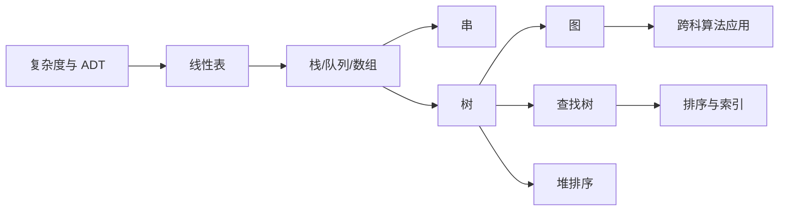

# 数据结构目录

> [!cite] 教材与速查
> [[../90-复习资料/01-核心教材/2026数据结构_带书签.pdf#page=13|打开教材正文起始页]] · [[../90-复习资料/01-核心教材/00-核心教材页码索引#数据结构|页码索引]] · [[../00-总览/408四科公式算法协议速查#二、数据结构|数据结构速查]]

## 使用说明

本目录对应王道 2026 数据结构八章。建议先按章节顺序建立知识结构，再按“算法伪代码—复杂度—边界—适用场景”做第二轮横向比较，最后用每章复习清单和自测问题闭环。

> [!important] 408 必考
> 线性表算法、树与图、查找结构、内外排序是主体；绪论复杂度和 KMP 常以小题精确考查。

> [!note] 理解补充
> 做算法题时先写输入约定与失败条件，再写不变量和复杂度，能显著减少下标与空指针错误。

> [!info] 技术更新
> 笔记保留 408 统一模型，同时在各章标注缓存、外存、工程算法等现实实现差异。

## 八章导航

| 章 | 主题 | 必会主线 |
|---:|---|---|
| 1 | [[第1章-绪论|绪论]] | ADT、时间与空间复杂度 |
| 2 | [[第2章-线性表|线性表]] | 顺序表、单/双/循环/静态链表 |
| 3 | [[第3章-栈队列数组|栈、队列和数组]] | 循环队列、表达式、矩阵压缩 |
| 4 | [[第4章-串|串]] | KMP、`next`、`nextval` 与下标口径 |
| 5 | [[第5章-树与二叉树|树与二叉树]] | 遍历、线索、哈夫曼、并查集 |
| 6 | [[第6章-图|图]] | 存储、遍历、MST、最短路、关键路径 |
| 7 | [[第7章-查找|查找]] | 折半、平衡树、多路树、散列、ASL |
| 8 | [[第8章-排序|排序]] | 内排序比较、外部归并 |

## 全书知识网络

## 横向速查

### 核心复杂度

| 操作/算法 | 典型复杂度 |
|---|---:|
| 顺序表按位访问 | $O(1)$ |
| 链表按位查找 | $O(n)$ |
| KMP | $O(n+m)$ |
| 树/图遍历（邻接表） | $O(n)$ / $O(V+E)$ |
| Dijkstra（矩阵） | $O(V^2)$ |
| Floyd | $O(V^3)$ |
| AVL、红黑树查找 | $O(\log n)$ |
| 散列查找 | 平均 $O(1)$，最坏 $O(n)$ |
| 高效比较排序 | 平均或最坏 $O(n\log n)$ |

### 伪代码检查顺序

1. 明确数组是 0 基还是 1 基，逻辑位置与物理下标是否相差 1。
2. 写空结构、满结构、非法位置、不可达等失败条件。
3. 确定循环不变量或递归含义。
4. 修改指针前保存仍要访问的结点地址。
5. 给出时间、辅助空间，以及最好/平均/最坏口径。
6. 说明算法前提，如有序、非负权、连通、DAG 或键域有限。

## 三轮复习路径

### 第一轮：结构与操作

按 1→8 章阅读，手写每个核心 ADT 的基本操作，重点理解顺序与链式、递归与迭代、内存与外存的取舍。

### 第二轮：算法专题

- 指针专题：链表、树链表、邻接表、散列拉链。
- 遍历专题：树的四种遍历、图的 BFS/DFS、拓扑序。
- 贪心专题：哈夫曼、Prim、Kruskal。
- 动态更新专题：AVL/红黑树、B 树、散列表。
- 比较专题：查找 ASL、排序复杂度与稳定性。

### 第三轮：真题闭环

限时完成选择题和算法题；错题回填到对应章“易错点”；算法答案固定包含设计思想、伪代码、正确性要点、时间与空间复杂度。

## 全书复习清单

- [ ] 八章章节导航均能脱稿复述
- [ ] 常用伪代码能在边界完整的前提下手写
- [ ] 树、图、查找、排序复杂度表能横向比较
- [ ] KMP 和矩阵压缩能先声明下标口径
- [ ] 图算法能先声明适用前提
- [ ] 成功/失败 ASL 能区分样本空间
- [ ] 外部排序能从 I/O 角度解释优化

## 资料依据

- 《2026 年数据结构考研复习指导》扫描 PDF，第 13～412 页；章节边界来自原书书签，正文只对重点页做定向 OCR 并人工复核。
- [[../90-复习资料/01-核心教材/00-核心教材页码索引#数据结构|核心教材页码索引]]与本目录既有算法笔记用于交叉校核。

## 开始学习

- 第一章：[[第1章-绪论|绪论：复杂度与 ADT]]
- 综合回看：按本页“横向速查”和“三轮复习路径”执行。
- 跨科回看：[[../00-总览/408跨科知识链|408 跨科知识链]]。
