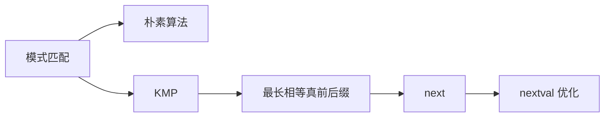

# 第4章 串

> [!cite] 教材定位
> 原书：[[408/90-复习资料/01-核心教材/2026数据结构_带书签.pdf#page=121|第4章 串（PDF 第 121 页）]]；本章范围为 PDF 第 121–135 页。

## 本章定位

本章核心是字符串模式匹配。必须把朴素匹配、KMP、`next`、`nextval` 放在统一下标口径下理解，能手算也能解释失配后的指针变化。

> [!important] 408 必考
> 手算 `next`/`nextval`，判断失配后主串与模式串指针，计算字符比较次数。

> [!note] 理解补充
> KMP 的本质是复用“模式串已匹配前缀”的自相似信息，主串指针不回退。

> [!info] 技术更新
> 工程中还常用 Boyer–Moore、Rabin–Karp 和自动机；408 的算法与数组口径以题目定义为准。

## 章节导航

- 前置：[[第3章-栈队列数组|线性序列与数组下标]]
- 本章：串的定义、存储、朴素匹配、KMP 与优化
- 后续：[[第5章-树与二叉树|树与二叉树]]进入非线性结构

## 考点地图

| 模块 | 核心 | 关键边界 |
|---|---|---|
| 串 ADT | 子串、位置、空串 | 空串不同于空格串 |
| 朴素匹配 | 失配后主串回退 | 最坏 $O(nm)$ |
| KMP | 主串不回退 | `next` 定义口径 |
| `nextval` | 避免相同字符再次比较 | 递推依赖 `next` |

## 核心知识框架



## 完整知识点

### 串的概念与存储

串是零个或多个字符组成的有限序列。空串长度为 0；空格串含空格字符，长度不为 0。子串是主串中连续字符序列，子串位置通常指其首字符在主串中的位置。

常见操作包括赋值、复制、判空、比较、求长、连接、求子串、定位、替换、插入和删除。定长顺序存储可能截断；堆分配顺序存储长度灵活且支持随机访问；块链存储适合长串插删，但块大小影响存储密度。

### 朴素模式匹配

主串长度 $n$、模式串长度 $m$。每次从主串某候选位置开始逐字符比较，失配则主串候选起点右移一位。最坏字符比较次数为 $(n-m+1)m$，复杂度 $O(nm)$。

```text
Naive(S, P):                   // 0 基
    for start <- 0 to |S|-|P|:
        j <- 0
        while j < |P| and S[start+j] = P[j]:
            j <- j + 1
        if j = |P|: return start
    return -1
```

空模式串通常约定在位置 0 匹配成功；若题目另有接口定义，应服从题设。

### KMP 的 0 基前缀函数口径

定义 $\pi[j]$ 为模式串 $P[0..j]$ 的最长相等真前缀与真后缀长度。计算时：

```text
BuildPi(P):
    pi[0] <- 0
    for i <- 1 to |P|-1:
        j <- pi[i-1]
        while j > 0 and P[i] != P[j]:
            j <- pi[j-1]
        if P[i] = P[j]: j <- j + 1
        pi[i] <- j
```

匹配：

```text
KMP0(S, P):
    if |P| = 0: return 0
    pi <- BuildPi(P)
    j <- 0
    for i <- 0 to |S|-1:
        while j > 0 and S[i] != P[j]:
            j <- pi[j-1]
        if S[i] = P[j]: j <- j + 1
        if j = |P|: return i-|P|+1
    return -1
```

预处理 $O(m)$，匹配 $O(n)$，总时间 $O(n+m)$，辅助空间 $O(m)$。

### 王道常用 1 基 `next` 口径

模式字符编号 $1..m$，令 `next[1]=0`。`next[j]=k` 表示在 $P[j]$ 失配时转去比较 $P[k]$；其中已经匹配的是 $P[1..j-1]$，故 $P[1..k-1]$ 是其最长相等真前后缀。递推：

```text
BuildNext(P):                  // P[1..m]
    i <- 1; j <- 0
    next[1] <- 0
    while i < m:
        if j = 0 or P[i] = P[j]:
            i <- i + 1
            j <- j + 1
            next[i] <- j
        else:
            j <- next[j]
```

匹配时若 `j==0` 或字符相等，则 `i++`,`j++`；否则仅令 `j=next[j]`，主串 `i` 不回退。成功条件 `j>m`。

> [!warning] 下标口径
> 有的教材给 `next[0]=-1`，有的把最长前后缀长度整体右移。数组数值不同并非算法矛盾。答题先抄题目定义，再用同一口径推到底，不能直接套背诵结果。

### `nextval` 优化

若失配后转到的字符与当前失配字符相同，会立即再次失配。1 基口径中：

```text
BuildNextVal(P):
    m <- |P|
    if m = 0: return empty array
    next <- BuildNext(P)
    nextval[1] <- 0
    for j <- 2 to m:
        if next[j] = 0:
            nextval[j] <- 0
        else if P[j] != P[next[j]]:
            nextval[j] <- next[j]
        else:
            nextval[j] <- nextval[next[j]]
```

空模式串返回空数组；非空模式串才写 `nextval[1]`。当 `next[j]=0` 时分支直接结束，不访问不存在的 `P[0]`。时间和辅助空间均为 $O(m)$；`nextval` 只减少冗余比较，不改变匹配结果与渐进复杂度。

### 手算方法

对每个失配位置 $j$，只考察已匹配段 $P[1..j-1]$，列出它的真前缀和真后缀，取最长相等者长度 $L$，则 1 基口径 `next[j]=L+1`；不存在时为 1，特殊首项为 0。随后比较 `P[j]` 与 `P[next[j]]` 决定是否递归压缩为 `nextval`。

## 典型题型与解题方法

1. **求数组**：在草稿上写字符、下标、已匹配段三行；逐列求最长边界，最后统一转换口径。
2. **问下次比较位置**：主串指针保持在失配字符，模式指针跳到 `next[j]`；若 `j=0`，下一步两指针共同前进。
3. **比较次数**：按代码逐次记录 `(i,j)`，字符相等和不等都计一次，`j` 连续回退可能对同一主串字符比较多次。
4. **最大滑动距离**：失配于 $j$ 时模式右移 $j-next[j]$；使用 `nextval` 则代入 `nextval[j]`。

## 完整例题与逐步解答

### 例 1：手算前缀函数

求模式串 `ABABACA` 的 0 基前缀函数 $\pi$。

> [!success]- 展开完整答案
> $\pi[i]$ 表示子串 $P[0..i]$ 的最长相等真前缀/真后缀长度。逐位计算：
>
> | $i$ | 字符 | $P[0..i]$ | 最长边界 | $\pi[i]$ |
> |---:|:---:|---|---|---:|
> | 0 | A | A | 空 | 0 |
> | 1 | B | AB | 空 | 0 |
> | 2 | A | ABA | A | 1 |
> | 3 | B | ABAB | AB | 2 |
> | 4 | A | ABABA | ABA | 3 |
> | 5 | C | ABABAC | 空 | 0 |
> | 6 | A | ABABACA | A | 1 |
>
> 所以
>
> $$
> \boxed{\pi=[0,0,1,2,3,0,1]}.
> $$
>
> 在 $i=5$ 遇到 C 时，候选边界会从长度 3 回退到 $\pi[2]=1$，再回退到 $\pi[0]=0$，直到找不到可继续的相等边界。

### 例 2：KMP 失配为何不回退主串

用模式串 `ABABAC` 匹配主串 `ABABABAC`。说明第一次在 C 处失配后的跳转和最终匹配位置。

> [!success]- 展开完整答案
> 模式的前缀函数为
>
> $$
> [0,0,1,2,3,0].
> $$
>
> 主串前 5 个字符 `ABABA` 已与模式前 5 个字符匹配，此时主串下标 5 的 `B` 与模式下标 5 的 `C` 失配。已匹配段 `ABABA` 的最长边界长度为 $\pi[4]=3$，所以模式指针从 5 回退到 3，主串指针仍停在下标 5：
>
> ```text
> text:    A B A B A B A C
> pattern:     A B A B A C
> ```
>
> 此时主串 `B` 与模式下标 3 的 `B` 相等，继续匹配 `A C`，最终模式从主串 0 基下标 2 开始匹配成功。
>
> 主串不回退的依据是：前缀函数已经把“刚才匹配成功的文本后缀”与“模式可复用前缀”对应起来，无需重新比较已知相等的字符。

## 做题识别顺序

1. 先确认使用 0 基 $\pi$、1 基 `next` 还是 `nextval`，不要混表。
2. 求 $\pi[i]$ 时只看 $P[0..i]$ 的真前后缀；失配后沿已有 $\pi$ 链回退。
3. 跟踪匹配时记录 `(i,j)`，失配只回退模式指针，主串指针保持。
4. 比较次数题把每次字符相等/不等都计入，同一主串字符可能比较多次。
5. 周期题除看 $n-\pi[n-1]$ 外，还要检查边界非空且能整除总长度。

## 一页记忆

```c
while (j > 0 && text[i] != pattern[j])
    j = pi[j - 1];
if (text[i] == pattern[j])
    ++j;
```

$$
\boxed{T_{KMP}=O(n+m),\qquad S_{KMP}=O(m)}
$$

- $\pi[i]$ 是 $P[0..i]$ 的最长相等真前缀/真后缀长度。
- 常见王道 1 基口径中，`next[1]=0`；对 $j\ge2$，`next[j]=\pi[j-2]+1`。若题目给不同代码，以代码定义为准。
- `nextval` 在回退位置字符仍与当前字符相同时继续跳过，避免必然重复的失配。

## 易错点

- `next[j]` 由 $P[1..j-1]$ 决定，不把当前失配字符算入已匹配段。
- KMP 主串指针不回退，不代表每个主串字符只比较一次。
- `next` 与前缀函数 $\pi$ 的下标和数值不能直接混用。
- `nextval` 不是简单地给每项减 1。
- 匹配成功返回首位置时注意 0 基和 1 基的差异。

## 跨章节/跨科联系

- [[第7章-查找]]同样通过预处理降低在线查找代价。
- KMP 的失配跳转可理解为有限状态自动机；计算机网络协议解析与编译器词法分析会用到字符串匹配。
- 前后缀思想也用于周期判断：令 $p=n-\pi[n-1]$；只有同时满足 $\pi[n-1]>0$、$p<n$ 且 $n\bmod p=0$，串才由长度为 $p$ 的较短非空周期重复构成。

## 本章复习清单

- [ ] 能区分空串与空格串、子串与子序列
- [ ] 能写朴素匹配并分析最坏复杂度
- [ ] 能用 0 基前缀函数实现 KMP
- [ ] 能按王道 1 基口径手算 `next`
- [ ] 能由 `next` 推导 `nextval`
- [ ] 能跟踪失配后的指针与字符比较次数

## 自测问题

1. KMP 为什么能保证主串指针不回退？
2. `next[j]` 为什么只取决于 `P[1..j-1]`？
3. 0 基前缀函数与 1 基 `next` 如何建立对应关系？
4. `P[j]==P[next[j]]` 时为何可继续跳到 `nextval[next[j]]`？
5. KMP 的最坏时间和辅助空间分别是多少？

> [!question]- 自测问题参考答案
> 1. 失配前已经知道一段文本等于模式前缀；`next/π` 直接给出该段后缀中可复用的最长模式前缀，只移动模式即可继续，主串字符无需重新读取。
> 2. 失配发生在 $P[j]$，真正已经匹配的是 $P[1..j-1]$；可复用边界必须来自这段已知相等内容，不能把尚未匹配成功的 $P[j]$ 算进去。
> 3. 必须先声明口径。常见王道 1 基定义下 `next[1]=0`，$j\ge2$ 时 `next[j]=π[j-2]+1`；0 基实现通常直接把失配长度更新为 `π[j-1]`。
> 4. 若 $P[j]=P[next[j]]$，在 $P[j]$ 失配后跳到该位置仍会拿同一个字符与当前主串字符比较，必然再次失配；`nextval` 继续沿失配链跳过它。
> 5. 预处理模式 $O(m)$，在线扫描主串 $O(n)$，总时间 $O(n+m)$；前缀/next 数组占 $O(m)$ 辅助空间。

## 资料依据

- 《2026 年数据结构考研复习指导》第 4 章，第 121～135 页；按 PDF 书签定位并以定向 OCR 辅助核对，`next`、`nextval` 与前缀函数口径已人工复核。
- 本目录既有统考题型总结与口径提示用于交叉核对。

## 前后章节导航

- 上一章：[[第3章-栈队列数组|第3章 栈、队列和数组]]
- 下一章：[[第5章-树与二叉树|第5章 树与二叉树]]
