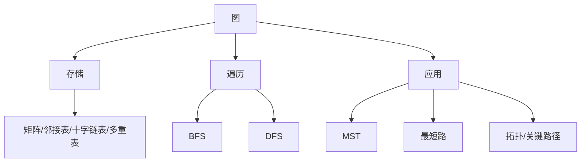

# 第6章 图

> [!cite] 教材定位
> 原书：[[408/90-复习资料/01-核心教材/2026数据结构_带书签.pdf#page=210|第6章 图（PDF 第 210 页）]]；本章范围为 PDF 第 210–280 页。

## 本章定位

图综合性强：同一算法在邻接矩阵和邻接表上的复杂度不同。复习应围绕“存储—遍历—应用”建立整体，并掌握 MST、最短路、拓扑排序、关键路径的适用前提。

> [!important] 408 必考
> 度数与边数、存储结构、BFS/DFS、Prim/Kruskal、Dijkstra/Floyd、拓扑与关键路径。

> [!note] 理解补充
> 算法得到的遍历序列、MST 或拓扑序可能不唯一，取决于邻接点次序和同权选择。

> [!info] 技术更新
> 大规模稀疏图常采用 CSR 等连续压缩格式；408 仍以邻接矩阵、邻接表及其变体为核心。

## 章节导航

- 前置：[[第5章-树与二叉树|树遍历与并查集]]
- 本章：概念、存储、遍历、MST、最短路、DAG、拓扑、关键路径
- 后续：[[第7章-查找|查找]]研究集合中的定位结构

## 考点地图

| 任务 | 典型算法 | 前提/限制 |
|---|---|---|
| 遍历 | BFS、DFS | 非连通图需从每个未访问点启动 |
| MST | Prim、Kruskal | 无向连通带权图 |
| 单源最短路 | Dijkstra | 边权非负 |
| 各点对最短路 | Floyd | 可有负边，不可有负环 |
| 线性次序 | 拓扑排序 | DAG |
| 工期分析 | 关键路径 | AOE 网为 DAG |

## 核心知识框架



## 完整知识点

### 基本概念与公式

图 $G=(V,E)$。无向边记 $(u,v)$，有向边记 $\langle u,v\rangle$。简单图无自环和重边。路径长度是边数，带权路径长度是边权和。

无向图：

$$
\sum_{v\in V}d(v)=2|E|,\qquad 0\le |E|\le\frac{n(n-1)}2
$$

有向图：

$$
\sum d^+(v)=\sum d^-(v)=|E|,\qquad |E|\le n(n-1)
$$

连通无向图至少 $n-1$ 条边；强连通有向图至少 $n$ 条边（$n>1$）。极大连通子图是连通分量；极大强连通子图是强连通分量。生成树含全部顶点和 $n-1$ 条边，连通且无环。

### 图的存储

- **邻接矩阵**：空间 $O(n^2)$，判边 $O(1)$。无权 0/1 矩阵以 1 表示边，此时无向图的度统计一行中的 1，有向图第 $i$ 行的 1 的数量是出度、第 $i$ 列的 1 的数量是入度。带权矩阵通常以 $\infty$ 表示无边，应统计“不是无边哨兵且不是对角线自身值”的表项；权为 0 的合法边必须计入，不能用“非零项”判断。无向图矩阵对称，适合稠密图。
- **邻接表**：空间 $O(n+e)$；枚举邻接点高效；无向边存两次，有向图求出度方便、求入度需扫描或建逆邻接表。
- **十字链表**：有向图每条弧结点同时串入弧尾的出边链和弧头的入边链。
- **邻接多重表**：无向边只用一个边结点，同时挂到两个端点的边链，适合边的修改。

图的抽象操作包括增删顶点/边、判邻接、列邻接点、取权、遍历。删除顶点会同时删除所有关联边。

### BFS 与 DFS

```text
BFS(G, s):
    visited[s] <- true; enqueue(Q, s)
    while Q not empty:
        u <- dequeue(Q); visit(u)
        for each v adjacent to u:
            if not visited[v]:
                visited[v] <- true
                enqueue(Q, v)
```

访问标志应在入队时设置，避免同一顶点重复入队。无权图 BFS 首次到达即得到从源点的最少边数路径，可维护 `dist` 和 `parent`。

```text
DFS(G, u):
    visited[u] <- true; visit(u)
    for each v adjacent to u:
        if not visited[v]: DFS(G, v)
```

邻接矩阵下两者均为 $O(n^2)$；邻接表下为 $O(n+e)$。非连通图需外层枚举所有顶点，形成 BFS/DFS 森林。无向图 DFS 遇到已访问且非父结点的邻接点可判环；有向图通常用白灰黑颜色判回边。

### 最小生成树

MST 只定义于无向连通带权图；权值和最小，形态未必唯一。若各边权互异，则 MST 唯一；反之不一定不唯一。

**Prim** 从一个顶点集合出发，每次选连接集合内外的最小边。邻接矩阵实现 $O(n^2)$，适合稠密图；最小堆与邻接表可达 $O(e\log n)$。

**Kruskal** 按边权递增扫描，若两端属于不同集合则选边并合并，直至选 $n-1$ 条；排序主导 $O(e\log e)$，适合稀疏图，判环使用并查集。

割性质：跨越任意割的唯一最轻边属于所有 MST；环性质：一个环中的唯一最重边不属于任何 MST。

### 最短路径

**Dijkstra** 维护已确定集合 `S`、距离 `dist` 和前驱。每轮选未确定且距离最小顶点 $u$，再松弛出边：

$$
dist[v]\leftarrow\min(dist[v],dist[u]+w(u,v))
$$

矩阵实现 $O(n^2)$，堆实现 $O((n+e)\log n)$。不能处理负权边，因为已确定的距离可能被后来负边改小。不可达点距离为 $\infty$，前驱无定义。

**Floyd** 求所有点对最短路：

$$
D^{(k)}[i][j]=\min\{D^{(k-1)}[i][j],D^{(k-1)}[i][k]+D^{(k-1)}[k][j]\}
$$

三层循环 `k` 必须在最外层，时间 $O(n^3)$、空间 $O(n^2)$。允许负边；若最终 $D[i][i]<0$，说明存在可达负环，最短路无定义。

### DAG、拓扑排序与关键路径

DAG 可用于消除表达式树的公共子式。拓扑排序反复选择入度为 0 的顶点输出并删除其出边；输出数少于顶点数说明有环。邻接表实现 $O(n+e)$。逆拓扑可用出度为 0 或 DFS 完成。

AOE 网以边表示活动、顶点表示事件。设源点事件最早时刻 `ve[0]=0`，按拓扑序：

$$
ve[k]=\max_{\langle j,k\rangle}(ve[j]+w(j,k))
$$

汇点最早时刻为总工期。令汇点 `vl=ve`，按逆拓扑序：

$$
vl[k]=\min_{\langle k,j\rangle}(vl[j]-w(k,j))
$$

活动 $a_i=\langle j,k\rangle$ 的最早开始 $e_i=ve[j]$，最迟开始 $l_i=vl[k]-w(j,k)$；$e_i=l_i$ 的活动为关键活动。关键路径可能多条；缩短一条路径上的活动不一定缩短总工期，必须同时压缩所有当前最长路径上的约束活动，且可能产生新关键路径。

### 图应用算法完整规格

伪代码以顶点编号 `0..n-1`、邻接表 `adj[u]` 为主；无边距离为 $\infty$。权值加法前必须确认两项有限并防止数值溢出。

```text
Prim(G, start):
    // 前提：G 是无向带权图，0 <= start < n
    if n = 0 or start invalid: return error
    key[*] <- INF; parent[*] <- -1; used[*] <- false
    key[start] <- 0
    repeat n times:
        u <- unused vertex with minimum key
        if u does not exist or key[u] = INF: return error("disconnected")
        used[u] <- true
        for each undirected edge (u,v,w) in adj[u]:
            if not used[v] and w < key[v]:
                key[v] <- w; parent[v] <- u
    return edges (parent[v],v) for all v != start
```

矩阵线性选点时 $O(n^2)$、空间 $O(n)$；邻接表加堆时 $O(e\log n)$、空间 $O(n+e)$。只适用于无向连通带权图；不连通时应报告失败或显式改成最小生成森林接口。

```text
Kruskal(G):
    // 前提：G 是无向带权图；边表每条无向边只出现一次
    if n = 0: return error
    sort edges by nondecreasing weight
    MakeSet(0..n-1); result <- empty
    for each edge (u,v,w) in sorted edges:
        if Find(u) != Find(v):
            append edge to result
            Union(u,v)
            if size(result) = n-1: break
    if size(result) != n-1: return error("disconnected")
    return result
```

时间 $O(e\log e)$、并查集空间 $O(n)$（边表另占 $O(e)$）；适合稀疏无向连通图。自环永不入选，平行边可保留并由排序选择。

```text
Dijkstra(G, source):
    // 前提：所有边权 >= 0，source 合法
    if source invalid: return error
    if any edge has negative weight: return error("negative edge")
    dist[*] <- INF; parent[*] <- -1; settled[*] <- false
    dist[source] <- 0
    repeat n times:
        u <- unsettled vertex with minimum dist
        if u does not exist or dist[u] = INF: break
        settled[u] <- true
        for each edge (u,v,w):
            if not settled[v] and dist[u]+w < dist[v]:
                dist[v] <- dist[u]+w; parent[v] <- u
    return (dist,parent)
```

矩阵实现时间 $O(n^2)$、空间 $O(n)$；邻接表加堆为 $O((n+e)\log n)$、空间 $O(n+e)$。不可达顶点保持 `INF`，重建路径时若目标非源且 `parent=-1` 应返回不可达。

```text
Floyd(W, n):
    // W[i][i]=0；无边为 INF；允许负边但要求结果中无负环
    D <- copy(W)
    for i <- 0 to n-1:
        for j <- 0 to n-1:
            if i != j and W[i][j] != INF: next[i][j] <- j
            else: next[i][j] <- -1
    for k <- 0 to n-1:
        for i <- 0 to n-1:
            for j <- 0 to n-1:
                if D[i][k] != INF and D[k][j] != INF and
                   D[i][k]+D[k][j] < D[i][j]:
                    D[i][j] <- D[i][k]+D[k][j]
                    next[i][j] <- next[i][k]
    if exists i with D[i][i] < 0: return error("negative cycle")
    return (D,next)
```

时间 $O(n^3)$、空间 $O(n^2)$；适合顶点数不大、需要所有点对距离的图。负环可达范围内不存在有限最短路。

```text
TopologicalSort(G):
    // 前提：G 是有向图
    indegree[v] <- number of incoming edges for every v
    Q <- all vertices with indegree 0
    order <- empty
    while Q not empty:
        u <- dequeue(Q); append u to order
        for each edge (u,v):
            indegree[v] <- indegree[v]-1
            if indegree[v] = 0: enqueue(Q,v)
    if size(order) != n: return error("directed cycle")
    return order
```

时间 $O(n+e)$、空间 $O(n)$（图本身除外）。仅 DAG 有完整拓扑序；队列中同时有多个零入度点时结果不唯一。

```text
CriticalPathAOE(G):
    // 前提：G 是边权非负的 AOE DAG，具有唯一源点和唯一汇点
    order <- TopologicalSort(G)
    if TopologicalSort failed: return error("not DAG")
    if source/sink count is not one: return error("normalize AOE network")
    ve[*] <- -INF; ve[source] <- 0
    for u in order:
        if ve[u] = -INF: return error("event unreachable from source")
        for each edge (u,v,w): ve[v] <- max(ve[v], ve[u]+w)
    vl[*] <- ve[sink]
    for u in reverse(order):
        for each edge (u,v,w): vl[u] <- min(vl[u], vl[v]-w)
    critical <- empty
    for each edge (u,v,w):
        earliest <- ve[u]
        latest <- vl[v]-w
        if earliest = latest: append edge to critical
    return (ve[sink], critical, ve, vl)
```

时间 $O(n+e)$、空间 $O(n+e)$（含输出）。适用于工期分析；多源多汇可先添加权值 0 的超级源/汇后再调用。关键活动集合可能包含多条关键路径，输出集合不等于已经枚举所有路径。

## 典型题型与解题方法

1. **存储还原图**：矩阵看对称性与非零项，邻接表注意边的重复存储及邻接点次序。
2. **遍历序列**：严格按给定邻接次序模拟，并在发现顶点时标记；非连通图补外层扫描。
3. **MST**：Prim 维护点集边界，Kruskal 维护边排序和并查集；每选边后检查是否成环。
4. **最短路**：Dijkstra 表格逐轮写 `S/dist/path`；Floyd 每轮只允许新顶点 $k$ 作中间点。
5. **关键路径**：先拓扑求 `ve`，再逆拓扑求 `vl`，最后逐边算 `e,l`，不能只凭最长路径图形猜。

## 完整例题与逐步解答

### 例 1：Dijkstra 最短路径

有向图边权均非负：$A\to B=1$，$A\to C=4$，$B\to C=2$，$B\to D=5$，$C\to D=1$。从 A 出发求各点最短距离和路径。

> [!success]- 展开完整答案
> 初始化：`dist[A]=0`，其余为 $\infty$。
>
> 1. 选 A 固定，松弛得 $dist[B]=1$、$dist[C]=4$；
> 2. 未固定点中 B 最小，固定 B：经 B 到 C 为 $1+2=3<4$，更新 C；经 B 到 D 为 $1+5=6$；
> 3. C 的距离 3 最小，固定 C：经 C 到 D 为 $3+1=4<6$，更新 D；
> 4. 固定 D，结束。
>
> | 顶点 | 最短距离 | 路径 |
> |---|---:|---|
> | A | 0 | A |
> | B | 1 | A→B |
> | C | 3 | A→B→C |
> | D | 4 | A→B→C→D |
>
> Dijkstra 的贪心依据是非负边保证当前最小暂定距离以后不会再被降低；出现负边时这一依据失效。

### 例 2：AOE 网的关键路径

AOE 网有活动：$0\to1$ 工期 3，$0\to2$ 工期 2，$1\to3$ 工期 4，$2\to3$ 工期 6。求事件最早/最迟时间、关键活动和总工期。

> [!success]- 展开完整答案
> 按拓扑序正向计算事件最早发生时间：
>
> $$
> ve[0]=0,quad ve[1]=3,quad ve[2]=2,quad
> ve[3]=\max(3+4,2+6)=8.
> $$
>
> 总工期为 8。再从终点逆拓扑计算最迟时间：
>
> $$
> vl[3]=8,quad vl[1]=8-4=4,quad vl[2]=8-6=2,
> $$
>
> $$
> vl[0]=\min(4-3,2-2)=0.
> $$
>
> 对活动 $u\to v$，最早开始 $e=ve[u]$，最迟开始 $l=vl[v]-w$。计算得：
>
> | 活动 | $e$ | $l$ | 余量 |
> |---|---:|---:|---:|
> | 0→1 | 0 | 1 | 1 |
> | 1→3 | 3 | 4 | 1 |
> | 0→2 | 0 | 0 | 0 |
> | 2→3 | 2 | 2 | 0 |
>
> 所以关键活动为 $0\to2$、$2\to3$，关键路径为
>
> $$
> \boxed{0\to2\to3},
> $$
>
> 总工期 $\boxed{8}$。

## 做题识别顺序

1. 先确认有向/无向、带权/无权和邻接访问顺序。
2. BFS 在入队时标记，DFS 在首次发现时标记；非连通图还需外层扫描。
3. MST 题只在无向连通带权图上做；Prim 扩点集，Kruskal 按边权并查集判环。
4. 最短路按条件选算法：无权 BFS、非负单源 Dijkstra、全源 Floyd、DAG 可按拓扑松弛。
5. 关键路径先正向算 `ve`，再逆向算 `vl`，最后逐边算活动余量。

## 一页记忆

| 算法 | 目标 | 关键条件 | 典型复杂度 |
|---|---|---|---|
| BFS | 无权最短路/遍历 | 队列 | $O(V+E)$（邻接表） |
| DFS | 遍历/判环基础 | 递归或栈 | $O(V+E)$ |
| Prim | MST | 无向连通图 | 适合稠密实现 |
| Kruskal | MST | 边排序+并查集 | $O(E\log E)$ |
| Dijkstra | 单源最短路 | 边权非负 | 堆实现 $O((V+E)\log V)$ |
| Floyd | 全源最短路 | 可含负边但无负环 | $O(V^3)$ |

- 拓扑排序只能用于 DAG；若无法输出全部顶点，则存在有向环。
- MST 最小化整棵树边权和，不保证树上任意两点路径都是原图最短路。

## 易错点

- 无向图一条边在邻接表出现两次，但边数只算一次。
- BFS/DFS 生成树依赖邻接次序；MST 与遍历树概念不同。
- Prim、Kruskal 求的是边权和最小，不保证任意两点路径最短。
- Dijkstra 不允许负边；Floyd 的 `k` 循环不能放内层。
- AOV 网顶点表示活动，AOE 网边表示活动。
- 关键活动组成的子图可能有分支，不一定只有一条链。

## 跨章节/跨科联系

- [[第3章-栈队列数组]]提供 BFS 队列与 DFS 栈；[[第5章-树与二叉树]]的并查集用于 Kruskal。
- 计算机网络的路由算法对应最短路径；操作系统死锁检测与资源分配图联系有向图判环。
- [[第7章-查找]]的优先队列实现可加速 Dijkstra 和 Prim。

## 本章复习清单

- [ ] 能用度数定理和边数上下界计算
- [ ] 能比较四种图存储方式
- [ ] 能手写 BFS、DFS 并分析两种存储下复杂度
- [ ] 能区分 Prim 与 Kruskal 的适用场景
- [ ] 能完整模拟 Dijkstra 与 Floyd
- [ ] 能做拓扑排序并判环
- [ ] 能计算 `ve/vl/e/l` 和关键路径

## 自测问题

1. 邻接矩阵与邻接表分别适合怎样的图？
2. BFS 为什么要在入队时标记访问？
3. Dijkstra 不能处理负边的根本原因是什么？
4. Floyd 中为何 `k` 必须是最外层循环？
5. 缩短某个关键活动为何不一定缩短总工期？

> [!question]- 自测问题参考答案
> 1. 邻接矩阵适合稠密图、需要 $O(1)$ 判断边是否存在的场景；邻接表适合稀疏图和按邻边遍历，空间约 $O(V+E)$。
> 2. 若到出队时才标记，同一未标记顶点可能被多个前驱重复入队，造成重复队列项和错误父结点；入队即标记保证每点只入队一次。
> 3. Dijkstra 固定当前最小距离后不再修改它；负边可能让以后才访问的顶点通过负权边把已固定距离降低，破坏贪心不变式。
> 4. 第 $k$ 轮的矩阵必须表示“只允许编号不超过 $k$ 的顶点作中间点”。只有固定 $k$ 后更新全部 $(i,j)$，才能在进入下一轮时保持这个动态规划含义。
> 5. 可能同时存在多条关键路径；缩短只属于其中一条的活动，其他关键路径仍决定总工期。即使原来只有一条，缩短后另一条近关键路径也可能成为新的瓶颈。

## 资料依据

- 《2026 年数据结构考研复习指导》第 6 章，第 210～280 页；按 PDF 书签定位并以定向 OCR 辅助核对，图存储、遍历和应用算法已人工复核。
- 本目录既有算法表格、复杂度和适用条件汇总用于交叉核对。

## 前后章节导航

- 上一章：[[第5章-树与二叉树|第5章 树与二叉树]]
- 下一章：[[第7章-查找|第7章 查找]]
