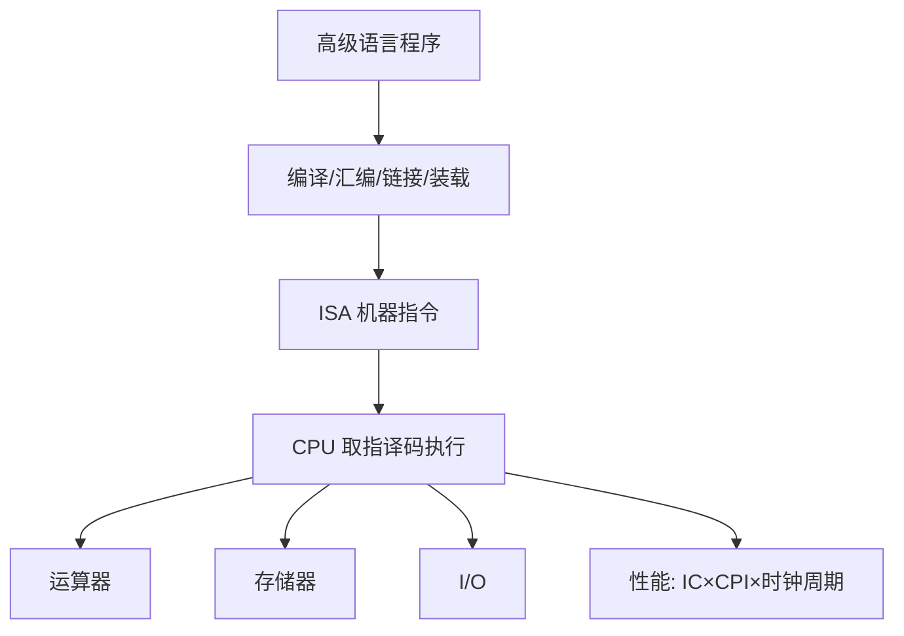

# 第1章 计算机系统概述

> [!cite] 教材定位
> 原书：[[408/90-复习资料/01-核心教材/2026计算机组成原理_带书签.pdf#page=13|第1章 计算机系统概述（PDF 第 13 页）]]；本章范围为 PDF 第 13–36 页。

## 本章定位

本章回答两个总问题：**计算机如何分层完成程序**，以及**用什么量评价计算机性能**。前者是后续 ISA、CPU、存储和 I/O 的总图，后者贯穿流水线、Cache、总线等所有性能题。

> [!important] 408 解题口径
> 性能比较必须锁定“同一工作负载”，时间公式必须区分时钟周期数、指令数和秒；任何只比较主频或某个孤立指标的结论都不充分。

## 章节导航

- [[#计算机系统的层次结构]]
- [[#冯·诺依曼结构与硬件组成]]
- [[#程序的翻译与执行]]
- [[#性能指标与计算]]
- [[#Amdahl 定律]]

## 考点地图

| 考点 | 常见设问 | 关键抓手 |
|---|---|---|
| 系统层次 | 谁对谁透明、各层接口是什么 | ISA 是软硬件边界 |
| 冯·诺依曼机 | 五大部件、存储程序 | 指令与数据同存、自动执行 |
| 程序转换 | 编译、汇编、链接、装载 | 输入输出文件类型 |
| CPU 性能 | 指令数、CPI、主频 | 三因子公式与单位 |
| 吞吐/响应 | 多机比较、批处理 | 工作量/时间与完成时间 |
| Amdahl | 局部加速后的整体收益 | 未加速部分形成上限 |

> [!important] 408 必考
> 正文中的“计算机系统的层次结构”“冯·诺依曼结构与硬件组成”“程序的翻译与执行”“性能指标与计算”“Amdahl 定律”构成本章考试主线。必须能用 $T_{CPU}=IC\times CPI/f$ 完成量纲检查，能区分响应时间与吞吐量，并说明 ISA、组成和实现的层次关系。

> [!note] 理解补充
> “软硬件逻辑功能等价”“透明性针对哪一层用户”“峰值指标不等于实际工作负载性能”用于解释主线概念，不另立一套计算口径。计算机发展史和具体语言演进只帮助形成背景，不应挤占性能公式与层次结构的复习时间。

> [!info] 技术更新
> 现代处理器常以每瓦性能、尾延迟、能效和实际基准套件共同评价系统，且同一 ISA 可有乱序、大小核等多种微体系结构。这些现实指标说明“主频不等于性能”，但 408 计算仍以题设的 $IC$、CPI、主频、执行时间和 Amdahl 定律为准。

## 核心知识框架

## 完整知识点

### 计算机系统的层次结构

计算机系统由硬件和软件组成。硬件提供运算、存储、控制和 I/O 资源；软件是程序、数据和文档。相同逻辑功能常可由硬件或软件实现，选择取决于速度、成本、灵活性和功耗。

#### 抽象层与相关机制（非严格单线翻译层级）

下表同时描述两条相互交叉的关系：一条是“高级语言→汇编/机器代码”的**语言翻译链**，另一条是操作系统向运行中程序提供进程、文件、虚拟存储等**运行时资源抽象**。汇编语言不是操作系统的下一级；二者都以 ISA 为基础，并在程序生成与运行阶段发生联系。

| 抽象域或实现层 | 本层对象 | 翻译或实现机制 | 面向使用者提供的接口/关系 |
|---|---|---|---|
| 应用/高级语言（语言翻译链） | 算法、源程序、语言数据类型 | 编译器、链接器、语言运行库把源程序变为可执行表示 | 语言语义、标准库/API，供应用程序员使用；运行时也可调用 OS 服务 |
| 汇编语言（语言翻译链） | 助记符、标号、伪指令 | 汇编器把汇编语句翻译为机器指令和重定位信息 | ISA 的符号化书写形式，供编译器后端和汇编程序员使用；不表示位于 OS 之下 |
| 操作系统（运行时抽象） | 进程、文件、虚拟地址空间、设备抽象 | 内核、调度、存储管理和驱动程序管理硬件资源 | 系统调用与用户态 ABI，供运行中的应用和语言运行库使用；内核通过 ISA 的特权机制控制硬件 |
| 机器语言/ISA（共同基础接口） | 机器指令、寄存器、数据类型、寻址方式、普通与特权指令 | 微体系结构通过取指、译码和执行实现 ISA 语义 | 供汇编器、编译器后端和操作系统共同使用的机器级接口 |
| 微体系结构（实现层） | 数据通路、控制器、Cache、流水线 | 寄存器传送、控制逻辑和存储层次实现每条 ISA 指令 | 满足 ISA 规定的可观察行为；内部时序通常不向程序员暴露 |
| 数字逻辑与器件（实现层） | 门电路、触发器、组合/时序电路、晶体管 | 布尔逻辑、状态电路和物理器件实现处理部件 | 寄存器、ALU、存储阵列等硬件构件，供微体系结构设计使用 |

系统调用是操作系统向用户程序提供的受控服务入口；特权指令属于 ISA，供操作系统内核使用；汇编器是把汇编语言翻译成机器代码的工具。三者分别处在接口、指令和翻译机制三个位置，不能混称为同一种“下层接口”。

**体系结构**通常指程序员可见的属性，如指令集、通用寄存器、数据类型、寻址方式；**计算机组成**指实现这些属性的具体方式，如数据通路宽度、控制方式、Cache 容量。不同组成可以实现同一 ISA。

透明性是“某层使用者无需了解下层细节”。例如高级语言程序员通常无需知道微指令；但 ISA 寄存器和机器数据类型对汇编程序员不透明。

### 冯·诺依曼结构与硬件组成

冯·诺依曼机的核心是**存储程序**：程序和数据以二进制形式预先存入存储器，控制器按地址自动取出指令并执行。经典特征：

1. 由运算器、控制器、存储器、输入设备、输出设备组成。
2. 指令和数据同等地存放在存储器中，形式上都是二进制位串。
3. 指令包含操作码和地址码。
4. 以运算器为中心的早期结构逐步演变为以存储器为中心的现代结构。

| 部件 | 作用 | 典型寄存器/信号 |
|---|---|---|
| 运算器 | 算术、逻辑、移位 | ALU、ACC、状态标志 |
| 控制器 | 取指、译码、发控制信号 | PC、IR、控制单元 |
| 主存 | 存放正在运行的程序和数据 | MAR、MDR（概念模型） |
| 输入设备 | 外界信息转为机器形式 | 接口数据/状态端口 |
| 输出设备 | 机器结果转为外界形式 | 接口数据/控制端口 |

CPU 通常由运算器和控制器组成。**机器字长**是 CPU 一次能处理的二进制数据位数，常与通用寄存器、ALU 宽度相关，但不必等于指令字长、存储字长或地址总线宽度。

### 程序的翻译与执行

- **编译程序**：将高级语言整体翻译为汇编或目标代码；生成的目标程序可反复执行。
- **解释程序**：逐句分析并执行源程序，通常不产生独立目标程序。
- **汇编程序**：把汇编语言翻译为机器语言目标模块。
- **链接程序**：解析外部符号并重定位，合并目标模块和库。
- **装载程序**：把可执行文件放入内存，建立运行环境并转交入口地址。

指令执行的基本循环是取指、译码、取操作数、执行、写回，并在适当时机检查异常或中断。不同指令可能省略其中某些阶段。

### 性能指标与计算

#### 基本量

| 指标 | 定义 | 单位/注意 |
|---|---|---|
| 吞吐量 | 单位时间完成的任务数 | task/s；越大越好 |
| 响应时间 | 从任务开始到完成的时间 | s；越小越好 |
| 主频 $f$ | 每秒时钟周期数 | Hz |
| 时钟周期 $T$ | 一个时钟周期的时间 | s，$T=1/f$ |
| CPI | 每条指令平均时钟周期数 | cycle/instruction |
| IPC | 每周期平均完成指令数 | instruction/cycle；简单情形约为 $1/CPI$ |
| CPU 执行时间 | CPU 为该程序工作的时间 | s |

CPU 性能三因子：

$$
T_{CPU}=IC\times CPI\times T=\frac{IC\times CPI}{f}
$$

其中 $IC$ 为动态指令条数（instruction），$CPI$ 为周期/指令，$f$ 为 Hz。若有 $n$ 类指令：

$$
CPI=\sum_{i=1}^{n} p_iCPI_i,\qquad
T_{CPU}=\frac{\sum_i IC_iCPI_i}{f}
$$

$p_i=IC_i/IC$，所有比例之和为 1。比较两机执行同一程序时，速度提升倍数为：

$$
S=\frac{T_{old}}{T_{new}}
$$

#### IPS、MIPS 与 FLOPS

$$
IPS=\frac{IC}{T_{CPU}}=\frac{f}{CPI},\qquad MIPS=\frac{f}{CPI\times10^6}
$$

FLOPS 是每秒浮点运算次数；MFLOPS、GFLOPS、TFLOPS 分别按 $10^6、10^9、10^{12}$ 缩放。一次“浮点运算”不一定对应一条指令，向量指令还可能一次完成多个元素运算。

> [!warning] 指标边界
> MIPS 只在指令集、编译器和工作负载具有可比性时才有意义；不能用不同 ISA 的 MIPS 直接判定程序完成时间。峰值 FLOPS 也不等于实际应用性能。

#### 其他容量与带宽概念

- 数据通路带宽常由位宽与传输频率共同决定。
- 存储容量若按字节编址，$n$ 位地址可寻址 $2^n$ B；若按字编址，还需乘每字字节数。
- $1\text{ KiB}=2^{10}\text{ B}$，而通信速率中的 k、M、G 常按十进制 $10^3、10^6、10^9$，题目另有说明时从其规定。

### Amdahl 定律

若原执行时间中可改进部分占比为 $p$，该部分加速 $k$ 倍，则整体加速比：

$$
S=\frac{1}{(1-p)+\frac{p}{k}}
$$

当 $k\to\infty$ 时，$S_{max}=1/(1-p)$。因此优化应优先覆盖耗时占比大的部分。

若题目给出“新系统某部分所占时间比例”，不能直接把它当原系统 $p$；先设原时间并还原各部分时间。

## 典型题型与方法

### 题型一：CPU 时间比较

某程序执行 $2\times10^9$ 条指令，平均 CPI 为 1.5，主频 3 GHz：

$$
T=\frac{2\times10^9\times1.5}{3\times10^9}=1\text{ s}
$$

步骤固定为：统一 Hz → 求总周期数 → 除以主频 → 写秒。若改进同时改变 $IC$、CPI 和主频，三个量都要代入，不能只看主频。

### 题型二：指令混合

先由各类动态指令比例求加权 CPI，再代入 CPU 时间。若给的是各类条数，直接计算 $\sum IC_iCPI_i$ 更稳妥。

### 题型三：局部优化

先确认 $p$ 是**原时间占比**，再用 Amdahl。若多个互斥部分分别加速：

$$
S=\frac{1}{1-\sum p_i+\sum\frac{p_i}{k_i}}
$$

### 题型四：性能结论判断

依次检查：是否同一程序、是否同一输入、指标是否实际测得、单位是否一致。只有完成时间能直接回答“谁更快”。

## 完整例题与逐步解答

### 例 1：三因素性能比较

同一高级语言程序在机器 A 上执行 $1.0\times10^9$ 条指令，平均 CPI 为 2.0，主频 2.5 GHz；在机器 B 上因 ISA 和编译器不同执行 $1.2\times10^9$ 条指令，平均 CPI 为 1.2，主频 2.0 GHz。只比较 CPU 执行时间，哪台更快？快多少？

> [!success]- 展开完整答案
> 统一使用
>
> $$
> T_{CPU}=\frac{IC\times CPI}{f}.
> $$
>
> 机器 A：
>
> $$
> T_A=\frac{1.0\times10^9\times2.0}{2.5\times10^9}
> =0.8\text{ s}.
> $$
>
> 机器 B：
>
> $$
> T_B=\frac{1.2\times10^9\times1.2}{2.0\times10^9}
> =0.72\text{ s}.
> $$
>
> 所以 B 更快。以 A 时间除以 B 时间得到 B 相对 A 的加速比：
>
> $$
> S_{B/A}=\frac{0.8}{0.72}\approx\boxed{1.11}.
> $$
>
> 不能只比较主频。B 主频更低，却因平均 CPI 明显更小而总体更快；跨 ISA 时动态指令数也会变化。

### 例 2：Amdahl 定律

某程序中可优化部分占原执行时间的 80%，该部分被加速 4 倍。求整体加速比；若该部分可被无限加速，整体极限是多少？

> [!success]- 展开完整答案
> 把原时间归一化为 1。不可优化部分仍占 $1-0.8=0.2$，可优化部分的新时间为 $0.8/4=0.2$：
>
> $$
> S=\frac{1}{0.2+0.2}=\boxed{2.5}.
> $$
>
> 当局部加速倍数 $k\to\infty$ 时，可优化部分时间趋近 0：
>
> $$
> S_{max}=\frac{1}{1-0.8}=\boxed{5}.
> $$
>
> 这说明只优化局部存在硬上限；Amdahl 式中的 80% 必须是**优化前的时间占比**，不是指令条数占比。

## 做题识别顺序

1. 性能题先确认比较的是同一任务、CPU 时间还是墙钟时间。
2. 将 GHz、MHz 统一为 Hz，再写 $IC\times CPI/f$，保留单位检查量纲。
3. 指令混合先求 $\sum IC_iCPI_i$，不要把各类 CPI 直接算术平均。
4. Amdahl 题把原时间归一化为 1，分别处理可优化和不可优化部分。
5. 概念题沿“高级语言 → 汇编 → 机器指令 → 微操作 → 电路”定位所处层次。

## 一页记忆

$$
\boxed{
T_{CPU}=IC\times CPI\times T_{clk}
=\frac{IC\times CPI}{f}
}
$$

$$
\boxed{
S_{Amdahl}=\frac{1}{(1-p)+p/k},\qquad
S_{max}=\frac{1}{1-p}
}
$$

- ISA 是软件可见契约，规定指令、寄存器、数据类型、寻址与异常等；微体系结构是实现这个契约的数据通路与控制方式。
- 主频高、CPI 小、指令条数少都可能有利，但只有把三者放进同一时间公式才可比较。
- 机器字长、指令字长、存储字长和地址宽度分别描述不同对象，不能统称“多少位”。

## 易错点

- 主频高不必然更快：可能有更大 CPI 或更多指令。
- CPI 是平均周期数，不是“每秒指令数”；维度不能混淆。
- $T_{CPU}$ 通常不含用户等待和 I/O 等全部墙钟时间，题目应按定义判断。
- “字”“字长”“机器字长”“指令字长”“存储字长”不是同义词。
- 指令和数据在存储器中形式相同，CPU 依据执行阶段和控制信号解释它们。
- 体系结构对程序员可见，组成是实现细节；“可见”需说明针对哪一层程序员。
- Amdahl 的 $p$ 必须基于优化前时间。
- IPS/MIPS 的分母是实际执行时间，FLOPS 统计的是浮点运算而非浮点指令。

## 跨章节/跨科联系

- [[第2章-数据的表示和运算]]：机器字长决定整数范围和 ALU 位宽。
- [[第3章-存储系统]]：Cache/虚存把局部性转化为平均访问时间改善。
- [[第4章-指令系统]]：ISA 是硬件与编译器、操作系统之间的边界。
- [[第5章-中央处理器]]：CPI 由数据通路、控制器、流水冒险共同决定。
- 操作系统：系统调用、异常、中断和装载共同建立程序运行环境。
- 编译原理：编译优化会改变动态指令数和指令组合。

## 本章复习清单

- [ ] 能画出五大部件并说明存储程序思想。
- [ ] 能区分体系结构、组成、实现和透明性。
- [ ] 能说清编译、汇编、链接、装载的输入输出。
- [ ] 能写出 CPU 时间三因子公式并标注单位。
- [ ] 能由指令比例求平均 CPI。
- [ ] 能解释 MIPS/FLOPS 的适用边界。
- [ ] 能使用 Amdahl 定律并识别原时间占比。
- [ ] 能区分机器字长、指令字长、存储字长和地址宽度。

## 自测问题

1. 为什么说 ISA 是软硬件接口，而微体系结构不是？
2. 指令和数据都以二进制存储，CPU 如何区分二者？
3. 同一程序在两台机器上的 $IC$、CPI、主频均不同，应如何比较？
4. 3 GHz、CPI=1.2 的处理器理论 IPS 是多少？这一数字为何不能跨 ISA 直接比较？
5. 可优化部分占原时间 80%，加速 4 倍，整体加速比和极限各是多少？
6. 编译、汇编、链接和装载分别解决什么问题？

> [!question]- 自测问题参考答案
> 1. ISA 规定程序和操作系统可依赖的指令编码、寄存器、数据类型、异常等契约；不同流水线、Cache 和执行单元组织都可实现同一 ISA，因此微体系结构通常不属于该接口。
> 2. 取指阶段由 PC 给出地址，取回的位串进入 IR 并按指令格式译码；执行阶段产生的数据地址，取回的位串按操作数类型解释。区分来自控制状态与访问上下文，不靠存储位串自身的标记。
> 3. 分别计算 $T=IC\times CPI/f$，在同一任务和同一时间口径下比较；三个量都不能单独决定性能。
> 4. $IPS=f/CPI=3\times10^9/1.2=2.5\times10^9$ 指令/s。不同 ISA 的一条指令完成的工作量不同，动态指令数也不同，所以 IPS 不能直接说明跨 ISA 的任务完成速度。
> 5. 整体加速比为 $1/(0.2+0.8/4)=2.5$；无限加速时极限为 $1/0.2=5$。
> 6. 编译把高级语言变为汇编或目标代码；汇编把汇编语句变为可重定位机器代码；链接解析符号并组合目标模块和库；装载把可执行文件映射到内存、完成运行时准备并转交入口。

## 资料依据

- 《2026 年计算机组成原理考研复习指导》第 1 章，第 13～36 页；按 PDF 书签定位，扫描页仅作定向 OCR 辅助，公式和单位已人工复核。
- 本目录既有笔记用于交叉核对复习重点；不再引用不存在的旧 OCR 全文路径。

## 前后章节导航

上一页：[[组成原理目录\|计算机组成原理目录]]  
下一章：[[第2章-数据的表示和运算\|第2章 数据的表示和运算]]
