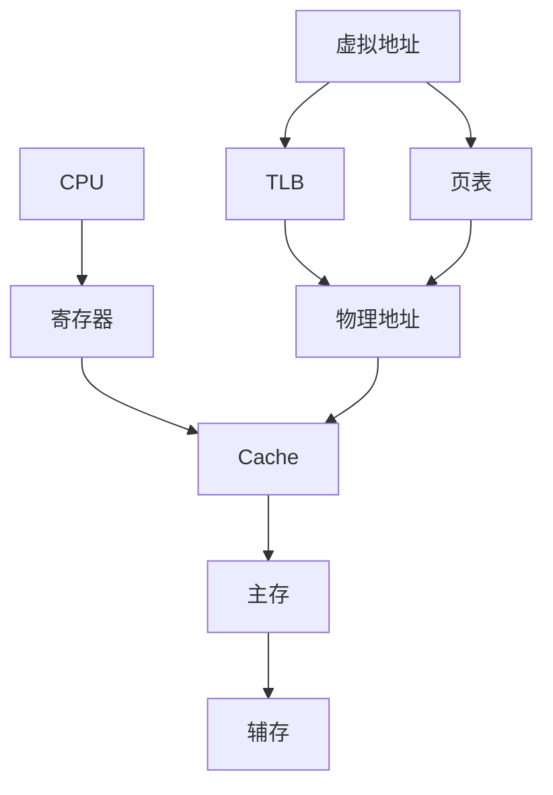

# 第3章 存储系统

> [!cite] 教材定位
> 原书：[[408/90-复习资料/01-核心教材/2026计算机组成原理_带书签.pdf#page=92|第3章 存储系统（PDF 第 92 页）]]；本章范围为 PDF 第 92–167 页。

## 本章定位

本章围绕“用层次结构同时接近快、大、便宜”展开。解题主线有两条：**容量与地址位宽**，以及**一次访存经过哪些层次、各自耗时多少**。Cache 和虚拟存储综合题必须先画地址字段再讨论命中。

## 章节导航

- [[#存储层次与性能]]
- [[#半导体存储器与主存扩展]]
- [[#多模块存储器]]
- [[#Cache]]
- [[#虚拟存储、页表与 TLB]]
- [[#外存基础]]

## 考点地图

| 模块 | 高频计算 | 易设陷阱 |
|---|---|---|
| RAM/ROM | 芯片容量、地址线、数据线 | 位扩展与字扩展 |
| 主存扩展 | 芯片数、片选地址 | 按字/字节编址 |
| 交叉存储 | 连续访问时间、带宽 | 模块周期与总线周期 |
| Cache | 地址划分、命中率、AMAT | 块单位、写策略 |
| 虚存 | 页号/页内偏移、页表大小 | 页表项与页大小混淆 |
| TLB+Cache | 串并行查找时序 | Cache 使用虚/实地址 |
| 磁盘 | 平均存取时间 | 寻道、旋转、传输单位 |

> [!important] 408 必考
> RAM/ROM 特性、芯片字位扩展、低位交叉、Cache 地址划分与写策略、AMAT、分页地址转换、页表/TLB 是本章考试主线。综合题按“虚拟地址→TLB/页表→物理地址→Cache→主存”逐级标出位宽、命中状态和时间。

> [!note] 理解补充
> 局部性分类、缺失成因、地址镜像、磁盘/RAID/SSD 基础用于解释存储层次为何有效。多级页表按需分配、Cache 元数据实现开销等内容帮助校验边界，但凡题目给出简化容量或并行查找时序，应优先采用题设模型。

## 核心知识框架



## 完整知识点

### 存储层次与性能

越靠近 CPU，速度越快、容量越小、每位成本越高。Cache—主存依靠时间/空间局部性，主存—辅存依靠虚拟存储实现容量扩展。

| 层次 | 管理者 | 传送单位 | 未命中后果 |
|---|---|---|---|
| Cache—主存 | 硬件 | Cache 块 | 从主存装块，几十至数百周期 |
| 主存—辅存 | 硬件+操作系统 | 页 | 缺页异常，磁盘/SSD I/O |

- **时间局部性**：近期访问的信息很可能再次访问。
- **空间局部性**：访问某地址后，其邻近地址很可能被访问。
- 存取时间是启动一次操作到完成的时间；存取周期还包括恢复时间，通常不小于存取时间。

平均访问时间通式：

$$
AMAT=T_{hit}+MR\times P_{miss}
$$

$T_{hit}$ 为命中路径耗时，$MR$ 为缺失率，$P_{miss}$ 为缺失后额外代价。若题目把主存时间定义为“未命中总时间”，就不能再次加 $T_{hit}$。

### 半导体存储器与主存扩展

#### SRAM、DRAM 与 ROM

| 类型 | 存储单元 | 是否刷新 | 特点 | 常见用途 |
|---|---|---|---|---|
| SRAM | 双稳态触发器 | 否 | 快、贵、密度低 | Cache |
| DRAM | 电容电荷 | 是 | 慢、便宜、密度高 | 主存 |
| ROM | 非易失单元 | 否 | 断电保持 | 固件 |

DRAM 常用行列地址复用以减少地址引脚：先送行地址并锁存，再送列地址。刷新按行进行：集中刷新有较长“死区”；分散刷新把刷新分摊到各周期；异步刷新在最大刷新间隔内均匀安排。

ROM 演变：掩模式 ROM 出厂固定；PROM 一次编程；EPROM 可紫外擦除；EEPROM 电擦除；Flash 以块为单位擦除，兼顾密度与非易失性。

#### 芯片规格和扩展

芯片写作 $2^k\times w$ bit，表示有 $2^k$ 个存储字、每字 $w$ 位，需要 $k$ 根片内地址线和 $w$ 根数据线。

目标容量为 $2^m\times W$ bit 时，若 $m\ge k$，且目标字数是芯片字数的整数倍、目标字长 $W$ 是芯片字长 $w$ 的整数倍，则：

$$
N_{chip}=2^{m-k}\times\frac{W}{w}
$$

前因子是**字扩展**组数，后因子是每组的**位扩展**芯片数。若目标字数或字长不是芯片规格的整数倍，应分别向上取整：

$$
N_{chip}=\left\lceil\frac{2^m}{2^k}\right\rceil
\times\left\lceil\frac{W}{w}\right\rceil
$$

此时最后一组可能有未使用的存储字，位扩展后的高位也可能未接入目标数据字，形成容量或位宽浪费。若 $m<k$，不是“字扩展”，而是只使用单片的一部分地址空间；仍需按片选和实际可用地址范围判断。

1. 位扩展：多个芯片共享地址线和片选，各自承担数据总线的一部分。
2. 字扩展：低 $k$ 位接所有芯片片内地址，高 $m-k$ 位译码产生各组片选。
3. 字位同时扩展：先位扩展成一组，再做字扩展。

若系统按字节编址，容量 $C$ B 需要 $\log_2C$ 根地址线。若数据总线宽 $W$ bit，一次读写 $W/8$ B，但地址通常仍指向一个字节；题目若规定按字编址则另算。

片选译码：线选法简单但地址空间可能重叠；全译码唯一分配地址；部分译码会产生地址镜像。求地址范围时固定片选高位，低位从全 0 到全 1。

### 多模块存储器

单体多字存储器一次取出一个宽字；多体交叉存储器把连续地址分散到多个模块并行启动。

低位交叉（$m$ 个模块）：

$$
模块号=A\bmod m,\qquad 模块内地址=\lfloor A/m\rfloor
$$

连续地址落在不同模块，适合流水访问。设模块存取周期为 $T$，总线可每 $\tau$ 启动一次，需满足 $m\tau\ge T$ 才能无冲突连续启动。连续读 $n$ 个字的常见时间模型：

$$
t=T+(n-1)\tau
$$

高位交叉让一段连续地址集中于同一模块，便于模块独立扩容，但连续访问并行性较差。

### Cache

#### 基本结构与地址字段

Cache 以块为单位保存主存副本。每行通常含有效位、标记、数据块，可能还有脏位和替换状态。

设物理地址 $p$ 位、块大小 $B=2^b$ B、Cache 数据区容量 $C$ B、$E$ 路组相联：

$$
行数=L=C/B,\qquad 组数=S=L/E
$$

$$
块内偏移=b,\qquad 组索引=\log_2S,\qquad Tag=p-b-\log_2S
$$

直接映射 $E=1$；全相联 $S=1$；$E$ 路组相联每组有 $E$ 行。Cache 总容量必须先拆分数据与实现元数据。设每行私有状态位为 $R$ bit（如有效位、脏位），每组共享的替换状态为 $Q$ bit（如近似 LRU 状态），则每行位数为：

$$
Bits_{line}=8B+TagBits+R
$$

完整 Cache 位数为：

$$
C_{total}=L\times Bits_{line}+S\times Q
$$

其中 $L$ 是行数、$S$ 是组数。直接映射通常无需组内替换状态，可取 $Q=0$；组相联的替换状态属于**每组**开销，不能机械地重复计入每行。若题目只给“Cache 容量”而未要求标记阵列总容量，通常指数据区 $C=L\times B$ B，应忽略 Tag、有效位、脏位、替换位以及译码器/比较器等实现开销；若明确求总位数，则按题给状态位计入，未给出的电路开销仍忽略。

#### 映射、替换与写策略

| 映射 | 候选位置 | 比较器 | 冲突 |
|---|---|---|---|
| 直接映射 | 唯一行 | 1 | 最大 |
| 全相联 | 任意行 | 多 | 最小 |
| 组相联 | 指定组内任一行 | 每路一个 | 折中 |

直接映射行号 $=主存块号\bmod L$；组相联组号 $=主存块号\bmod S$。全相联和组相联需要替换算法，如 LRU、FIFO、随机；直接映射无需选择。

| 写策略 | 命中时 | 未命中时 | 典型状态 |
|---|---|---|---|
| 写直达 | 同时写 Cache 和主存 | 常配非写分配 | 写缓冲 |
| 写回 | 只写 Cache，换出脏块才写主存 | 常配写分配 | 脏位 |
| 写分配 | 先调块入 Cache 再写 | — | 利于后续局部性 |
| 非写分配 | 直接写下层，不调块 | — | 避免一次性写污染 |

缺失可分为强制性、容量和冲突缺失。增大块能利用空间局部性，但块过大会减少行数、增加缺失代价。

#### 命中率和访问序列

命中率 $H=N_{hit}/N$，缺失率 $MR=1-H$。分析循环时逐次写出“块号→组号→组内状态”；冷启动初始全无效。若一次访问跨块，应拆成多个块访问。

若 Cache 与主存串行查找，常见平均时间 $H t_c+(1-H)(t_c+t_m)$；若并行启动且命中时取消主存，则按题意可能为 $Ht_c+(1-H)t_m$。必须以给定时序为准。

### 虚拟存储、页表与 TLB

#### 分页地址转换

虚拟地址分为虚拟页号 VPN 和页内偏移：页大小 $P=2^p$ B 时，低 $p$ 位是页内偏移。地址转换只替换页号，偏移不变：

$$
VA=[VPN\mid offset]\longrightarrow PA=[PFN\mid offset]
$$

页表项 PTE 至少含物理页框号和有效/存在位，常见还有访问权限、脏位、访问位。单级页表大小：

$$
PageTableSize=\#VirtualPages\times PTEBytes
$$

多级页表只为实际使用的地址区域逐级分配下级表，节省连续页表空间，但 TLB 未命中时页表遍历次数增加。

缺页是所需页不在主存，由硬件触发异常，操作系统调页；若无空闲页框需按替换算法选择页面，脏页换出前写回。缺页代价巨大，因此页替换与局部性关键。

#### TLB

TLB 是页表项的高速缓存，通常按 VPN 查找并返回 PFN 与权限。TLB 命中不等于 Cache 命中：前者解决地址翻译，后者解决数据是否在高速缓存。

无 TLB 时，一次数据访问可能先访问页表再访问数据，共两次主存（单级页表）。设 TLB 查找 $t_T$、主存 $t_M$、TLB 命中率 $h$，且不考虑 Cache/缺页：

$$
EAT=h(t_T+t_M)+(1-h)(t_T+2t_M)
$$

TLB 与 Cache 能否并行取决于 Cache 索引使用的地址位。物理索引、物理标记（PIPT）通常要先得到物理地址；虚拟索引、物理标记（VIPT）可用虚拟地址的页内偏移并行查组，待 TLB 给出物理页框号后比较物理标记。

设块大小为 $2^b$ B，故块内偏移有 $b$ 位；Cache 有 $2^s$ 组，故组索引有 $s$ 位；页大小为 $2^p$ B，故页内偏移有 $p$ 位。为使 VIPT 的组索引连同块内偏移完全落在地址转换前后不变的页内偏移中，必须满足：

$$
b+s\le p
$$

若 Cache 为 $E$ 路组相联、数据区容量为 $C$ B，则 $C=2^{b+s}E$，上述条件等价于：

$$
\frac{C}{E}\le 2^p=PageSize
$$

即 **Cache 数据容量/路数不大于页大小**。这里 $C$ 只计数据区，不含 Tag、有效位、脏位和替换状态；若题目给出的索引方案或别名处理机制不同，以题设为准。

#### TLB、页表、Cache 综合顺序

1. VA 提取 VPN 和 offset。
2. 查 TLB；未命中则查页表，PTE 无效则缺页。
3. 得到 PFN，拼出 PA。
4. 用 PA 的块内偏移、组索引和 Tag 查 Cache。
5. Cache 未命中再访问主存并装块。

同一页内偏移在转换前后不变，因此页大小必须不小于采用页内位做虚拟索引所覆盖的范围。

### 外存基础

磁盘平均存取时间：

$$
T_a=T_s+T_r+T_t
$$

$T_s$ 为寻道时间，$T_r$ 为旋转等待（随机位置平均约半圈），$T_t$ 为数据传输时间；还可能有控制器开销。转速 $R$ rpm 时一圈时间 $60/R$ s。

RAID 0 条带化提高并行性但无冗余；RAID 1 镜像；RAID 5 使用分布式奇偶校验，可容忍一个磁盘失效。SSD 以页读写、块擦除，控制器用闪存转换层、磨损均衡和垃圾回收管理。

> [!info] 技术更新
> 现实系统常有多级 Cache、多级 TLB、非易失内存和 NVMe SSD，但 408 计算仍以题设的简化层次、命中率和固定延迟为准；现代实现只用于理解，不替换教材模型。

## 典型题型与方法

### 题型一：存储芯片扩展

先把所有容量统一为“字数×位数”，计算位扩展芯片/组与字扩展组数；再画数据线、片内地址线、片选高位。最后检查总容量和地址范围。

### 题型二：Cache 地址划分

固定顺序：字节地址位数 → 块内偏移 → 行数/组数 → 组索引 → Tag。若题目给字地址，先确认是否需要字内字节偏移。

### 题型三：访问序列命中率

地址先除以块大小得到块号；映射到组；逐次更新有效位、Tag 和替换次序。循环第二轮的初态是第一轮末态，不能重新冷启动。

### 题型四：页表与 TLB

页内偏移位数 $=\log_2P$；VPN 位数 $=VA位数-offset$；页表项数 $=2^{VPN位数}$。页表项大小通常由可表示的页框号位数和状态位向字节取整得到，不能用页面大小代替。

### 题型五：多层 AMAT

从内向外递推。例如 L1 缺失后查 L2：

$$
AMAT=T_{L1}+MR_{L1}(T_{L2}+MR_{L2}P_{mem})
$$

各层缺失率需确认是局部缺失率还是全局缺失率。

## 完整例题与逐步解答

### 例 1：存储芯片的字位扩展

用 $256K\times8$ bit 的芯片组成 $1M\times32$ bit 的存储器，需要多少片？地址线和数据线怎样连接？

> [!success]- 展开完整答案
> 位宽从 8 bit 扩到 32 bit，需要并联
>
> $$
> \frac{32}{8}=4
> $$
>
> 片形成一组。字数从 $256K=2^{18}$ 扩到 $1M=2^{20}$，需要
>
> $$
> \frac{2^{20}}{2^{18}}=4
> $$
>
> 组。因此总芯片数为
>
> $$
> \boxed{4\times4=16\text{ 片}}.
> $$
>
> 连接方式：
>
> - 低 18 位地址线并接到每片的片内地址端；
> - 高 2 位地址经 2→4 译码器选择 4 个字扩展组之一；
> - 每组 4 片分别连接数据总线的 8 bit 切片，共组成 32 bit；
> - 同组芯片共享片选，4 片同时读写一个 32 bit 存储字。
>
> 验算总容量：$16\times256K\times8=1M\times32$ bit。

### 例 2：4 路组相联 Cache 地址划分

物理地址 32 bit，数据 Cache 容量 32 KiB，块大小 64 B，4 路组相联。求 Tag、组索引和块内偏移位数。

> [!success]- 展开完整答案
> 块大小 $64\text{ B}=2^6\text{ B}$，所以块内偏移为 6 bit。
>
> Cache 行数为
>
> $$
> \frac{32\text{ KiB}}{64\text{ B}}
> =\frac{2^{15}}{2^6}=2^9=512.
> $$
>
> 4 路组相联每组 4 行，组数为 $512/4=128=2^7$，所以组索引为 7 bit。
>
> Tag 位数为
>
> $$
> 32-7-6=\boxed{19\text{ bit}}.
> $$
>
> 最终字段：
>
> ```text
> | Tag 19 bit | Set 7 bit | Block offset 6 bit |
> ```
>
> 4 路只影响“行数如何组成组”，不能把行号的 9 bit 全当组索引。

### 例 3：两级 Cache 的 AMAT

L1 命中时间 1 ns，局部缺失率 5%；L2 命中时间 8 ns，L2 的局部缺失率 20%；主存缺失代价 80 ns。各项均按额外层级时间定义，求 AMAT。

> [!success]- 展开完整答案
> 先计算发生 L1 缺失后的平均额外时间：
>
> $$
> T_{after\ L1}=8+0.2\times80=24\text{ ns}.
> $$
>
> 再从 L1 向外递推：
>
> $$
> AMAT=1+0.05\times24
> =\boxed{2.2\text{ ns}}.
> $$
>
> L2 的 20% 是以“已经发生 L1 缺失”为条件的局部缺失率；全局到主存概率为 $0.05\times0.20=1\%$。若题目把 80 ns 定义为包括 L2 查询在内的总缺失时间，公式就要相应调整。

## 做题识别顺序

1. 芯片扩展先分开算“位扩展倍数”和“字扩展倍数”，最后相乘并画片选。
2. Cache 先算块内偏移，再由容量/块大小求行数，由行数/路数求组数。
3. 访问序列先把地址变成主存块号和组号，再逐次更新 Tag、有效位、脏位和替换状态。
4. AMAT 先确认缺失率是局部还是全局、缺失代价是额外还是总时间。
5. 虚拟地址题沿 VA→TLB/页表→PA→Cache 画路径，避免把 TLB 未命中和缺页混为一谈。

## 一页记忆

$$
\boxed{
\text{offset}=\log_2B,quad
\text{set}=\log_2\frac{C}{B\times E},quad
\text{tag}=A-\text{set}-\text{offset}
}
$$

$$
\boxed{
AMAT=T_1+MR_1(T_2+MR_2P_{mem})
}
$$

- 直接映射每组 1 行，全相联只有 1 组，组相联在二者之间。
- 写回需要脏位；写直达每次命中写都更新下层，通常配写缓冲。
- 页内偏移不变；虚页号经页表变成页框号，物理地址再进入 Cache 字段划分。

## 易错点

- 芯片“$K\times bit$”先分清字数和字长，不能直接乘芯片个数后猜地址线。
- 字节编址系统的数据总线宽度不决定可寻址单元大小。
- Cache 块大小用字节时，块内偏移也按字节计算。
- 组相联的组数是行数除以路数，Tag 不是主存块号整体。
- 写回需要脏位；写直达通常需要写缓冲，二者不要混搭理由。
- AMAT 的缺失代价是额外代价还是总耗时必须看题意。
- TLB 缺失不是缺页；页表有效时只需装入 TLB。
- 页内偏移不参与地址转换。
- 虚拟页数决定页表项数，物理页框数决定页框号位数。
- 磁盘平均旋转等待通常是半圈，不是整圈。

## 跨章节/跨科联系

- [[第1章-计算机系统概述]]：Cache 和存储等待会改变 CPI 与程序时间。
- [[第4章-指令系统]]：访存指令地址、对齐和字节序决定跨块行为。
- [[第5章-中央处理器]]：取指/访存通路连接 Cache，流水线因缺失停顿。
- [[第6章-总线]]：突发传输和交叉存储器决定装块带宽。
- 操作系统：分页、缺页异常、页面置换和多级页表是同一机制的软件侧。

## 本章复习清单

- [ ] 能比较 SRAM、DRAM、ROM，并解释刷新和地址复用。
- [ ] 能独立完成字扩展、位扩展和片选地址计算。
- [ ] 能计算低位交叉连续访问时间和无冲突条件。
- [ ] 能画三种 Cache 映射的地址字段。
- [ ] 能逐次模拟访问序列与替换算法。
- [ ] 能区分写回/写直达、写分配/非写分配。
- [ ] 能用统一定义计算单级和多级 AMAT。
- [ ] 能计算页内偏移、页表项数、页表大小。
- [ ] 能说明 TLB 命中、TLB 缺失、缺页、Cache 缺失的区别。
- [ ] 能写出 VA→PA→Cache 的完整时序。

## 自测问题

1. 用 $256K\times8$ bit 芯片组成 $1M\times32$ bit 存储器需多少片？地址线如何连接？
2. 32 位物理地址、32 KiB 数据 Cache、64 B 块、4 路组相联，各字段多少位？
3. 写回 Cache 的脏块在何时写主存？为什么写直达不需要脏位？
4. 4 KiB 页、32 位虚拟地址、4 B 页表项，单级页表多大？
5. TLB 命中但 Cache 未命中时，后续发生什么？
6. 为什么页内偏移在地址转换前后保持不变？
7. 多级 AMAT 中“局部缺失率”和“全局缺失率”有何区别？

> [!question]- 自测问题参考答案
> 1. 位扩展 4 片/组，字扩展 4 组，共 16 片。低 18 位接所有芯片片内地址，高 2 位译码选择一组；每组 4 片分别接 32 bit 数据总线的四个 8 bit 段。
> 2. 块内偏移 6 bit；共有 512 行、128 组，组索引 7 bit；Tag 为 $32-6-7=19$ bit。
> 3. 写回 Cache 仅在脏块被替换或显式刷回时更新主存，脏位记录上下层是否不一致；写直达每次写命中都同步写下层，因此无需靠脏位判断是否回写。
> 4. 页偏移 12 bit，虚页号 20 bit，共 $2^{20}$ 个页表项；页表大小 $2^{20}\times4=4$ MiB。
> 5. 地址翻译已经由 TLB 得到物理地址；Cache 未命中后按该物理块从下一级 Cache 或主存装块，可能替换旧行，再把所需字交给 CPU。
> 6. 页面与页框大小相同、边界对齐，地址低位只表示页内位置；转换只把高位虚页号替换为页框号。
> 7. 局部缺失率以“访问到本层”为分母；全局缺失率以全部原始访问为分母。例如 L2 全局缺失率等于 L1 缺失率乘 L2 局部缺失率。

## 资料依据

- 《2026 年计算机组成原理考研复习指导》第 3 章，第 92～167 页；按 PDF 书签定位并以定向 OCR 辅助核对，容量单位、幂指数和地址字段已人工复核。
- 虚拟存储的软件侧现代实现可对照 [Linux 内核 Memory Management 官方文档](https://www.kernel.org/doc/html/latest/mm/index.html)，但本章 Cache/TLB 计算严格按 408 题设。

## 前后章节导航

上一章：[[第2章-数据的表示和运算\|第2章 数据的表示和运算]]  
下一章：[[第4章-指令系统\|第4章 指令系统]]
