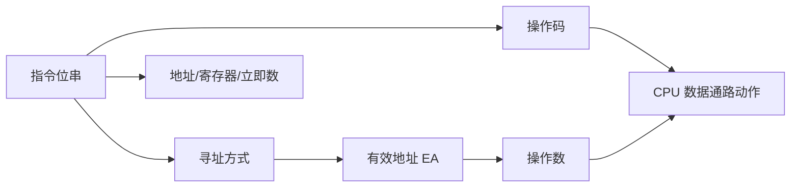
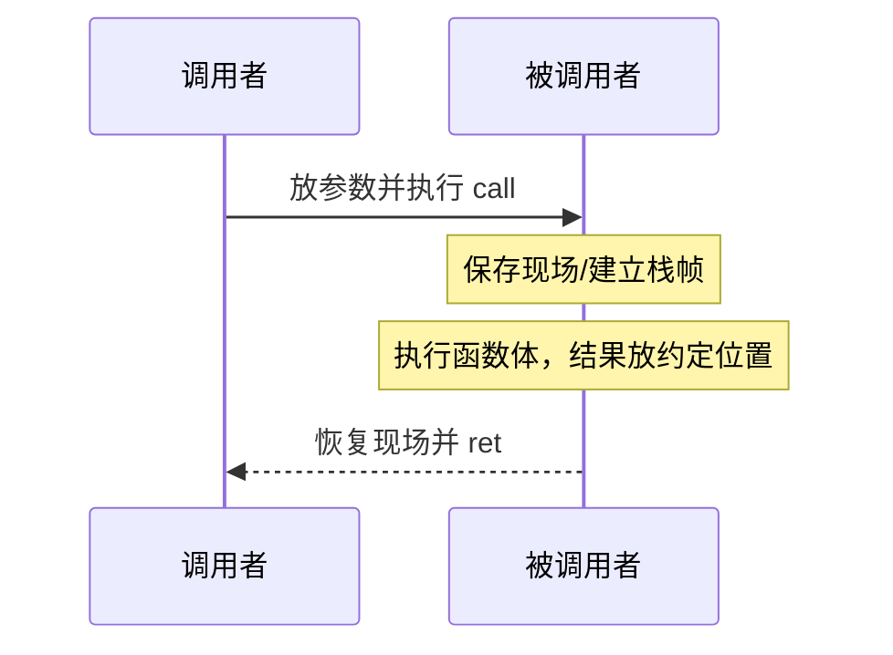

# 第4章 指令系统

> [!cite] 教材定位
> 原书：[[408/90-复习资料/01-核心教材/2026计算机组成原理_带书签.pdf#page=168|第4章 指令系统（PDF 第 168 页）]]；本章范围为 PDF 第 168–217 页。

## 本章定位

指令系统（ISA）规定软件可见的机器：数据类型、寄存器、指令格式、寻址、存储模型和异常接口。本章计算题本质是**有限指令位如何分配**与**地址字段如何形成有效地址**；机器级程序题则追踪寄存器、内存和 PC 的逐条变化。

## 章节导航

- [[#指令格式与操作码]]
- [[#寻址方式与有效地址]]
- [[#数据对齐与端序]]
- [[#高级语言的机器级表示]]
- [[#过程调用]]
- [[#CISC 与 RISC]]

## 考点地图

| 考点 | 常见题型 | 解题核心 |
|---|---|---|
| 指令格式 | 操作码位数、地址数 | 定长/变长、字段总宽 |
| 扩展操作码 | 各地址指令条数 | 保留前缀、不允许前缀冲突 |
| 寻址 | 求 EA/操作数 | 区分地址、内容与次数 |
| 偏移寻址 | 相对/基址/变址 | 谁由系统维护、谁由用户改变 |
| 对齐 | 数据跨字、访存次数 | 起址模对象长度 |
| 机器程序 | 条件、循环、数组 | 标志、PC、步长 |
| 调用 | 参数、返回地址、现场 | 调用者/被调用者保存 |

> [!important] 408 必考
> 指令字段分配、定长与扩展操作码、各种寻址方式的 EA、相对位移、数据对齐、条件/循环的机器表示以及 CISC/RISC 对比是本章考试主线。计算题先画指令字段，再核对操作码预算、位移范围和地址单位。

> [!note] 理解补充
> 过程调用、调用者/被调用者保存、位置无关代码和结构体/数组地址用于把 ISA 与程序连接起来。具体寄存器名称和调用约定依题设，不应把某一现实 ISA 的细节当成 408 通用规则。

## 核心知识框架



## 完整知识点

### ISA 与指令基本类型

ISA 对程序员可见，通常包括：指令格式与功能、寄存器组织、数据类型和编码、寻址方式、存储地址空间、I/O 方式、异常/中断可见行为。微操作和控制信号属于实现细节。

按功能，指令常分为数据传送、算术逻辑、移位、控制转移、输入输出、系统控制。按显式地址数分零/一/二/三地址指令；隐含操作数不占地址字段，例如累加器或栈顶。

### 指令格式与操作码

一条指令通常含操作码、寻址方式字段、寄存器字段、立即数/位移字段。若指令长度为 $L$ bit，有 $n$ 个各 $a$ bit 的地址字段，固定操作码长度为 $k$ bit：

$$
L=k+na+\text{其他字段位数}
$$

$$
N_{op}\le 2^k
$$

$N_{op}$ 表示可定义的**操作种类数**，每个操作种类由一个操作码编码标识。等号只在 $2^k$ 个操作码全部用于指令操作时成立；实际 ISA 往往保留部分编码用于非法指令、系统用途或后续扩展，因此通常是 $N_{op}<2^k$。不要把操作码（编码字段）误称为操作数，也不要把理论编码数等同于实际操作种类数。

定长指令便于取指和译码，变长指令编码密度高但边界判断复杂。定长操作码译码简单；扩展操作码让少地址指令利用空出的地址字段扩展操作码。

#### 扩展操作码规则

任何短操作码都不能成为长操作码的前缀。若 $m$ 位基本操作码中给 $r$ 个 $n$ 地址指令，则剩余 $2^m-r$ 个前缀可扩展；每向后扩展 $a$ 位，理论容量乘 $2^a$，但必须为下一层继续保留前缀。

解题用“码点预算”：

1. 从最多地址指令开始分配操作码。
2. 未使用的操作码前缀作为下一类入口。
3. 扩展后扣除本类使用数量。
4. 继续扩展，最后检查前缀无冲突和条数非负。

零地址指令不一定没有操作数，可能隐含栈顶；一地址指令也可能以 ACC 为另一操作数。

### 寻址方式与有效地址

记指令地址字段为 $A$，寄存器内容为 $(R)$，存储单元内容为 $M[EA]$。

| 寻址方式 | 有效地址/操作数 | 访存特点 | 典型用途 |
|---|---|---|---|
| 立即 | $OP=A$ | 取指后不再取数 | 常数 |
| 直接 | $EA=A$ | 取数 1 次 | 固定全局对象 |
| 间接 | $EA=M[A]$ | 先取地址再取数 | 指针（较慢） |
| 寄存器 | $OP=(R)$ | 不访问主存数据 | 临时变量 |
| 寄存器间接 | $EA=(R)$ | 取数 1 次 | 指针/数组 |
| 相对 | $EA=(PC)+sext(A)$ | 位移常为有符号 | 分支、位置无关代码 |
| 基址 | $EA=(BR)+sext(A)$ | 基址常由系统维护 | 重定位、段基址 |
| 变址 | $EA=A+(IX)$ | 变址寄存器常由用户改变 | 数组遍历 |
| 栈 | $EA=(SP)$ 附近 | SP 隐含 | 调用、临时数据 |

> [!important] PC 基准
> 相对寻址通常使用“取完当前指令后”的 PC，即下一条指令地址。题目若规定流水线或 ISA 的其他基准，以题设为准。

若位移字段 $d$ 位且按补码解释，范围为 $[-2^{d-1},2^{d-1}-1]$ 个地址单位。若指令地址按字节、位移按指令字，则还要乘指令字节数。

间接寻址次数要分清：取一条指令的访存、取间接地址的访存、取操作数的访存。Cache 命中与否不改变逻辑访存次数，但改变实际层次访问时间。

#### 寻址范围

- 直接寻址 $a$ 位地址字段可表示 $2^a$ 个地址单元。
- 寄存器寻址 $r$ 位可指定 $2^r$ 个寄存器。
- 基址/变址的范围由寄存器宽度、位移宽度和地址加法规则共同决定。
- 相对转移要检查目标地址相对下一条指令是否落入有符号位移范围并满足对齐。

### 数据对齐与端序

按字节编址时，对象长度 $m$ B 若自然对齐，常要求 $address\bmod m=0$。未对齐对象可能跨存储字或 Cache 块，需要多次访存；某些 ISA 允许但变慢，某些会触发异常。

大端把最高有效字节置于低地址，小端把最低有效字节置于低地址。读取单个字节再扩展时，地址选择和扩展方式都必须明确。

数组 `A[i]` 地址：

$$
EA=Base(A)+i\times sizeof(element)
$$

二维行优先数组 `A[i][j]`，列数为 $N$：

$$
EA=Base+(iN+j)\times elementBytes
$$

### 高级语言的机器级表示

#### 算术、比较和分支

机器通常通过比较指令内部执行 $A-B$ 并设置条件码，再由条件转移读取。无符号比较前必须先确认该 ISA/题设对减法 CF 的定义：若减法由 $A+\overline{B}+1$ 实现，且 CF 直接记录最高位进位，则 CF=1 表示**无借位**、CF=0 表示**发生借位**，因此 $A<B$ 当且仅当 CF=0，$A\ge B$ 当且仅当 CF=1；若 ISA 把 CF 定义成“借位标志”，上述 CF 条件正好反向。无论哪种定义，$ZF=1$ 表示 $A=B$，无符号“小于等于”需把“小于”的 CF 条件与 ZF 结合。

对补码有符号数，减法结果的符号位可能被溢出翻转，因此 $A<B$ 的统一判定为：

$$
SF\oplus OF=1
$$

$A\le B$ 则为 $(SF\oplus OF)=1$ 或 $ZF=1$。这与第 2 章“CF 服务无符号比较、OF 与 SF 共同修正有符号比较”的口径一致；不能只看 SF，也不能把同一跳转条件同时用于有符号和无符号解释。

`if-else` 常翻译为“条件转移到 else/then + 无条件跳过另一分支”。循环常形成：初始化 → 条件检测 → 循环体 → 更新 → 回跳。逐条模拟时建立表格记录 PC、关键寄存器、标志和内存。

逻辑运算用途：

- 与掩码清零/提取位；
- 或掩码置位；
- 异或翻转位或快速清零自身（特定 ISA 习惯）；
- 移位实现乘除 $2^k$、字段拼接与索引缩放。

#### Load/Store 与内存操作数

典型 RISC 只有 load/store 访问内存，算术操作数来自寄存器；CISC 可允许一条算术指令含内存操作数。分析机器表示时必须按题设 ISA，不可臆造指令副作用。

立即数短于寄存器时，算术立即数常做符号扩展，逻辑立即数可能零扩展；具体由指令定义。装入窄数据也区分有符号扩展和零扩展。

### 过程调用

调用需要保存返回地址、传递参数、分配栈帧、保存必要寄存器并返回。常见栈帧含返回地址、旧帧指针、保存寄存器、局部变量和溢出参数。



调用者保存寄存器可能被被调用者自由改写，若调用者仍需其值则调用前保存；被调用者保存寄存器若被使用，必须在返回前恢复。具体集合属于调用约定。

递归每次调用必须拥有独立活动记录，因此局部状态和返回地址不能只放在全局唯一位置。栈增长方向、SP 指向已用顶端还是空位置均由题设/ISA 决定。

### CISC 与 RISC

| 特征 | CISC 倾向 | RISC 倾向 |
|---|---|---|
| 指令数量/格式 | 多、格式与长度多样 | 少而规整、常定长 |
| 寻址方式 | 多 | 较少 |
| 内存访问 | 允许复杂内存操作 | Load/Store |
| 寄存器 | 相对较少（传统） | 较多 |
| 控制实现 | 常见微程序 | 常见硬布线 |
| 流水实现 | 译码边界复杂 | 易于规则流水 |
| 代码密度 | 通常较高 | 可能较低 |

这是设计倾向而非绝对二分。现代处理器可把复杂 ISA 指令译为内部微操作，也可在 RISC ISA 中加入复杂扩展。408 判断题按典型特征作答。

> [!info] 技术更新
> 现实 ISA 已广泛采用向量扩展、压缩指令和复杂前端译码；这些变化说明 CISC/RISC 特征在实现上会融合，但 408 的基本比较仍以指令规整性、Load/Store、寻址数量和控制方式为主。

## 典型题型与方法

### 题型一：扩展操作码

画字段，按“最多地址数→最少地址数”逐级预算。每层写出可用前缀数、扩展位数、本层使用数、留给下层数。最后验证任何短码都不是长码前缀。

### 题型二：有效地址

先写符号扩展后的位移，再写 EA 公式，最后才访问 $M[EA]$。题目问“有效地址”时不要多取一次内容；问“操作数”时才读存储器。

### 题型三：相对转移编码

$$
displacement=Target-PC_{next}
$$

若位移单位为字，除以字节数；检查整除、对齐和 $d$ 位补码范围，再编码。

### 题型四：机器级循环

将每条指令归为“数据、地址、控制”三类；记录循环每次地址增量和终止条件。数组指针增量应等于元素字节数，而非固定加 1。

### 题型五：访存次数

分别计取指、读操作数、写结果、间接取地址；再结合 Cache/流水线分析物理访问和周期。逻辑访存次数与总线事务数不一定相同。

## 完整例题与逐步解答

### 例 1：PC 相对转移位移

某定长指令 4 B，当前分支指令地址为 `0x1000`，位移字段 12 bit、按字节计数，目标地址为 `0x0F80`。求位移十进制值和 12 bit 补码编码，并判断能否表示。

> [!success]- 展开完整答案
> 取指后 PC 通常已指向下一条指令：
>
> $$
> PC_{next}=0x1000+4=0x1004.
> $$
>
> 因而
>
> $$
> displacement=0x0F80-0x1004=-0x84=-132.
> $$
>
> 12 bit 补码范围为 $[-2048,2047]$，$-132$ 可表示。编码为
>
> $$
> 2^{12}-132=4096-132=3964=0xF7C,
> $$
>
> 即
>
> ```text
> 1111 0111 1100
> ```
>
> 若题目规定位移按指令字计数，还要先确认字节差能整除 4，再除以 4 编码。

### 例 2：寻址方式与访存次数

不计取指，比较立即寻址、直接寻址、寄存器间接寻址和存储器间接寻址取得源操作数所需的数据访存次数。

> [!success]- 展开完整答案
> | 寻址方式 | 操作数/有效地址 | 数据访存次数 |
> |---|---|---:|
> | 立即 | 操作数就在指令字段 | 0 |
> | 直接 | $EA=A$，再读 $M[EA]$ | 1 |
> | 寄存器间接 | $EA=(R)$，再读 $M[EA]$ | 1 |
> | 存储器间接 | 先读 $EA=M[A]$，再读 $M[EA]$ | 2 |
>
> 寄存器间接中的寄存器访问不是主存数据访存。若题目把取指也计入，则每条指令还要加取指访问；若指令跨多个存储字，还需按题设增加。

### 例 3：未对齐对象跨存储字

4 B 整数从字节地址 `0x1003` 开始存放，存储字长 4 B 且按 4 B 边界对齐。它跨几个存储字？

> [!success]- 展开完整答案
> 该对象占用地址：
>
> ```text
> 0x1003, 0x1004, 0x1005, 0x1006
> ```
>
> 4 B 存储字的边界分别为：
>
> - `0x1000～0x1003`；
> - `0x1004～0x1007`。
>
> 因而对象跨
>
> $$
> \boxed{2\text{ 个存储字}}.
> $$
>
> 大小端只决定这 4 个字节的高低有效字节顺序，不改变对象跨越的地址范围。

## 做题识别顺序

1. 指令格式题先画字段和位宽，再分配操作码、寄存器号与地址码。
2. 有效地址题先写 EA 公式；题目只问 EA 时不要多访问一次存储器。
3. 相对转移统一以 $PC_{next}$ 为基准，再检查位移单位、对齐和补码范围。
4. 访存次数分开计取指、间接取地址、读操作数和写结果。
5. 机器代码循环跟踪寄存器、地址增量、条件码和 PC，逐轮列状态比凭直觉更稳。

## 一页记忆

$$
\boxed{EA_{PC-rel}=PC_{next}+SEXT(d)}
$$

- 立即寻址：操作数在指令中；直接寻址：地址字段给 EA；寄存器间接：寄存器内容给 EA；存储器间接：存储器内容再给 EA。
- 基址寄存器常由系统/编译器维护，位移访问结构或栈帧；变址寄存器常由程序改变，适合数组遍历。
- 扩展操作码必须满足前缀唯一，否则译码器读到短码时无法判断是否还应继续读扩展位。
- 有符号小于常看 $SF\oplus OF$，因为溢出会使单独的符号位失真。

## 易错点

- 操作码位数 $k$ 只能直接推出最多 $2^k$ 种编码，不代表都可用。
- 扩展操作码必须满足前缀唯一，不能只比较总位数容量。
- 立即寻址没有 EA；地址字段本身就是操作数。
- 寄存器间接的 EA 是寄存器内容，不是寄存器编号。
- 相对寻址的 PC 通常已指向下一条指令。
- 基址与变址公式相似，但用途和维护主体不同。
- 有效地址、物理地址、虚拟地址不可混称；本章 EA 还可能进入第 3 章地址转换。
- 对齐按字节地址和对象长度判断，端序不改变对象的起始地址。
- `call` 与 `ret` 对 PC、返回地址和栈的副作用要按题设完整记录。
- RISC “指令少”不是程序动态指令条数一定少，也不保证必然更快。

## 跨章节/跨科联系

- [[第2章-数据的表示和运算]]：立即数扩展、条件码、有无符号比较均依赖编码。
- [[第3章-存储系统]]：EA 经地址转换成为物理地址，再划分 Cache 字段。
- [[第5章-中央处理器]]：每种指令格式决定译码和数据通路控制信号。
- [[第7章-输入输出系统]]：I/O 指令与统一编址由 ISA 规定。
- 数据结构：数组、结构体和指针运算直接体现为基址+偏移。
- 操作系统：特权指令、系统调用与异常定义用户态/内核态边界。

## 本章复习清单

- [ ] 能列出 ISA 的程序员可见内容。
- [ ] 能按字段位宽计算指令种类和寄存器数量。
- [ ] 能完成多层扩展操作码分配并检验前缀。
- [ ] 能写出所有常见寻址方式的 EA/操作数公式。
- [ ] 能计算相对转移范围、位移编码和 PC 基准。
- [ ] 能分析对齐、端序与跨字访存。
- [ ] 能把条件、循环和数组访问还原为机器级流程。
- [ ] 能说明过程调用的参数、现场、栈帧和返回地址。
- [ ] 能准确比较 CISC 与 RISC 的典型特征。

## 自测问题

1. 为什么扩展操作码设计中短码不能是长码前缀？
2. 立即、直接、寄存器间接寻址各需要几次数据访存？
3. 相对位移 12 位、按字节计数时，理论跳转范围是多少？
4. 基址寻址和变址寻址公式相同，为何用途不同？
5. 一个 4 B 整数位于地址 `0x1003`，在 4 B 存储字系统中可能跨几个字？
6. 有符号“小于”条件为何不能只看 SF？
7. 递归函数为何必须为每次调用建立独立栈帧？

> [!question]- 自测问题参考答案
> 1. 若短码是某长码前缀，读到短码后无法立即判断指令是否结束，译码不再唯一；前缀唯一保证每种编码可无歧义解析。
> 2. 不计取指：立即寻址 0 次；直接寻址 1 次；寄存器间接 1 次。若是存储器间接则通常 2 次。
> 3. 12 bit 补码按字节计数的范围是 $[-2^{11},2^{11}-1]=[-2048,2047]$ B，相对 $PC_{next}$。
> 4. 基址寻址通常以稳定的段/栈/对象基址加位移，便于重定位；变址寻址让变址寄存器随循环改变，便于访问数组元素。公式相似但寄存器来源和使用方式不同。
> 5. 地址范围为 `0x1003～0x1006`，跨 `0x1000～0x1003` 与 `0x1004～0x1007` 两个存储字。
> 6. 有符号运算溢出时结果符号可能反转，因此小于条件通常用 $SF\oplus OF$，不能只看 SF。
> 7. 每层递归调用都有独立参数、局部变量、保存寄存器和返回地址；共享一个栈帧会覆盖尚未返回的外层调用状态。

## 资料依据

- 《2026 年计算机组成原理考研复习指导》第 4 章，第 168～217 页；按 PDF 书签定位并以定向 OCR 辅助核对，地址、位移和指令字节数已人工复核。
- [RISC-V ISA Manual 官方仓库](https://github.com/riscv/riscv-isa-manual)用于核验现代开放 ISA 的指令与扩展机制；RISC/CISC 比较和寻址计算仍按 408 经典口径。

## 前后章节导航

上一章：[[第3章-存储系统\|第3章 存储系统]]  
下一章：[[第5章-中央处理器\|第5章 中央处理器]]
