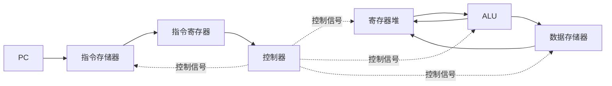

# 第5章 中央处理器

> [!cite] 教材定位
> 原书：[[408/90-复习资料/01-核心教材/2026计算机组成原理_带书签.pdf#page=218|第5章 中央处理器（PDF 第 218 页）]]；本章范围为 PDF 第 218–292 页。

## 本章定位

本章把 ISA 指令落实为寄存器传送和控制信号，是组成原理综合题的中心。解题必须同时追踪三件事：**数据在哪里、经过哪条通路、在哪个时钟边沿写入**。流水线题还要把依赖关系映射为停顿、转发或冲刷。

## 章节导航

- [[#CPU 功能与寄存器]]
- [[#指令周期与微操作]]
- [[#数据通路]]
- [[#硬布线控制器]]
- [[#微程序控制器]]
- [[#异常和中断]]
- [[#指令流水线]]

## 考点地图

| 模块 | 高频设问 | 抓手 |
|---|---|---|
| 寄存器 | 位宽、可见性、作用 | 地址宽/字长/指令长 |
| 指令周期 | 微操作序列、访存次数 | 取指→间址→执行→中断 |
| 数据通路 | 控制信号、冲突、时序 | 源、组合部件、目的 |
| 控制器 | 信号生成、速度/灵活性 | 硬布线 vs 微程序 |
| 微程序 | 微地址、字段编码 | 下地址形成、并/串行控制 |
| 异常中断 | 断点、返回地址、优先级 | 内/外因、同步/异步 |
| 流水线 | 吞吐、加速比、冒险 | 时空图与依赖距离 |

> [!important] 408 必考
> 寄存器位宽、指令周期微操作、单/多总线数据通路、硬布线与微程序控制、异常中断、经典流水线性能与三类冒险是本章考试主线。数据通路题逐拍检查源、组合路径、目的和写入边沿；流水线题必须画时空图并计入停顿与冲刷。

> [!note] 理解补充
> 单周期/多周期权衡、字段编码的控制并行性、精确异常及高级流水概念用于解释结构选择。超标量、乱序和寄存器重命名只帮助理解依赖类型，未在题设出现时不得自行赋予经典五级流水这些能力。

## 核心知识框架

## 完整知识点

### CPU 功能与寄存器

CPU 的主要功能：指令控制、操作控制、时间控制、数据加工，并处理异常和中断。基本结构包括数据通路和控制器。

| 寄存器 | 内容 | 位宽依据 | 程序员可见性 |
|---|---|---|---|
| PC | 下一条指令地址 | 地址空间/ISA | 通常不可直接任意访问 |
| IR | 当前指令 | 指令字长 | 不可见 |
| MAR | 访存地址 | 主存地址位数 | 不可见 |
| MDR | 读写数据 | 存储字/数据总线宽 | 不可见 |
| GPR | 操作数、地址、中间值 | 机器字长 | 可见 |
| PSW/FLAGS | 条件码、控制位 | ISA 规定 | 部分可见 |
| ACC | 隐含算术操作数 | 机器字长 | 累加器型 ISA 可见 |

寄存器位宽由所承载的信息决定，不必都等于机器字长。按字节编址、主存 $2^m$ B 时 MAR 至少 $m$ 位；MDR 位宽与一次主存交换的数据宽度一致，若一次取多字节可大于 8 位。

### 指令周期与微操作

指令周期是取出并执行一条指令所需的全部时间，可含取指、间址、执行和中断周期；每个周期含若干时钟周期/节拍。不同指令的指令周期长度可不同。

#### 典型取指微操作

以同步主存、MAR/MDR 模型为例：

| 节拍 | 寄存器传送 | 控制含义 |
|---|---|---|
| $T_0$ | $MAR\leftarrow PC$ | 地址送主存 |
| $T_1$ | $MDR\leftarrow M[MAR]$，$PC\leftarrow PC+L$ | 读指令、PC 增量 |
| $T_2$ | $IR\leftarrow MDR$ | 指令写入 IR |

$L$ 是指令在地址单位上的长度。实际存储器读可能跨多个节拍，寄存器写入在时钟边沿完成；不能让依赖新值的操作在同一边沿前提前使用。

#### 典型执行序列

- `ADD R1,R2,R3`：读 $R2,R3$ → ALU 加 → $R1\leftarrow$ 结果，同时更新规定标志。
- `LOAD R1,d(R2)`：$EA\leftarrow R2+sext(d)$ → $MAR\leftarrow EA$ → $MDR\leftarrow M[MAR]$ → $R1\leftarrow MDR$。
- `STORE R1,d(R2)`：求 EA → $MAR\leftarrow EA$，$MDR\leftarrow R1$ → $M[MAR]\leftarrow MDR$。
- 条件转移：检测条件 → 若成立 $PC\leftarrow PC+sext(d)$；基准 PC 按 ISA 定义。

同时微操作必须满足：无资源冲突、无组合逻辑环、源值在节拍开始时可用、目的寄存器能在边沿写入。例如单总线同一时刻只能有一个源驱动总线。

### 数据通路

数据通路由寄存器、ALU、移位器、多路选择器、总线和存储接口组成。控制信号主要分：

- 源选择/输出使能；
- 目的寄存器写使能；
- ALU/移位功能选择；
- 存储器读写；
- PC 选择与写使能；
- 标志寄存器写使能。

#### 单总线数据通路

共享一条内部总线，硬件少但并行度低。完成 $R1\leftarrow R2+R3$ 常需暂存寄存器：

1. $Y\leftarrow R2$
2. $Z\leftarrow Y+R3$
3. $R1\leftarrow Z$

每一步至少一个节拍，前提是总线一次只能承载一个源。若 ALU 一端直接接 Y、另一端接总线，Z 锁存 ALU 输出，上述序列成立。

#### 多总线与寄存器堆

双/三总线可同时读两个源并写一个目的，寄存器堆常有两个读端口一个写端口，使寄存器型算术在一个组合阶段完成。代价是多端口寄存器堆、选择器和布线更复杂。

#### 单周期与多周期 CPU

| 项目 | 单周期 | 多周期 |
|---|---|---|
| 每条指令周期数 | 1 | 多个且可不同 |
| 时钟周期 | 由最慢指令路径决定 | 由最慢基本阶段决定 |
| 部件复用 | 少，常需分离资源 | 同一部件可跨周期复用 |
| 控制 | 组合控制 | 状态机控制 |
| 性能权衡 | CPI=1 但周期长 | CPI>1 但周期短 |

性能仍用 $T=IC\times CPI\times T_{clk}$，不能只比较 CPI。

### 硬布线控制器

硬布线控制器用组合/时序逻辑根据指令操作码、节拍、条件标志和外部信号直接产生控制信号：

$$
C_i=f_i(OP,Timing,Flags,External)
$$

设计步骤：列指令微操作 → 按节拍安排 → 写每个控制信号出现条件 → 化简逻辑 → 实现电路。优点是速度快，适合规整 ISA；缺点是修改和扩展困难，指令越复杂逻辑越庞大。

### 微程序控制器

微程序控制把一条机器指令解释为微指令序列。核心部件：控制存储器 CM、微地址寄存器 $\mu\mathrm{PC}$（也称 CMAR）、微指令寄存器 CMDR、微地址形成电路。

- **微命令**：一个具体控制动作。
- **微操作**：微命令作用下的数据通路操作。
- **微指令**：一个节拍内并行发出的一组微命令及下地址信息。
- **微程序**：实现一条机器指令的一串微指令。

#### 微指令编码

| 方式 | 控制字段宽 | 并行性 | 译码 |
|---|---:|---|---|
| 直接编码（水平型） | 大 | 高 | 少/无 |
| 字段直接编码 | 中 | 互斥命令分组 | 每组译码 |
| 字段间接编码 | 小 | 较低 | 某字段含义受另一字段控制 |

字段直接编码时，把互斥微命令放同一字段；若一组有 $n$ 个微命令且需表示“不发命令”，字段至少 $\lceil\log_2(n+1)\rceil$ 位。可并行微命令必须分属不同字段。

#### 下地址形成

顺序执行通常令 $\mu\mathrm{PC}\leftarrow\mu\mathrm{PC}+1$；转移可由微指令下地址字段、条件判别、机器指令操作码映射、异常入口等形成。若控制存储器有 $N$ 个字，微地址至少 $\lceil\log_2N\rceil$ 位。

硬布线速度通常更快；微程序规整、易修改。微程序仍是硬件控制器内部机制，不是普通机器程序，微指令也不是 ISA 指令。

### 异常和中断

异常由当前指令内部事件引起，通常同步；外部中断来自 I/O、时钟等，通常异步。异常还可分故障、陷阱、终止，返回地址可能是当前指令或下一条指令，取决于是否可重启及 ISA 定义。

响应基本过程：

1. 在规定边界检测请求并判断允许/优先级。
2. 保存断点（PC）和必要状态。
3. 切换到特权态，屏蔽或调整中断允许。
4. 取得入口地址并执行处理程序。
5. 恢复状态，用专用返回指令回到断点。

中断隐指令是硬件完成的响应动作，不是指令集中可由程序显式调用的普通指令。可屏蔽中断受屏蔽位控制；不可屏蔽中断用于高优先级紧急事件。优先级还区分响应优先级与处理优先级，后者可通过屏蔽字改变。

### 指令流水线

#### 基本性能

把指令分为 $k$ 段，各段组合延迟 $t_i$，流水寄存器开销 $t_r$：

$$
T_{clk}=\max(t_i)+t_r
$$

理想情况下完成 $n$ 条指令：

$$
T_{pipe}=(k+n-1)T_{clk}
$$

$T_{pipe}$ 是完成这批 $n$ 条指令的**总时间**，单位为 s；若题目只数周期，也可先写总周期数 $k+n-1$ cycle，再乘 $T_{clk}$（s/cycle）。

吞吐率：

$$
TP=\frac{n}{(k+n-1)T_{clk}}\xrightarrow[n\to\infty]{}\frac{1}{T_{clk}}
$$

$TP$ 是单位时间完成的指令数，单位为 instruction/s；它不是“需要多少周期”。稳态理想吞吐率接近每个时钟完成 1 条指令，但单条指令仍需穿过全部流水级。

单条指令从进入第一级到离开末级的**延迟**，在理想 $k$ 级等周期流水中为：

$$
Latency_{instruction}=kT_{clk}
$$

其单位为 s/instruction（作为一条指令的经过时间时通常直接写 s）。发生停顿时，该指令实际延迟还要加上它经历的停顿周期；延迟不等于批处理总时间，也不能与 instruction/s 的吞吐率直接相加。

相对非流水（每条依次走各段）加速比：

$$
S=\frac{n\sum t_i}{(k+n-1)(\max t_i+t_r)}
$$

流水线提高吞吐率，不一定减少单条指令延迟；分段不均衡和流水寄存器开销限制收益。

#### 五级流水示例

IF 取指、ID 译码/读寄存器、EX 运算/求地址、MEM 数据访存、WB 写回。段间寄存器必须保存后续阶段需要的全部数据和控制信号，例如目标寄存器号也要随指令向后传递。

#### 结构冒险

多条指令争用同一硬件资源，如统一单端口存储器同时取指和读数据。处理：资源复制（分离指令/数据存储）、多端口、错开或停顿。

#### 数据冒险

- RAW（写后读）：后指令读取前指令尚未写回的值，顺序流水中最常见真相关。
- WAR（读后写）、WAW（写后写）：主要在乱序执行或多发射时出现。

处理：编译器调度、插入气泡/停顿、数据转发、寄存器重命名。经典五级流水有转发时，ALU 结果常可从 EX/MEM 转发到下一指令 EX；`load-use` 数据到 MEM 末才产生，紧随使用通常仍需停 1 周期。具体以题设“何时产生、何时需要、能转发到哪里”为准。

#### 控制冒险

分支方向和目标未确定时，后续取指可能错误。处理：停顿、尽早判定、静态/动态预测、延迟分支、投机执行。预测错误要冲刷错误路径指令，罚时取决于分支在哪一级解析。

若基础 CPI 为 $CPI_0$，各种停顿平均每条指令增加 $s_i$ 周期：

$$
CPI=CPI_0+\sum_i s_i
$$

分支罚时贡献常为：

$$
s_{branch}=f_{branch}\times r_{mispredict}\times penalty
$$

#### 超标量与动态调度概念

超标量每周期可发射多条指令；动态流水通过硬件发现并行性；乱序执行允许就绪指令越过未就绪指令，但通常按程序序提交以保证精确异常。多核是线程级并行，与单核指令级并行不同。

> [!info] 技术更新
> 现代高性能 CPU 广泛使用分支预测、寄存器重命名、乱序执行和多级缓存。408 题通常给出简化五级流水和明确转发路径，解题必须服从题设时序，不能套用现实处理器的隐含能力。

## 典型题型与方法

### 题型一：寄存器位宽

逐个问“它保存地址、指令还是数据”：地址看可寻址单元数，IR 看指令字长，MDR 看一次交换宽度，GPR/ALU 看机器字长。不要用一个“CPU 是 32 位”包办所有答案。

### 题型二：写微操作序列

先写 RTL 目标，再按硬件约束拆节拍。每拍检查：总线驱动源数量、ALU 输入是否可用、存储器是否完成、寄存器是否在末沿写入。

### 题型三：控制信号

对每个动作写“源选择 + ALU 功能 + 目的写使能 + 存储读写”。若多路选择器控制值由图中端口编号决定，必须依据图，不凭名称猜。

### 题型四：微指令字长

分别计算控制字段、判别字段和下地址字段。互斥组用 $\lceil\log_2(n+1)\rceil$；并行命令不得放同组；控制存储器容量决定下地址位数。

### 题型五：流水时空图

先画无冒险网格，再标每个结果产生点和使用点；能转发则画路径，不能则插入 `stall` 并冻结相应前级。分支错误路径用冲刷标记。最后从首条 IF 到末条完成数周期。

### 题型六：流水性能

先求最长段加寄存器开销得到 $T_{clk}$（s/cycle）；再把装入、排空、停顿和预测失败计入总周期数，二者相乘得到批处理总时间（s）。吞吐率用完成指令数除以总时间，单位 instruction/s；单条延迟用该指令经历的级数与停顿乘时钟周期，单位 s。cycle 只是周期计数单位，不能作为吞吐率单位。

## 完整例题与逐步解答

### 例 1：互斥编码的微指令控制字段

8 组互斥微命令分别含 5、3、7、2、4、6、3、5 个命令。每组采用字段直接编码，并要保留“不发命令”状态，至少需要多少控制位？

> [!success]- 展开完整答案
> 一组有 $n$ 个互斥命令时，还要编码“本组无命令”，所以状态数为 $n+1$，需要
>
> $$
> \lceil\log_2(n+1)\rceil
> $$
>
> 位。逐组计算：
>
> | 命令数 | 所需位数 |
> |---:|---:|
> | 5 | 3 |
> | 3 | 2 |
> | 7 | 3 |
> | 2 | 2 |
> | 4 | 3 |
> | 6 | 3 |
> | 3 | 2 |
> | 5 | 3 |
>
> 总控制字段位数为
>
> $$
> 3+2+3+2+3+3+2+3=\boxed{21\text{ bit}}.
> $$
>
> 可以并行执行的微命令不能放在同一互斥组，否则一个字段一次只能选其中一个，会错误限制并行性。

### 例 2：五级流水线性能

五级流水各段组合逻辑延迟依次为 200、150、180、220、160 ps，流水寄存器开销 20 ps。理想执行 100 条指令，无停顿，求时钟周期、总时间和平均吞吐率。

> [!success]- 展开完整答案
> 流水时钟周期由最慢段决定，并加流水寄存器开销：
>
> $$
> T_{clk}=\max(200,150,180,220,160)+20
> =240\text{ ps}.
> $$
>
> $k=5$ 级流水执行 $n=100$ 条指令的理想周期数为
>
> $$
> k+n-1=5+100-1=104.
> $$
>
> 总时间为
>
> $$
> T=104\times240\text{ ps}=24.96\text{ ns}.
> $$
>
> 平均吞吐率为
>
> $$
> TP=\frac{100}{24.96\text{ ns}}
> \approx\boxed{4.01\times10^9\text{ instruction/s}}.
> $$
>
> 单条指令仍要穿过 5 级，理想延迟约 $5\times240=1200$ ps；“理想 CPI 接近 1”描述稳态完成速率，不是单条指令只需一个周期。

### 例 3：分支预测对 CPI 的影响

理想流水 CPI 为 1，分支频率 20%，预测错误率 10%，每次预测错误额外罚 3 周期。求平均 CPI。

> [!success]- 展开完整答案
> 每条指令成为分支且预测错误的概率为
>
> $$
> 0.20\times0.10=0.02.
> $$
>
> 平均罚时为
>
> $$
> 0.02\times3=0.06\text{ cycle/instruction}.
> $$
>
> 所以
>
> $$
> \boxed{CPI=1+0.06=1.06}.
> $$
>
> 若题目给“所有分支固定罚时”而非“仅预测错误罚时”，概率项不同；必须先读清罚时发生条件。

## 做题识别顺序

1. 数据通路题先写 RTL 微操作，再按总线数、ALU 输入和寄存器边沿拆节拍。
2. 控制信号按“源选择、ALU 功能、目的写使能、存储读写”逐项列。
3. 微程序题先分互斥组与可并行命令，再算控制字段、判别字段和下地址字段。
4. 流水题先求最长段与寄存器开销，再画结果产生点、使用点、转发、停顿和冲刷。
5. 性能题分开计算时钟周期和总周期数，最后相乘；吞吐率必须用指令数除以秒。

## 一页记忆

$$
\boxed{
T_{pipe}=(k+n-1+stall+flush)T_{clk}
}
$$

$$
\boxed{
\Delta CPI=f_{event}\times rate_{event}\times penalty
}
$$

- 单周期 CPI=1，但时钟必须覆盖最慢指令整条路径；多周期可缩短时钟并复用部件。
- 结构冒险来自资源冲突，数据冒险来自相关，控制冒险来自下一 PC 不确定。
- 转发只缩短“结果写回后再读取”的等待，不能让尚未产生的数据提前出现；经典 load-use 常仍需 1 个气泡。
- MAR 看地址空间，MDR 看一次存储交换宽度，IR 看指令字长，GPR/ALU 看机器字长，位宽不必相同。

## 易错点

- 指令周期、机器周期、时钟周期是不同层次的时间单位。
- 同一节拍写入的新寄存器值通常不能在同一边沿前作为另一微操作源。
- 数据通路上的线表示能传，不表示可无控制地同时传。
- 单总线一次只能由一个源驱动，但可有多个目的同时锁存同一总线值（若控制允许）。
- 微程序位于控制存储器，机器程序位于主存；微指令不是机器指令。
- “水平型”强调并行控制能力，不等于所有微命令都能无冲突同时发出。
- 异常通常同步、中断通常异步，但最终以事件来源与 ISA 定义为准。
- 流水线理想 CPI 约为 1，不代表每条指令只经历 1 个周期。
- 转发不能让数据早于其产生时刻出现；load-use 是否停顿要看路径。
- 预测正确不等于没有分支开销，是否有开销取决于预测和取目标时机。

## 跨章节/跨科联系

- [[第1章-计算机系统概述]]：数据通路时钟和流水停顿共同决定 CPI。
- [[第2章-数据的表示和运算]]：ALU、移位器、标志位是本章执行部件。
- [[第3章-存储系统]]：Cache/TLB 缺失会造成流水停顿；取指和数据访存可能结构冲突。
- [[第4章-指令系统]]：指令字段决定寄存器读口、立即数扩展和控制生成。
- [[第7章-输入输出系统]]：外部中断和 DMA 请求需要 CPU 在规定时机响应。
- 操作系统：精确异常、特权态切换和上下文保存支撑进程与系统调用。

## 本章复习清单

- [ ] 能按内容而非“机器位数”判断各寄存器位宽。
- [ ] 能写取指、Load、Store、算术和分支的微操作。
- [ ] 能依据单/多总线限制拆分时钟节拍。
- [ ] 能从数据通路图列出完整控制信号。
- [ ] 能比较单周期、多周期、硬布线和微程序控制。
- [ ] 能计算微指令控制字段与下地址字段位数。
- [ ] 能区分异常、中断、断点和中断隐指令。
- [ ] 能计算流水线周期、总时间、吞吐率和加速比。
- [ ] 能识别结构、数据、控制冒险并给出对应处理。
- [ ] 能画含转发、停顿和冲刷的流水时空图。

## 自测问题

1. 为什么 MAR、MDR、IR 和 GPR 的位宽可能彼此不同？
2. 单总线结构实现 $R1\leftarrow R2+R3$ 为什么需要 Y/Z 暂存器？
3. 单周期 CPU 的 CPI=1，为什么性能仍可能差于多周期 CPU？
4. 8 组互斥微命令中每组分别有 5、3、7、2、4、6、3、5 个命令，字段直接编码至少需多少控制位？
5. 故障与陷阱的返回地址为何可能不同？
6. 五级流水已有完整 ALU 转发时，紧邻的 load-use 为什么常需停 1 周期？
7. 分支频率 20%、预测错误率 10%、错误罚时 3 周期，平均 CPI 增量是多少？

> [!question]- 自测问题参考答案
> 1. MAR 保存地址，位宽由可寻址单元数决定；MDR 保存一次与存储器交换的数据，位宽看存储字/总线宽度；IR 容纳当前指令，位宽看指令字长；GPR 服务数据运算，通常看机器字长。
> 2. 单总线一次只能有一个源驱动。先把 R2 送入 Y，再把 R3 上总线并与 Y 经 ALU 相加送 Z，最后 Z 上总线写 R1；Y/Z 保存无法在同一拍同时取得和写回的中间值。
> 3. 单周期时钟周期必须覆盖最慢指令，简单指令也被迫等待同样长；多周期把工作拆分并允许各类指令使用不同周期数，可能有更短时钟和更高平均性能。
> 4. 各组位数为 3、2、3、2、3、3、2、3，总计 21 bit。
> 5. 故障通常希望修复后重新执行出错指令，保存的断点指向该指令；陷阱通常在指令完成后报告，返回地址常指向下一条。最终以 ISA 定义为准。
> 6. load 的数据通常到 MEM 级末尾才得到，而紧邻指令在下一周期 EX 级开始就需要它；即使有转发，时间仍来不及，所以常停 1 周期。
> 7. CPI 增量为 $0.2\times0.1\times3=0.06$，平均 CPI 为 1.06。

## 资料依据

- 《2026 年计算机组成原理考研复习指导》第 5 章，第 218～292 页；按 PDF 书签定位并以定向 OCR 辅助核对，微操作、周期数和控制信号已人工复核。
- 现代 ISA 的异常、特权和实现边界可对照 [RISC-V ISA Manual 官方仓库](https://github.com/riscv/riscv-isa-manual)；流水题仍按题设数据通路作答。

## 前后章节导航

上一章：[[第4章-指令系统\|第4章 指令系统]]  
下一章：[[第6章-总线\|第6章 总线]]
