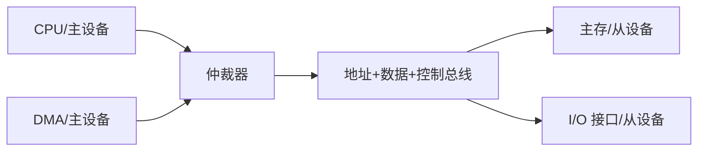
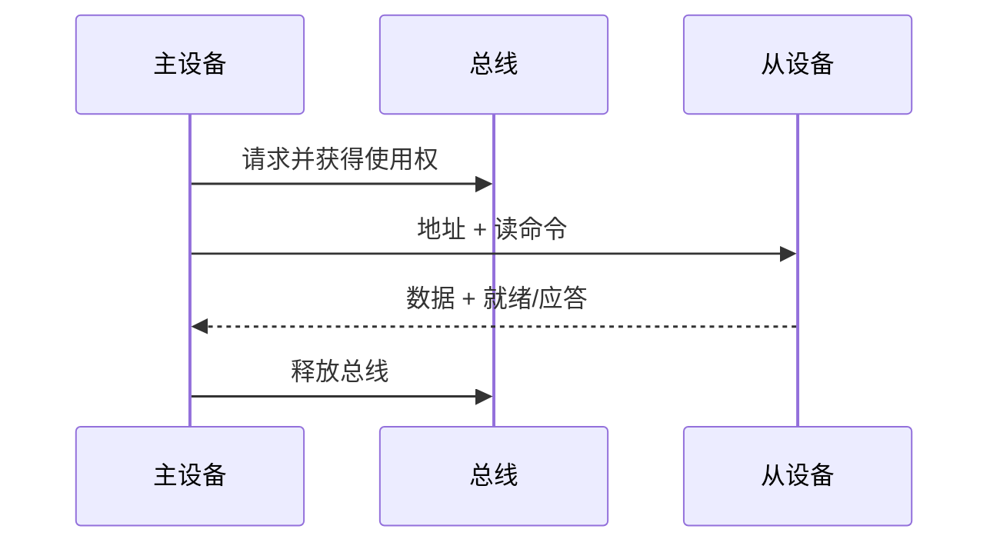

# 第6章 总线

> [!cite] 教材定位
> 原书：[[408/90-复习资料/01-核心教材/2026计算机组成原理_带书签.pdf#page=293|第6章 总线（PDF 第 293 页）]]；本章范围为 PDF 第 293–309 页。

## 本章定位

总线把 CPU、主存和 I/O 的点到点需求组织为共享通信协议。本章核心不是记接口名称，而是分清**总线宽度、一次事务的数据量、事务所占时钟数、连续事务能否流水重叠**，并据此计算有效带宽。

## 章节导航

- [[#总线概念与分类]]
- [[#总线性能指标]]
- [[#总线事务]]
- [[#同步、异步与半同步定时]]
- [[#总线仲裁]]
- [[#突发、分离事务与层次结构]]

## 考点地图

| 考点 | 高频设问 | 关键区别 |
|---|---|---|
| 分类 | 片内/系统/通信，地址/数据/控制 | 位置分类与信号分类 |
| 位宽 | 寻址范围、每次传输量 | 地址宽不等于数据宽 |
| 带宽 | 理论/有效传输率 | 时钟频率、每拍次数、效率 |
| 事务 | 读写阶段、主从角色 | 请求、仲裁、地址、数据 |
| 定时 | 同步/异步握手 | 固定节拍 vs 事件应答 |
| 仲裁 | 链式、计数器、独立请求 | 优先级、速度、线路、故障 |
| 突发 | 装 Cache 块时间 | 首字延迟与后续字间隔 |

> [!important] 408 必考
> 总线分类与位宽、峰值/有效带宽、读写事务、同步与异步定时、集中仲裁和突发传输是本章考试主线。带宽题必须明确一次有效数据量、每事务周期数、可否流水重叠，并统一 bit、B、Hz 和 s。

> [!note] 理解补充
> 半同步等待、分离事务、桥接和公平性策略用于解释共享互连的效率边界。串行与并行的现实速度不能仅凭线数判断，但 408 题中各阶段持续时间、复用方式和仲裁开销均以题设为准。

## 核心知识框架

## 完整知识点

### 总线概念与分类

总线是一组共享传输线及其协议。共享降低连线成本并便于扩展，但同一时刻资源竞争限制并行度。总线标准通常规定机械、电气、功能和过程特性。

按位置：片内总线连接 CPU 内部部件；系统总线连接 CPU、主存和 I/O；I/O/通信总线连接外设或系统间设备。按信号功能：

| 类型 | 方向 | 作用 |
|---|---|---|
| 地址总线 | 通常主设备→从设备 | 选择地址/端口 |
| 数据总线 | 双向或分向 | 传输数据 |
| 控制总线 | 双向混合 | 读写、请求、应答、中断、时钟等 |

地址总线 $a$ 位，若按字节编址，理论地址空间为 $2^a$ B。数据总线 $d$ 位，一次并行数据拍最多传 $d$ bit。地址/数据线可复用以省引脚，但需要分时和锁存，事务可能多占阶段。

按传输形式：并行总线一拍多位，近距离吞吐高但有偏斜、串扰和引脚成本；串行总线线路少、适合高速远距离和差分传输，并可通过高符号率、多通道提升带宽。“串行必慢、并行必快”是错误结论。

### 总线性能指标

- 总线宽度：数据线位数。
- 总线时钟频率：每秒总线时钟周期数。
- 传输率/带宽：单位时间传送的有效数据量，常用 B/s。
- 总线复用、突发长度、事务开销、仲裁等待会影响有效带宽。

若每个时钟完成 $q$ 次数据传输，每次 $W$ bit：

$$
BW_{peak}=f\times q\times\frac{W}{8}\quad(\text{B/s})
$$

若一次事务传 $D$ B、占 $c$ 个时钟周期且事务不重叠：

$$
BW_{effective}=\frac{D}{c/f}=\frac{Df}{c}
$$

总线利用率：

$$
U=\frac{有效数据传输时间}{观察总时间},\qquad BW_{effective}=U\times BW_{data-phase}
$$

题目中的 MB/s 若未特别说明，通信速率常按 $10^6$ B/s；存储容量 MB 常按 $2^{20}$ B，必须服从题面定义。

### 总线事务

总线事务是主设备与从设备完成一次逻辑读写的全过程，通常包括：请求/仲裁、地址阶段、命令阶段、数据阶段、结束/应答。**总线周期**是一次传输操作占用的时间单位，**时钟周期**是同步总线的基本节拍，一次总线周期可含多个时钟周期。

#### 读事务

#### 写事务

主设备给出地址和写命令，并在规定数据阶段驱动数据；从设备锁存数据并应答。同步设计中地址/数据在哪个边沿有效必须由协议确定。

总线主设备能发起事务，如 CPU、DMA 控制器；从设备响应事务，如主存、接口。一个设备可在不同事务中兼具两种角色。

### 同步、异步与半同步定时

#### 同步定时

所有设备按公共时钟和固定节拍动作。优点是协议简单、控制快；缺点是周期按最慢路径设计，速度差异大的设备浪费时间，时钟偏斜限制规模。适合同速、短距离部件。

时序题按以下检查：发起端何时给地址/数据，接收端在哪个边沿采样，信号需满足建立/保持时间，慢设备是否通过等待状态延长周期。

#### 异步定时

不依赖统一固定时钟，用请求/应答握手协调。

- 不互锁：请求和应答按预定延迟撤销，简单但可靠性较低。
- 半互锁：一方撤销受对方信号约束。
- 全互锁：请求见应答后撤销，应答见请求撤销后再撤销，四相握手最可靠但往返延迟大。

全互锁典型顺序：Request↑ → Ack↑ → Request↓ → Ack↓。异步可适应设备速度差异，但控制复杂且握手有额外延迟。

#### 半同步与分离事务

半同步保留公共时钟，同时允许慢设备插入等待周期。分离事务把请求阶段和响应阶段分开：主设备发请求后释放总线，从设备准备好数据后重新仲裁返回响应，提高等待期间利用率，但需事务标识和乱序匹配能力。

### 总线仲裁

多个主设备同时请求总线时，仲裁器按优先级和公平策略授权。集中仲裁由中央仲裁器决定；分布式仲裁由各设备协商。

| 集中方式 | 线路 | 速度 | 优先级/特点 |
|---|---|---|---|
| 链式查询 | 少 | 较慢，授权逐级传播 | 距仲裁器近者优先；链路故障影响后级 |
| 计数器定时查询 | 中 | 需编码查询 | 起点可轮换，较公平 |
| 独立请求 | 多 | 快，可并行判优 | 每设备请求/授权线，硬件多 |

链式查询中请求线可共享，授权线串接；高优先设备可截获授权。计数器查询用设备地址线逐个询问，计数起点固定则有固定优先级，轮换则近似公平。独立请求可灵活动态设置优先级。

优先级策略要在响应紧急设备与避免低优先级饥饿间折中；轮询、老化、时间片可改善公平性。仲裁时间若不能与当前事务重叠，应计入有效带宽。

### 突发、分离事务与层次结构

突发传输在一次地址/仲裁开销后连续传多个数据拍，适合 Cache 块、DMA 块传送。若首次数据延迟 $t_0$，后续每拍间隔 $t_b$，共传 $n$ 拍：

$$
T_{burst}=t_0+(n-1)t_b
$$

若每拍 $W/8$ B，有效带宽：

$$
BW=\frac{nW/8}{T_{burst}}
$$

总线分层可隔离不同速度和电气负载：处理器—存储器高速总线、I/O 总线、外设总线通过桥连接。桥要完成协议、宽度、时钟域转换并缓冲数据。

总线事务与流水线可重叠：地址阶段发起下一事务时，前一事务进入数据阶段；此时总吞吐由可持续数据拍间隔决定，不再简单用单事务总周期相乘。题目若明确“流水式总线”，应画阶段时空图。

> [!info] 技术更新
> 现代互连常采用点到点串行链路、分组交换和一致性协议，而非单一共享并行总线。408 仍以总线事务、定时、仲裁和带宽模型为核心；现实互连用于理解“协议化共享资源”，不替换题设模型。

## 典型题型与方法

### 题型一：峰值带宽

统一 $f$ 为 Hz、宽度为 B/次，乘每周期传输次数。DDR 的“双倍”是每时钟两个数据边沿，不表示时钟频率翻倍。

### 题型二：有效带宽

列一笔事务时间轴：仲裁、地址、等待、数据、恢复。只把有效数据字节放分子，总耗时放分母；判断哪些阶段可重叠。

### 题型三：突发装块

先算块含多少数据拍 $n=BlockBytes/(W/8)$，再计算首字延迟和后续拍。若地址或仲裁每个突发只发生一次，不可按每拍重复。

### 题型四：异步握手

按信号边沿写事件链，判断撤销是否依赖对方，从而识别不互锁/半互锁/全互锁。分析故障时指出请求或应答永久保持可能造成死锁。

### 题型五：仲裁比较

从线路数、判优延迟、优先级灵活性、扩展性、单点故障、公平性六维作答；不要只背“简单/复杂”。

## 完整例题与逐步解答

### 例 1：峰值带宽

某总线时钟 100 MHz，数据线 64 bit，每个时钟周期可在两个边沿各传一次数据。求理论峰值带宽。

> [!success]- 展开完整答案
> 每次传输的数据量为
>
> $$
> 64\text{ bit}=8\text{ B}.
> $$
>
> 每周期 2 次传输，所以
>
> $$
> BW=100\times10^6\times8\times2
> =1.6\times10^9\text{ B/s}
> =\boxed{1.6\text{ GB/s}}.
> $$
>
> 这是十进制 GB/s 的峰值，不含仲裁、地址、等待、协议编码和空闲开销；真实有效带宽通常更低。

### 例 2：事务有效数据比例

一次同步总线事务含 1 周期地址阶段、2 周期等待和 4 周期数据阶段，每个数据周期传 8 B。求有效数据量和有效数据周期比例。

> [!success]- 展开完整答案
> 有效数据量为
>
> $$
> 4\times8=32\text{ B}.
> $$
>
> 总事务周期数为
>
> $$
> 1+2+4=7.
> $$
>
> 因而按周期计算的有效数据比例为
>
> $$
> \boxed{\eta=\frac{4}{7}\approx57.14\%}.
> $$
>
> 若还给仲裁或恢复周期，应加入分母；若地址阶段能与前一事务数据阶段重叠，则要按实际时间轴消除重叠部分。

### 例 3：突发传输周期数

突发传送 64 B，总线每个数据拍传 8 B。从事务开始到第一拍数据完成共需 5 周期，之后每周期完成一拍。求完成整个突发的周期数。

> [!success]- 展开完整答案
> 数据拍数为
>
> $$
> n=\frac{64}{8}=8.
> $$
>
> 第一拍已经包含在 5 周期首延迟中，只剩 7 拍，每拍 1 周期：
>
> $$
> T=5+(8-1)=\boxed{12\text{ cycle}}.
> $$
>
> 常见错误是写成 $5+8=13$，把第一拍重复计算。突发传输的优势正是首地址与仲裁开销通常只支付一次。

## 做题识别顺序

1. 带宽题先把 bit 转 B、MHz 转 Hz，再乘每周期有效传输次数。
2. 事务题画仲裁、地址、等待、数据、恢复时间轴，只把有效数据放分子。
3. 突发题先算数据拍数，区分首拍延迟是否已包含第一拍。
4. 异步握手按请求上升、应答上升、请求下降、应答下降写事件依赖。
5. 仲裁题同时比较延迟、公平性、线路数、扩展性和单点故障。

## 一页记忆

$$
\boxed{
BW_{peak}=f\times\frac{W}{8}\times N_{transfer/cycle}
}
$$

$$
\boxed{
BW_{effective}=\frac{\text{有效数据字节数}}{\text{完整事务时间}}
}
$$

- 地址总线宽度决定可寻址单元数，数据总线宽度决定一个数据拍的位数。
- 同步总线共享时钟但仍可插等待；异步总线靠握手协调，但仍有建立/保持和超时约束。
- 分离事务让主设备在从设备准备数据期间释放总线；事务标识用于把乱序返回与原请求匹配。

## 易错点

- 地址总线宽度决定可寻址单元数，数据总线宽度决定一次数据拍位数。
- 总线宽度以 bit 表示，带宽常以 B/s 表示，必须除以 8。
- 总线时钟周期不等于总线事务周期。
- 峰值带宽不含仲裁、地址、等待和协议编码开销；有效带宽更低。
- 突发传输通常只付一次首地址开销，后续地址隐式递增。
- 同步总线也可插等待周期；异步总线也不是“没有任何时序约束”。
- 仲裁决定谁先用总线，不直接完成数据传送。
- 链式查询优先级由物理位置决定，低优先设备可能饥饿。
- 分离事务释放的是等待期间的总线，不等于从设备已经完成请求。
- 串行/并行的快慢不能只看“每拍位数”。

## 跨章节/跨科联系

- [[第3章-存储系统]]：Cache 块填充、多体交叉存储和主存带宽使用总线事务。
- [[第5章-中央处理器]]：内部总线限制微操作并行，结构冒险来自资源共享。
- [[第7章-输入输出系统]]：DMA 成为总线主设备并与 CPU 仲裁。
- 计算机网络：异步握手、链路吞吐和协议开销具有相似分析方法。
- 操作系统：设备驱动配置 DMA 和中断，但总线仲裁由硬件执行。

## 本章复习清单

- [ ] 能按位置、信号功能和传输形式分类总线。
- [ ] 能区分地址宽度、数据宽度和地址空间。
- [ ] 能计算峰值带宽并正确换算 bit/B、Hz/s。
- [ ] 能画出读写总线事务的阶段和主从方向。
- [ ] 能区分总线周期与时钟周期。
- [ ] 能比较同步、异步、半同步定时。
- [ ] 能写出全互锁四相握手顺序。
- [ ] 能比较三种集中仲裁并分析公平性。
- [ ] 能计算突发传输时间与有效带宽。
- [ ] 能识别可重叠阶段并画流水式总线时空图。

## 自测问题

1. 32 位地址总线、64 位数据总线在字节编址下分别说明什么？
2. 100 MHz、64 bit、每周期 2 次传输的峰值带宽是多少 GB/s？
3. 一次事务含 1 周期地址、2 周期等待、4 周期数据，每数据周期传 8 B，有效数据比例是多少？
4. 全互锁异步握手的四个信号边沿顺序是什么？
5. 链式查询为何线路少却可能既慢又不公平？
6. 突发传 64 B、总线每拍 8 B，首次数据 5 周期、后续每周期一拍，共需多少周期？
7. 分离事务为什么需要事务标识？

> [!question]- 自测问题参考答案
> 1. 32 位地址总线最多编码 $2^{32}$ 个字节地址，即 4 GiB 地址空间；64 位数据总线表示一次数据拍可传 64 bit=8 B，不表示地址空间是 64 位。
> 2. $100\text{ MHz}\times8\text{ B}\times2=1.6\text{ GB/s}$。
> 3. 有效数据为 $4\times8=32$ B；有效数据周期比例为 $4/(1+2+4)=4/7\approx57.14\%$。
> 4. 全互锁四相握手：请求上升 → 应答上升 → 请求下降 → 应答下降；每一步撤销都依赖观察到对方相应边沿。
> 5. 链式查询只需一条串行授权链，线路少；授权逐级传播使低位设备判优慢，固定物理优先级还可能让远端低优先设备饥饿。
> 6. 共有 8 拍；首拍在第 5 周期完成，余下 7 拍各 1 周期，总计 $5+7=12$ 周期。
> 7. 多个请求可同时未完成，返回顺序可能与发出顺序不同；事务标识使主设备能把每个响应匹配到正确请求和缓冲区。

## 资料依据

- 《2026 年计算机组成原理考研复习指导》第 6 章，第 293～309 页；按 PDF 书签定位并以定向 OCR 辅助核对，频率、位宽和单位已人工复核。

## 前后章节导航

上一章：[[第5章-中央处理器\|第5章 中央处理器]]  
下一章：[[第7章-输入输出系统\|第7章 输入/输出系统]]
