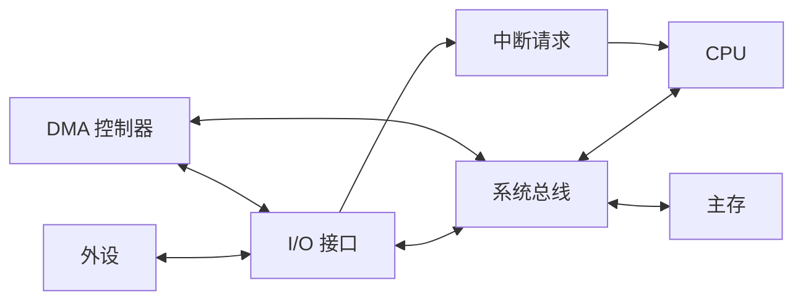
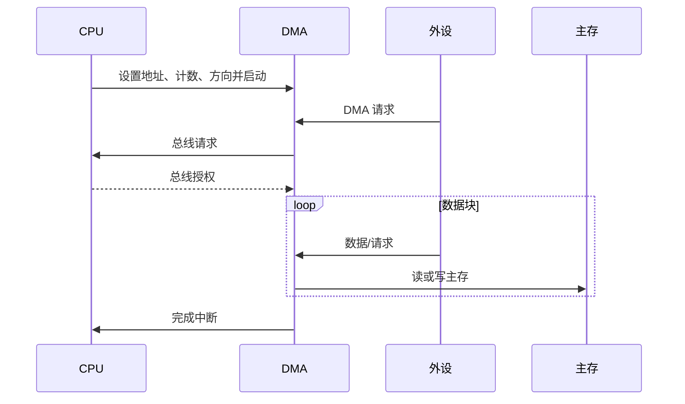

# 第7章 输入输出系统

> [!cite] 教材定位
> 原书：[[408/90-复习资料/01-核心教材/2026计算机组成原理_带书签.pdf#page=310|第7章 输入输出系统（PDF 第 310 页）]]；本章范围为 PDF 第 310–348 页。

## 本章定位

I/O 系统解决 CPU/主存与低速、异步、种类繁多外设之间的协作。四种控制方式的本质差异是：**谁检测设备、谁搬数据、以什么粒度占用 CPU 和总线**。计算题要把设备速率换成“每秒事件数”，再乘每次服务开销。

## 章节导航

- [[#I/O 系统与外设]]
- [[#I/O 接口]]
- [[#I/O 编址与指令]]
- [[#程序查询方式]]
- [[#程序中断方式]]
- [[#DMA 方式]]
- [[#通道与 I/O 处理机]]

## 考点地图

| 模块 | 高频设问 | 核心量 |
|---|---|---|
| 接口 | 寄存器、功能、方向 | 数据/状态/控制端口 |
| 编址 | 独立/统一编址 | 地址空间与指令类型 |
| 查询 | CPU 占用率、最大速率 | 查询间隔、每次时间 |
| 中断 | 响应过程、屏蔽字、开销 | 事件频率×服务周期 |
| DMA | 传送过程、总线占用 | 块大小、周期窃取、初始化 |
| 通道 | 与 DMA/CPU 分工 | 通道程序、设备级并行 |

> [!important] 408 必考
> I/O 接口及编址、程序查询、中断响应与屏蔽、DMA 传送过程与总线占用、通道分类是本章考试主线。性能题统一先把设备速率换成事件频率，再乘每次 CPU 或总线开销。

> [!note] 理解补充
> 中断嵌套时间线、DMA 与 Cache 一致性、通道程序和设备缓冲用于解释并行与批处理。具体入口保存内容、端口位定义和总线授权时序依题设，不能用操作系统或现实设备驱动细节替换硬件口径。

## 核心知识框架

## 完整知识点

### I/O 系统与外设

I/O 系统由外部设备、I/O 接口、总线和 I/O 软件组成。外设可分人机交互设备、存储设备和网络/机间通信设备。其速度、数据格式、时序和错误特征差异大，因此不能直接连接 CPU 内部数据通路。

四种控制方式比较：

| 方式 | 设备状态检测 | 数据搬运者 | 基本传送单位 | CPU 占用 |
|---|---|---|---|---|
| 程序查询 | CPU 反复读状态 | CPU 指令 | 字/字节 | 最高，忙等 |
| 中断 | 设备主动通知 | CPU 指令 | 字/字节或小批 | 服务时占用 |
| DMA | DMA 控制器 | DMA 硬件 | 数据块 | 初始化/结束占用 |
| 通道 | 通道执行通道程序 | 通道 | 一组 I/O 操作 | 更低，可管理多设备 |

### I/O 接口

接口功能：设备选择与地址译码、数据缓冲、格式/电平/速度转换、状态报告、命令接收、错误检测、中断和 DMA 请求。

| 寄存器/端口 | 方向（CPU 视角） | 内容 |
|---|---|---|
| 数据寄存器 | 读或写 | 输入数据、输出数据 |
| 状态寄存器 | 读 | ready、busy、error、中断原因 |
| 控制寄存器 | 写（也可读回） | 启动、模式、中断允许、复位 |

接口与端口不同：接口是硬件电路整体，端口是其中可由 CPU 寻址的寄存器。设备就绪不等于 CPU 已读取数据；输入缓冲可满、输出缓冲可空，状态位语义要看题设。

### I/O 编址与指令

| 方式 | 地址空间 | 访问指令 | 特点 |
|---|---|---|---|
| 独立编址 | I/O 与主存分开 | 专用 I/O 指令 | 不占主存地址，控制信号独立 |
| 统一编址（存储器映射） | 共用地址空间 | 普通访存指令 | 指令丰富、占用部分地址 |

统一编址下，I/O 地址仍需接口译码；访问可能具有副作用，通常不能像普通内存一样随意缓存或重排。独立编址是否有独立地址线取决于实现，关键是地址空间和控制命令分离。

### 程序查询方式

CPU 执行输入输出程序：发命令 → 反复读取状态 → 就绪后传数据 → 检查错误/结束。在等待期间 CPU 不能做有效工作，适合简单、低速或事件极少场景。

若每次查询耗 $C_p$ 个周期、查询频率 $f_p$ 次/s、CPU 主频 $f_{CPU}$：

$$
U_{poll}=\frac{f_pC_p}{f_{CPU}}
$$

若要求不丢数据，查询间隔必须不大于设备产生一个需要服务数据单元的时间；设备速率 $R$ B/s、每个数据单元 $B_u$ B 时，事件频率 $R/B_u$ 次/s。

查询方式中一次“查询”可能含多条指令和多次总线访问，题目给的是周期数、指令数还是时间必须分清。

### 程序中断方式

设备准备好后发中断请求，CPU 在允许的指令边界响应，执行中断服务程序（ISR），完成数据传送后返回。等待期间 CPU 可运行其他程序。

#### 中断响应条件与过程

通常需：请求有效、未被屏蔽、CPU 开中断、当前没有更高优先级限制，并到达允许响应的时机。硬件响应：关中断/调整状态、保存断点和 PSW 的必要部分、识别中断源并形成入口；软件 ISR 保存通用现场、服务设备、清除请求、恢复现场、中断返回。

中断源识别方式：软件查询依次读状态，硬件向量由设备/控制器提供中断类型号或入口索引。**中断向量**通常是处理程序入口地址或其索引，**向量地址**是存放中断向量的单元地址，二者不可混淆。

#### 优先级和屏蔽

响应优先级决定多个请求同时到来时先响应谁，常由硬件排队电路决定；处理优先级决定 ISR 是否允许更高优先级中断嵌套，可由屏蔽字调整。

设计屏蔽字时，每个 ISR 屏蔽自身及不允许打断它的中断源，开放允许打断它的更高处理优先级源。进入 ISR 后应先保护现场，再在安全位置开放中断；退出前恢复屏蔽和现场。

#### 中断 CPU 占用率

设备数据率 $R$ B/s，每次中断处理 $B_i$ B，事件频率：

$$
f_i=R/B_i
$$

每次中断总开销 $C_i$ 周期，CPU 主频 $f_{CPU}$：

$$
U_{int}=\frac{f_iC_i}{f_{CPU}}
$$

$C_i$ 应包含题目指定的响应、现场保护、服务、恢复等开销；若数据传送指令时间另给，也要加入。多个设备占用率可相加，但总和超过 1 表示系统无法实时服务。

### DMA 方式

DMA 控制器在外设与主存间直接成块传送数据。CPU 只在开始时设置主存起址、设备/方向、传送字数等，结束或错误时由 DMA 中断 CPU。

DMA 控制器常含：主存地址寄存器、字计数器、数据缓冲寄存器、命令/状态寄存器和总线控制逻辑。每传一个数据单元，地址按方向递增/递减，计数器更新，计数结束产生完成信号。

#### DMA 与总线

DMA 作为总线主设备与 CPU 仲裁：

- **停止 CPU 访存**：DMA 连续占总线传块，块传送快，CPU 停顿长。
- **周期窃取**：DMA 每次窃取一个或少数存储周期，CPU 间歇停顿。
- **交替访问/透明 DMA**：利用 CPU 不访存的周期，理想时影响小但时序控制复杂。

DMA 与 CPU 可并行执行内部运算，但争用主存/总线时 CPU 需等待。DMA 通常不能代替 CPU 执行设备控制协议和复杂错误处理。

#### DMA 性能

若每块 $B$ B，设备速率 $R$ B/s，则块完成频率 $R/B$。每块 CPU 初始化和完成中断开销 $C_b$ 周期：

$$
U_{CPU,DMA}=\frac{R}{B}\times\frac{C_b}{f_{CPU}}
$$

总线占用率若每个传输单元 $w$ B、占 $c$ 个总线周期、总线周期 $T_b$：

$$
U_{bus}=\frac{R}{w}\times cT_b
$$

若 DMA 使用突发，需按整块事务的地址/仲裁/数据阶段重新计算，不能把峰值带宽当有效带宽。

DMA 一致性问题：若 CPU Cache 中保存同一内存区域副本，DMA 绕过 Cache 写主存可能使副本陈旧；现实系统用一致性互连或软件刷新/失效处理。408 未说明时通常忽略，但涉及 Cache 的综合题按题设。

### 通道与 I/O 处理机

通道是具有特殊指令系统、能执行通道程序的 I/O 处理部件。CPU 发出 I/O 指令启动通道，通道从主存取得通道程序，独立控制多个设备和一系列传送，结束后中断 CPU。

| 项目 | DMA | 通道 |
|---|---|---|
| 控制程序 | 寄存器参数 | 主存中的通道程序 |
| 功能 | 主要成块搬运 | 可执行设备选择、传送、条件等 I/O 指令 |
| 管理范围 | 常面向一个/少数设备 | 可管理多台设备 |
| CPU 干预 | 每块设置 | 一组 I/O 工作启动一次 |

通道类型常见：字节多路通道交叉服务多台低速设备；数组多路通道按块交叉服务多台高速设备；选择通道在一段时间独占服务一台高速设备。

> [!info] 技术更新
> 现代系统常用消息信号中断、IOMMU、多队列 DMA 与高性能设备队列。它们延续“设备批量提交、DMA 搬运、完成通知”的基本思想；408 作答仍以接口寄存器、中断、DMA 和通道模型为准。

## 典型题型与方法

### 题型一：查询占用率

先由设备速率求最低查询频率，再乘每次查询的周期数，最后除 CPU 每秒周期数。若给多个设备，分别计算后相加；检查是否超过 100%。

### 题型二：中断占用率

先确定“每个字节一次”还是“每缓冲块一次”中断，求事件频率。每次开销要统一为周期或秒；数据处理时间若包含在服务程序中不可重复加。

### 题型三：中断屏蔽与嵌套

先写期望处理优先级序列，再为每个 ISR 标出允许打断者；由此填屏蔽位。最后按到达时刻画 CPU 服务时间线，区分请求被记录与实际响应。

### 题型四：DMA 总线占用

设备速率除以每次传输字节数得到每秒 DMA 数据拍；乘每拍占用时间。若主存带宽小于设备需求，即使 CPU 占用低也无法持续传送。

### 题型五：方式选择

按数据率、传输粒度、实时性、CPU 开销和硬件成本判断：极低频控制可查询；零散异步事件用中断；高速成块数据用 DMA；大量复杂并发 I/O 用通道/专用处理器。

## 完整例题与逐步解答

### 例 1：程序查询的 CPU 占用率

某设备以 $1\text{ MB/s}$ 连续产生数据，每次产生 1 B 就需要被查询。CPU 主频 2 GHz，每次查询含状态检查和分支共 20 个时钟周期。按十进制 MB 计算，维持不丢数据的最低查询占用率是多少？

> [!success]- 展开完整答案
> 设备每秒产生
>
> $$
> 1\times10^6\text{ B/s}
> $$
>
> 且每字节一次事件，所以最低查询频率为 $10^6$ 次/s。查询消耗周期数为
>
> $$
> 10^6\times20=2\times10^7\text{ cycle/s}.
> $$
>
> CPU 每秒有 $2\times10^9$ 个周期，故占用率
>
> $$
> U=\frac{2\times10^7}{2\times10^9}=0.01=\boxed{1\%}.
> $$
>
> 若一次查询可以处理多个字节，事件频率应改为数据率除以每次处理字节数；不能直接拿 B/s 乘周期数而不检查传输粒度。

### 例 2：分块中断频率

设备数据率为 $10\text{ MB/s}$，每填满 1 KiB 缓冲区中断一次。按十进制 MB、二进制 KiB，求每秒中断次数。

> [!success]- 展开完整答案
> 数据率是 $10\times10^6\text{ B/s}$，每块大小为 $1024\text{ B}$：
>
> $$
> f_{int}=\frac{10\times10^6}{1024}
> =9765.625\text{ 次/s}
> \approx\boxed{9.77\text{ kHz}}.
> $$
>
> 若每次中断开销为 $C$ 个周期、CPU 主频为 $f$，中断 CPU 占用率再计算 $f_{int}C/f$。合并更多数据再中断可降低开销，但也会增加等待延迟和缓冲需求。

### 例 3：DMA 总线占用率

DMA 设备持续传输 $200\text{ MB/s}$，总线数据宽度 64 bit、时钟 100 MHz，每个数据拍占 1 周期，忽略协议开销。求 DMA 所需数据拍频率和总线周期占用率。

> [!success]- 展开完整答案
> 每拍传
>
> $$
> 64\text{ bit}=8\text{ B}.
> $$
>
> 所需数据拍频率为
>
> $$
> \frac{200\times10^6}{8}=25\times10^6\text{ beat/s}.
> $$
>
> 总线每秒有 $100\times10^6$ 个周期，每拍占 1 周期，因此
>
> $$
> U_{bus}=\frac{25\times10^6}{100\times10^6}
> =\boxed{25\%}.
> $$
>
> DMA 的 CPU 占用可能很低，但设备仍实实在在占用主存/总线带宽。若再叠加 Cache 回写、CPU 访存和其他 DMA，瓶颈可能出现在总线而不是 CPU。

## 做题识别顺序

1. 先由数据率除以每次处理字节数，得到查询/中断/DMA 数据拍频率。
2. CPU 占用率用“事件频率 × 每事件 CPU 周期 / CPU 每秒周期”。
3. 总线占用率用“数据拍频率 × 每拍总线周期 / 总线每秒周期”。
4. 中断嵌套题分开写响应优先级、处理优先级和屏蔽字，再按到达时刻画服务线。
5. 方式选择看数据粒度和控制复杂度：低速查询、异步中断、成块 DMA、复杂并发通道。

## 一页记忆

$$
\boxed{
f_{event}=\frac{R_{device}}{B_{per\ event}},\qquad
U_{CPU}=\frac{f_{event}C_{event}}{f_{CPU}}
}
$$

$$
\boxed{
U_{bus}=\frac{R_{device}}{BW_{effective}}
}
$$

- 查询和中断方式通常仍由 CPU 搬数据；中断只是让 CPU 不必持续忙等。
- DMA 由 CPU 初始化，控制器在设备与主存间按块传输，块完成后再中断 CPU。
- 响应优先级决定同时请求先响应谁，主要由硬件判优；处理优先级决定 ISR 能否被另一中断打断，可由屏蔽字调整。
- 通道能执行通道程序、管理多个设备和复杂 I/O 序列，比单纯 DMA 控制器自治程度更高。

## 易错点

- I/O 接口不是外设本身，端口也不是接口整体。
- 程序中断方式的数据搬运者仍是 CPU，不是接口自动写主存。
- 中断请求可在指令执行中到来，但 CPU 通常在规定边界响应。
- 中断响应保存断点不等于 ISR 已保存所有通用寄存器。
- 中断向量、向量地址、中断类型号含义不同。
- 响应优先级和处理优先级可不同，屏蔽字主要改变后者。
- DMA 是外设—主存直接传送，不意味着完全不经过接口或总线。
- DMA 完成一个数据字通常不中断 CPU，完成一块才常中断。
- CPU 与 DMA 可并行不代表二者可同时占用同一总线/单端口主存。
- 计算占用率时先把 B/s 转换为事件/s，不能直接乘周期。
- 通道有自己的通道指令，但不是通用 CPU。

## 跨章节/跨科联系

- [[第3章-存储系统]]：DMA 访问主存可能与 Cache 一致性、存储带宽有关。
- [[第5章-中央处理器]]：CPU 的异常/中断入口、现场和返回机制支撑 ISR。
- [[第6章-总线]]：DMA 主设备仲裁、周期窃取和突发传输决定实际吞吐。
- 操作系统：设备驱动初始化接口，ISR 处理中断，下半部/任务完成后续工作。
- 计算机网络：网卡环形队列与 DMA 展现批处理减少中断的性能思想。

## 本章复习清单

- [ ] 能说明 I/O 接口的功能和三类端口。
- [ ] 能比较独立编址与统一编址。
- [ ] 能从设备数据率计算查询最低频率和 CPU 占用率。
- [ ] 能完整口述中断响应、ISR 和返回过程。
- [ ] 能区分中断向量、向量地址、响应/处理优先级。
- [ ] 能设计基本中断屏蔽关系并画嵌套时间线。
- [ ] 能说明 DMA 初始化、传送、结束三个阶段。
- [ ] 能比较停止访存、周期窃取和透明 DMA。
- [ ] 能计算 DMA 的 CPU 开销和总线占用率。
- [ ] 能比较查询、中断、DMA 与通道的分工和粒度。

## 自测问题

1. I/O 接口为何需要数据、状态和控制寄存器？
2. 程序查询和程序中断的数据搬运者为何都是 CPU，但占用率不同？
3. 设备 10 MB/s、每 1 KiB 中断一次时，中断频率是多少（按十进制 MB、二进制 KiB）？
4. 响应优先级和处理优先级分别由什么决定？
5. DMA 周期窃取时 CPU 哪些工作可以继续，哪些必须停顿？
6. 为什么 DMA 的 CPU 占用率很低但仍可能耗尽主存总线带宽？
7. 通道相较 DMA 多了什么能力？三类通道分别适合什么设备？

> [!question]- 自测问题参考答案
> 1. 数据寄存器暂存交换数据；状态寄存器报告就绪、忙、错误等；控制寄存器接收启动、模式、中断允许等命令，三类信息方向和用途不同。
> 2. 两者的数据传送指令都由 CPU 执行；查询方式让 CPU 循环读状态忙等，中断方式允许 CPU 先做其他工作，设备就绪后再进入 ISR，所以等待占用不同。
> 3. $10\times10^6/1024=9765.625$ 次/s，约 9.77 kHz。
> 4. 响应优先级主要由硬件排队/判优电路决定同时请求的先后；处理优先级由当前 ISR 的屏蔽关系决定谁能打断谁，可用屏蔽字改变。
> 5. DMA 占用总线或单端口主存的周期内，CPU 不能进行需要同一资源的访存；若 CPU 可继续执行寄存器内部运算或使用不冲突的 Cache/总线资源，则这些工作可以继续。
> 6. CPU 只在初始化和块完成时介入，但每个数据字节仍要经过主存总线；设备总吞吐接近总线极限时会耗尽带宽并拖慢 CPU 访存。
> 7. 通道能取出并执行通道指令，组织多个设备和多段传输。字节多路通道适合多个低速设备，选择通道适合高速设备独占成块传输，数组多路通道在多个高速设备间按块交替。

## 资料依据

- 《2026 年计算机组成原理考研复习指导》第 7 章，第 310～348 页；按 PDF 书签定位并以定向 OCR 辅助核对，速率单位、周期数和信号名已人工复核。
- [Linux 内核 DMA API 官方文档](https://www.kernel.org/doc/html/latest/core-api/dma-api.html)用于核验现代 DMA 地址、映射与一致性边界；408 主线仍是查询、中断、DMA 和通道的硬件模型。

## 前后章节导航

上一章：[[第6章-总线\|第6章 总线]]  
返回：[[组成原理目录\|计算机组成原理目录]]
