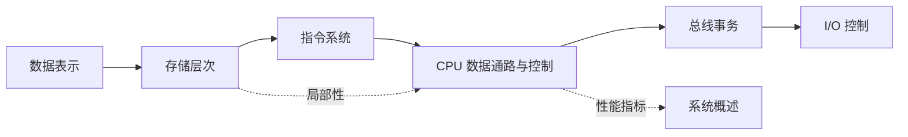

# 计算机组成原理目录

> [!cite] 教材与速查
> [[../90-复习资料/01-核心教材/2026计算机组成原理_带书签.pdf#page=13|打开教材正文起始页]] · [[../90-复习资料/01-核心教材/00-核心教材页码索引#计算机组成原理|页码索引]] · [[../00-总览/408四科公式算法协议速查#三、计算机组成原理|组成原理速查]]

> [!abstract] 使用说明
> 本目录按“表示—存储—指令—执行—互连—I/O”的机器工作链组织。先用第 1 章建立性能与层次观，再依次学习 2～7 章；二轮复习按下方专题链横向串联。

## 章节导航

| 章节 | 核心问题 | 高频计算 |
|---|---|---|
| [[第1章-计算机系统概述\|第1章 计算机系统概述]] | 程序如何成为机器活动，怎样评价快慢 | CPU 时间、CPI、IPS、FLOPS、Amdahl |
| [[第2章-数据的表示和运算\|第2章 数据的表示和运算]] | 位模式怎样表示数并完成运算 | 补码、溢出、浮点范围与舍入 |
| [[第3章-存储系统\|第3章 存储系统]] | 容量、速度、地址如何折中 | 芯片扩展、Cache、AMAT、页表/TLB |
| [[第4章-指令系统\|第4章 指令系统]] | 指令怎样编码并定位操作数 | 操作码扩展、有效地址、对齐 |
| [[第5章-中央处理器\|第5章 中央处理器]] | 一条指令如何沿数据通路执行 | 微操作、控制信号、流水线性能 |
| [[第6章-总线\|第6章 总线]] | 部件怎样共享通信资源 | 带宽、事务周期、仲裁与定时 |
| [[第7章-输入输出系统\|第7章 输入/输出系统]] | 慢速外设如何与 CPU、主存协作 | 查询、中断、DMA、通道 |

## 高频专题链

- **位宽链**：机器字长 → 数据类型 → 寄存器/ALU → 指令字段 → 数据总线。
- **地址链**：虚拟地址 → TLB/页表 → 物理地址 → Cache 标记/组号/块内地址 → 存储芯片片选。
- **时序链**：时钟周期 → 指令周期 → 流水级 → 总线周期 → 中断/DMA 响应。
- **性能链**：指令数、CPI、主频 → Cache 缺失代价 → 流水停顿 → I/O 占用。
- **程序链**：高级语言 → 汇编/机器指令 → 数据通路微操作 → 存储和 I/O 事务。

## 建议复习顺序

1. 一轮：逐章完成“完整知识点”和章末自测。
2. 二轮：重算每章典型题，所有结果写明位数、单位和边界条件。
3. 三轮：按“地址链、时序链、性能链”做跨章综合题。
4. 冲刺：只看各章考点地图、易错点、复习清单，并口述自测答案。

## 资料依据

- 《2026 年计算机组成原理考研复习指导》扫描 PDF，第 13～348 页；章节边界来自原书书签，正文只对重点页做定向 OCR 并人工复核。
- [[../90-复习资料/01-核心教材/00-核心教材页码索引#计算机组成原理|核心教材页码索引]]与本目录既有笔记用于交叉校核。
- IEEE 754、RISC-V 和 Linux DMA 官方资料只核验技术更新，不替代 408 经典模型。

## 前后导航

下一章：[[第1章-计算机系统概述\|第1章 计算机系统概述]] · 跨科：[[../00-总览/408跨科知识链|408 跨科知识链]]
