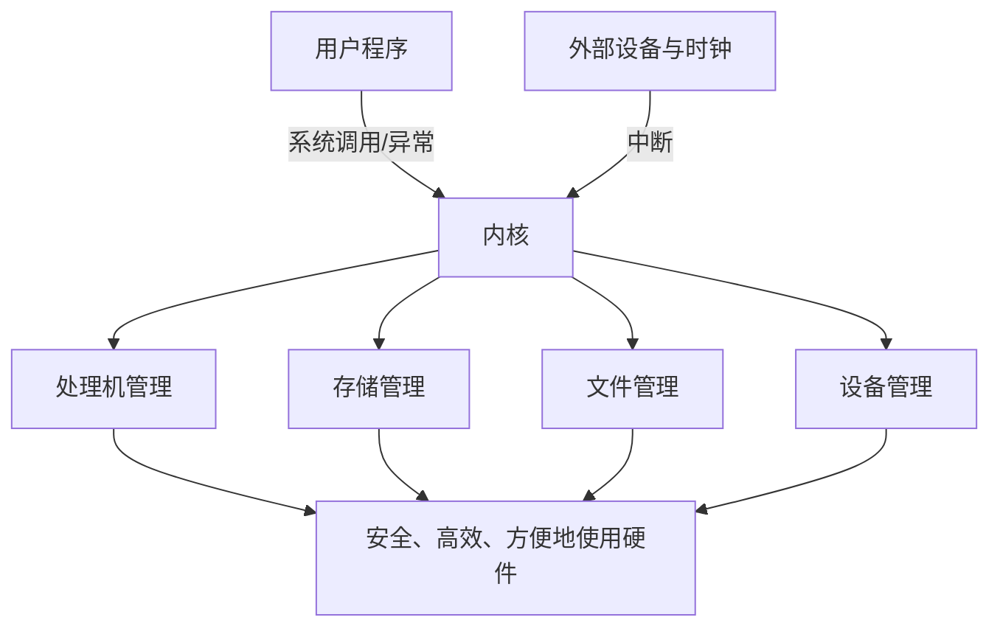

# 第1章 计算机系统概述

> [!cite] 教材定位
> 原书：[[408/90-复习资料/01-核心教材/2026操作系统_带书签.pdf#page=13|第1章 计算机系统概述（PDF 第 13 页）]]；本章范围为 PDF 第 13–48 页。

## 本章定位

本章解释操作系统的目标、控制权来源与组织方式，是理解进程调度、虚拟内存和 I/O 的入口。选择题集中在概念边界，综合题常把中断、系统调用与后续章节组合考查。

## 章节导航

1. OS 的概念、特征与功能
2. 发展历程与系统类型
3. 运行机制：处理器状态、指令、中断与异常
4. 系统调用与用户接口
5. 内核体系结构、虚拟机与系统启动

## 考点地图

| 考点 | 要回答的问题 | 频度 |
|---|---|---|
| 并发与共享 | 两者为何互为存在条件 | 高频 |
| 中断、异常、系统调用 | 来源、时机、返回点、状态切换 | 高频 |
| 特权指令 | 谁能执行，用户如何请求服务 | 高频 |
| OS 结构 | 宏内核与微内核的权衡 | 中频 |
| 引导 | CPU 上电后如何找到内核 | 中频 |

> [!important] 408 必考
> 判断一个事件时，先看**来源在 CPU 外还是当前指令内部**，再看是否由程序主动请求，最后判断处理后能否返回原指令。

## 核心知识框架

## 完整知识点

### 1. 操作系统的概念与目标

操作系统是控制和管理计算机软硬件资源、合理组织工作流程，并为用户和应用提供接口的系统软件。它既是**资源管理者**，也是硬件之上的**扩充机器**。

主要目标：方便性、有效性、可扩充性与开放性。基本功能包括处理机管理、存储器管理、文件管理、设备管理，以及向用户提供命令接口、程序接口和图形接口。

### 2. 四大特征

- **并发**：多个事件在同一时间间隔内发生；并行是同一时刻同时发生。单核可并发而不能真正并行执行多条进程指令。
- **共享**：系统资源供多个并发活动共同使用。互斥共享要求一段时间只允许一个进程访问；同时共享允许宏观同时、微观交替访问。
- **虚拟**：通过时分复用和空分复用把一个物理实体映射成多个逻辑实体，如虚拟处理器、虚拟存储器、SPOOLing。
- **异步**：进程以不可预知速度向前推进，但正确同步后结果应可再现。

并发与共享是最基本特征：没有并发就没有资源竞争与共享需求；共享机制又是并发活动协调推进的条件。

### 3. 发展与分类

| 阶段/类型 | 核心机制 | 主要目标或特征 |
|---|---|---|
| 手工操作 | 人工装入与运行 | CPU 利用率低 |
| 单道批处理 | 监督程序自动衔接作业 | 减少人工干预，内存仅一道作业 |
| 多道批处理 | 多个作业驻留内存，I/O 时切换 | 提高吞吐量和资源利用率，交互性差 |
| 分时系统 | 时间片轮转，多终端交互 | 及时性、独立性、交互性、同时性 |
| 实时系统 | 截止期约束 | 硬实时必须按时，软实时允许偶尔违期 |
| 网络 OS | 各机器有自治 OS，通过网络共享 | 用户知道资源位置 |
| 分布式 OS | 多机协同形成统一系统 | 透明性、容错与并行性 |

### 4. 运行机制与处理器状态

CPU 至少区分用户态（目态）与核心态（管态），通常由程序状态字中的模式位表示。内核态可执行全部指令，用户态只能执行非特权指令。

- **特权指令**：涉及系统控制或关键资源，如开关中断、修改页表基址、设置时钟、执行 I/O 控制。
- **非特权指令**：普通运算、取数、访管指令本身。访管指令在用户态执行并触发自陷，随后由内核完成服务。
- 用户态到内核态必须通过中断或异常；内核态到用户态由修改程序状态字实现。

内核通常包含时钟管理、中断机制、原语及处理机、内存、设备等管理的核心部分。**原语**由若干指令构成，执行必须连续、不可被中断，常借助关中断或硬件原子指令保证。

### 5. 中断与异常

| 维度 | 外中断 | 异常/内中断 |
|---|---|---|
| 来源 | 当前指令外部，如时钟、I/O 完成 | 当前指令执行内部 |
| 同步性 | 异步 | 同步 |
| 例子 | 时钟、网卡、DMA 完成 | 缺页、除零、非法指令、自陷 |

异常可分为：故障（通常可修复并重新执行原指令，如缺页）、自陷（有意安排，返回下一条，如系统调用）、终止（严重错误，通常不能恢复）。外中断有可屏蔽中断与不可屏蔽中断。

典型处理过程：

1. 当前指令执行完后检查中断请求；异常可能在指令执行中被检测。
2. 硬件保存断点与程序状态字，切换到内核态并根据中断向量找到入口。
3. 中断入口保存通用寄存器等现场，识别中断源并执行服务程序。
4. 恢复现场，执行中断返回，回到被打断程序或调度其他进程。

中断与子程序调用都改变控制流，但中断由硬件事件或异常触发，需保存状态并可能切换特权级；子程序调用由程序显式执行，通常只按调用约定保存返回地址和必要寄存器。

### 6. 系统调用

系统调用是 OS 向应用提供的程序接口，覆盖进程控制、文件、设备、通信和信息维护。库函数可能完全在用户态运行，也可能封装系统调用，两者不能等同。

一次调用的条件与步骤：

1. 用户程序把系统调用号和参数放入约定位置。
2. 执行访管/自陷指令；硬件保存返回点，转入内核态。
3. 系统调用总入口检查参数，分派到内核服务例程。
4. 服务完成后设置返回值，恢复用户现场并返回用户态。

系统调用会发生用户态/内核态转换，但不必然发生进程切换；若调用导致等待 I/O，当前进程才可能阻塞并调度他者。

### 7. 用户接口

- 命令接口包括联机命令接口（交互式）和脱机命令接口（批处理作业控制）。
- 程序接口由系统调用组成。
- 图形接口最终仍经库和系统调用请求内核服务。

### 8. 操作系统体系结构

| 结构 | 优点 | 局限 |
|---|---|---|
| 分层 | 关系清晰、便于验证 | 层次难定义，跨层开销 |
| 模块化 | 接口明确、可动态扩展 | 模块依赖可能复杂 |
| 宏内核 | 核心服务在内核空间，调用高效 | 内核庞大，故障影响面大 |
| 微内核 | 内核仅保留机制，服务进程在用户态 | 可靠、可移植；消息通信与切换开销大 |
| 外核 | 内核只保护与复用资源，应用定制抽象 | 灵活但开发复杂 |

机制回答“提供什么基本能力”，策略回答“按什么规则使用能力”；微内核强调机制与策略分离。

> [!note] 理解补充
> 微内核不是“内核代码越少越好”，而是把地址空间、线程、IPC 等必要机制留在内核，把文件系统、驱动等策略性服务移到用户态。

### 9. 虚拟机

第一类虚拟机管理程序直接运行在硬件上；第二类运行在宿主 OS 上。虚拟机通过复用和隔离硬件提供多个完整执行环境，容器则通常共享宿主内核，二者抽象层次不同。

### 10. 操作系统引导

经典引导链：CPU 复位后执行固件 → 固件自检并选择启动设备 → 读取引导记录或 EFI 启动项 → 引导程序装入内核与必要模块 → 内核初始化中断、内存和设备 → 建立根文件系统 → 启动第一个用户态进程与系统服务。

> [!info] 技术更新
> 现代 PC 常由 UEFI 固件从 EFI System Partition 加载启动程序，较旧教材常用 BIOS→MBR 描述。408 解题以题干给定模型为准，两条链都遵循“固件先运行、逐级装入、内核接管”的原则。

## 典型题型与方法

### 题型一：事件分类

先判来源：设备/时钟是外中断；指令执行产生的是异常。再判异常类型：可修复重启为故障，主动服务请求为自陷，无法继续为终止。

### 题型二：状态与切换次数

画出“用户程序→自陷入口→服务例程→返回”的控制流。题目问状态切换时只数用户态与内核态变化；问进程切换时必须出现保存 PCB、选择新进程、恢复新上下文。

### 题型三：结构比较

从服务放置位置、通信方式、性能、可靠性、可扩展性五个维度作答。宏内核内部过程调用快；微内核隔离性好但 IPC 较多。

## 完整例题与逐步解答

### 例 1：中断与异常分类

判断下列事件属于外中断还是异常，并说明主要处理结果：时钟片到期、键盘输入完成、DMA 传输完成、缺页、执行除零指令、用户程序执行系统调用指令。

> [!success]- 展开完整答案
> 先看事件是否由当前指令执行直接引起。来自设备或时钟、与当前指令异步的是外中断；由当前指令引起的是异常。
>
> | 事件 | 类型 | 典型处理 |
> |---|---|---|
> | 时钟片到期 | 外中断/时钟中断 | 进入内核更新计时，可能触发抢占调度 |
> | 键盘输入完成 | 外中断/I/O 中断 | 驱动读取状态，唤醒等待输入的进程 |
> | DMA 完成 | 外中断/I/O 中断 | DMA 已搬完一批数据，控制器通知 CPU 收尾 |
> | 缺页 | 内部异常中的故障 | 调页并修复页表后，通常重新执行原指令 |
> | 除零 | 内部异常 | OS 通常向进程报告错误并终止或交给信号处理 |
> | 系统调用指令 | 主动异常/自陷 | 受控进入内核执行系统服务，完成后返回用户态 |
>
> “进入内核”不等于“必然换进程”。例如一个很快完成的系统调用可以直接返回原进程；时钟中断也可能检查后仍让原进程继续运行。

### 例 2：模式切换与进程切换计数

进程 P 在用户态执行 `read`，数据尚未就绪，因此 P 阻塞，调度器切换到进程 Q。稍后设备完成并发出中断，内核唤醒 P，但 Q 的时间片未到且 P 优先级不更高，于是 Q 继续运行。问发生了哪些模式切换和进程切换。

> [!success]- 展开完整答案
> 1. P 执行系统调用指令：用户态 $\rightarrow$ 内核态，是一次模式切换。
> 2. `read` 不能立即完成，P 由运行态转为阻塞态；调度器保存 P 的完整进程上下文并恢复 Q，这是一次 P $\rightarrow$ Q 的进程切换。
> 3. Q 被恢复后返回用户态：内核态 $\rightarrow$ 用户态。
> 4. 设备完成产生中断：Q 的用户态 $\rightarrow$ 内核态。内核保存中断现场并把 P 从阻塞态移到就绪态。
> 5. 因题设不抢占 Q，所以没有发生 Q $\rightarrow$ P 的进程切换；中断返回时由内核态 $\rightarrow$ Q 的用户态。
>
> 这里至少能看出：模式切换比进程切换更频繁。进程切换不仅要改变特权级，还要切换调度实体、地址空间相关状态和更多寄存器上下文，代价通常更高。

## 做题识别顺序

1. 看到事件先问“来自外部设备/时钟，还是由当前指令引起”。
2. 再判断是否只发生用户态/内核态转换，还是运行进程也改变。
3. 系统调用题按“参数准备 → 自陷 → 内核检查与服务 → 返回”写路径。
4. 结构题按性能、隔离、可扩展、通信开销、可信计算基大小比较，不只背优缺点口号。
5. 引导题按“固件 → 引导加载程序 → 内核初始化 → 首个用户态进程”写控制权交接。

## 一页记忆

- 并发强调一段时间内交替推进，并行强调同一时刻真正同时执行。
- 共享提供协作对象，并发使共享访问产生同步与互斥问题；二者是 OS 最基本特征。
- 外中断来自 CPU 外部且通常异步；异常由当前指令引起且同步。
- 系统调用是用户程序获得内核服务的受控接口；库函数可能封装系统调用，也可能完全在用户态完成。
- 模式切换不必换进程；进程切换一定要保存旧进程并恢复新进程的运行上下文。

## 易错点

- 并发是时间间隔概念，并行是同一时刻概念。
- OS 的异步性不意味着运行结果可以错误或不可重复。
- 用户程序不能直接执行 I/O 特权指令，但可以执行访管指令请求内核代办。
- 缺页属于异常，不是外中断；I/O 完成属于外中断。
- 中断处理一定进入内核态，未必引起进程切换。
- 系统调用是接口，系统调用服务例程是其内核实现，库函数还可能不进入内核。
- 引导程序与内核不是同一程序；固件最先取得控制权。

## 跨章节/跨科联系

- [[第2章-进程与线程]]：时钟中断触发抢占，系统调用可能使进程阻塞。
- [[第3章-内存管理]]：缺页异常修复地址映射后重启指令。
- [[第5章-输入输出管理]]：控制器完成 I/O 后以中断通知 CPU。
- 组成原理：中断向量、程序状态字、特权级和 DMA 是软硬件接口。

## 本章复习清单

- [ ] 能用一句话定义 OS，并列出四大特征与五类功能。
- [ ] 能区分并发/并行、互斥共享/同时共享。
- [ ] 能比较批处理、分时与实时系统。
- [ ] 能按来源、同步性和返回点区分中断与三类异常。
- [ ] 能口述系统调用的四步路径，并说明为何不必然切换进程。
- [ ] 能比较宏内核、微内核、分层和模块化。
- [ ] 能口述从固件到首个用户进程的引导链。

## 自测问题

1. 为什么并发与共享被称为最基本特征？
2. 用户态执行访管指令是否违反“用户态不能执行特权指令”？
3. 缺页、除零、时钟到期、DMA 完成分别属于什么事件？
4. 系统调用、库函数、普通函数调用有何边界？
5. 微内核为什么可靠性更好，又为什么可能更慢？
6. 中断处理和进程切换分别需要保存哪些上下文？

> [!question]- 自测问题参考答案
> 1. 并发使多个活动在时间上交错，共享使它们能访问共同资源；没有共享，并发进程难以协作；没有并发，也不会产生资源竞争、同步和互斥问题。
> 2. 不违反。访管/系统调用指令本来就是允许用户态执行的受控入口；真正的特权操作在完成陷入和权限检查后由内核态代码执行。
> 3. 缺页和除零是由当前指令引起的内部异常；时钟到期与 DMA 完成是外中断。
> 4. 系统调用是用户—内核接口；库函数是语言/运行库提供的函数，可能调用系统调用也可能纯用户态执行；普通函数调用只按调用约定跳转，不自动改变特权级。
> 5. 微内核把更多服务放入隔离的用户态进程，单个服务故障不易破坏整个内核；但服务间需要更多 IPC、调度和地址空间切换，所以可能更慢。
> 6. 中断入口至少保存返回地址、程序状态字和必要寄存器；进程切换还要把可恢复的 CPU 上下文、调度状态、内存映射相关信息等保存到 PCB，并恢复另一进程的对应状态。

## 资料依据

- 《2026 操作系统考研复习指导》第 1 章，第 13～48 页；扫描页按书签定位，定向 OCR 仅用于知识点核对。
- 本库原“第1章-计算机系统概述”长篇笔记与复习版章节，用于交叉纠错。
- [UEFI Forum 官方规范页](https://uefi.org/specifications)仅用于核验现代固件启动模型，不替代 408 的引导主线。

## 前后章节导航

上一页：[[操作系统目录]] · 下一章：[[第2章-进程与线程]]
