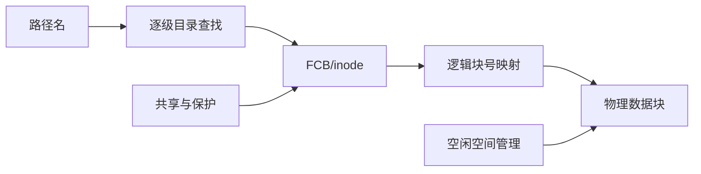

# 第4章 文件管理

> [!cite] 教材定位
> 原书：[[408/90-复习资料/01-核心教材/2026操作系统_带书签.pdf#page=264|第4章 文件管理（PDF 第 264 页）]]；本章范围为 PDF 第 264–317 页。

## 本章定位

本章连接用户看到的文件名与磁盘上的数据块。综合题的主线是：**路径逐级查目录→找到 FCB/inode→由逻辑块号查物理块号→读写数据块→更新元数据与空闲空间**。

## 章节导航

1. 文件概念、操作与逻辑结构
2. 连续、链接、索引等物理结构
3. 目录、FCB/inode、共享与保护
4. 文件系统层次、磁盘布局、空闲空间与挂载

## 考点地图

| 模块 | 关键条件 | 高频计算 |
|---|---|---|
| 逻辑结构 | 定长/变长、顺序/索引 | 记录地址、平均查找 |
| 物理结构 | 块大小、指针大小、索引级数 | 最大文件、给定偏移映射 |
| 目录 | 目录项是否已缓存、目录如何实现 | 访盘次数、最大文件数 |
| 空闲空间 | 盘块编号起点、位序约定 | 位示图行列、表大小 |
| 共享保护 | 链接对象、引用计数、权限主体 | 删除语义、访问判断 |

> [!important] 408 必考
> 混合索引题先把字节偏移转换成**文件逻辑块号**，再判断落入直接、一级、二级或三级索引范围；最后按“索引块是否已在内存”计访盘次数。

## 核心知识框架

## 完整知识点

### 1. 文件概念、属性与操作

文件是存放在外存中、由 OS 管理的具有符号名的信息集合；外存可以是磁盘、固态存储或其他可持久保存信息的设备，并不限于硬盘。属性包括名称、标识符、类型、位置、大小、所有者、保护权限与时间信息。

基本操作：创建（分配 FCB 与空间）、删除（回收空间和目录项）、打开（把磁盘 FCB 关键部分装入打开文件表并返回描述符）、关闭、读、写、定位、截断与属性管理。`open` 后的读写通过文件描述符查内存打开文件表，无需每次重新按路径查目录。

系统可维护系统级打开文件表和进程级打开文件表。前者保存文件位置、打开计数等共享信息；后者保存当前偏移、访问模式及指向系统表项的指针。不同打开实例可以有独立偏移。

### 2. 文件逻辑结构

- 无结构/流式文件：字节流，OS 不解释记录语义。
- 顺序文件：记录顺序存放，适合批量处理；定长记录可直接计算位置，变长记录通常需顺序扫描或索引。
- 索引文件：为关键字建立索引项，支持随机检索但有索引开销。
- 索引顺序文件：记录分组有序，每组建索引，先查索引再在组内顺序查找。
- 直接/散列文件：由关键字散列到位置，需处理冲突。

定长记录从 0 编号时，第 $i$ 条记录地址为 `首地址 + i×记录长`；若从 1 编号则用 $(i-1)$，必须看题设。

### 3. 文件物理结构

| 结构 | 随机访问 | 扩展 | 碎片/开销 |
|---|---|---|---|
| 连续分配 | 快，`start+i` | 困难 | 外部碎片，需预知长度 |
| 隐式链接 | 慢，须沿链 | 容易 | 无外部碎片，块内指针占空间且可靠性差 |
| FAT 显式链接 | FAT 在内存时较快 | 容易 | FAT 占内存，链损坏影响后续块 |
| 索引分配 | 支持随机 | 灵活 | 索引块占空间，小文件利用率可能低 |

连续分配的文件第 $i$ 个逻辑块映射为 `起始块号+i`。隐式链接的数据块含下一块指针；显式链接把指针集中到 FAT，FAT 每个磁盘块对应一个表项。

索引分配可用链接索引、多级索引和混合索引。若块大小 $B$、指针大小 $p$，一个索引块能放：

$$
K=\left\lfloor\frac{B}{p}\right\rfloor
$$

取下整是因为索引块只能存放完整指针；若 $B$ 不是 $p$ 的整数倍，余下字节不能再容纳一个地址项。常见题目会给出整除条件，此时可直接写 $K=B/p$。

若 inode 有 $d$ 个直接地址、$s_1$ 个一级、$s_2$ 个二级、$s_3$ 个三级地址项，最大数据块数：

$$
N=d+s_1K+s_2K^2+s_3K^3
$$

最大文件长度为 $N\times B$。此式只计算数据块容量，不把索引块算入文件内容长度。

#### 给定偏移的混合索引定位

1. 计算逻辑块号 $l=\lfloor offset/B\rfloor$，块内偏移 $r=offset\bmod B$。以下下标均从 0 开始，且允许 $s_1,s_2,s_3>1$。
2. 若 $l<d$，使用第 $l$ 个直接地址项。
3. 否则令 $q=l-d$。若 $q<s_1K$，选择第 $e_1=\lfloor q/K\rfloor$ 个一级间接地址项，并访问该索引块内第 $i_1=q\bmod K$ 个数据块指针。
4. 若不在一级范围，令 $q=q-s_1K$。若 $q<s_2K^2$，选择第 $e_2=\lfloor q/K^2\rfloor$ 个二级间接地址项；再令 $u=q\bmod K^2$，两级索引块下标依次为 $i_1=\lfloor u/K\rfloor$、$i_2=u\bmod K$。
5. 若不在二级范围，令 $q=q-s_2K^2$。若 $q<s_3K^3$，选择第 $e_3=\lfloor q/K^3\rfloor$ 个三级间接地址项；再令 $u=q\bmod K^3$，三级索引块下标依次为 $i_1=\lfloor u/K^2\rfloor$、$i_2=\lfloor(u\bmod K^2)/K\rfloor$、$i_3=u\bmod K$。
6. 若减去上述覆盖范围后仍不命中，则偏移超过该索引结构所支持的最大文件长度。命中后再根据 inode、各级索引块和数据块是否已缓存，分别计算访盘次数。

### 4. FCB、inode 与目录项

FCB 保存文件基本信息、存取控制和物理位置，是文件存在的管理数据结构。把文件名与其余元数据分离后，目录项只保留文件名与 inode 编号，inode 保存属性和块索引，可缩短目录项、减少查目录时读入的数据块数。

目录操作包括查找、创建、删除、显示、修改、遍历。目录结构：

- 单级目录：简单但重名冲突，不便共享。
- 两级目录：每用户独立目录，解决不同用户重名。
- 树形目录：支持绝对/相对路径与工作目录，是常用结构。
- 无环图目录：允许共享文件/子目录，但必须维护引用并防止成环。

目录可用线性表实现，插入简单、查找慢；散列表查找快但需冲突处理。路径查找每一级通常要读相应目录文件，已缓存目录块、inode 或当前工作目录可减少访盘。

### 5. 文件共享

**硬链接**：多个目录项指向同一 inode，inode 引用计数增加。删除一个名字只减计数，计数为 0 且无打开引用时才能回收文件。硬链接不能跨文件系统，通常限制对目录创建以避免环。

**符号链接/软链接**：新建一个内容为目标路径的特殊文件。可跨文件系统并可链接目录，但目标删除后链接悬空；访问需额外解析路径和读取链接文件。

基于索引节点共享时，共享者不能复制一份可独立修改的物理地址清单，否则扩展时会不一致；应共同指向唯一 inode。

### 6. 文件保护

保护目标是控制谁能执行读、写、执行、追加、删除、列目录等操作。

- 口令与加密保护内容，但口令管理或密钥成本高。
- 访问控制矩阵以主体为行、对象为列；访问控制表 ACL 按对象列出主体权限；能力表按主体列出可访问对象及权限。
- Unix 风格权限按所有者、组、其他用户设置读写执行位。目录的读权限通常表示列出，写表示修改目录项，执行表示穿越/查找。

保护不同于文件系统一致性和备份：权限防未授权访问，备份/日志用于故障恢复。

### 7. 文件系统层次与 VFS

典型层次：用户与系统调用接口 → 逻辑文件系统（目录、权限、FCB）→ 文件组织模块（逻辑块到物理块）→ 基本文件系统（块 I/O）→ I/O 控制（驱动、中断）→ 设备。

VFS 为多种具体文件系统提供统一接口与对象模型。常见抽象对象包括超级块、inode、目录项和打开文件对象。

### 8. 文件系统布局

磁盘上常见：引导块、超级块/卷控制块、空闲空间结构、inode/FCB 区、目录与数据区。超级块记录块大小、总块数、空闲信息和根目录位置等关键元数据，常有备份。

内存中维护挂载表、目录/名称缓存、活动 inode、系统和进程打开文件表、页缓存/缓冲区。文件系统先经格式化建立元数据结构，再挂载到目录树的挂载点；挂载点原内容在挂载期间通常被遮蔽。

### 9. 文件存储空间管理

- 空闲表法：记录连续空闲区起始块和长度，适合连续分配。
- 空闲链表法：把空闲盘块或空闲区链接，分配简单，随机获取多个块效率较低。
- 位示图法：每块对应一位，容易寻找连续空闲块并统计，但需约定 0/1 含义。
- 成组链接法：把多个空闲块号存入一组，最后一项指向下一组，兼顾批量分配和较少内存占用。

位示图若每行 $w$ 位、盘块号 $b$ 从 0 开始：

$$
row=\left\lfloor\frac{b}{w}\right\rfloor,\qquad col=b\bmod w
$$

反推 $b=row\times w+col$。若题目行列或块号从 1 开始，先统一为 0 基再换回。管理 $n$ 个盘块至少需 $n$ 位，即 $\lceil n/8\rceil$ 字节。

### 10. 一致性、日志与布局优化

元数据与数据的写入可能因断电只完成一部分。文件系统检查工具通过扫描修复不一致；日志文件系统先记录预期元数据更新再提交，便于崩溃恢复。将相关 inode、目录和数据块邻近放置，可减少机械磁盘寻道。

> [!note] 理解补充
> “打开文件后不再查目录”不代表后续一定不访盘：数据块、间接索引块或 inode 若不在缓存仍可能访盘；文件扩展还会更新元数据和空闲空间结构。

> [!info] 技术更新
> Linux VFS 的官方文档将 inode、dentry、file、superblock 等作为核心对象；现代文件系统普遍结合页缓存、日志或写时复制。408 计算仍以题设的 FCB/inode、块索引和缓存条件为准。

## 典型题型与方法

### 题型一：最大文件长度

先算每索引块指针数 $K$，再分别列直接、一级、二级、三级覆盖的数据块数；求和后乘块大小。若问文件的实际存储占用，默认计算文件实际使用的数据块与为这些数据块实际分配的各级索引块，并按块取整。只有题目明确要求计入 inode/FCB 等元数据，且给出其存放方式或占用大小时，才把相应元数据计入；不能默认一个 inode 独占一个磁盘块。

### 题型二：访问某字节的访盘次数

把字节偏移转为逻辑块号和块内偏移，确定索引层级。分别判断目录、inode、各级索引块和数据块是否已在内存。写操作若分配新块，还要访问/更新空闲空间结构；不要默认所有元数据都缓存。

### 题型三：目录访盘

从根或当前目录逐级解析。每一级先查目录块获得下一 inode 编号，再读下一 inode；题目常给“inode 已在内存”“目录项定长”“一个块可容纳多少项”，需据此精确计数。

### 题型四：位示图与 FAT

统一编号基准后用除法、取模定位。FAT 大小 = 磁盘块数 × 每表项大小；若表项只给位数，存储时还要按题意考虑是否紧凑位存储或按字节对齐。

## 完整例题与逐步解答

### 例 1：混合索引的最大文件长度

磁盘块大小为 4 KiB，块地址 4 B。inode 含 10 个直接地址、1 个一级间接、1 个二级间接和 1 个三级间接地址。忽略其他上限，求最大文件内容长度。

> [!success]- 展开完整答案
> 一个索引块可存放的块地址数为
>
> $$
> K=\frac{4\text{ KiB}}{4\text{ B}}
> =\frac{4096}{4}=1024.
> $$
>
> 各类指针能覆盖的数据块数为：
>
> - 直接：$10$；
> - 一级间接：$1024$；
> - 二级间接：$1024^2$；
> - 三级间接：$1024^3$。
>
> 因而最大**文件内容**长度为
>
> $$
> \boxed{
> L_{max}=(10+1024+1024^2+1024^3)\times4\text{ KiB}
> }.
> $$
>
> 该式不把索引块本身算进文件内容。若题目问实际磁盘占用，则还要根据文件实际长度计算真正分配了多少个一级、二级、三级索引块；不能把所有理论索引块都默认已分配。

### 例 2：二级索引的下标

沿用上题结构，文件逻辑块从 0 编号。逻辑块号 1500 由哪类索引定位？若进入二级间接，两个下标是多少？

> [!success]- 展开完整答案
> 前 10 个逻辑块由直接地址覆盖，接下来的 1024 个逻辑块由一级间接覆盖，即块号 $10\sim1033$。
>
> 对块号 1500，先扣除这些范围：
>
> $$
> q=1500-10-1024=466.
> $$
>
> 因为 $q<1024^2$，它位于二级间接区域。外层和内层下标分别为
>
> $$
> i=\left\lfloor\frac{466}{1024}\right\rfloor=0,\qquad
> j=466\bmod1024=466.
> $$
>
> 所以路径为“二级间接入口 → 第 0 个一级索引块地址 → 该索引块第 466 个数据块地址”。若文件块从 1 编号，必须先转换为从 0 开始的相对编号再做除法和取模。

### 例 3：硬链接与符号链接的删除语义

文件 inode 号为 100，目录中 `a` 与 `b` 都是它的硬链接；`s` 是内容为路径 `a` 的符号链接。依次删除 `a`、访问 `b`、访问 `s`，会发生什么？

> [!success]- 展开完整答案
> `a` 和 `b` 的目录项都直接指向 inode 100。删除 `a` 只删除一个目录项并将 inode 的硬链接计数减 1，inode 和数据仍由 `b` 引用，所以访问 `b` 正常。
>
> `s` 自己是另一个 inode，其文件内容保存路径字符串 `a`。解析 `s` 时系统继续按路径寻找 `a`；由于 `a` 已删除，`s` 成为悬空符号链接，访问失败。
>
> 删除 `s` 只删除符号链接自身，不影响 inode 100。只有 inode 100 的硬链接计数降为 0 且没有打开文件引用时，文件数据才具备真正回收条件。

## 做题识别顺序

1. 最大文件题先算每索引块指针数 $K=B/p$，再列直接、一级、二级、三级覆盖块数。
2. 给定字节偏移先除块大小，得到逻辑块号和块内偏移，再判断索引层级。
3. 访盘次数逐项列目录块、inode、各级索引块、数据块，题目说已缓存才删除对应访盘。
4. 目录与链接题把“文件名/目录项、inode、打开文件对象”分开画引用关系。
5. 位图题先统一编号从 0 还是 1 开始，再做整除和取模。

## 一页记忆

$$
\boxed{
K=\frac{\text{索引块大小}}{\text{指针大小}},\qquad
L_{max}=(d+K+K^2+K^3)B
}
$$

- 连续分配随机访问快但有外部碎片；链接分配便于增长；索引分配兼顾随机访问与动态增长。
- 目录项保存文件名及定位 inode 的信息，inode 保存元数据和数据块地址，通常不保存文件名。
- 文件描述符是进程表下标，指向系统打开文件对象；打开文件对象再关联 inode，并保存当前偏移等运行状态。
- 硬链接共享 inode，通常不能跨文件系统；符号链接保存路径，可跨文件系统但可能悬空。

## 易错点

- 逻辑结构面向用户，物理结构描述磁盘块组织，不能混用。
- 连续分配支持顺序和随机访问；隐式链接通常只便于顺序访问。
- 文件最后一块的块内碎片不是动态分区的外部碎片。
- 最大文件内容长度不包含索引块；默认的实际存储占用包含实际数据块和实际分配的索引块，inode/FCB 是否计入取决于题目是否明确要求并给出存放方式。
- 字节偏移和逻辑块号的编号起点必须确认。
- inode 不保存文件名；文件名在目录项中。
- 硬链接共享 inode，软链接保存路径；删除语义不同。
- `open` 返回描述符，后续偏移通常在打开文件表而非磁盘 inode 中维护。
- 位示图 0/1 的空闲含义由题设决定，不能凭习惯。
- 挂载不是把文件复制进目录，而是把新文件系统接到命名空间。

## 跨章节/跨科联系

- [[第3章-内存管理]]：内存映射文件与页缓存会改变 `read` 的访盘路径。
- [[第5章-输入输出管理]]：逻辑块请求最终交给设备驱动和磁盘调度。
- 数据结构：树用于目录，散列表用于目录缓存，位图用于空间管理，B/B+ 树常用于索引。
- 计算机网络：远程文件系统仍提供文件抽象，但一致性与故障模型更复杂。

## 本章复习清单

- [ ] 能区分逻辑结构与四类物理分配方式。
- [ ] 能计算混合索引最大文件长度与给定偏移的索引路径。
- [ ] 能解释 FCB、inode、目录项和打开文件表的分工。
- [ ] 能逐级计算路径查找访盘次数。
- [ ] 能比较硬链接和符号链接的删除、跨文件系统与开销。
- [ ] 能完成位示图、FAT 与实际块占用计算。
- [ ] 能口述磁盘/内存中的文件系统布局与挂载过程。

## 自测问题

1. 为什么把文件名从 FCB 分离能加快目录查找？
2. 混合索引中二级索引的两个下标如何由逻辑块号得到？
3. 打开文件后访问数据还可能发生哪些访盘？
4. 删除一个硬链接和删除符号链接分别影响什么对象？
5. 位示图编号从 1 开始时如何避免行列换算错误？
6. 文件系统的逻辑文件层与基本文件层分别负责什么？
7. 日志为什么能帮助恢复，却不能替代备份？

> [!question]- 自测问题参考答案
> 1. 目录只保留文件名和 inode 编号后，单个目录项更短，一个磁盘块能放更多项，顺序查找需要读取的目录块更少。
> 2. 先扣除直接和一级间接覆盖范围，得到二级区域内相对块号 $q$；外层下标为 $\lfloor q/K\rfloor$，内层下标为 $q\bmod K$。
> 3. 可能读取目录块、inode、各级索引块和数据块；写入新数据还可能分配数据/索引块并更新位图、inode 和日志。实际次数取决于哪些对象已在缓存。
> 4. 删除硬链接会删除目录项并减少共享 inode 的链接计数；删除符号链接只回收符号链接自己的 inode/数据，不影响其目标。
> 5. 若题号从 1 开始，先令零基编号 $n'=n-1$，再用 $n'/\text{每行位数}$ 与 $n'\bmod\text{每行位数}$ 定位，最后按题意把行列转回 1 基。
> 6. 逻辑文件层处理文件名、目录、保护和打开/关闭等抽象；基本文件层把逻辑块请求转换为具体块操作，并与缓冲和设备层衔接。
> 7. 日志记录未完成更新，可在崩溃后重做或撤销以恢复一致性；它不保存任意历史版本，也无法替代备份应对误删、介质损坏或整盘丢失。

## 资料依据

- 《2026 操作系统考研复习指导》第 4 章，第 264～317 页：文件系统基础、目录与文件系统；扫描页按书签定位并以定向 OCR 辅助核对。
- [Linux 内核 VFS 官方文档](https://www.kernel.org/doc/html/latest/filesystems/vfs.html)用于核验 dentry、inode、file 与 superblock 的现代对象关系，仅列作技术更新。

## 前后章节导航

上一章：[[第3章-内存管理]] · 目录：[[操作系统目录]] · 下一章：[[第5章-输入输出管理]]
