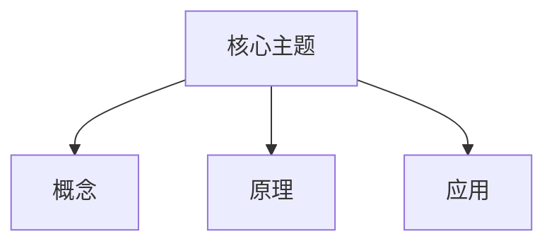

# {{title}}

> [!cite] 教材定位
> 原书：[[408/90-复习资料/01-核心教材/00-核心教材页码索引|核心教材页码索引]]。新建章节时填写准确 PDF 起止页。

> [!abstract] 本章定位
> 写明章节作用、前置知识、预计分值倾向和复习优先级。

## 章节导航

`{{科目目录}}` · 上一章 · 下一章

## 考纲与考点地图

| 考点 | 掌握层次 | 常见题型 | 个人状态 |
|---|---|---|---|
| 核心考点 | 理解并应用 | 选择/综合 | ⬜ |

## 核心知识框架

## 核心知识点

> [!important] 408 必考
> 写出结论、前提、边界和考试作答口径。

> [!note] 理解补充
> 解释原理和知识联系。

> [!info] 技术更新
> 标明现实技术变化及其与考试口径的差异。

## 典型题型与解题方法

1. 识别题型和已知条件。
2. 写出适用公式、算法或状态关系。
3. 保留单位、位宽、下标或边界条件。
4. 检查结果是否满足题意和数量级。

## 完整例题与逐步解答

### 例题 1：从题意到验算

写出题目、识别信号、第一步理由、完整过程、复杂度或单位检查。

> [!success]- 完整答案
>
> 每一行都要保留引用前缀，公式和代码块也必须位于 callout 内部。

## 做题识别顺序

1. 题目对象属于哪一章、哪一层或哪类结构？
2. 已知条件触发哪条母公式、算法不变量或协议状态？
3. 哪些边界、单位、位宽和先后次序必须显式保留？
4. 用什么反例或数量级检查最终结论？

## 一页记忆版

- 主链：
- 母公式/核心不变量：
- 高频易错：
- 综合题启动动作：

## 易错点

> [!warning] 易错点
> 记录容易混淆的概念、遗漏条件和典型反例。

## 跨章节与跨科联系

- 本科目关联：`{{科目目录}}`
- 跨科关联：[[跨科关联索引]]

## 本章复习清单

- [ ] 能闭卷画出知识框架。
- [ ] 能解释核心结论的适用条件。
- [ ] 能独立完成典型计算或算法过程。
- [ ] 已整理错题并安排间隔复习。

## 自测问题

1. 本章最核心的三个概念是什么？
2. 哪些结论有容易忽略的前提？
3. 如何把本章知识用于一道综合题？

> [!success]- 自测完整答案
>
> 逐题回答并给出理由；不能只列结论。

## 资料依据

- 本地 2026 王道教材对应章节、书签页码与定向 OCR。
- [[资料来源与版本说明]]。

## 前后章节导航

上一章 · `{{科目目录}}` · 下一章
