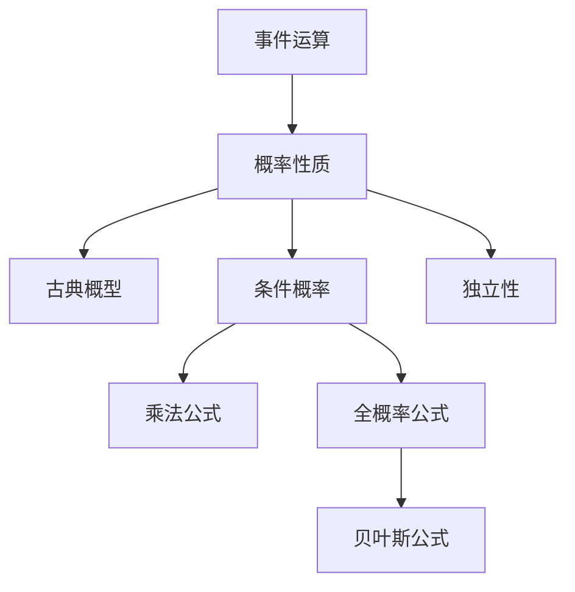

# 第 1 讲 随机事件与概率

原书范围：[[数学一/01-基础讲义/27张宇基础30讲概率.pdf#page=10|PDF 第 10 页]]至[[数学一/01-基础讲义/27张宇基础30讲概率.pdf#page=41|第 41 页]]。

## 核心地图



## 零基础准备：随机试验、样本点与事件

### 什么叫随机试验

一次试验如果同时满足以下特点，就可看成随机试验：

1. 可以在相同条件下重复；
2. 所有可能结果事先可以明确；
3. 每次究竟出现哪个结果，试验前不能确定。

例如抛一枚硬币、掷一枚骰子、从一批产品中随机抽一件，都是随机试验。

### 样本空间

随机试验所有可能结果组成的集合叫样本空间，记作 $\Omega$。

抛一枚硬币：

$$
\Omega=\{\text{正面},\text{反面}\}.
$$

掷一枚骰子：

$$
\Omega=\{1,2,3,4,5,6\}.
$$

连续掷两次骰子时，一个样本点必须同时记录两次结果：

$$
\Omega=\{(i,j):i,j\in\{1,2,\ldots,6\}\}.
$$

这里 $(1,2)$ 与 $(2,1)$ 是不同样本点，因为发生顺序不同。

### 事件

事件是样本空间的子集。例如掷骰子时，

$$
A=\{\text{出现偶数}\}=\{2,4,6\}.
$$

- 必然事件是 $\Omega$，概率为 1；
- 不可能事件是空集 $\varnothing$，概率为 0；
- 单个具体结果组成的事件称为基本事件。

概率不是直接赋给一句中文，而是赋给这句话所对应的结果集合。

## 本讲公式主链

$$
\boxed{
\text{事件集合}
\longrightarrow
P(A)
\longrightarrow
P(A\mid B)
\longrightarrow
\begin{cases}
\text{乘法公式},\\
\text{全概率公式},\\
\text{贝叶斯公式}
\end{cases}
\longrightarrow
\text{独立性}
}.
$$

## 先用一句话理解本讲

这一讲做的事情，是把日常语言中的“不确定”翻译成可以运算的事件。

例如“抽到的产品至少有一件次品”，不能直接按感觉算。先设

$$
A_i=\{\text{第 }i\text{ 件是次品}\},
$$

那么“至少一件次品”就是 $A_1\cup A_2\cup\cdots$，它的补集是“全部合格”。概率计算的难点，往往不是最后的加减乘除，而是**第一步有没有把中文翻译正确**。

> [!tip] 初学者先问三个问题
> 1. 一次试验的全部可能结果是什么？
> 2. 题目关心的结果集合是什么？
> 3. 题目给出的信息，是在改变概率，还是在缩小样本空间？

## 为什么事件要用集合运算

一次随机试验的每个具体结果是一个“点”，事件则是一批满足条件的点。于是：

- “同时满足两个条件”就是交集；
- “满足至少一个条件”就是并集；
- “不满足条件”就是补集。

这能消除自然语言的歧义：

$$
\text{至少一个}=A\cup B,
$$

$$
\text{恰有一个}=A\bar B\cup\bar AB,
$$

$$
\text{不都发生}=\overline{AB}=\bar A\cup\bar B.
$$

“不都发生”只是排除“两者都发生”，并不等于“两者都不发生”。

## 1. 事件语言

样本空间 $\Omega$ 是所有可能结果的集合，事件是 $\Omega$ 的子集。

| 文字 | 集合表达 | 说明 |
|---|---|---|
| $A$ 与 $B$ 同时发生 | $AB=A\cap B$ | 交事件 |
| 至少一个发生 | $A\cup B$ | 并事件 |
| $A$ 不发生 | $\bar A$ | 对立事件 |
| 只发生 $A$ | $A\bar B$ | 差事件 |
| 恰有一个发生 | $A\bar B\cup\bar AB$ | 对称差 |
| 至少一个不发生 | $\overline{AB}=\bar A\cup\bar B$ | 德摩根律 |

> [!tip] “至少”优先看补集
> “至少一个成功”的补集是“全部失败”；“至少两次成功”的补集是“0 次或 1 次成功”。补集常把多项并事件变成一个乘积。

## 2. 概率的必会性质

$$
P(\Omega)=1,\qquad P(A)\ge 0,
$$

若 $A_i$ 两两互斥，则

$$
P\!\left(\bigcup_i A_i\right)=\sum_iP(A_i).
$$

常用推论：

$$
P(\bar A)=1-P(A),
$$

$$
P(A\cup B)=P(A)+P(B)-P(AB),
$$

$$
P(A-B)=P(A)-P(AB).
$$

三个事件的容斥：

$$
P(A\cup B\cup C)=\sum P(A)-\sum P(AB)+P(ABC).
$$

## 3. 古典概型

当基本结果有限且等可能时，

$$
P(A)=\frac{|A|}{|\Omega|}.
$$

关键不是背排列组合，而是先判断：是否放回、是否计序、是否允许重复。

### 例 1：补集与组合计数

盒中有 5 个红球、3 个白球，不放回任取 3 个。求至少取到 1 个白球的概率。

**解：**直接分类为 1、2、3 个白球较繁，取补集“全是红球”：

$$
P(\text{至少1白})
=1-P(\text{全红})
=1-\frac{\binom53}{\binom83}
=1-\frac{10}{56}
=\frac{23}{28}.
$$

检查：分母是从 8 个不同球中无序选 3 个；不放回，所以不是二项分布。

## 4. 条件概率与乘法公式

当 $P(B)>0$ 时，

$$
P(A\mid B)=\frac{P(AB)}{P(B)}.
$$

因此

$$
P(AB)=P(B)P(A\mid B)=P(A)P(B\mid A).
$$

连续使用可得：

$$
P(A_1A_2\cdots A_n)
=P(A_1)P(A_2\mid A_1)\cdots
P(A_n\mid A_1\cdots A_{n-1}).
$$

> [!warning] 条件概率不是除法技巧
> 条件 $B$ 发生后，样本空间缩小成 $B$；分子 $AB$ 是缩小后仍满足 $A$ 的部分。

### 条件概率为什么要除以 $P(B)$

已知 $B$ 发生，相当于把 $B$ 外面的结果全部删掉，只在 $B$ 内重新比较。$B$ 原来的总概率是 $P(B)$，为了让缩小后的样本空间总概率重新变为 1，需要把 $B$ 内的概率都除以 $P(B)$。

所以

$$
P(A\mid B)=\frac{P(AB)}{P(B)},
$$

可以读成：“在 $B$ 这群结果中，同时属于 $A$ 的比例是多少？”

一个班有 40 人，其中 24 人学过编程，学过编程的人中有 18 人通过考试。已知随机选中的人学过编程后，分母不再是全班 40 人，而是 24 人：

$$
P(\text{通过}\mid\text{学过编程})
=\frac{18/40}{24/40}=\frac{18}{24}=\frac34.
$$

### 例 2：不放回抽样的条件链

袋中 4 个合格品、2 个次品，不放回连续抽 2 个。求第二个为次品的概率。

**解法一：全概率。**按第一次结果分层：

$$
\begin{aligned}
P(D_2)
&=P(G_1)P(D_2\mid G_1)+P(D_1)P(D_2\mid D_1)\\
&=\frac46\cdot\frac25+\frac26\cdot\frac15
=\frac13.
\end{aligned}
$$

**解法二：对称性。**随机排列 6 个产品，每个位置出现次品的概率都为 $2/6=1/3$。

## 5. 全概率公式与贝叶斯公式

若 $B_1,\ldots,B_n$ 两两互斥、并为 $\Omega$，且 $P(B_i)>0$，则

$$
P(A)=\sum_{i=1}^nP(B_i)P(A\mid B_i).
$$

反推原因时：

$$
P(B_k\mid A)
=\frac{P(B_k)P(A\mid B_k)}
{\sum_iP(B_i)P(A\mid B_i)}.
$$

全概率是“原因 $\to$ 结果”，贝叶斯是“看到结果 $\to$ 更新原因概率”。

### 用一棵树理解全概率与贝叶斯

把可能原因画在第一层，把结果画在第二层：

```mermaid
flowchart LR
  O[开始] -->|P(B1)| B1[原因 B1]
  O -->|P(B2)| B2[原因 B2]
  B1 -->|P(A\mid B1)| A1[结果 A]
  B2 -->|P(A\mid B2)| A2[结果 A]
```

沿一条路径相乘，得到“这个原因并且出现这个结果”的概率：

$$
P(B_iA)=P(B_i)P(A\mid B_i).
$$

把所有通向 $A$ 的路径相加，就是全概率。已看到 $A$ 后，某条路径在全部 $A$ 路径中所占的比例，就是贝叶斯后验概率。

> [!note] 三个词的含义
> - $P(B_i)$：观察结果前对原因的认识，叫先验；
> - $P(A\mid B_i)$：在该原因下看到结果的可能性，常称似然；
> - $P(B_i\mid A)$：观察结果后更新的原因概率，叫后验。

### 例 3：筛查结果的贝叶斯更新

某批产品来自甲厂的比例为 $0.9$，来自乙厂的比例为 $0.1$。甲厂产品通过检测的概率为 $0.98$，乙厂为 $0.05$。随机抽一件，已知它通过检测，求来自甲厂的概率。

设 $A=$“来自甲厂”，$T=$“通过”。先求证据概率：

$$
P(T)=0.9\times0.98+0.1\times0.05=0.887.
$$

于是

$$
P(A\mid T)=\frac{0.9\times0.98}{0.887}
=\frac{0.882}{0.887}\approx0.9944.
$$

> [!note] 解释
> $0.98$ 是 $P(T\mid A)$，而题目问 $P(A\mid T)$；两者不能交换。先验比例 $0.9$ 对后验有决定作用。

## 6. 独立性

事件 $A,B$ 独立等价于

$$
P(AB)=P(A)P(B).
$$

若 $P(B)>0$，也等价于 $P(A\mid B)=P(A)$。独立表示知道 $B$ 是否发生，不改变 $A$ 的概率。

- $A,B$ 独立，则 $A,\bar B$、$\bar A,B$、$\bar A,\bar B$ 也独立。
- **互斥不等于独立。**若非零概率事件互斥，则 $P(AB)=0$，却有 $P(A)P(B)>0$，所以不独立。
- 多个事件“两两独立”不能自动推出“相互独立”。

### 独立与互斥为什么几乎相反

互斥表示 $A$ 一发生，$B$ 就绝不可能发生；独立表示知道 $A$ 是否发生，对 $B$ 的概率没有影响。

若 $P(A),P(B)>0$ 且二者互斥，则

$$
P(B\mid A)=0\ne P(B),
$$

所以必不独立。互斥是“强烈影响”，独立是“毫无影响”。

### 两两独立为什么不等于相互独立

抛两次公平硬币，令 $A=$第一次为正面，$B=$第二次为正面，$C=$两次结果相同。可以验证任意两个事件都独立，但一旦知道 $A,B$ 同时发生，就必然知道 $C$ 发生。因此相互独立还要检查三重、四重等所有交集的乘法关系。

### 例 4：重复试验与至少一次成功

每次试验成功概率为 $p$，各次独立。进行 $n$ 次，至少成功一次的概率为

$$
1-P(\text{全部失败})=1-(1-p)^n.
$$

若要求该概率不低于 $0.95$，则

$$
1-(1-p)^n\ge0.95
\iff n\ln(1-p)\le\ln0.05.
$$

因为 $\ln(1-p)<0$，除过去时不等号要反向：

$$
n\ge\frac{\ln0.05}{\ln(1-p)}.
$$

最后取满足条件的最小整数。

## 综合例题：从中文翻译到结果检查

某设备由两个独立模块组成。甲正常的概率为 $0.9$，乙正常的概率为 $0.8$。设备在“至少一个模块正常”时可以运行。已知设备正在运行，求两个模块都正常的概率。

设 $A=$甲正常，$B=$乙正常。题目目标是

$$
P(AB\mid A\cup B).
$$

独立性给出

$$
P(AB)=0.9\times0.8=0.72.
$$

运行概率用补集计算：

$$
P(A\cup B)=1-P(\bar A\bar B)
=1-0.1\times0.2=0.98.
$$

由于 $AB\subseteq A\cup B$：

$$
P(AB\mid A\cup B)
=\frac{0.72}{0.98}=\frac{36}{49}\approx0.735.
$$

答案略大于无条件概率 $0.72$，这是合理的：已知设备能运行，已经排除了“两模块都坏”的情况。

## 事件运算的两条德摩根律

$$
\boxed{
\overline{A\cup B}=\bar A\cap\bar B
}
$$

它表示“$A,B$ 至少一个发生”的反面是“$A,B$ 都不发生”。

$$
\boxed{
\overline{A\cap B}=\bar A\cup\bar B
}
$$

它表示“$A,B$ 同时发生”的反面是“至少一个不发生”。

这两条规律是“至少一个”用补集计算的基础。

### 常见中文的精确翻译

| 中文 | 事件表达 |
|---|---|
| $A,B$ 都发生 | $AB$ |
| $A,B$ 至少一个发生 | $A\cup B$ |
| $A,B$ 恰有一个发生 | $A\bar B\cup\bar AB$ |
| $A$ 发生而 $B$ 不发生 | $A\bar B$ |
| $A,B$ 都不发生 | $\bar A\bar B$ |
| $A,B$ 不都发生 | $\overline{AB}=\bar A\cup\bar B$ |
| $A,B$ 至少一个不发生 | $\bar A\cup\bar B$ |

“不都发生”允许两者都不发生，也允许只发生一个；它不是“都不发生”。

## 加法公式为什么要减交集

把 $P(A)$ 与 $P(B)$ 相加时，交集 $AB$ 中的结果被计算了两次，所以要减回一次：

$$
\boxed{
P(A\cup B)=P(A)+P(B)-P(AB)
}.
$$

若 $A,B$ 互斥，则 $AB=\varnothing$，所以公式退化为

$$
P(A\cup B)=P(A)+P(B).
$$

三个事件时，要先减去两两交集，但三重交集被“加三次、减三次”，最后一次也没留下，所以还要加回：

$$
\boxed{
\begin{aligned}
P(A\cup B\cup C)
={}&P(A)+P(B)+P(C)\\
&-P(AB)-P(AC)-P(BC)\\
&+P(ABC).
\end{aligned}
}
$$

## 古典概型的计数工具

### 排列：顺序不同算不同结果

从 $n$ 个不同对象中选 $r$ 个并排列：

$$
\boxed{
A_n^r=\frac{n!}{(n-r)!}
}.
$$

例如从 5 人中选正、副两名负责人，职位有区别：

$$
A_5^2=5\cdot4=20.
$$

### 组合：只关心选了谁

从 $n$ 个不同对象中无序选 $r$ 个：

$$
\boxed{
\binom nr=\frac{n!}{r!(n-r)!}
}.
$$

例如从 5 人中选 2 人组成小组：

$$
\binom52=10.
$$

### 有放回与不放回

- 有放回：每次抽取后总体恢复，各次在相同条件下进行；
- 不放回：总体组成会变化，后一次概率依赖前一次结果。

不放回不代表不能用乘法公式，而是要用条件概率：

$$
P(A_1A_2)
=P(A_1)P(A_2\mid A_1).
$$

## 多个事件相互独立的完整条件

三个事件 $A,B,C$ 相互独立，必须同时满足

$$
P(AB)=P(A)P(B),
$$

$$
P(AC)=P(A)P(C),
$$

$$
P(BC)=P(B)P(C),
$$

以及

$$
\boxed{
P(ABC)=P(A)P(B)P(C)
}.
$$

前三条只说明两两独立；最后一条还要控制三个事件共同发生。

一般地，$n$ 个事件相互独立要求任取其中 $k\ge2$ 个事件，其交集概率都等于各自概率之积。

## 全概率与贝叶斯的一张对照表

设 $B_1,\ldots,B_n$ 构成完备事件组。

| 问题方向 | 目标 | 公式 |
|---|---|---|
| 已知原因分层，求结果总概率 | $P(A)$ | $\sum_iP(B_i)P(A\mid B_i)$ |
| 已看到结果，反推某原因 | $P(B_k\mid A)$ | $\dfrac{P(B_k)P(A\mid B_k)}{\sum_iP(B_i)P(A\mid B_i)}$ |

记忆时不要只看公式形状，应先判断题目问的是“结果”还是“原因”。

## 本讲母公式

### 补集与加法

$$
\boxed{
P(\bar A)=1-P(A)
}
$$

$$
\boxed{
P(A\cup B)=P(A)+P(B)-P(AB)
}
$$

### 条件概率与乘法

$$
\boxed{
P(A\mid B)=\frac{P(AB)}{P(B)},
\qquad P(B)>0
}
$$

$$
\boxed{
P(AB)=P(B)P(A\mid B)
}
$$

### 全概率与贝叶斯

$$
\boxed{
P(A)=\sum_iP(B_i)P(A\mid B_i)
}
$$

$$
\boxed{
P(B_k\mid A)
=
\frac{P(B_k)P(A\mid B_k)}
{\sum_iP(B_i)P(A\mid B_i)}
}
$$

### 独立性

$$
\boxed{
A,B\text{ 独立}
\iff
P(AB)=P(A)P(B)
}
$$

### 重复独立试验至少一次成功

$$
\boxed{
P(\text{至少成功一次})
=1-(1-p)^n
}.
$$

## 本讲检测题与完整答案

### 检测 1：事件语言

用 $A,B$ 表示“$A,B$ 恰有一个发生”和“$A,B$ 不都发生”。

> [!success]- 完整答案
>
> 恰有一个发生分为两种互斥情况：
>
> $$
> \boxed{A\bar B\cup\bar AB}.
> $$
>
> 不都发生是“同时发生”的补集：
>
> $$
> \boxed{\overline{AB}=\bar A\cup\bar B}.
> $$
>
> 两者不同：不都发生还包含 $A,B$ 都不发生。

### 检测 2：不放回抽样

袋中有 3 个红球、2 个白球，不放回抽 2 个，求恰好抽到 1 个白球的概率。

> [!success]- 完整答案
>
> 用组合计数：
>
> $$
> P(\text{恰好1白})
> =
> \frac{\binom21\binom31}{\binom52}
> =\frac6{10}
> =\boxed{\frac35}.
> $$
>
> 也可按顺序分为“先白后红”和“先红后白”：
>
> $$
> \frac25\cdot\frac34+\frac35\cdot\frac24
> =\frac3{10}+\frac3{10}
> =\frac35.
> $$
>
> 两种方法结果一致。

### 检测 3：全概率与贝叶斯

某病患病率为 $1\%$。检测对患者呈阳性的概率为 $95\%$，对未患病者误报阳性的概率为 $5\%$。某人检测阳性，求其患病概率。

> [!success]- 完整答案
>
> 设 $D=$患病，$T=$阳性。先求阳性总概率：
>
> $$
> \begin{aligned}
> P(T)
> &=P(D)P(T\mid D)+P(\bar D)P(T\mid\bar D)\\
> &=0.01\cdot0.95+0.99\cdot0.05\\
> &=0.059.
> \end{aligned}
> $$
>
> 由贝叶斯公式：
>
> $$
> \begin{aligned}
> P(D\mid T)
> &=\frac{0.01\cdot0.95}{0.059}\\
> &=\frac{0.0095}{0.059}\\
> &\approx0.161.
> \end{aligned}
> $$
>
> 所以
>
> $$
> \boxed{P(D\mid T)\approx16.1\%}.
> $$
>
> 这说明阳性率 $95\%$ 不是“阳性后患病概率”，低患病率会显著影响后验概率。

### 检测 4：独立还是互斥

设 $P(A)=0.4,P(B)=0.5,P(AB)=0.2$。判断 $A,B$ 是否独立、是否互斥。

> [!success]- 完整答案
>
> $$
> P(A)P(B)=0.4\cdot0.5=0.2=P(AB),
> $$
>
> 所以 $A,B$ 独立。
>
> 但
>
> $$
> P(AB)=0.2\ne0,
> $$
>
> 所以它们不互斥。
>
> $$
> \boxed{A,B\text{ 独立但不互斥}}.
> $$

### 检测 5：至少一次成功

某次试验成功概率为 $0.2$，各次独立。至少做多少次，才能使至少成功一次的概率不低于 $0.9$？

> [!success]- 完整答案
>
> 要求
>
> $$
> 1-(1-0.2)^n\ge0.9,
> $$
>
> 即
>
> $$
> 0.8^n\le0.1.
> $$
>
> 取对数：
>
> $$
> n\ln0.8\le\ln0.1.
> $$
>
> 因为 $\ln0.8<0$，除法时不等号反向：
>
> $$
> n\ge\frac{\ln0.1}{\ln0.8}\approx10.32.
> $$
>
> 取最小整数：
>
> $$
> \boxed{n=11}.
> $$
>
> 验算：$1-0.8^{10}\approx0.893<0.9$，而 $1-0.8^{11}\approx0.914>0.9$。

## 一套可执行的读题流程

1. 圈出“至少、恰有、已知、来自、独立、不放回”等词。
2. 设最少数量的基本事件。
3. 先写目标，如 $P(A\mid B)$，防止条件方向写反。
4. 判断使用补集、分层、贝叶斯、独立乘法还是组合计数。
5. 检查答案是否在 $[0,1]$，变化方向是否合乎常识。

## 解题入口

| 题面信号 | 首选工具 |
|---|---|
| 至少一个、至少一次 | 补集 |
| 已知某事件发生 | 条件概率 |
| 多个来源混合产生结果 | 全概率 |
| 看到结果反推来源 | 贝叶斯 |
| 重复且相互独立 | 乘法、二项模型 |
| 有限等可能、抽取排列 | 古典概型 |

## 易错清单

- [ ] 把 $P(A\mid B)$ 写成 $P(B\mid A)$。
- [ ] 全概率分层事件没有两两互斥并覆盖全集。
- [ ] 不放回抽样误当成独立重复试验。
- [ ] 把互斥当独立。
- [ ] “至少”问题硬分类，漏项或重复计数。

返回 [[00-概率论总览]] · 下一讲 [[02-一维随机变量及其分布]]
