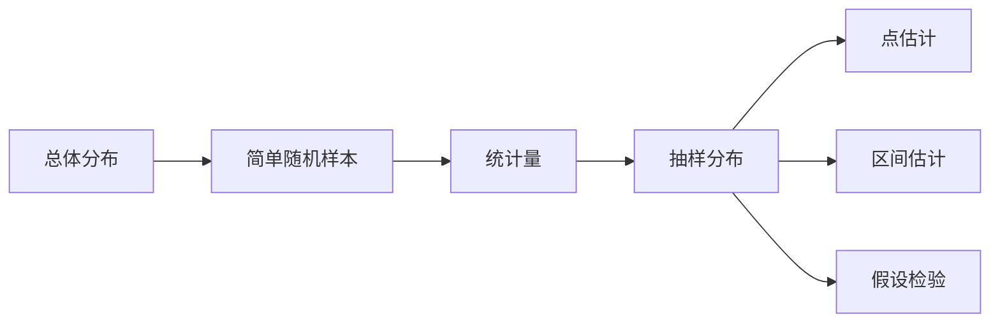

# 第 6 讲 数理统计

原书范围：[[数学一/01-基础讲义/27张宇基础30讲概率.pdf#page=142|PDF 第 142 页]]至[[数学一/01-基础讲义/27张宇基础30讲概率.pdf#page=172|第 172 页]]。

## 核心地图

统计推断的逻辑是：总体参数未知，但样本携带参数信息；用统计量提取信息，并量化误差。

## 本讲总主链

$$
\boxed{
\text{总体与未知参数}
\longrightarrow
\text{随机样本}
\longrightarrow
\text{统计量及抽样分布}
\longrightarrow
\begin{cases}
\text{点估计},\\
\text{区间估计},\\
\text{假设检验}
\end{cases}
}.
$$

数理统计题最重要的不是先套公式，而是先识别：

1. 总体分布是否给定为正态；
2. 研究均值还是方差；
3. 总体方差已知还是未知；
4. 目标是估计还是检验。

这四个问题决定应使用 $Z,t,\chi^2,F$ 中的哪一个分布。

## 先理解统计推断在做什么

概率论通常是“已知模型，向前计算结果概率”；数理统计则反过来：“只看到一小批结果，倒推背后的模型参数”。

例如工厂声称零件平均寿命为 1000 小时。我们不可能测试全部产品，只能抽样。样本均值接近 1000，可能是声明正确，也可能只是抽样波动。统计推断的任务就是把这种波动量化，而不是凭一次样本下绝对结论。

## 1. 总体、样本与统计量

来自总体分布 $F(x;\theta)$ 的简单随机样本 $X_1,\dots,X_n$ 满足：

- 相互独立；
- 每个 $X_i$ 与总体同分布。

统计量是不含未知参数的样本函数。例如：

$$
\bar X=\frac1n\sum_{i=1}^nX_i,
$$

$$
S^2=\frac1{n-1}\sum_{i=1}^n(X_i-\bar X)^2.
$$

注意：$\frac1n\sum(X_i-\mu)^2$ 含未知参数 $\mu$ 时，不是统计量。

### 为什么样本方差除以 $n-1$

样本偏差满足

$$
\sum_{i=1}^n(X_i-\bar X)=0.
$$

前 $n-1$ 个偏差确定后，最后一个偏差被迫确定，因此只有 $n-1$ 个自由变化量。更精确地说：

$$
E\left[\frac1n\sum_{i=1}^n(X_i-\bar X)^2\right]
=\frac{n-1}{n}\sigma^2,
$$

它会系统性低估总体方差。改除以 $n-1$ 后才有 $E(S^2)=\sigma^2$。

## 2. 正态总体的三大抽样分布

若 $X_1,\dots,X_n\overset{iid}{\sim}N(\mu,\sigma^2)$，则：

1. 样本均值

$$
\bar X\sim N\!\left(\mu,\frac{\sigma^2}{n}\right).
$$

2. 样本均值与样本方差相互独立。

3. 卡方统计量

$$
\frac{(n-1)S^2}{\sigma^2}\sim\chi^2(n-1).
$$

4. 当 $\sigma^2$ 未知时

$$
\frac{\bar X-\mu}{S/\sqrt n}\sim t(n-1).
$$

两个独立正态总体的方差比较会产生 $F$ 分布：

$$
\frac{S_1^2/\sigma_1^2}{S_2^2/\sigma_2^2}
\sim F(n_1-1,n_2-1).
$$

> [!tip] 自由度的直觉
> 计算 $S^2$ 时先用样本估计了 $\mu$，偏差满足 $\sum(X_i-\bar X)=0$，因此只有 $n-1$ 个自由变化方向。

### 三个分布各自从哪里来

- 标准正态 $Z$：总体方差已知，用真实 $\sigma$ 标准化样本均值；
- $t$ 分布：总体方差未知，用随机的 $S$ 代替 $\sigma$，尾部更厚；
- $\chi^2$ 分布：描述样本方差围绕总体方差的波动；
- $F$ 分布：两个独立方差估计之比。

样本量增大时，$S$ 越来越接近 $\sigma$，因此 $t(n-1)$ 也越来越接近标准正态。

### 抽样分布识别表

| 题目条件 | 统计量 | 分布 |
|---|---|---|
| 正态总体，$\sigma$ 已知 | $(\bar X-\mu)/(\sigma/\sqrt n)$ | $N(0,1)$ |
| 正态总体，$\sigma$ 未知 | $(\bar X-\mu)/(S/\sqrt n)$ | $t(n-1)$ |
| 正态总体，研究方差 | $(n-1)S^2/\sigma^2$ | $\chi^2(n-1)$ |
| 两个独立正态总体，比较方差 | 标准化方差之比 | $F$ |

### 例 1：识别统计量分布

设 $X_1,\ldots,X_{10}\overset{iid}{\sim}N(\mu,\sigma^2)$，求

$$
T=\frac{\sqrt{10}(\bar X-\mu)}{S}
$$

的分布。

这是正态总体、方差未知、用 $S$ 代替 $\sigma$ 的标准形式，所以

$$
T\sim t(9).
$$

不能写成 $N(0,1)$；只有使用真实 $\sigma$ 标准化时才精确服从标准正态。

## 3. 点估计

### 矩估计原则

用样本矩匹配总体矩。若 $E_\theta(X)=g(\theta)$，令

$$
\bar X=g(\theta)
$$

并解出 $\hat\theta$。

矩估计的直觉是“用样本的平均特征替代总体的理论特征”。如果理论均值是参数的函数 $g(\theta)$，而样本均值是我们实际观察到的对应量，就令二者相等。

### 极大似然估计（MLE）

对观测值 $x_1,\ldots,x_n$，似然函数

$$
L(\theta)=\prod_{i=1}^nf(x_i;\theta).
$$

选择使 $L(\theta)$ 最大的参数。通常对数化：

$$
\ell(\theta)=\ln L(\theta)=\sum_{i=1}^n\ln f(x_i;\theta).
$$

但若参数决定支持集，不能只求导，必须先写参数约束。

极大似然不是问“参数取某值的概率是多少”。频率学派中参数是固定未知量。它问的是：**如果参数等于某个候选值，眼前这批样本出现得有多合理？**选择使已观察样本最容易出现的候选参数。

### MLE 的完整操作流程

1. 写单个样本的概率函数或密度，并写清支持集；
2. 利用独立性相乘得到 $L(\theta)$；
3. 先把与参数有关的约束保留下来；
4. 能取对数时写 $\ell(\theta)$，把乘积变成求和；
5. 找内部驻点，也检查边界；
6. 判断取得的是最大值，而不只是导数为 0。

### 例 2：指数分布的矩估计与 MLE

设 $X_i\overset{iid}{\sim}Exp(\lambda)$，密度 $f(x)=\lambda e^{-\lambda x}$（$x>0$）。

因为 $E(X)=1/\lambda$，矩估计为

$$
\hat\lambda_{MM}=\frac1{\bar X}.
$$

似然函数

$$
L(\lambda)=\lambda^n e^{-\lambda\sum x_i},\qquad\lambda>0.
$$

$$
\ell(\lambda)=n\ln\lambda-\lambda\sum x_i,
$$

令导数为 0：

$$
\frac n\lambda-\sum x_i=0
\Longrightarrow
\hat\lambda_{MLE}=\frac n{\sum x_i}=\frac1{\bar X}.
$$

本例两种估计相同，但并非普遍如此。

### 例 3：支持集含参数的 MLE

设 $X_i\overset{iid}{\sim}U(0,\theta)$，$\theta>0$。联合似然为

$$
L(\theta)=\theta^{-n}\mathbf1\{\theta\ge X_{(n)}\},
$$

其中 $X_{(n)}=\max_iX_i$。在允许区间 $\theta\ge X_{(n)}$ 内，$\theta^{-n}$ 随 $\theta$ 递减，所以

$$
\hat\theta_{MLE}=X_{(n)}.
$$

若忽略指示条件，直接对 $-n\ln\theta$ 求导，会错误地发现“没有驻点”。真正最大值在边界。

## 4. 估计量的评价

### 无偏性

若

$$
E_\theta(\hat\theta)=\theta,
$$

则称 $\hat\theta$ 是无偏估计。

### 有效性

两个无偏估计量相比，方差较小者更有效。

### 一致性

样本量增大时，若

$$
\hat\theta_n\xrightarrow{P}\theta,
$$

则称估计量具有一致性。

### 三个标准分别回答什么

- 无偏性：长期重复抽样，估计量平均有没有对准真值？
- 有效性：都对准真值时，谁的波动更小？
- 一致性：样本量越来越大时，估计量会不会靠近真值？

无偏不保证方差小，一致也不保证小样本表现好。评价估计量时要看题目具体问哪一种性质。

### 例 4：构造 $\mu^2$ 的无偏估计

设总体均值为 $\mu$、方差为 $\sigma^2$，样本量为 $n$。因为

$$
E(\bar X^2)=D(\bar X)+[E(\bar X)]^2
=\frac{\sigma^2}{n}+\mu^2,
$$

且 $E(S^2)=\sigma^2$，所以

$$
\widehat{\mu^2}=\bar X^2-\frac{S^2}{n}
$$

满足 $E(\widehat{\mu^2})=\mu^2$。

## 5. 区间估计

置信区间来自一个分布不含未知参数的枢轴量。

### 区间公式是怎样“解出来”的

以方差已知的正态总体为例：

$$
P\left(-z_{\alpha/2}\le
\frac{\bar X-\mu}{\sigma/\sqrt n}
\le z_{\alpha/2}\right)=1-\alpha.
$$

这里随机量是 $\bar X$，参数 $\mu$ 夹在不等式中。把不等式对 $\mu$ 重新整理，就得到

$$
P\left(\bar X-z_{\alpha/2}\frac\sigma{\sqrt n}
\le\mu\le
\bar X+z_{\alpha/2}\frac\sigma{\sqrt n}\right)=1-\alpha.
$$

所以置信区间不是凭空记忆，而是从枢轴量中央概率区间反解参数。

### 正态总体均值，方差已知

置信度 $1-\alpha$：

$$
\mu\in
\left[
\bar X-z_{\alpha/2}\frac{\sigma}{\sqrt n},
\bar X+z_{\alpha/2}\frac{\sigma}{\sqrt n}
\right].
$$

### 正态总体均值，方差未知

$$
\mu\in
\left[
\bar X-t_{\alpha/2}(n-1)\frac{S}{\sqrt n},
\bar X+t_{\alpha/2}(n-1)\frac{S}{\sqrt n}
\right].
$$

> [!warning] 置信度的正确解释
> 参数在频率学派中是固定的，随机的是区间构造过程。重复抽样时，按该方法构造的区间有约 $1-\alpha$ 的比例覆盖真实参数；不能简单说“这个已经算出的区间有 95% 概率包含固定参数”。

### 例 5：未知方差下的均值区间

某正态总体抽取 $n=16$ 个样本，得到 $\bar x=50$、$s=8$。若 $t_{0.025}(15)=2.131$，则 $95\%$ 置信区间为

$$
50\pm2.131\times\frac8{4}
=50\pm4.262,
$$

即

$$
[45.738,54.262].
$$

## 6. 假设检验

基本流程：

1. 写原假设 $H_0$ 和备择假设 $H_1$；
2. 在 $H_0$ 成立时构造统计量；
3. 根据显著性水平 $\alpha$ 和备择方向确定拒绝域；
4. 用样本值作决定，并用题意解释。

| 备择假设 | 检验类型 | 拒绝域方向 |
|---|---|---|
| $\mu\ne\mu_0$ | 双侧 | 两端 |
| $\mu>\mu_0$ | 右侧 | 右端 |
| $\mu<\mu_0$ | 左侧 | 左端 |

两类错误：

- 第一类错误：$H_0$ 为真却拒绝，概率受 $\alpha$ 控制；
- 第二类错误：$H_0$ 为假却未拒绝，概率记为 $\beta$。

在样本量不变时，不能同时任意压低两类错误；增加样本量通常能改善检验能力。

### 假设检验的法庭类比

$H_0$ 像“暂定无罪”。只有样本证据在 $H_0$ 成立时非常反常，才拒绝 $H_0$。

- 拒绝 $H_0$：证据强到超过预设门槛；
- 不拒绝 $H_0$：证据还不够强，不等于证明 $H_0$ 为真。

### $p$ 值到底是什么

$p$ 值是在 $H_0$ 成立的前提下，出现“当前样本这么极端或更极端”结果的概率。

- $p\le\alpha$：落入拒绝域，拒绝 $H_0$；
- $p>\alpha$：证据不足，不拒绝 $H_0$。

$p$ 值不是“$H_0$ 为真的概率”，也不是效果大小。样本量很大时，极小的实际差异也可能得到很小的 $p$ 值。

### 例 6：已知方差的单侧检验

已知总体正态且 $\sigma=10$。抽取 $n=25$，样本均值 $\bar x=104$。检验

$$
H_0:\mu=100,
\qquad H_1:\mu>100,
$$

取 $\alpha=0.05$，$z_{0.05}=1.645$。

检验统计量：

$$
Z=\frac{\bar X-100}{10/\sqrt{25}}.
$$

观测值

$$
z=\frac{104-100}{2}=2.
$$

因为 $2>1.645$，拒绝 $H_0$，样本提供了均值高于 100 的显著证据。结论不是“证明 $H_1$ 必然正确”，而是在既定错误控制下作出统计决定。

## 随机样本与样本观测值不要混

抽样之前，

$$
X_1,\ldots,X_n
$$

是随机变量，统计量

$$
\bar X,\ S^2
$$

也都是随机变量，因此有抽样分布。

抽样之后得到具体数字

$$
x_1,\ldots,x_n,
$$

对应的

$$
\bar x,\ s^2
$$

是统计量的观测值，是确定的数。

所以：

- 推导分布、无偏性时用大写 $X_i,\bar X,S^2$；
- 代入样本计算区间或检验统计量时用小写 $x_i,\bar x,s^2$。

## 样本离差平方和恒等式

对任意常数 $\mu$，

$$
X_i-\mu=(X_i-\bar X)+(\bar X-\mu).
$$

平方后求和：

$$
\begin{aligned}
\sum_{i=1}^n(X_i-\mu)^2
={}&
\sum_{i=1}^n(X_i-\bar X)^2\\
&+2(\bar X-\mu)
\sum_{i=1}^n(X_i-\bar X)\\
&+n(\bar X-\mu)^2.
\end{aligned}
$$

中间项为零，因为

$$
\sum_{i=1}^n(X_i-\bar X)=0.
$$

因此

$$
\boxed{
\sum_{i=1}^n(X_i-\mu)^2
=
\sum_{i=1}^n(X_i-\bar X)^2
+n(\bar X-\mu)^2
}.
$$

这说明用样本均值代替真实均值后，会消耗一个自由度，也是样本方差分母为 $n-1$ 的代数基础。

## $Z,t,\chi^2,F$ 四类统计量怎样区分

### 标准正态 $Z$

正态总体且 $\sigma$ 已知：

$$
\boxed{
Z=\frac{\bar X-\mu}{\sigma/\sqrt n}
\sim N(0,1)
}.
$$

### $t$ 分布

正态总体但 $\sigma$ 未知，用 $S$ 代替：

$$
\boxed{
T=\frac{\bar X-\mu}{S/\sqrt n}
\sim t(n-1)
}.
$$

$S$ 本身有随机波动，因此 $t$ 分布比标准正态尾部更厚。

### 卡方分布

研究一个正态总体的方差：

$$
\boxed{
\frac{(n-1)S^2}{\sigma^2}
\sim\chi^2(n-1)
}.
$$

### $F$ 分布

比较两个独立正态总体的方差：

$$
\boxed{
\frac{S_1^2/\sigma_1^2}
{S_2^2/\sigma_2^2}
\sim F(n_1-1,n_2-1)
}.
$$

## 估计量的偏差、方差与均方误差

估计量 $\hat\theta$ 的偏差为

$$
\operatorname{Bias}(\hat\theta)
=E(\hat\theta)-\theta.
$$

均方误差定义为

$$
\operatorname{MSE}(\hat\theta)
=E[(\hat\theta-\theta)^2].
$$

展开可得

$$
\boxed{
\operatorname{MSE}(\hat\theta)
=D(\hat\theta)
+[\operatorname{Bias}(\hat\theta)]^2
}.
$$

若估计量无偏，则 MSE 就等于方差；若允许小偏差，有时可以换取更小方差和更小 MSE。

## 极大似然估计的函数不变性

若 $\hat\theta$ 是 $\theta$ 的 MLE，而目标参数是

$$
\eta=g(\theta),
$$

则在通常条件下，$\eta$ 的 MLE 为

$$
\boxed{\hat\eta=g(\hat\theta)}.
$$

例如指数分布率参数的 MLE 为

$$
\hat\lambda=\frac1{\bar X},
$$

其均值参数

$$
\eta=\frac1\lambda
$$

的 MLE 就是

$$
\hat\eta=\bar X.
$$

## 正态总体方差的置信区间

设

$$
X_1,\ldots,X_n\overset{iid}{\sim}N(\mu,\sigma^2).
$$

记 $q_p(\nu)$ 为自由度 $\nu$ 的卡方分布下侧 $p$ 分位数：

$$
P(\chi_\nu^2\le q_p(\nu))=p.
$$

由

$$
\frac{(n-1)S^2}{\sigma^2}\sim\chi^2(n-1),
$$

反解 $\sigma^2$，置信度 $1-\alpha$ 的区间为

$$
\boxed{
\left[
\frac{(n-1)S^2}{q_{1-\alpha/2}(n-1)},
\frac{(n-1)S^2}{q_{\alpha/2}(n-1)}
\right]
}.
$$

由于分母中的大分位数给出小端点，小分位数给出大端点，顺序不要写反。

## 已知方差时均值检验的拒绝域

检验

$$
H_0:\mu=\mu_0
$$

时使用

$$
Z=\frac{\bar X-\mu_0}{\sigma/\sqrt n}.
$$

在 $H_0$ 成立时，$Z\sim N(0,1)$。

| 备择假设 | 拒绝域 |
|---|---|
| $H_1:\mu>\mu_0$ | $Z>z_\alpha$ |
| $H_1:\mu<\mu_0$ | $Z<-z_\alpha$ |
| $H_1:\mu\ne\mu_0$ | $|Z|>z_{\alpha/2}$ |

这里 $z_\alpha$ 满足

$$
P(Z>z_\alpha)=\alpha.
$$

备择假设的方向决定拒绝域方向，而不是样本均值落在哪边后再临时决定。

## 本讲母公式

### 样本均值与样本方差

$$
\boxed{
\bar X=\frac1n\sum_{i=1}^nX_i,
\qquad
S^2=\frac1{n-1}\sum_{i=1}^n(X_i-\bar X)^2
}
$$

### 正态总体抽样分布

$$
\boxed{
\frac{\bar X-\mu}{\sigma/\sqrt n}\sim N(0,1)
}
$$

$$
\boxed{
\frac{\bar X-\mu}{S/\sqrt n}\sim t(n-1)
}
$$

$$
\boxed{
\frac{(n-1)S^2}{\sigma^2}\sim\chi^2(n-1)
}
$$

### 矩估计

$$
\boxed{
\text{样本矩}=\text{对应总体矩}
}
$$

### 极大似然

$$
\boxed{
L(\theta)=\prod_{i=1}^nf(x_i;\theta),
\qquad
\hat\theta=\arg\max_\theta L(\theta)
}
$$

### 均值置信区间

方差已知：

$$
\boxed{
\bar X\pm z_{\alpha/2}\frac{\sigma}{\sqrt n}
}
$$

方差未知且总体正态：

$$
\boxed{
\bar X\pm t_{\alpha/2}(n-1)\frac{S}{\sqrt n}
}.
$$

## 本讲检测题与完整答案

### 检测 1：判断是否为统计量

设 $X_1,\ldots,X_n$ 来自均值为 $\mu$ 的总体。判断

$$
\bar X,
\qquad
\sum_{i=1}^n(X_i-\mu)^2
$$

是否为统计量。

> [!success]- 完整答案
>
> $\bar X$ 只含样本，不含未知参数，因此是统计量。
>
> 第二个量含未知参数 $\mu$，因此在 $\mu$ 未知时不是统计量。
>
> $$
> \boxed{
> \bar X\text{ 是统计量；}
> \quad
> \sum(X_i-\mu)^2\text{ 不是统计量}
> }.
> $$

### 检测 2：识别抽样分布

设

$$
X_1,\ldots,X_{20}\overset{iid}{\sim}N(\mu,\sigma^2).
$$

写出

$$
\frac{\sqrt{20}(\bar X-\mu)}{S}
$$

与

$$
\frac{19S^2}{\sigma^2}
$$

的分布。

> [!success]- 完整答案
>
> 第一个统计量用 $S$ 标准化均值：
>
> $$
> \boxed{
> \frac{\sqrt{20}(\bar X-\mu)}{S}
> \sim t(19)
> }.
> $$
>
> 第二个统计量是样本方差的卡方形式：
>
> $$
> \boxed{
> \frac{19S^2}{\sigma^2}
> \sim\chi^2(19)
> }.
> $$

### 检测 3：Bernoulli 参数的 MLE

设 $X_1,\ldots,X_n$ 独立同分布，且

$$
P(X_i=1)=p,
\qquad
P(X_i=0)=1-p.
$$

求 $p$ 的极大似然估计。

> [!success]- 完整答案
>
> 似然函数为
>
> $$
> L(p)
> =
> \prod_{i=1}^np^{x_i}(1-p)^{1-x_i}
> =
> p^{\sum x_i}(1-p)^{n-\sum x_i}.
> $$
>
> 对数似然为
>
> $$
> \ell(p)
> =
> \left(\sum x_i\right)\ln p
> +\left(n-\sum x_i\right)\ln(1-p).
> $$
>
> 求导并令零：
>
> $$
> \frac{\sum x_i}{p}
> -\frac{n-\sum x_i}{1-p}=0.
> $$
>
> 解得
>
> $$
> \hat p
> =\frac1n\sum_{i=1}^nx_i
> =\bar x.
> $$
>
> 所以
>
> $$
> \boxed{\hat p_{\mathrm{MLE}}=\bar X}.
> $$

### 检测 4：已知方差的均值区间

总体正态且 $\sigma=6$。抽取 $n=36$ 个样本，得到 $\bar x=20$。已知 $z_{0.025}=1.96$，求 $\mu$ 的 $95\%$ 置信区间。

> [!success]- 完整答案
>
> 标准误为
>
> $$
> \frac{\sigma}{\sqrt n}
> =\frac6{6}=1.
> $$
>
> 置信区间为
>
> $$
> 20\pm1.96\cdot1.
> $$
>
> 所以
>
> $$
> \boxed{[18.04,21.96]}.
> $$

### 检测 5：已知方差的右侧检验

总体正态且 $\sigma=4$。抽取 $n=16$ 个样本，得到 $\bar x=11.2$。检验

$$
H_0:\mu=10,
\qquad
H_1:\mu>10,
$$

取 $\alpha=0.05$，$z_{0.05}=1.645$。

> [!success]- 完整答案
>
> 检验统计量观测值为
>
> $$
> z
> =
> \frac{11.2-10}{4/\sqrt{16}}
> =\frac{1.2}{1}
> =1.2.
> $$
>
> 右侧拒绝域是
>
> $$
> Z>1.645.
> $$
>
> 因为 $1.2<1.645$，所以不拒绝 $H_0$。
>
> 结论应表述为：
>
> $$
> \boxed{
> \text{在 }5\%\text{ 显著性水平下，尚无充分证据认为 }\mu>10
> }.
> $$
>
> 不能说“证明了 $\mu=10$”。

### 检测 6：无偏估计与 MSE

若估计量 $\hat\theta$ 满足

$$
E(\hat\theta)=\theta+0.2,
\qquad
D(\hat\theta)=0.5,
$$

求其偏差与均方误差。

> [!success]- 完整答案
>
> 偏差为
>
> $$
> \operatorname{Bias}(\hat\theta)
> =E(\hat\theta)-\theta
> =0.2.
> $$
>
> 所以
>
> $$
> \begin{aligned}
> \operatorname{MSE}(\hat\theta)
> &=D(\hat\theta)
> +[\operatorname{Bias}(\hat\theta)]^2\\
> &=0.5+0.2^2\\
> &=0.54.
> \end{aligned}
> $$
>
> $$
> \boxed{
> \operatorname{Bias}=0.2,
> \qquad
> \operatorname{MSE}=0.54
> }.
> $$

## 统计推断题的完整决策树

1. 明确总体是否正态、方差是否已知、样本是否独立。
2. 识别目标：点估计、区间估计还是检验。
3. 选择枢轴量或检验统计量：$Z,t,\chi^2,F$。
4. 写自由度，特别注意样本方差带来 $n-1$。
5. 区间题把概率不等式反解参数；检验题按备择方向定单侧或双侧。
6. 用题目语言解释结论，不写“参数有 95% 概率位于已算出的频率学派区间”。

## 7. 现代补充：模型假设先于公式

统计公式依赖模型。正态总体的小样本 $t/\chi^2/F$ 结论、样本独立性、方差齐性等假设一旦不满足，结论可能改变。NIST 的[分布假设说明](https://www.itl.nist.gov/div898/handbook/prc/section2/prc21.htm)也强调先检查程序所依赖的分布条件。

考研计算中按题设模型作答；实际数据分析中还应查看异常值、偏态、依赖性与测量过程。

## 易错清单

- [ ] 把含未知参数的样本函数叫作统计量。
- [ ] 样本方差分母写成 $n$，却继续套 $\chi^2(n-1)$ 公式。
- [ ] 方差未知仍用 $Z$ 分布而不是 $t$ 分布。
- [ ] MLE 忽略参数决定的支持集。
- [ ] 把 MLE 自动当无偏估计。
- [ ] 双侧检验的显著性水平没有分到两端。
- [ ] 把“不拒绝 $H_0$”写成“证明 $H_0$ 正确”。

上一讲 [[05-大数定律与中心极限定理]] · 返回 [[00-概率论总览]] · [[99-公式与易错点速查]]
