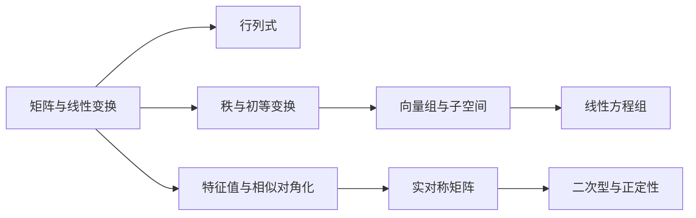

# 张宇基础 30 讲·线性代数讲解总览

> [!abstract] 这套笔记怎么用
> 以原书“第 0 讲 + 第 1–6 讲”为主线，把定义、等价条件、计算入口与完整代表题连起来。例题为重新设计的同类题，不大段复制原书；原页可通过章节中的 PDF 链接核对。

## 原书结构与页码

| 讲次 | 主题 | PDF 物理页 | 书内页码 | 笔记 |
|---|---|---:|---:|---|
| 第 0 讲 | 零基础课——线性代数入门 | 8–17 | 1–10 | [[01-零基础课-线性代数入门]] |
| 第 1 讲 | 行列式 | 18–51 | 11–44 | [[02-行列式]] |
| 第 2 讲 | 矩阵 | 52–88 | 45–81 | [[03-矩阵]] |
| 第 3 讲 | 向量组 | 89–120 | 82–113 | [[04-向量组]] |
| 第 4 讲 | 线性方程组 | 121–145 | 114–138 | [[05-线性方程组]] |
| 第 5 讲 | 特征值与特征向量 | 146–184 | 139–177 | [[06-特征值与特征向量]] |
| 第 6 讲 | 二次型 | 185–213 | 178–206 | [[07-二次型]] |

原书目录见 [[数学一/01-基础讲义/27张宇基础30讲线代.pdf#page=7|PDF 第 7 页]]。正文满足：`书内页码 = PDF 物理页码 - 7`。

## 一张图抓住主线

线性代数题目表面不同，底层经常只在问三件事：

1. **信息有多少**：秩、极大无关组、解空间维数；
2. **同一对象如何换表示**：初等变换、基变换、相似、合同；
3. **能否化简到标准结构**：阶梯形、对角形、标准形。

## 三条统一视角

### 1. 矩阵是线性映射的坐标表示

$A\boldsymbol x$ 不是一串机械乘法，而是把输入向量映射到输出向量。矩阵乘法 $AB$ 表示先做 $B$，再做 $A$。

### 2. 秩是全书的“信息量”

$$
r(A)=\dim C(A)=\dim R(A).
$$

它同时控制：向量组的极大无关组大小、齐次方程基础解系个数、非齐次方程是否有解、矩阵能否可逆。

### 3. 变换要分清保持什么

| 关系 | 形式 | 主要保持量 |
|---|---|---|
| 等价 | $B=PAQ$ | 秩 |
| 相似 | $B=P^{-1}AP$ | 特征多项式、特征值、迹、行列式 |
| 合同 | $B=P^TAP$ | 二次型惯性指数 |

## 推荐复习顺序

### 教材级讲解的三个入口

每讲都可按“先理解—再记忆—后自测”阅读：

| 章节 | 零基础/主链入口 | 公式整理 | 完整检测题 |
|---|---|---|---|
| 第 0 讲 | [[01-零基础课-线性代数入门#先建立三个画面]] | [[01-零基础课-线性代数入门#本讲知识主链]] | [[01-零基础课-线性代数入门#本讲检测题]] |
| 第 1 讲 | [[02-行列式#零基础起点：行列式究竟是什么]] | [[02-行列式#一页记忆版]] | [[02-行列式#本讲检测题与完整答案]] |
| 第 2 讲 | [[03-矩阵#零基础准备：矩阵的基本运算]] | [[03-矩阵#本讲母公式]] | [[03-矩阵#本讲检测题与完整答案]] |
| 第 3 讲 | [[04-向量组#零基础准备：什么叫向量组]] | [[04-向量组#本讲母公式]] | [[04-向量组#本讲检测题与完整答案]] |
| 第 4 讲 | [[05-线性方程组#本讲总主链]] | [[05-线性方程组#本讲母公式]] | [[05-线性方程组#本讲检测题与完整答案]] |
| 第 5 讲 | [[06-特征值与特征向量#本讲总主链]] | [[06-特征值与特征向量#本讲母公式]] | [[06-特征值与特征向量#本讲检测题与完整答案]] |
| 第 6 讲 | [[07-二次型#零基础准备：什么叫二次型]] | [[07-二次型#本讲母公式]] | [[07-二次型#本讲检测题与完整答案]] |

检测题答案默认折叠。建议先在纸上完成，再展开逐步核对第一步、运算和验算。

### 零基础阅读法：先图像，再代数

每个概念先回答“它在几何或信息上表示什么”，再学习计算：

| 代数概念 | 直观画面 |
|---|---|
| 矩阵 | 一台线性加工机器 |
| 行列式 | 体积缩放率，是否压扁空间 |
| 秩 | 独立信息或独立方向的数量 |
| 线性方程组 | 多个约束的公共交点 |
| 特征向量 | 变换后不改变直线方向的特殊方向 |
| 二次型 | 不同方向上的弯曲程度 |

推荐先读以下通俗入口：

- [[01-零基础课-线性代数入门#先建立三个画面]]
- [[02-行列式#先把行列式看成“体积缩放率”]]
- [[03-矩阵#秩的通俗含义：有几条独立信息]]
- [[04-向量组#先把四个概念排成层级]]
- [[05-线性方程组#先从几何看“解”是什么]]
- [[06-特征值与特征向量#先理解“特殊方向”]]
- [[07-二次型#先从图形理解二次型]]

1. 第一遍先掌握 [[03-矩阵]]、[[04-向量组]]、[[05-线性方程组]] 的秩主线。
2. 第二遍把 [[02-行列式]] 的计算与 [[06-特征值与特征向量]] 的特征多项式连接起来。
3. 第三遍用实对称矩阵串起正交对角化与 [[07-二次型]]。
4. 每道综合题先判断研究对象，再选择变换，最后检查变换保持量。

### 每道题强制写出的三行

1. **对象与尺寸**：矩阵几行几列、向量有几个、未知数有几个；
2. **等价条件**：例如可逆 $\Leftrightarrow |A|\ne0\Leftrightarrow r(A)=n$；
3. **结果检查**：秩范围、解的自由度、特征值的和与积、正定性的严格条件。

> [!tip] 四步闭环
> **看维数 → 判关系 → 选变换 → 验结论**。
>
> 验证至少包括：乘法维数匹配、秩不超过行列数、特征向量非零、基础解系线性无关、正交矩阵满足 $Q^TQ=I$。

## 当前版本提醒

> [!warning] 关于“最新考纲”
> 截至 2026-07-14，在教育部与研招网公开页面中未检索到 **2027 数学（一）正式考试大纲**。原书中的题型权重和课程定位只作历史复习参考；正式发布后应以当年官方大纲为准。详见 [[来源与版本说明#考纲与时效性]]。

## 快速入口

- [[99-线性代数公式与易错点速查]]
- [[来源与版本说明]]
- [[数学一/00-资料索引]]
- [[数学一/01-基础讲义/27张宇基础30讲线代.pdf|原 PDF]]
