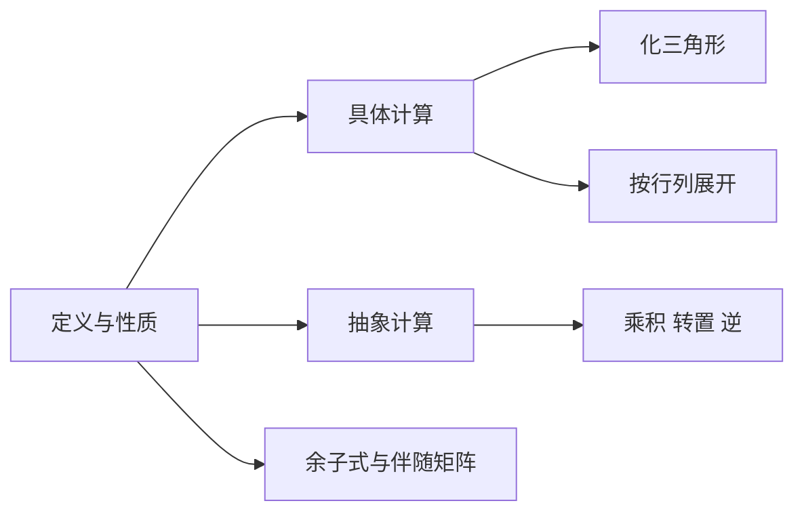

# 第 1 讲 行列式

原书范围：[[数学一/01-基础讲义/27张宇基础30讲线代.pdf#page=18|PDF 第 18 页]]至[[数学一/01-基础讲义/27张宇基础30讲线代.pdf#page=51|第 51 页]]。

## 核心地图

行列式把方阵压缩成一个数。几何上它描述有向体积的缩放；代数上它判断方阵是否可逆。

$$
|A|\ne0\iff A\text{ 可逆}\iff r(A)=n.
$$

## 零基础起点：行列式究竟是什么

### 1. 矩阵与行列式不是同一种对象

先看二阶矩阵

$$
A=
\begin{bmatrix}
a_{11}&a_{12}\\
a_{21}&a_{22}
\end{bmatrix}.
$$

矩阵 $A$ 是一个由四个数按行、列排成的数字表。利用这四个数，可以按照规定计算出一个数：

$$
a_{11}a_{22}-a_{12}a_{21}.
$$

这个数叫作矩阵 $A$ 的行列式，记作

$$
|A|
\qquad\text{或}\qquad
\det A.
$$

因此

$$
\boxed{
\det A
=
\begin{vmatrix}
a_{11}&a_{12}\\
a_{21}&a_{22}
\end{vmatrix}
=a_{11}a_{22}-a_{12}a_{21}
}.
$$

最根本的区别是

$$
\boxed{\text{矩阵是一个数字表；行列式是由方阵计算得到的一个数。}}
$$

例如

$$
A=
\begin{bmatrix}
1&2\\
3&4
\end{bmatrix}
$$

是一个矩阵，而

$$
|A|
=
\begin{vmatrix}
1&2\\
3&4
\end{vmatrix}
=1\cdot4-2\cdot3=-2
$$

是一个数。可以写 $|A|=-2$，不能写 $A=-2$。

> [!warning] 两种竖线不要混淆
> $\det A$ 或 $|A|$ 表示行列式；若再写 $\left|\det A\right|$，外层竖线表示对这个数取绝对值。

### 2. 只有方阵才有普通行列式

行列式要求行数与列数相同。

$$
\begin{bmatrix}
1&2\\
3&4
\end{bmatrix}
$$

是 $2\times2$ 方阵，可以计算行列式；而

$$
\begin{bmatrix}
1&2&3\\
4&5&6
\end{bmatrix}
$$

是 $2\times3$ 矩阵，不是方阵，因此在本课程中不讨论它的普通行列式。

$$
\boxed{\text{先看是不是方阵，再谈行列式。}}
$$

## 二阶行列式：主对角线乘积减副对角线乘积

对

$$
D=
\begin{vmatrix}
a&b\\
c&d
\end{vmatrix},
$$

计算公式是

$$
\boxed{D=ad-bc}.
$$

- 主对角线元素是 $a,d$，乘积为 $ad$；
- 副对角线元素是 $b,c$，乘积为 $bc$；
- 最后做“主对角线乘积减副对角线乘积”。

### 例 0-1：直接计算

计算

$$
\begin{vmatrix}
2&3\\
1&4
\end{vmatrix}.
$$

主对角线乘积是 $2\cdot4=8$，副对角线乘积是 $3\cdot1=3$，所以

$$
\begin{vmatrix}
2&3\\
1&4
\end{vmatrix}
=8-3=5.
$$

### 例 0-2：为什么两行成比例时结果为零

计算

$$
\begin{vmatrix}
1&2\\
2&4
\end{vmatrix}.
$$

$$
\begin{vmatrix}
1&2\\
2&4
\end{vmatrix}
=1\cdot4-2\cdot2=0.
$$

观察两行：

$$
(2,4)=2(1,2).
$$

第二行只是第一行的两倍，没有提供新的方向。几何上，两个列向量也在同一条直线上，围不出有面积的平行四边形，因此行列式为零。

## 三阶行列式与沙路法则

三阶行列式写成

$$
D=
\begin{vmatrix}
a_{11}&a_{12}&a_{13}\\
a_{21}&a_{22}&a_{23}\\
a_{31}&a_{32}&a_{33}
\end{vmatrix}.
$$

对三阶行列式，可以使用沙路法则：把前两列抄到右边，取三条左上到右下的乘积之和，再减去三条左下到右上的乘积之和。

展开式为

$$
\begin{aligned}
D={}&
a_{11}a_{22}a_{33}
+a_{12}a_{23}a_{31}
+a_{13}a_{21}a_{32}\\
&-a_{13}a_{22}a_{31}
-a_{11}a_{23}a_{32}
-a_{12}a_{21}a_{33}.
\end{aligned}
$$

前三项取正号，后三项取负号。

### 例 0-3：完整写出六项

计算

$$
D=
\begin{vmatrix}
1&2&0\\
0&1&3\\
2&0&1
\end{vmatrix}.
$$

三个正项是

$$
1\cdot1\cdot1,
\qquad
2\cdot3\cdot2,
\qquad
0\cdot0\cdot0,
$$

和为

$$
1+12+0=13.
$$

三个负项对应的乘积是

$$
0\cdot1\cdot2,
\qquad
1\cdot3\cdot0,
\qquad
2\cdot0\cdot1,
$$

和为 $0$。因此

$$
\boxed{D=13}.
$$

> [!warning] 沙路法则只适用于三阶
> 四阶及更高阶行列式不能继续画斜线硬算。高阶题主要依靠行列式性质造零、化三角形，或按某一行、某一列展开。

## $n$ 阶行列式先理解到什么程度

一般的 $n$ 阶行列式记作

$$
D_n=
\begin{vmatrix}
a_{11}&a_{12}&\cdots&a_{1n}\\
a_{21}&a_{22}&\cdots&a_{2n}\\
\vdots&\vdots&&\vdots\\
a_{n1}&a_{n2}&\cdots&a_{nn}
\end{vmatrix}.
$$

$a_{ij}$ 表示第 $i$ 行、第 $j$ 列元素。例如 $a_{23}$ 就是第 2 行第 3 列元素。

一般定义中的每一项都要做到：

1. 从每一行恰好取一个元素；
2. 从每一列也恰好取一个元素；
3. 把这 $n$ 个元素相乘；
4. 根据列下标排列的奇偶性决定正负号；
5. 把所有 $n!$ 项相加。

这一定义解释了为什么直接按定义计算高阶行列式非常低效。考研计算更重要的是掌握性质，把高阶行列式迅速化简。

## 先把行列式看成“体积缩放率”

二维矩阵的两列张成一个平行四边形，$|\det A|$ 是它的面积；三维时是平行六面体体积。符号记录方向是否翻转。

这个视角能解释很多性质：

- 两行或两列相同，图形被压扁，体积为 0；
- 交换两列会把方向翻转，行列式变号；
- 某列乘 $k$，对应一个方向伸缩 $k$ 倍，体积也乘 $k$；
- 一列加上另一列的倍数，相当于剪切，底和高不变，体积不变。

所以

$$
|A|=0
$$

不是一个偶然计算结果，而是在说矩阵把空间压低了维数，列向量线性相关，变换无法逆转。

### 二阶行列式的有向面积

设 $A$ 的两列是

$$
\boldsymbol a_1=
\begin{bmatrix}
a_{11}\\
a_{21}
\end{bmatrix},
\qquad
\boldsymbol a_2=
\begin{bmatrix}
a_{12}\\
a_{22}
\end{bmatrix}.
$$

它们作为邻边围成平行四边形。行列式

$$
\det A=a_{11}a_{22}-a_{12}a_{21}
$$

给出有向面积，真正的几何面积为

$$
\boxed{S=\left|\det A\right|}.
$$

若 $\det A>0$，两个向量的排列方向与平面标准方向一致；若 $\det A<0$，方向翻转；若 $\det A=0$，平行四边形被压成线段，面积为零。

例如

$$
A=
\begin{bmatrix}
1&2\\
2&3
\end{bmatrix}
$$

满足

$$
\det A=1\cdot3-2\cdot2=-1.
$$

行列式是 $-1$，但几何面积是

$$
\left|-1\right|=1.
$$

负号记录方向，不表示面积为负。

## 1. 三类初等变换对行列式的影响

| 变换 | 行列式变化 |
|---|---|
| 交换两行（列） | 乘 $-1$ |
| 某行（列）乘 $k$ | 行列式乘 $k$ |
| 某行（列）的 $k$ 倍加到另一行（列） | 不变 |

常用性质：

$$
|A^T|=|A|,
\qquad |AB|=|A||B|,
$$

若 $A$ 可逆：

$$
|A^{-1}|=\frac1{|A|}.
$$

三角矩阵的行列式等于主对角元之积。

> [!warning] 不能拆加法
> 一般没有 $|A+B|=|A|+|B|$。行列式对某一行单独线性，但不是对整个矩阵做普通线性运算。

## 2. 余子式与代数余子式

删去第 $i$ 行第 $j$ 列所得行列式记为 $M_{ij}$，代数余子式

$$
A_{ij}=(-1)^{i+j}M_{ij}.
$$

这里两个概念只差一个符号因子：

- $M_{ij}$：只做“删行、删列”；
- $A_{ij}$：在 $M_{ij}$ 前再乘 $(-1)^{i+j}$。

三阶代数余子式的符号位置是

$$
\begin{bmatrix}
+&-&+\\
-&+&-\\
+&-&+
\end{bmatrix}.
$$

可以记成从左上角正号开始，横向、纵向都正负交替。

### 例：求一个代数余子式

设

$$
D=
\begin{vmatrix}
1&2&3\\
0&4&5\\
2&1&6
\end{vmatrix}.
$$

求元素 $a_{23}=5$ 的余子式和代数余子式。

删去第 2 行、第 3 列，留下

$$
M_{23}=
\begin{vmatrix}
1&2\\
2&1
\end{vmatrix}
=1\cdot1-2\cdot2=-3.
$$

因为 $2+3=5$ 为奇数，

$$
A_{23}=(-1)^{2+3}M_{23}=-M_{23}=3.
$$

所以

$$
\boxed{M_{23}=-3,\qquad A_{23}=3}.
$$

按第 $i$ 行展开：

$$
|A|=\sum_{j=1}^na_{ij}A_{ij}.
$$

三阶时，按第一行展开就是

$$
|A|=a_{11}A_{11}+a_{12}A_{12}+a_{13}A_{13}.
$$

展开时每一项都使用“本行元素乘它自己的代数余子式”。

而用另一行元素乘第 $i$ 行的代数余子式，和为 0：

$$
\sum_{j=1}^na_{kj}A_{ij}=0,\qquad k\ne i.
$$

这正是 $AA^*=|A|I$ 的元素形式。

为什么“换成另一行”会得到零？把第 $i$ 行替换为第 $k$ 行，再沿第 $i$ 行展开，就会出现两行完全相同的新行列式，因此其值为零。

## 3. 计算策略

1. 有大量 0：沿零多的行或列展开。
2. 元素有共同结构：先做“加到某行/列”制造 0。
3. 抽象矩阵：优先用 $|AB|$、特征值乘积、相似不变量。
4. 递推型行列式：沿边缘展开，建立 $D_n$ 与低阶的关系。

### 为什么通常优先“造零”

$n$ 阶行列式按定义包含 $n!$ 项，直接展开增长极快。初等变换能把矩阵化成三角形，只需乘对角线；按某行展开时，每出现一个 0，就少算一个低阶行列式。

因此计算目标不是“立刻展开”，而是：

1. 找结构相似的行或列；
2. 用不改变行列式的倍加变换制造 0；
3. 化成三角形，或沿 0 最多的行列展开。

### 选择行变换还是列变换

行列式对行和列完全对称。若各行结构相近就做行变换；若各列有公共结构就做列变换。混合使用也可以，但每一步都要记录换行、数乘带来的系数变化。

### 例 1：用变换制造三角形

计算

$$
D=\begin{vmatrix}
1&1&1\\
1&2&3\\
1&3&6
\end{vmatrix}.
$$

作 $R_2\leftarrow R_2-R_1$，$R_3\leftarrow R_3-R_1$，行列式不变：

$$
D=\begin{vmatrix}
1&1&1\\
0&1&2\\
0&2&5
\end{vmatrix}.
$$

再作 $R_3\leftarrow R_3-2R_2$：

$$
D=\begin{vmatrix}
1&1&1\\
0&1&2\\
0&0&1
\end{vmatrix}=1.
$$

### 例 2：含参数行列式与根

求

$$
D(x)=\begin{vmatrix}
x&1&1\\
1&x&1\\
1&1&x
\end{vmatrix}
$$

并解 $D(x)=0$。

把三列都加到第一列：

$$
C_1\leftarrow C_1+C_2+C_3,
$$

得到第一列均为 $x+2$，提出公因子：

$$
D(x)=(x+2)
\begin{vmatrix}
1&1&1\\
1&x&1\\
1&1&x
\end{vmatrix}.
$$

再作 $R_2\leftarrow R_2-R_1$、$R_3\leftarrow R_3-R_1$：

$$
D(x)=(x+2)
\begin{vmatrix}
1&1&1\\
0&x-1&0\\
0&0&x-1
\end{vmatrix}
=(x+2)(x-1)^2.
$$

所以根为 $x=-2$ 或 $x=1$（二重根）。

### 例 3：抽象行列式

设 $A$ 为 3 阶可逆矩阵，$|A|=2$。求

$$
\left|3A^{-1}A^T\right|.
$$

3 阶矩阵整体乘 3，行列式乘 $3^3$：

$$
\begin{aligned}
|3A^{-1}A^T|
&=3^3|A^{-1}||A^T|\\
&=27\cdot\frac1{|A|}\cdot|A|=27.
\end{aligned}
$$

> [!tip] 数乘指数
> 对 $n$ 阶矩阵，$|kA|=k^n|A|$，不是 $k|A|$。

### 例 4：代数余子式求和

设 $A=(a_{ij})_{3\times3}$，已知 $|A|=5$。求

$$
a_{21}A_{11}+a_{22}A_{12}+a_{23}A_{13}.
$$

这里 $A_{1j}$ 是第一行元素的代数余子式，却拿第二行元素相乘。相当于把第一行替换为第二行后按第一行展开，所得矩阵有两行相同，因此

$$
a_{21}A_{11}+a_{22}A_{12}+a_{23}A_{13}=0.
$$

## 4. 克拉默法则的定位

对 $n$ 个方程、$n$ 个未知数的系统 $A\boldsymbol x=\boldsymbol b$，若 $|A|\ne0$，则唯一解

$$
x_i=\frac{D_i}{D}.
$$

它适合理论判断和低阶手算。高维实际计算通常采用消元或矩阵分解，不逐个展开行列式。

其中

$$
D=|A|,
$$

$D_i$ 表示把系数行列式的第 $i$ 列换成常数列后得到的新行列式。

### 完整例题：用克拉默法则解二元方程组

求解

$$
\begin{cases}
x+y=3,\\
2x-y=0.
\end{cases}
$$

系数行列式为

$$
D=
\begin{vmatrix}
1&1\\
2&-1
\end{vmatrix}
=-1-2=-3\ne0.
$$

因此方程组有唯一解。

求 $x$ 时，把第一列换成常数列：

$$
D_1=
\begin{vmatrix}
3&1\\
0&-1
\end{vmatrix}
=-3.
$$

所以

$$
x=\frac{D_1}{D}=\frac{-3}{-3}=1.
$$

求 $y$ 时，把第二列换成常数列：

$$
D_2=
\begin{vmatrix}
1&3\\
2&0
\end{vmatrix}
=-6.
$$

所以

$$
y=\frac{D_2}{D}=\frac{-6}{-3}=2.
$$

代回：

$$
1+2=3,\qquad 2\cdot1-2=0,
$$

故

$$
\boxed{x=1,\qquad y=2}.
$$

> [!warning] 使用前先看 $D$
> 只有 $D\ne0$ 时才能直接写 $x_i=D_i/D$。若 $D=0$，不能除以零，需要转到线性方程组的秩与解的结构去判断。

## 抽象行列式题的翻译表

| 题目给法 | 立即想到 |
|---|---|
| $AB$、$A^T$、$A^{-1}$ | 乘积、转置、逆的行列式性质 |
| $A^*$ | $AA^*=|A|I$，可逆时 $A^*=|A|A^{-1}$ |
| 已知特征值 | 行列式等于全部特征值之积 |
| 相似矩阵 | 特征多项式和行列式相同 |
| 分块三角矩阵 | 对角块行列式相乘 |
| 某行元素乘另一行代数余子式 | 构造两行相同的行列式 |

## 行列式题的验算方法

- 三角形结果应等于对角元之积；
- 交换一次行或列必须变号；
- 参数行列式得到多项式后，可代入 0、1 等简单值回原式抽查；
- 若两行明显相关，最终结果必须为 0；
- $n$ 阶整体数乘的次数应为 $n$。

## 本讲知识主链

$$
\boxed{
\text{方阵}
\longrightarrow
\det A
\longrightarrow
\begin{cases}
\det A\ne0 &\Rightarrow A\text{ 可逆},\\
\det A=0 &\Rightarrow A\text{ 不可逆}
\end{cases}
\longrightarrow
\text{方程组与向量相关性}
}
$$

计算方法的主链是

$$
\boxed{
\text{二阶直接算}
\longrightarrow
\text{三阶可用沙路}
\longrightarrow
\text{高阶先造零}
\longrightarrow
\text{化三角形或按行列展开}
}.
$$

## 一页记忆版

### 二阶公式

$$
\boxed{
\begin{vmatrix}
a&b\\
c&d
\end{vmatrix}
=ad-bc
}
$$

### 三类初等变换

$$
\boxed{
\begin{aligned}
\text{交换两行（列）}&\Rightarrow \det\text{ 变号},\\
\text{某行（列）乘 }k&\Rightarrow \det\text{ 乘 }k,\\
\text{一行（列）的倍数加到另一行（列）}
&\Rightarrow \det\text{ 不变}.
\end{aligned}
}
$$

### 乘积、转置、逆

$$
\boxed{
\det(A^T)=\det A,\qquad
\det(AB)=\det A\det B,\qquad
\det(A^{-1})=\frac1{\det A}
}
$$

最后一个公式要求 $A$ 可逆。

### 展开公式

$$
\boxed{
A_{ij}=(-1)^{i+j}M_{ij},
\qquad
\det A=\sum_{j=1}^na_{ij}A_{ij}
}
$$

### 可逆判断

$$
\boxed{A\text{ 可逆}\iff\det A\ne0}
$$

## 做题时的识别顺序

1. 先判断是具体数字行列式，还是含 $A^T,A^{-1},AB,A^*$ 的抽象题。
2. 二阶直接用 $ad-bc$；三阶数字简单时可用沙路。
3. 高阶先观察是否能提出公因子、制造大量零或化成三角形。
4. 看到“某行元素乘另一行代数余子式”，立即联想到两行相同，结果为零。
5. 看到矩阵可逆、方程组唯一解、向量线性无关，立即联想到 $\det A\ne0$。
6. 含参数结果算成多项式后，代入简单参数回原式抽查。

## 本讲检测题与完整答案

### 检测 1：二阶行列式

计算

$$
D_1=
\begin{vmatrix}
3&2\\
1&4
\end{vmatrix}.
$$

> [!success]- 完整答案
>
> 主对角线乘积为 $3\cdot4=12$，副对角线乘积为 $2\cdot1=2$，所以
>
> $$
> \boxed{D_1=12-2=10}.
> $$

### 检测 2：用沙路法则写出六项

计算

$$
D_2=
\begin{vmatrix}
1&0&2\\
2&1&0\\
0&3&1
\end{vmatrix}.
$$

> [!success]- 完整答案
>
> 三个正项为
>
> $$
> 1\cdot1\cdot1,
> \qquad
> 0\cdot0\cdot0,
> \qquad
> 2\cdot2\cdot3,
> $$
>
> 其和为
>
> $$
> 1+0+12=13.
> $$
>
> 三个负项为
>
> $$
> 2\cdot1\cdot0,
> \qquad
> 1\cdot0\cdot3,
> \qquad
> 0\cdot2\cdot1,
> $$
>
> 其和为 $0$。因此
>
> $$
> \boxed{D_2=13}.
> $$

### 检测 3：用性质化简

计算

$$
D=
\begin{vmatrix}
1&2&3\\
2&4&6\\
0&1&1
\end{vmatrix}.
$$

> [!success]- 完整答案
>
> 第二行等于第一行的 $2$ 倍，两行成比例，所以行列式为零：
>
> $$
> \boxed{D=0}.
> $$
>
> 也可以作 $R_2\leftarrow R_2-2R_1$，第二行变成零行，从而得到同样结论。

### 检测 4：抽象行列式

设 $A$ 是 4 阶可逆矩阵，且 $|A|=2$，求

$$
\left|3A^{-1}\right|.
$$

> [!success]- 完整答案
>
> 因为 $A$ 为 4 阶，
>
> $$
> |3A^{-1}|=3^4|A^{-1}|.
> $$
>
> 又因为
>
> $$
> |A^{-1}|=\frac1{|A|}=\frac12,
> $$
>
> 所以
>
> $$
> \boxed{|3A^{-1}|=81\cdot\frac12=\frac{81}{2}}.
> $$

## 易错清单

- [ ] 行列式与矩阵混为一谈；前者是数，后者是数组/线性映射。
- [ ] 初等变换后忘记符号或倍数变化。
- [ ] 写成 $|kA|=k|A|$。
- [ ] 误用 $|A+B|=|A|+|B|$。
- [ ] 代数余子式的 $(-1)^{i+j}$ 符号写错。
- [ ] $|AB|=|A||B|$ 错写成需要 $AB=BA$；该公式不需要交换。

上一讲 [[01-零基础课-线性代数入门]] · 返回 [[00-线性代数总览]] · 下一讲 [[03-矩阵]]
