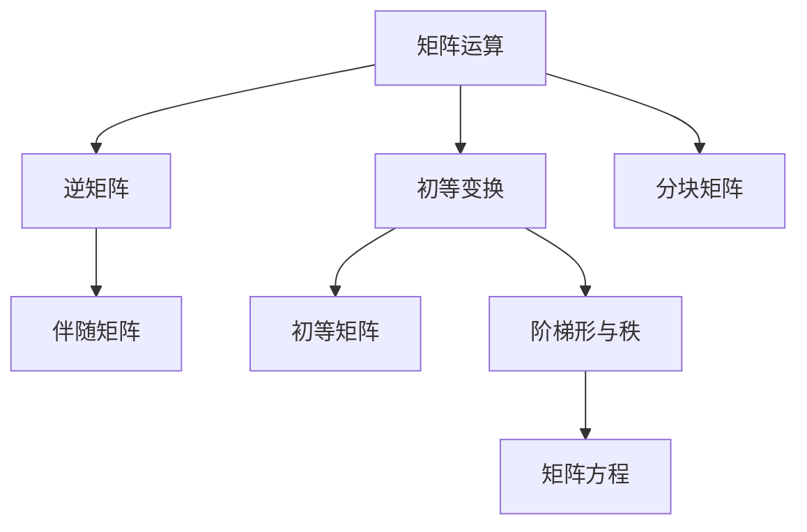

# 第 2 讲 矩阵

原书范围：[[数学一/01-基础讲义/27张宇基础30讲线代.pdf#page=52|PDF 第 52 页]]至[[数学一/01-基础讲义/27张宇基础30讲线代.pdf#page=88|第 88 页]]。

## 核心地图

## 本讲先解决六个问题

1. 两个矩阵什么时候相等，什么时候能相加、相乘？
2. 一个方阵什么时候可逆，怎样求逆？
3. 初等行变换为什么既能求逆又能求秩？
4. 秩为什么表示“有效信息的条数”？
5. 矩阵方程中逆矩阵应放在左边还是右边？
6. 大矩阵怎样通过分块降低计算量？

这些问题不是彼此孤立的。主线是

$$
\boxed{
\text{矩阵运算}
\longrightarrow
\text{初等变换}
\longrightarrow
\text{阶梯形}
\longrightarrow
\text{秩、逆与方程}
}.
$$

## 零基础准备：矩阵的基本运算

### 1. 矩阵相等

两个矩阵相等必须同时满足：

1. 行数相同、列数相同；
2. 对应位置的元素全部相等。

例如

$$
\begin{bmatrix}
x&2\\
3&y
\end{bmatrix}
=
\begin{bmatrix}
1&2\\
3&4
\end{bmatrix}
$$

等价于

$$
x=1,\qquad y=4.
$$

### 2. 加法与数乘

只有同型矩阵才能相加，对应元素分别相加：

$$
\begin{bmatrix}
1&2\\
3&4
\end{bmatrix}
+
\begin{bmatrix}
2&-1\\
0&5
\end{bmatrix}
=
\begin{bmatrix}
3&1\\
3&9
\end{bmatrix}.
$$

数 $k$ 乘矩阵，就是每个元素都乘 $k$：

$$
k(a_{ij})=(ka_{ij}).
$$

### 3. 乘法先看尺寸

若

$$
A_{m\times n},\qquad B_{n\times p},
$$

则 $AB$ 存在，且

$$
AB\text{ 为 }m\times p.
$$

结果的第 $i$ 行第 $j$ 列元素，是 $A$ 的第 $i$ 行与 $B$ 的第 $j$ 列对应相乘再相加：

$$
(AB)_{ij}=\sum_{k=1}^na_{ik}b_{kj}.
$$

例如

$$
\begin{aligned}
\begin{bmatrix}
1&2\\
3&4
\end{bmatrix}
\begin{bmatrix}
2&0\\
1&5
\end{bmatrix}
&=
\begin{bmatrix}
1\cdot2+2\cdot1&1\cdot0+2\cdot5\\
3\cdot2+4\cdot1&3\cdot0+4\cdot5
\end{bmatrix}\\
&=
\begin{bmatrix}
4&10\\
10&20
\end{bmatrix}.
\end{aligned}
$$

矩阵乘法满足结合律和分配律：

$$
(AB)C=A(BC),
$$

$$
A(B+C)=AB+AC.
$$

但通常

$$
\boxed{AB\ne BA}.
$$

### 4. 转置

把矩阵的行、列互换，得到转置矩阵 $A^T$。例如

$$
A=
\begin{bmatrix}
1&2&3\\
4&5&6
\end{bmatrix}
\quad\Longrightarrow\quad
A^T=
\begin{bmatrix}
1&4\\
2&5\\
3&6
\end{bmatrix}.
$$

常用公式：

$$
\boxed{
(A^T)^T=A,\qquad
(A+B)^T=A^T+B^T,\qquad
(AB)^T=B^TA^T
}.
$$

乘积转置也要倒序，因为原来乘积的行、列角色互换了。

### 5. 几类特殊矩阵

| 名称 | 特征 | 典型用途 |
|---|---|---|
| 零矩阵 $O$ | 所有元素为 0 | 加法零元 |
| 单位矩阵 $I$ | 主对角线为 1，其余为 0 | 乘法单位元 |
| 对角矩阵 | 非主对角元全为 0 | 幂、逆容易计算 |
| 上三角矩阵 | 主对角线下方全为 0 | 行列式为对角元乘积 |
| 对称矩阵 | $A^T=A$ | 正交对角化、二次型 |
| 正交矩阵 | $Q^TQ=I$ | 保持长度和夹角 |

对角矩阵

$$
D=\operatorname{diag}(d_1,d_2,\ldots,d_n)
$$

的幂与逆可以逐个看对角元：

$$
D^k=\operatorname{diag}(d_1^k,d_2^k,\ldots,d_n^k),
$$

若每个 $d_i\ne0$，则

$$
D^{-1}
=\operatorname{diag}\left(\frac1{d_1},\frac1{d_2},\ldots,\frac1{d_n}\right).
$$

## 先分清矩阵的四种角色

同一个矩阵在不同题目中可能扮演不同角色：

1. 数据表：按行列存放信息；
2. 线性映射：把输入向量变为输出向量；
3. 向量组：各列是一组向量，用来研究线性表示；
4. 方程组系数：$A\boldsymbol x=\boldsymbol b$ 描述约束。

秩、逆矩阵和初等变换之所以贯穿全书，是因为它们从不同角度描述这四种角色中的“有效信息”。

## 1. 逆矩阵

方阵 $A$ 可逆，指存在 $A^{-1}$ 使

$$
AA^{-1}=A^{-1}A=I.
$$

$n$ 阶方阵的等价条件：

$$
A\text{ 可逆}
\iff |A|\ne0
\iff r(A)=n
\iff A\boldsymbol x=\boldsymbol0\text{ 只有零解}.
$$

常用公式：

$$
(AB)^{-1}=B^{-1}A^{-1},
$$

$$
(A^T)^{-1}=(A^{-1})^T,
$$

$$
A^{-1}=\frac1{|A|}A^*.
$$

### 逆矩阵为什么不是逐元素取倒数

数的倒数 $a^{-1}$ 能撤销乘法：$a^{-1}a=1$。矩阵的逆也要撤销整个线性变换：

$$
A^{-1}(A\boldsymbol x)=\boldsymbol x.
$$

矩阵各元素共同决定变换，不能分别取倒数。只有对角矩阵

$$
D=\operatorname{diag}(d_1,\ldots,d_n)
$$

才有

$$
D^{-1}=\operatorname{diag}(1/d_1,\ldots,1/d_n).
$$

### 为什么 $(AB)^{-1}$ 要倒序

$AB$ 表示先做 $B$ 再做 $A$。撤销时必须先撤销最后做的 $A$，再撤销 $B$，所以

$$
(AB)^{-1}=B^{-1}A^{-1}.
$$

### 例 1：初等变换求逆

求

$$
A=\begin{bmatrix}1&2\\3&5\end{bmatrix}
$$

的逆。对增广矩阵做行变换：

$$
\left[
\begin{array}{cc|cc}
1&2&1&0\\
3&5&0&1
\end{array}
\right].
$$

$R_2\leftarrow R_2-3R_1$：

$$
\left[
\begin{array}{cc|cc}
1&2&1&0\\
0&-1&-3&1
\end{array}
\right].
$$

$R_2\leftarrow-R_2$，再 $R_1\leftarrow R_1-2R_2$：

$$
\left[
\begin{array}{cc|cc}
1&0&-5&2\\
0&1&3&-1
\end{array}
\right].
$$

故

$$
A^{-1}=\begin{bmatrix}-5&2\\3&-1\end{bmatrix}.
$$

检查 $|A|=-1\ne0$，并可乘回验证。

## 2. 伴随矩阵

伴随矩阵是代数余子式矩阵的转置：

$$
A^*=(A_{ji})_{n\times n}.
$$

核心恒等式：

$$
AA^*=A^*A=|A|I.
$$

秩的结论（$A$ 为 $n$ 阶）：

$$
r(A^*)=
\begin{cases}
n,&r(A)=n,\\
1,&r(A)=n-1,\\
0,&r(A)\le n-2.
\end{cases}
$$

若 $A$ 可逆，则 $A^*=|A|A^{-1}$。

## 3. 初等变换与初等矩阵

对 $A$ 做一次初等行变换，等价于左乘一个初等矩阵；列变换等价于右乘：

$$
A\xrightarrow{\text{行变换}}PA,
\qquad
A\xrightarrow{\text{列变换}}AQ.
$$

初等矩阵都可逆，其逆仍是同类初等矩阵。

> [!important] 方向记忆
> 行变换从左乘，列变换从右乘。矩阵方程中不能把未知矩阵随意跨过已知矩阵。

### 初等行变换为什么能求逆

对增广矩阵 $(A\mid I)$ 做行变换，相当于不断左乘初等矩阵。若最终把左侧化成 $I$：

$$
P_k\cdots P_2P_1A=I,
$$

那么

$$
P_k\cdots P_2P_1=A^{-1}.
$$

同样的行操作施加在右侧 $I$ 上，右侧最终正好变成 $A^{-1}$。

## 4. 秩

$r(A)$ 是 $A$ 的非零子式最高阶数，也等于阶梯形矩阵非零行数。

常用不等式：

$$
r(A+B)\le r(A)+r(B),
$$

$$
r(AB)\le\min\{r(A),r(B)\},
$$

$$
r(AB)\ge r(A)+r(B)-n
$$

（当 $A$ 的列数与 $B$ 的行数均为 $n$）。

可逆矩阵不改变秩：

$$
r(PA)=r(A),\qquad r(AQ)=r(A).
$$

### 秩的通俗含义：有几条独立信息

矩阵可能有很多行列，但其中一些只是其他行列的重复组合。秩统计真正独立的信息方向有多少。

- 列秩：输出空间能到达多少个独立方向；
- 行秩：方程组中有多少条独立约束；
- 二者总相等，所以统一记为 $r(A)$。

初等变换只是在重新整理信息，不创造也不销毁独立信息，因此秩不变。

### 例 2：参数矩阵的秩

设

$$
A=\begin{bmatrix}
1&1&1\\
1&a&2\\
1&2&a
\end{bmatrix}.
$$

作 $R_2\leftarrow R_2-R_1$、$R_3\leftarrow R_3-R_1$，可得：

$$
|A|=(a-1)^2-1=a(a-2).
$$

- 若 $a\ne0,2$，则 $|A|\ne0$，$r(A)=3$。
- 若 $a=0$，

$$
A=\begin{bmatrix}1&1&1\\1&0&2\\1&2&0\end{bmatrix},
$$

存在二阶子式 $\begin{vmatrix}1&1\\1&0\end{vmatrix}=-1$，故 $r(A)=2$。
- 若 $a=2$，代入后

$$
A=\begin{bmatrix}1&1&1\\1&2&2\\1&2&2\end{bmatrix},
$$

后两行相同但上述二阶子式仍非零，所以 $r(A)=2$。

因此

$$
r(A)=\begin{cases}3,&a\ne0,2,\\2,&a=0\text{ 或 }2.\end{cases}
$$

## 5. 矩阵方程

注意未知矩阵的位置：

$$
AX=B\quad\Rightarrow\quad X=A^{-1}B,
$$

$$
XA=B\quad\Rightarrow\quad X=BA^{-1}.
$$

若 $AXB=C$ 且 $A,B$ 均可逆：

$$
X=A^{-1}CB^{-1}.
$$

### 例 3：解矩阵方程

设

$$
A=\begin{bmatrix}1&1\\0&1\end{bmatrix},
\quad
B=\begin{bmatrix}1&0\\0&2\end{bmatrix},
\quad
C=\begin{bmatrix}2&2\\1&3\end{bmatrix},
$$

求满足 $AXB=C$ 的 $X$。

$$
A^{-1}=\begin{bmatrix}1&-1\\0&1\end{bmatrix},
\qquad
B^{-1}=\begin{bmatrix}1&0\\0&1/2\end{bmatrix}.
$$

因此

$$
\begin{aligned}
X&=A^{-1}CB^{-1}\\
&=\begin{bmatrix}1&-1\\0&1\end{bmatrix}
\begin{bmatrix}2&2\\1&3\end{bmatrix}
\begin{bmatrix}1&0\\0&1/2\end{bmatrix}\\
&=\begin{bmatrix}1&-1/2\\1&3/2\end{bmatrix}.
\end{aligned}
$$

## 6. 分块矩阵

分块必须保证块的尺寸兼容。常用结论：

$$
\begin{bmatrix}A&0\\0&B\end{bmatrix}^{-1}
=\begin{bmatrix}A^{-1}&0\\0&B^{-1}\end{bmatrix}.
$$

若 $A,D$ 为方阵，则块三角矩阵

$$
\begin{vmatrix}A&B\\0&D\end{vmatrix}=|A||D|.
$$

分块不是随意画线，而是把大矩阵当成由“小矩阵元素”组成的新矩阵。只要块的尺寸满足乘法要求，就可以按普通矩阵乘法规则运算。

例如

$$
\begin{bmatrix}
A&B\\
C&D
\end{bmatrix}
\begin{bmatrix}
E&F\\
G&H
\end{bmatrix}
=
\begin{bmatrix}
AE+BG&AF+BH\\
CE+DG&CF+DH
\end{bmatrix}.
$$

每个位置仍然是“左边的块行乘右边的块列”。

> [!warning] 块不能交换顺序
> 即使把一个块当成整体，矩阵乘法仍通常不可交换。例如 $BG$ 不能随意改写成 $GB$。

## 三类初等变换总整理

初等行变换只有三类：

1. 交换两行：$R_i\leftrightarrow R_j$；
2. 某一行乘非零常数：$R_i\leftarrow kR_i$，$k\ne0$；
3. 某一行的倍数加到另一行：$R_i\leftarrow R_i+kR_j$。

列变换完全类似。

它们共同特点是都能撤销：

- 交换两行，再交换一次即可恢复；
- 乘 $k$ 后再乘 $1/k$；
- 加 $k$ 倍后再减 $k$ 倍。

所以每个初等变换都对应一个可逆的初等矩阵。

## 阶梯形与秩：完整消元示例

求矩阵

$$
B=
\begin{bmatrix}
1&2&1\\
2&4&0\\
1&2&2
\end{bmatrix}
$$

的秩。

### 第一步：用第一行消去第一列下方元素

作

$$
R_2\leftarrow R_2-2R_1,
\qquad
R_3\leftarrow R_3-R_1,
$$

得到

$$
\begin{bmatrix}
1&2&1\\
0&0&-2\\
0&0&1
\end{bmatrix}.
$$

### 第二步：消去第三行

作

$$
R_3\leftarrow R_3+\frac12R_2,
$$

得到

$$
\begin{bmatrix}
1&2&1\\
0&0&-2\\
0&0&0
\end{bmatrix}.
$$

阶梯形中有两行非零行，因此

$$
\boxed{r(B)=2}.
$$

这表示三行中只有两条独立约束，也表示三列最多只能提供两个独立方向。

> [!tip] 判秩不要数“原矩阵非零行”
> 原矩阵每一行都非零，但它们可能相关。必须先化为阶梯形，再数非零行；或者寻找最高阶非零子式。

## 秩的三种语言

同一个秩可以从三个角度理解：

| 角度 | $r(A)=r$ 的含义 |
|---|---|
| 子式 | 最高阶非零子式的阶数是 $r$ |
| 消元 | 阶梯形中有 $r$ 个非零行或主元 |
| 向量 | 行向量组、列向量组的极大无关组都含 $r$ 个向量 |

因此行秩与列秩相等，不是两个独立概念。

## 本讲母公式

### 运算公式

$$
\boxed{
(AB)_{ij}=\sum_ka_{ik}b_{kj},
\qquad
(AB)^T=B^TA^T
}
$$

### 逆矩阵公式

$$
\boxed{
AA^{-1}=I,\qquad
(AB)^{-1}=B^{-1}A^{-1},\qquad
(A^T)^{-1}=(A^{-1})^T
}
$$

### 伴随矩阵公式

$$
\boxed{
AA^*=A^*A=|A|I
}
$$

若 $A$ 可逆，

$$
\boxed{
A^{-1}=\frac1{|A|}A^*,
\qquad
A^*=|A|A^{-1}
}.
$$

### 秩的公式

$$
\boxed{
r(AB)\le\min\{r(A),r(B)\},
\qquad
r(A+B)\le r(A)+r(B)
}
$$

若 $P,Q$ 可逆，

$$
\boxed{r(PAQ)=r(A)}.
$$

### 矩阵方程公式

$$
\boxed{
\begin{aligned}
AX=B&\Rightarrow X=A^{-1}B,\\
XA=B&\Rightarrow X=BA^{-1},\\
AXB=C&\Rightarrow X=A^{-1}CB^{-1}.
\end{aligned}
}
$$

最后一式要求 $A,B$ 都可逆。

## 矩阵综合题的执行顺序

1. 先看是否为方阵、尺寸是否匹配。
2. 出现可逆先联想 $|A|\ne0$、$r(A)=n$、齐次方程仅零解。
3. 出现矩阵方程，按未知矩阵所在位置决定左乘还是右乘逆。
4. 参数秩题先找最高阶非零子式；行列式为 0 后必须继续判秩。
5. 出现初等变换，明确是左乘还是右乘，并判断保持的是秩、解集还是列关系。

## 本讲检测题与完整答案

### 检测 1：转置为什么倒序

设

$$
A=
\begin{bmatrix}
1&2\\
0&1
\end{bmatrix},
\qquad
B=
\begin{bmatrix}
2&0\\
3&1
\end{bmatrix}.
$$

分别计算 $(AB)^T$ 与 $B^TA^T$。

> [!success]- 完整答案
>
> 先算
>
> $$
> AB=
> \begin{bmatrix}
> 1&2\\
> 0&1
> \end{bmatrix}
> \begin{bmatrix}
> 2&0\\
> 3&1
> \end{bmatrix}
> =
> \begin{bmatrix}
> 8&2\\
> 3&1
> \end{bmatrix},
> $$
>
> 所以
>
> $$
> (AB)^T=
> \begin{bmatrix}
> 8&3\\
> 2&1
> \end{bmatrix}.
> $$
>
> 另一方面，
>
> $$
> B^T=
> \begin{bmatrix}
> 2&3\\
> 0&1
> \end{bmatrix},
> \qquad
> A^T=
> \begin{bmatrix}
> 1&0\\
> 2&1
> \end{bmatrix},
> $$
>
> 因此
>
> $$
> B^TA^T=
> \begin{bmatrix}
> 8&3\\
> 2&1
> \end{bmatrix}.
> $$
>
> 两边相等，验证了
>
> $$
> \boxed{(AB)^T=B^TA^T}.
> $$

### 检测 2：用初等变换求逆

求

$$
A=
\begin{bmatrix}
1&1\\
2&3
\end{bmatrix}
$$

的逆矩阵。

> [!success]- 完整答案
>
> 写增广矩阵：
>
> $$
> \left[
> \begin{array}{cc|cc}
> 1&1&1&0\\
> 2&3&0&1
> \end{array}
> \right].
> $$
>
> 作 $R_2\leftarrow R_2-2R_1$：
>
> $$
> \left[
> \begin{array}{cc|cc}
> 1&1&1&0\\
> 0&1&-2&1
> \end{array}
> \right].
> $$
>
> 再作 $R_1\leftarrow R_1-R_2$：
>
> $$
> \left[
> \begin{array}{cc|cc}
> 1&0&3&-1\\
> 0&1&-2&1
> \end{array}
> \right].
> $$
>
> 所以
>
> $$
> \boxed{
> A^{-1}=
> \begin{bmatrix}
> 3&-1\\
> -2&1
> \end{bmatrix}
> }.
> $$
>
> 验算：
>
> $$
> \begin{bmatrix}
> 1&1\\
> 2&3
> \end{bmatrix}
> \begin{bmatrix}
> 3&-1\\
> -2&1
> \end{bmatrix}
> =I.
> $$

### 检测 3：判断秩

求

$$
C=
\begin{bmatrix}
1&2&3\\
2&4&6\\
1&1&1
\end{bmatrix}
$$

的秩。

> [!success]- 完整答案
>
> 第二行是第一行的两倍，所以三阶行列式为零，$r(C)<3$。
>
> 再看左上角二阶子式：
>
> $$
> \begin{vmatrix}
> 1&2\\
> 1&1
> \end{vmatrix}
> =1-2=-1\ne0.
> $$
>
> 所以 $r(C)\ge2$。结合 $r(C)<3$，得到
>
> $$
> \boxed{r(C)=2}.
> $$

### 检测 4：解矩阵方程

设 $A,B$ 可逆，方程

$$
AXB+C=D
$$

中未知矩阵为 $X$，求 $X$。

> [!success]- 完整答案
>
> 先移项：
>
> $$
> AXB=D-C.
> $$
>
> 左边的 $A$ 用左乘 $A^{-1}$ 消去，右边的 $B$ 用右乘 $B^{-1}$ 消去：
>
> $$
> \boxed{X=A^{-1}(D-C)B^{-1}}.
> $$
>
> 不能把顺序写乱，因为矩阵乘法通常不可交换。

### 检测 5：矩阵没有普通消去律

说明为什么 $AB=O$ 不能推出 $A=O$ 或 $B=O$。

> [!success]- 完整答案
>
> 取
>
> $$
> A=
> \begin{bmatrix}
> 1&0\\
> 0&0
> \end{bmatrix},
> \qquad
> B=
> \begin{bmatrix}
> 0&0\\
> 0&1
> \end{bmatrix}.
> $$
>
> $A,B$ 都不是零矩阵，但
>
> $$
> AB=
> \begin{bmatrix}
> 0&0\\
> 0&0
> \end{bmatrix}.
> $$
>
> 原因是 $B$ 的输出落在 $A$ 会压成零的方向上。矩阵可能有非零零因子，因此不能照搬普通数的消去律。

## 现代补充：手算可逆不等于数值稳定

理论上 $|A|\ne0$ 就可逆；数值计算中，若 $A$ 接近奇异，微小数据误差会造成巨大解误差。条件数衡量这种敏感性。NumPy 官方文档明确提醒病态矩阵的数值逆可能不准确，见 [[来源与版本说明#数值计算的最新实践提醒]]。

实际程序求 $A\boldsymbol x=\boldsymbol b$ 通常直接调用线性求解器，而不是显式形成 $A^{-1}$。

## 易错清单

- [ ] $(AB)^{-1}$ 写成 $A^{-1}B^{-1}$；正确顺序相反。
- [ ] 伴随矩阵忘记对代数余子式矩阵转置。
- [ ] 行变换误写成右乘初等矩阵。
- [ ] $AB=0$ 就推出 $A=0$ 或 $B=0$；矩阵没有这种消去律。
- [ ] 参数秩题只算行列式为 0，却不继续判秩是 $n-1$ 还是更低。
- [ ] 解 $XA=B$ 时把 $A^{-1}$ 放到左边。

上一讲 [[02-行列式]] · 返回 [[00-线性代数总览]] · 下一讲 [[04-向量组]]
