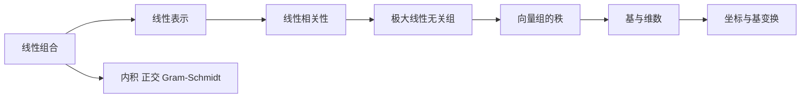

# 第 3 讲 向量组

原书范围：[[数学一/01-基础讲义/27张宇基础30讲线代.pdf#page=89|PDF 第 89 页]]至[[数学一/01-基础讲义/27张宇基础30讲线代.pdf#page=120|第 120 页]]。

## 核心地图

## 本讲先抓住一句话

$$
\boxed{\text{向量组问题，本质上是在研究“哪些方向必要，哪些方向多余”。}}
$$

把若干向量排成矩阵的列以后，本讲几乎所有问题都可以翻译成矩阵秩或线性方程组：

$$
\boxed{
\begin{aligned}
\text{能否表示}&\longleftrightarrow A\boldsymbol x=\boldsymbol\beta\text{ 是否有解},\\
\text{是否相关}&\longleftrightarrow A\boldsymbol x=\boldsymbol0\text{ 是否有非零解},\\
\text{独立方向个数}&\longleftrightarrow r(A),\\
\text{坐标}&\longleftrightarrow \text{表示系数}.
\end{aligned}
}
$$

## 零基础准备：什么叫向量组

一组维数相同、按一定顺序列出的向量称为向量组。例如

$$
\boldsymbol\alpha_1=
\begin{bmatrix}1\\0\\1\end{bmatrix},
\qquad
\boldsymbol\alpha_2=
\begin{bmatrix}0\\1\\1\end{bmatrix}
$$

组成一个含两个三维向量的向量组。

向量组中每个向量的维数必须相同，否则不能相加，也就无法讨论线性组合。

### 线性组合就是“缩放后相加”

给定数 $k_1,k_2$，

$$
k_1\boldsymbol\alpha_1+k_2\boldsymbol\alpha_2
$$

先把 $\boldsymbol\alpha_1$ 缩放 $k_1$ 倍，把 $\boldsymbol\alpha_2$ 缩放 $k_2$ 倍，再相加。

例如

$$
2
\begin{bmatrix}1\\0\\1\end{bmatrix}
-
\begin{bmatrix}0\\1\\1\end{bmatrix}
=
\begin{bmatrix}2\\-1\\1\end{bmatrix}.
$$

这说明向量 $(2,-1,1)^T$ 可以由 $\boldsymbol\alpha_1,\boldsymbol\alpha_2$ 线性表示。

### 张成空间是什么

让系数 $k_1,\ldots,k_s$ 取遍所有实数，所有可能的线性组合构成

$$
\operatorname{span}
\{\boldsymbol\alpha_1,\ldots,\boldsymbol\alpha_s\}.
$$

- 一个非零平面向量张成一条过原点的直线；
- 两个不共线平面向量张成整个平面；
- 三维空间中两个不共线向量通常张成一个过原点的平面；
- 三个线性无关的三维向量张成整个三维空间。

“能否表示 $\boldsymbol\beta$”就是在问 $\boldsymbol\beta$ 是否落在这个张成空间中。

## 先把四个概念排成层级

向量组这一讲最容易陷入名词。可以按下面顺序理解：

1. **线性组合**：拿已有向量按倍数相加；
2. **线性表示**：目标向量能否由这些组合得到；
3. **线性相关**：原向量组中是否有冗余方向；
4. **基与维数**：去掉冗余后，最少需要多少个方向描述整个空间。

在平面中，一个非零向量只能张成一条直线；两个不共线向量能张成整个平面。第三个平面向量一定能由前两个表示，因此一定带来冗余。

## 1. 线性组合与线性表示

若存在数 $k_1,\ldots,k_s$ 使

$$
\boldsymbol\beta=k_1\boldsymbol\alpha_1+\cdots+k_s\boldsymbol\alpha_s,
$$

则称 $\boldsymbol\beta$ 可由向量组 $\boldsymbol\alpha_1,\dots,\boldsymbol\alpha_s$ 线性表示。

把向量作列组成矩阵 $A=[\boldsymbol\alpha_1,\dots,\boldsymbol\alpha_s]$，问题等价于

$$
A\boldsymbol k=\boldsymbol\beta
$$

是否有解。因此

$$
\boldsymbol\beta\in\operatorname{span}\{\boldsymbol\alpha_i\}
\iff r(A)=r(A,\boldsymbol\beta).
$$

### 例 1：判定能否线性表示

设

$$
\boldsymbol\alpha_1=\begin{bmatrix}1\\0\\1\end{bmatrix},
\quad
\boldsymbol\alpha_2=\begin{bmatrix}0\\1\\1\end{bmatrix},
\quad
\boldsymbol\beta=\begin{bmatrix}2\\-1\\1\end{bmatrix}.
$$

令 $k_1\boldsymbol\alpha_1+k_2\boldsymbol\alpha_2=\boldsymbol\beta$。前两行给出 $k_1=2,k_2=-1$，第三行验证 $k_1+k_2=1$，成立。因此

$$
\boldsymbol\beta=2\boldsymbol\alpha_1-\boldsymbol\alpha_2.
$$

### “能表示”为什么等价于方程有解

把向量组写成矩阵的列：

$$
A=[\boldsymbol\alpha_1,\dots,\boldsymbol\alpha_s].
$$

那么

$$
A\boldsymbol k
=k_1\boldsymbol\alpha_1+\cdots+k_s\boldsymbol\alpha_s.
$$

判断 $\boldsymbol\beta$ 能否由向量组表示，就是判断 $A\boldsymbol k=\boldsymbol\beta$ 是否有解。这也把本讲和 [[05-线性方程组]] 直接连接起来。

## 2. 线性相关与线性无关

向量组 $\boldsymbol\alpha_1,\ldots,\boldsymbol\alpha_s$ 线性相关，是指齐次式

$$
k_1\boldsymbol\alpha_1+\cdots+k_s\boldsymbol\alpha_s=\boldsymbol0
$$

存在不全为零的系数。只有零解则线性无关。

矩阵语言：

$$
\boldsymbol\alpha_1,\dots,\boldsymbol\alpha_s\text{ 无关}
\iff r([\boldsymbol\alpha_1,\dots,\boldsymbol\alpha_s])=s.
$$

高频结论：

- 含零向量的向量组必相关。
- 部分组相关，则整个组相关。
- 整体无关，则任一部分组无关。
- $n$ 维空间中多于 $n$ 个向量必相关。
- 向量个数少于维数时，不能仅凭个数断定无关。

### 例 2：含参数的相关性

设

$$
\boldsymbol\alpha_1=(1,1,0)^T,
\quad
\boldsymbol\alpha_2=(1,0,1)^T,
\quad
\boldsymbol\alpha_3=(a,1,1)^T.
$$

以它们为列：

$$
A=\begin{bmatrix}1&1&a\\1&0&1\\0&1&1\end{bmatrix}.
$$

$$
|A|=a-2.
$$

故 $a\ne2$ 时三向量线性无关；$a=2$ 时相关。事实上当 $a=2$：

$$
\boldsymbol\alpha_3=\boldsymbol\alpha_1+\boldsymbol\alpha_2.
$$

### 相关就是“至少一个向量可被其余向量替代”

若

$$
k_1\boldsymbol\alpha_1+\cdots+k_s\boldsymbol\alpha_s=0
$$

存在不全为零的系数，假设 $k_j\ne0$，就可整理为

$$
\boldsymbol\alpha_j
=-\sum_{i\ne j}\frac{k_i}{k_j}\boldsymbol\alpha_i.
$$

这说明 $\boldsymbol\alpha_j$ 是冗余的。反过来，只要某个向量能由其余向量表示，移项就得到非零系数的齐次关系。

## 3. 极大线性无关组与向量组的秩

从向量组中选出一个线性无关的部分组，并且原组中每个向量都能由它表示，就得到极大线性无关组。其所含向量数唯一，称为向量组的秩。

若向量作为矩阵的列，则向量组的秩就是矩阵的列秩，也等于矩阵秩。

### 例 3：求极大无关组

设

$$
\boldsymbol\alpha_1=(1,0,1)^T,
\quad
\boldsymbol\alpha_2=(0,1,1)^T,
$$

$$
\boldsymbol\alpha_3=(1,1,2)^T,
\quad
\boldsymbol\alpha_4=(2,1,3)^T.
$$

观察到

$$
\boldsymbol\alpha_3=\boldsymbol\alpha_1+\boldsymbol\alpha_2,
\qquad
\boldsymbol\alpha_4=2\boldsymbol\alpha_1+\boldsymbol\alpha_2.
$$

而 $\boldsymbol\alpha_1,\boldsymbol\alpha_2$ 不成比例，线性无关。因此一个极大无关组是

$$
\{\boldsymbol\alpha_1,\boldsymbol\alpha_2\},
$$

向量组的秩为 2。

### “极大”究竟是什么意思

极大无关组的“极大”是指：在原向量组中，再加入任何剩余向量都会相关。不同极大无关组可能长得不同，但包含的向量数相同，这个共同个数就是秩。

用行化简找列向量组的极大无关组时：

1. 行化简得到阶梯形；
2. 记录主元列编号；
3. 回到原矩阵，选择对应编号的原列。

不能直接把化简后的列当作原向量组成员。

## 4. 等价向量组

两个向量组能相互线性表示，称为等价。等价向量组张成同一个子空间，因此秩相同。

但“秩相同”不能单独推出向量组等价；它们可能张成两个不同的同维子空间。

例如在 $\mathbb R^3$ 中，$(1,0,0)^T$ 和 $(0,1,0)^T$ 组成的单向量组秩都为 1，却不等价。

### 为什么等价比“秩相同”更强

秩只说明两个张成空间的维数相同；等价要求张成空间本身相同。两条不同直线都是一维，秩相同，但包含的向量不同，所以并不等价。

## 5. 向量空间、基、维数与坐标

一组线性无关且能张成空间 $V$ 的向量称为 $V$ 的一组基。基中向量个数是维数。

若 $\mathcal B=(\boldsymbol\alpha_1,\ldots,\boldsymbol\alpha_n)$ 是一组基，则每个 $\boldsymbol x\in V$ 唯一表示为

$$
\boldsymbol x=x_1\boldsymbol\alpha_1+\cdots+x_n\boldsymbol\alpha_n,
$$

$(x_1,\ldots,x_n)^T$ 是 $\boldsymbol x$ 在基 $\mathcal B$ 下的坐标。

### 例 4：求坐标

在 $\mathbb R^2$ 中取基

$$
\boldsymbol\alpha_1=(1,1)^T,
\qquad
\boldsymbol\alpha_2=(1,-1)^T.
$$

求 $\boldsymbol x=(4,2)^T$ 在此基下的坐标。令

$$
c_1\boldsymbol\alpha_1+c_2\boldsymbol\alpha_2=\boldsymbol x,
$$

即

$$
\begin{cases}
c_1+c_2=4,\\
c_1-c_2=2.
\end{cases}
$$

得 $c_1=3,c_2=1$。所以坐标为 $(3,1)^T$。

## 6. 内积、正交与施密特正交化

标准内积：

$$
(\boldsymbol x,\boldsymbol y)=\boldsymbol x^T\boldsymbol y.
$$

若内积为 0，则两向量正交。非零正交向量组必线性无关。

Gram–Schmidt 过程：

$$
\boldsymbol\beta_1=\boldsymbol\alpha_1,
$$

$$
\boldsymbol\beta_2=\boldsymbol\alpha_2-
\frac{(\boldsymbol\alpha_2,\boldsymbol\beta_1)}
{(\boldsymbol\beta_1,\boldsymbol\beta_1)}\boldsymbol\beta_1,
$$

依次减去在前面正交向量方向上的投影，最后单位化。

### 例 5：两向量正交化

设

$$
\boldsymbol\alpha_1=(1,1,0)^T,
\qquad
\boldsymbol\alpha_2=(1,0,1)^T.
$$

取 $\boldsymbol\beta_1=\boldsymbol\alpha_1$。因为

$$
(\boldsymbol\alpha_2,\boldsymbol\beta_1)=1,
\qquad
(\boldsymbol\beta_1,\boldsymbol\beta_1)=2,
$$

所以

$$
\boldsymbol\beta_2
=\boldsymbol\alpha_2-\frac12\boldsymbol\beta_1
=\left(\frac12,-\frac12,1\right)^T.
$$

为避免分数可放大为 $(1,-1,2)^T$，与 $(1,1,0)^T$ 的内积确为 0。单位化后：

$$
\boldsymbol e_1=\frac1{\sqrt2}(1,1,0)^T,
\qquad
\boldsymbol e_2=\frac1{\sqrt6}(1,-1,2)^T.
$$

## “能表示”与“表示唯一”为什么不同

设

$$
\boldsymbol\beta
=k_1\boldsymbol\alpha_1+\cdots+k_s\boldsymbol\alpha_s.
$$

“能表示”只要求至少找到一组系数；“表示唯一”要求只能找到这一组。

### 若向量组线性无关，则表示唯一

假设 $\boldsymbol\beta$ 有两种表示：

$$
\boldsymbol\beta
=k_1\boldsymbol\alpha_1+\cdots+k_s\boldsymbol\alpha_s,
$$

$$
\boldsymbol\beta
=l_1\boldsymbol\alpha_1+\cdots+l_s\boldsymbol\alpha_s.
$$

两式相减：

$$
(k_1-l_1)\boldsymbol\alpha_1+\cdots
+(k_s-l_s)\boldsymbol\alpha_s=\boldsymbol0.
$$

若向量组线性无关，齐次关系只能全部系数为零，所以

$$
k_i-l_i=0,
\qquad i=1,\ldots,s.
$$

因此 $k_i=l_i$，表示唯一。

### 若向量组线性相关，则表示可能不唯一

假设存在不全为零的 $c_i$ 使

$$
c_1\boldsymbol\alpha_1+\cdots+c_s\boldsymbol\alpha_s=\boldsymbol0.
$$

如果 $\boldsymbol\beta=\sum k_i\boldsymbol\alpha_i$，那么对任意实数 $t$，

$$
\boldsymbol\beta
=\sum_{i=1}^s(k_i+tc_i)\boldsymbol\alpha_i.
$$

改变 $t$ 就会得到不同系数。因此只要目标向量能表示，相关向量组通常会产生无穷多组表示。

所以

$$
\boxed{
\text{在给定向量组下表示唯一}
\iff
\text{该向量组线性无关}
}
$$

的准确说法是：对其张成空间中的每个向量，表示唯一，当且仅当该向量组线性无关。

## 用向量个数快速判断相关性

在 $\mathbb R^n$ 中最多只能有 $n$ 个线性无关向量。因此：

$$
\boxed{s>n\Longrightarrow s\text{ 个 }n\text{ 维向量必线性相关}.}
$$

原因是由这些向量作列得到的 $n\times s$ 矩阵满足

$$
r(A)\le n<s.
$$

列秩小于列数，列向量必相关。

但反过来不能说“向量个数不超过维数就一定无关”。例如在 $\mathbb R^3$ 中，

$$
\begin{bmatrix}1\\0\\0\end{bmatrix},
\qquad
\begin{bmatrix}2\\0\\0\end{bmatrix}
$$

只有两个向量，却仍然成比例、线性相关。

## 基与坐标的完整理解

一组基必须同时满足两个条件：

$$
\boxed{\text{线性无关}+\text{能够张成整个空间}.}
$$

- 只无关但不能张成：方向不够；
- 能张成但不无关：方向有冗余；
- 两者同时成立：每个向量都有唯一坐标。

在 $n$ 维空间中，任何一组基都恰有 $n$ 个向量。

### 标准坐标与基下坐标不要混淆

设

$$
\boldsymbol\alpha_1=
\begin{bmatrix}1\\1\end{bmatrix},
\qquad
\boldsymbol\alpha_2=
\begin{bmatrix}1\\-1\end{bmatrix}.
$$

向量

$$
\boldsymbol x=
\begin{bmatrix}4\\2\end{bmatrix}
$$

在标准基下坐标是 $(4,2)^T$，但在基

$$
\mathcal B=(\boldsymbol\alpha_1,\boldsymbol\alpha_2)
$$

下坐标是 $(3,1)^T$，因为

$$
\boldsymbol x=3\boldsymbol\alpha_1+\boldsymbol\alpha_2.
$$

向量本身没有变，变的是描述它所使用的“坐标尺”。

### 坐标矩阵公式

令

$$
P=
\begin{bmatrix}
\boldsymbol\alpha_1&\cdots&\boldsymbol\alpha_n
\end{bmatrix},
$$

$[\boldsymbol x]_{\mathcal B}$ 表示 $\boldsymbol x$ 在基 $\mathcal B$ 下的坐标，则

$$
\boxed{
\boldsymbol x=P[\boldsymbol x]_{\mathcal B}
}.
$$

因为基向量线性无关，$P$ 可逆，所以

$$
\boxed{
[\boldsymbol x]_{\mathcal B}=P^{-1}\boldsymbol x
}.
$$

## 正交为什么特别好用

一般基下求坐标要解线性方程组；若

$$
\boldsymbol e_1,\ldots,\boldsymbol e_n
$$

是标准正交基，则坐标可以直接通过内积得到：

$$
\boxed{
\boldsymbol x
=(\boldsymbol x,\boldsymbol e_1)\boldsymbol e_1
+\cdots+
(\boldsymbol x,\boldsymbol e_n)\boldsymbol e_n
}.
$$

其中第 $i$ 个坐标就是

$$
(\boldsymbol x,\boldsymbol e_i).
$$

若 $\boldsymbol u\ne\boldsymbol0$，向量 $\boldsymbol x$ 在 $\boldsymbol u$ 方向上的投影为

$$
\boxed{
\operatorname{proj}_{\boldsymbol u}\boldsymbol x
=
\frac{(\boldsymbol x,\boldsymbol u)}
{(\boldsymbol u,\boldsymbol u)}
\boldsymbol u
}.
$$

Gram–Schmidt 的每一步正是在减去已有方向上的投影，留下与已有方向垂直的新成分。

## 本讲母公式

### 线性表示

$$
\boxed{
\boldsymbol\beta
=\sum_{i=1}^sk_i\boldsymbol\alpha_i
\iff
A\boldsymbol k=\boldsymbol\beta
}
$$

$$
\boxed{
\boldsymbol\beta\text{ 可表示}
\iff
r(A)=r(A,\boldsymbol\beta)
}
$$

### 线性相关

$$
\boxed{
\boldsymbol\alpha_1,\ldots,\boldsymbol\alpha_s\text{ 无关}
\iff
r(A)=s
}
$$

$$
\boxed{
\boldsymbol\alpha_1,\ldots,\boldsymbol\alpha_s\text{ 相关}
\iff
A\boldsymbol k=\boldsymbol0\text{ 有非零解}
}
$$

### 基与坐标

$$
\boxed{
\boldsymbol x=P[\boldsymbol x]_{\mathcal B},
\qquad
[\boldsymbol x]_{\mathcal B}=P^{-1}\boldsymbol x
}
$$

### 正交投影

$$
\boxed{
\operatorname{proj}_{\boldsymbol u}\boldsymbol x
=
\frac{(\boldsymbol x,\boldsymbol u)}
{(\boldsymbol u,\boldsymbol u)}\boldsymbol u
}
$$

## 向量组题的决策流程

1. 问“能否表示”时，建立非齐次方程并比较系数矩阵与增广矩阵的秩。
2. 问“是否相关”时，建立齐次方程或比较秩与向量个数。
3. 问极大无关组时，行化简后按主元列编号回选原向量。
4. 问两个向量组等价时，检查能否相互表示，而不是只比秩。
5. 问基和坐标时，先验证基向量无关，再解坐标系数。
6. 问标准正交基时，先施密特正交化，最后单位化。

## 本讲检测题与完整答案

### 检测 1：线性表示

判断

$$
\boldsymbol\beta=
\begin{bmatrix}
3\\
1\\
4
\end{bmatrix}
$$

能否由

$$
\boldsymbol\alpha_1=
\begin{bmatrix}
1\\
0\\
1
\end{bmatrix},
\qquad
\boldsymbol\alpha_2=
\begin{bmatrix}
0\\
1\\
1
\end{bmatrix}
$$

线性表示。

> [!success]- 完整答案
>
> 设
>
> $$
> k_1\boldsymbol\alpha_1+k_2\boldsymbol\alpha_2
> =\boldsymbol\beta.
> $$
>
> 比较三个分量：
>
> $$
> \begin{cases}
> k_1=3,\\
> k_2=1,\\
> k_1+k_2=4.
> \end{cases}
> $$
>
> 前两式给出 $k_1=3,k_2=1$，代入第三式也成立，所以能表示：
>
> $$
> \boxed{\boldsymbol\beta=3\boldsymbol\alpha_1+\boldsymbol\alpha_2}.
> $$

### 检测 2：含参数相关性

问 $a$ 取何值时，下列三个向量线性相关：

$$
\boldsymbol\alpha_1=
\begin{bmatrix}1\\0\\1\end{bmatrix},
\quad
\boldsymbol\alpha_2=
\begin{bmatrix}0\\1\\1\end{bmatrix},
\quad
\boldsymbol\alpha_3=
\begin{bmatrix}1\\1\\a\end{bmatrix}.
$$

> [!success]- 完整答案
>
> 将三个向量作为列：
>
> $$
> A=
> \begin{bmatrix}
> 1&0&1\\
> 0&1&1\\
> 1&1&a
> \end{bmatrix}.
> $$
>
> 三个三维向量相关当且仅当
>
> $$
> |A|=0.
> $$
>
> 计算：
>
> $$
> |A|=a-1-1=a-2.
> $$
>
> 所以
>
> $$
> \boxed{a=2}.
> $$
>
> 此时
>
> $$
> \boldsymbol\alpha_3
> =\boldsymbol\alpha_1+\boldsymbol\alpha_2,
> $$
>
> 也直接验证了相关性。

### 检测 3：求极大无关组

设

$$
\boldsymbol\alpha_1=
\begin{bmatrix}1\\0\\0\end{bmatrix},
\quad
\boldsymbol\alpha_2=
\begin{bmatrix}0\\1\\0\end{bmatrix},
$$

$$
\boldsymbol\alpha_3=
\begin{bmatrix}1\\1\\0\end{bmatrix},
\quad
\boldsymbol\alpha_4=
\begin{bmatrix}2\\-1\\0\end{bmatrix}.
$$

求一个极大线性无关组及向量组的秩。

> [!success]- 完整答案
>
> $\boldsymbol\alpha_1,\boldsymbol\alpha_2$ 不成比例，因此线性无关。并且
>
> $$
> \boldsymbol\alpha_3
> =\boldsymbol\alpha_1+\boldsymbol\alpha_2,
> $$
>
> $$
> \boldsymbol\alpha_4
> =2\boldsymbol\alpha_1-\boldsymbol\alpha_2.
> $$
>
> 所以其余向量都能由前两个表示。
>
> 因此一个极大线性无关组为
>
> $$
> \boxed{\{\boldsymbol\alpha_1,\boldsymbol\alpha_2\}},
> $$
>
> 向量组的秩为
>
> $$
> \boxed{2}.
> $$

### 检测 4：求基下坐标

在基

$$
\mathcal B=
\left(
\begin{bmatrix}1\\1\end{bmatrix},
\begin{bmatrix}2\\-1\end{bmatrix}
\right)
$$

下，求 $\boldsymbol x=(5,1)^T$ 的坐标。

> [!success]- 完整答案
>
> 设坐标为 $(c_1,c_2)^T$，则
>
> $$
> c_1
> \begin{bmatrix}1\\1\end{bmatrix}
> +c_2
> \begin{bmatrix}2\\-1\end{bmatrix}
> =
> \begin{bmatrix}5\\1\end{bmatrix}.
> $$
>
> 得到
>
> $$
> \begin{cases}
> c_1+2c_2=5,\\
> c_1-c_2=1.
> \end{cases}
> $$
>
> 两式相减得 $3c_2=4$，所以 $c_2=4/3$，再得 $c_1=7/3$。
>
> 因此
>
> $$
> \boxed{
> [\boldsymbol x]_{\mathcal B}
> =
> \begin{bmatrix}
> 7/3\\
> 4/3
> \end{bmatrix}
> }.
> $$
>
> 验算：
>
> $$
> \frac73
> \begin{bmatrix}1\\1\end{bmatrix}
> +\frac43
> \begin{bmatrix}2\\-1\end{bmatrix}
> =
> \begin{bmatrix}5\\1\end{bmatrix}.
> $$

### 检测 5：正交投影

求 $\boldsymbol x=(2,1)^T$ 在 $\boldsymbol u=(1,1)^T$ 方向上的投影。

> [!success]- 完整答案
>
> $$
> (\boldsymbol x,\boldsymbol u)=2\cdot1+1\cdot1=3,
> $$
>
> $$
> (\boldsymbol u,\boldsymbol u)=1^2+1^2=2.
> $$
>
> 所以
>
> $$
> \operatorname{proj}_{\boldsymbol u}\boldsymbol x
> =\frac32
> \begin{bmatrix}1\\1\end{bmatrix}
> =
> \boxed{
> \begin{bmatrix}
> 3/2\\
> 3/2
> \end{bmatrix}
> }.
> $$
>
> 余向量为
>
> $$
> \boldsymbol x-\operatorname{proj}_{\boldsymbol u}\boldsymbol x
> =
> \begin{bmatrix}
> 1/2\\
> -1/2
> \end{bmatrix},
> $$
>
> 它与 $\boldsymbol u$ 的内积为零，验算正确。

## 现代补充：四个基本子空间

对 $m\times n$ 矩阵 $A$，MIT 18.06 常用四个子空间组织全书：列空间 $C(A)$、零空间 $N(A)$、行空间 $C(A^T)$、左零空间 $N(A^T)$。其中

$$
\dim C(A)=\dim C(A^T)=r(A),
$$

$$
\dim N(A)=n-r(A),
\qquad
\dim N(A^T)=m-r(A).
$$

这就是秩—零度关系，也是方程组自由变量个数的来源。该视角与考研结论完全兼容，参见 [[来源与版本说明#MIT OpenCourseWare]]。

## 易错清单

- [ ] “能由某组表示”与“表示唯一”混为一谈；唯一性还要求该组线性无关。
- [ ] 相关性的定义中允许所有系数都为零；关键是存在不全为零的系数。
- [ ] 秩相同就断言两个向量组等价。
- [ ] 行变换后直接把新矩阵的列当作原列向量的极大无关组；行变换保留列间关系，但应按主元列编号回选原列。
- [ ] 正交化后忘记单位化，或把“正交”与“标准正交”混为一谈。

上一讲 [[03-矩阵]] · 返回 [[00-线性代数总览]] · 下一讲 [[05-线性方程组]]
