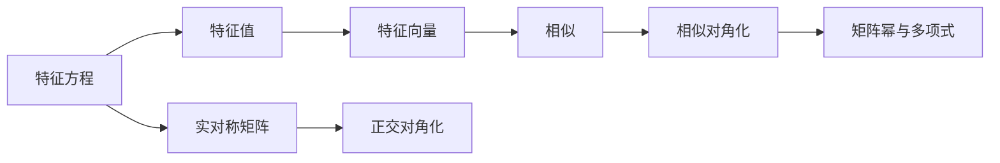

# 第 5 讲 特征值与特征向量

原书范围：[[数学一/01-基础讲义/27张宇基础30讲线代.pdf#page=146|PDF 第 146 页]]至[[数学一/01-基础讲义/27张宇基础30讲线代.pdf#page=184|第 184 页]]。

## 核心地图

## 先理解“特殊方向”

一般向量经过矩阵变换后，长度和方向都会改变。特征向量是少数特别方向：变换后仍在原直线上，只发生伸缩或反向。

$$
A\boldsymbol\xi=\lambda\boldsymbol\xi
$$

中，$\boldsymbol\xi$ 给方向，$\lambda$ 给伸缩倍数：

- $|\lambda|>1$：拉长；
- $0<|\lambda|<1$：缩短；
- $\lambda<0$：同时反向；
- $\lambda=0$：该方向被压到零向量。

## 零基础例子：对角矩阵的特征方向一眼可见

设

$$
D=
\begin{bmatrix}
2&0\\
0&3
\end{bmatrix}.
$$

对横轴方向

$$
\boldsymbol e_1=
\begin{bmatrix}1\\0\end{bmatrix},
$$

有

$$
D\boldsymbol e_1
=
\begin{bmatrix}2\\0\end{bmatrix}
=2\boldsymbol e_1.
$$

所以 $\boldsymbol e_1$ 是特征向量，对应特征值为 $2$。

对纵轴方向

$$
\boldsymbol e_2=
\begin{bmatrix}0\\1\end{bmatrix},
$$

有

$$
D\boldsymbol e_2
=
\begin{bmatrix}0\\3\end{bmatrix}
=3\boldsymbol e_2.
$$

所以 $\boldsymbol e_2$ 是特征向量，对应特征值为 $3$。

对一般向量 $(x,y)^T$，

$$
D
\begin{bmatrix}x\\y\end{bmatrix}
=
\begin{bmatrix}2x\\3y\end{bmatrix},
$$

横、纵方向伸缩倍数不同，结果通常不再与原向量共线。这说明特征向量是“保持在原直线上的特殊方向”，不是任意向量。

## 本讲总主链

$$
\boxed{
A\boldsymbol\xi=\lambda\boldsymbol\xi
\longrightarrow
(A-\lambda I)\boldsymbol\xi=\boldsymbol0
\longrightarrow
|A-\lambda I|=0
\longrightarrow
\lambda
\longrightarrow
\boldsymbol\xi
\longrightarrow
\text{对角化}
}.
$$

做题时必须先求特征值，再对每个特征值分别解特征向量；顺序不能倒。

## 1. 定义与计算顺序

若存在数 $\lambda$ 和非零向量 $\boldsymbol\xi$ 使

$$
A\boldsymbol\xi=\lambda\boldsymbol\xi,
$$

则 $\lambda$ 是特征值，$\boldsymbol\xi$ 是属于 $\lambda$ 的特征向量。

计算顺序：

1. 解特征方程 $|\lambda I-A|=0$；
2. 对每个 $\lambda_i$ 解 $(A-\lambda_iI)\boldsymbol x=0$；
3. 特征向量必须非零，同一特征值的所有特征向量加零向量构成特征子空间。

常用不变量：

$$
\sum_i\lambda_i=\operatorname{tr}(A),
\qquad
\prod_i\lambda_i=|A|
$$

（特征值按代数重数计算）。

若 $A$ 可逆，则 $A^{-1}$ 的特征值为 $1/\lambda_i$；$kA+bI$ 的特征值为 $k\lambda_i+b$；多项式 $f(A)$ 的特征值为 $f(\lambda_i)$。

### 特征方程为什么是行列式为 0

由 $A\boldsymbol\xi=\lambda\boldsymbol\xi$ 移项：

$$
(A-\lambda I)\boldsymbol\xi=0.
$$

特征向量要求非零，所以这个齐次方程必须有非零解，即系数矩阵不可逆：

$$
|A-\lambda I|=0.
$$

因此求特征值，本质上仍是在问齐次方程何时出现非零解。

### 例 1：求特征值与特征向量

设

$$
A=\begin{bmatrix}2&1\\1&2\end{bmatrix}.
$$

特征方程：

$$
|\lambda I-A|
=\begin{vmatrix}\lambda-2&-1\\-1&\lambda-2\end{vmatrix}
=(\lambda-2)^2-1
=(\lambda-1)(\lambda-3).
$$

所以 $\lambda_1=1,\lambda_2=3$。

- 当 $\lambda=1$，$(A-I)\boldsymbol x=0$ 给出 $x_1+x_2=0$，特征向量为 $k(1,-1)^T$，$k\ne0$。
- 当 $\lambda=3$，$(A-3I)\boldsymbol x=0$ 给出 $x_1-x_2=0$，特征向量为 $k(1,1)^T$，$k\ne0$。

检查：迹为 4，$1+3=4$；行列式为 3，$1\times3=3$。

## 2. 相似矩阵

若存在可逆矩阵 $P$ 使

$$
B=P^{-1}AP,
$$

则 $A,B$ 相似，表示同一线性变换在不同基下的矩阵。

相似保持：特征多项式、特征值及其重数、迹、行列式、秩，以及 $f(A)$ 的对应结构。

> [!warning] 反向一般不成立
> 特征值相同并不足以推出矩阵相似。例如单位矩阵 $I$ 只与自身相似，而某些非对角矩阵也可能只有特征值 1。

## 3. 相似对角化

$n$ 阶矩阵 $A$ 可相似对角化，当且仅当有 $n$ 个线性无关的特征向量。此时

$$
P^{-1}AP=\Lambda,
$$

$P$ 的列是与 $\Lambda$ 对角元顺序对应的特征向量。

常用充分条件：$A$ 有 $n$ 个互异特征值。

对重特征值 $\lambda$，必须检查

$$
\dim N(A-\lambda I)=\text{该特征值的代数重数}.
$$

### 对角化为什么能简化运算

若

$$
A=P\Lambda P^{-1},
$$

可以理解为：先换到特征向量组成的坐标系，在该坐标系中，复杂变换变成各方向独立伸缩；计算完成后再换回原坐标系。

对角矩阵乘方只需给每个对角元乘方，所以

$$
A^n=P\Lambda^nP^{-1}.
$$

### 代数重数与几何重数

- 代数重数：$\lambda$ 作为特征多项式根重复几次；
- 几何重数：$N(A-\lambda I)$ 的维数，即该特征值能提供几个线性无关特征向量。

始终有

$$
1\le\text{几何重数}\le\text{代数重数}.
$$

可对角化要求每个特征值的几何重数都等于代数重数。

### 例 2：对角化并求矩阵幂

设

$$
A=\begin{bmatrix}1&1\\0&2\end{bmatrix}.
$$

特征值为 1、2，互异，故可对角化。

- $\lambda=1$ 的特征向量可取 $(1,0)^T$；
- $\lambda=2$ 的特征向量可取 $(1,1)^T$。

令

$$
P=\begin{bmatrix}1&1\\0&1\end{bmatrix},
\qquad
\Lambda=\begin{bmatrix}1&0\\0&2\end{bmatrix}.
$$

则 $A=P\Lambda P^{-1}$，所以

$$
A^n=P\Lambda^nP^{-1}
=\begin{bmatrix}1&2^n-1\\0&2^n\end{bmatrix}.
$$

把 $n=1$ 代回可恢复原矩阵，是很好的自检。

## 4. 实对称矩阵

实对称矩阵 $A^T=A$ 有特别强的结论：

1. 特征值全为实数；
2. 不同特征值的特征向量相互正交；
3. 必可正交对角化，即存在正交矩阵 $Q$：

$$
Q^TAQ=\Lambda,
\qquad Q^{-1}=Q^T.
$$

同一重特征值下的特征向量不一定天然正交，需要在对应特征子空间内施密特正交化。

### 例 3：正交对角化

沿用

$$
A=\begin{bmatrix}2&1\\1&2\end{bmatrix}.
$$

把例 1 的特征向量单位化：

$$
\boldsymbol q_1=\frac1{\sqrt2}(1,-1)^T,
\qquad
\boldsymbol q_2=\frac1{\sqrt2}(1,1)^T.
$$

令

$$
Q=\frac1{\sqrt2}
\begin{bmatrix}1&1\\-1&1\end{bmatrix}.
$$

列向量依次对应特征值 1、3，因此

$$
Q^TAQ=\begin{bmatrix}1&0\\0&3\end{bmatrix}.
$$

## 5. 不能对角化的典型情形

设

$$
J=\begin{bmatrix}1&1\\0&1\end{bmatrix}.
$$

它只有特征值 1，代数重数为 2。但

$$
r(J-I)=1,
$$

所以 $\dim N(J-I)=1$，只有一个线性无关特征向量，不能相似对角化。

## 二阶特征多项式的快速公式

对

$$
A=
\begin{bmatrix}
a&b\\
c&d
\end{bmatrix},
$$

有

$$
\begin{aligned}
|\lambda I-A|
&=
\begin{vmatrix}
\lambda-a&-b\\
-c&\lambda-d
\end{vmatrix}\\
&=(\lambda-a)(\lambda-d)-bc\\
&=\lambda^2-(a+d)\lambda+(ad-bc).
\end{aligned}
$$

注意

$$
a+d=\operatorname{tr}(A),
\qquad
ad-bc=|A|.
$$

因此

$$
\boxed{
|\lambda I-A|
=\lambda^2-\operatorname{tr}(A)\lambda+|A|
}.
$$

若两个特征值为 $\lambda_1,\lambda_2$，则

$$
\boxed{
\lambda_1+\lambda_2=\operatorname{tr}(A),
\qquad
\lambda_1\lambda_2=|A|
}.
$$

这既能帮助计算，也能用来验算。

## 零特征值与可逆性的关系

若 $0$ 是 $A$ 的特征值，则存在非零向量 $\boldsymbol\xi$ 使

$$
A\boldsymbol\xi=0\boldsymbol\xi=\boldsymbol0.
$$

这说明齐次方程有非零解，$A$ 不可逆。

反过来，若 $A$ 不可逆，则 $A\boldsymbol x=\boldsymbol0$ 有非零解，这个非零解就是属于特征值 $0$ 的特征向量。

所以

$$
\boxed{
0\text{ 是 }A\text{ 的特征值}
\iff
|A|=0
\iff
A\text{ 不可逆}
}.
$$

## 特征值怎样随矩阵运算变化

若

$$
A\boldsymbol\xi=\lambda\boldsymbol\xi,
\qquad
\boldsymbol\xi\ne\boldsymbol0,
$$

则：

### 数乘与平移

$$
(kA+bI)\boldsymbol\xi
=kA\boldsymbol\xi+b\boldsymbol\xi
=(k\lambda+b)\boldsymbol\xi.
$$

所以 $kA+bI$ 对应特征值为

$$
\boxed{k\lambda+b}.
$$

### 矩阵幂

$$
A^2\boldsymbol\xi
=A(\lambda\boldsymbol\xi)
=\lambda A\boldsymbol\xi
=\lambda^2\boldsymbol\xi.
$$

继续得到

$$
\boxed{A^m\text{ 对应特征值为 }\lambda^m}.
$$

### 逆矩阵

若 $A$ 可逆，由

$$
A\boldsymbol\xi=\lambda\boldsymbol\xi
$$

两边左乘 $A^{-1}$：

$$
\boldsymbol\xi=\lambda A^{-1}\boldsymbol\xi.
$$

因为可逆矩阵的特征值不为零，

$$
\boxed{
A^{-1}\boldsymbol\xi
=\frac1\lambda\boldsymbol\xi
}.
$$

### 多项式

对

$$
f(t)=a_0+a_1t+\cdots+a_mt^m,
$$

有

$$
\boxed{
f(A)\boldsymbol\xi=f(\lambda)\boldsymbol\xi
}.
$$

## 对角化公式为什么成立

设 $A$ 有 $n$ 个线性无关特征向量

$$
\boldsymbol\xi_1,\ldots,\boldsymbol\xi_n,
$$

对应特征值为

$$
\lambda_1,\ldots,\lambda_n.
$$

把特征向量按列组成

$$
P=
\begin{bmatrix}
\boldsymbol\xi_1&\cdots&\boldsymbol\xi_n
\end{bmatrix}.
$$

那么

$$
\begin{aligned}
AP
&=
\begin{bmatrix}
A\boldsymbol\xi_1&\cdots&A\boldsymbol\xi_n
\end{bmatrix}\\
&=
\begin{bmatrix}
\lambda_1\boldsymbol\xi_1&\cdots&
\lambda_n\boldsymbol\xi_n
\end{bmatrix}\\
&=P\Lambda.
\end{aligned}
$$

因为特征向量线性无关，所以 $P$ 可逆。左乘 $P^{-1}$：

$$
\boxed{P^{-1}AP=\Lambda}.
$$

这也说明 $P$ 的列顺序必须与 $\Lambda$ 的对角元顺序一一对应。

## 实对称矩阵中不同特征值为何正交

设 $A^T=A$，且

$$
A\boldsymbol\xi=\lambda\boldsymbol\xi,
\qquad
A\boldsymbol\eta=\mu\boldsymbol\eta,
\qquad
\lambda\ne\mu.
$$

一方面，

$$
(A\boldsymbol\xi,\boldsymbol\eta)
=\lambda(\boldsymbol\xi,\boldsymbol\eta).
$$

另一方面，因为 $A$ 对称，

$$
(A\boldsymbol\xi,\boldsymbol\eta)
=(\boldsymbol\xi,A\boldsymbol\eta)
=\mu(\boldsymbol\xi,\boldsymbol\eta).
$$

两式相减：

$$
(\lambda-\mu)(\boldsymbol\xi,\boldsymbol\eta)=0.
$$

由于 $\lambda\ne\mu$，只能有

$$
\boxed{(\boldsymbol\xi,\boldsymbol\eta)=0}.
$$

## 本讲母公式

$$
\boxed{
A\boldsymbol\xi=\lambda\boldsymbol\xi,
\quad
\boldsymbol\xi\ne\boldsymbol0,
\quad
|\lambda I-A|=0
}
$$

$$
\boxed{
\sum_{i=1}^n\lambda_i=\operatorname{tr}(A),
\qquad
\prod_{i=1}^n\lambda_i=|A|
}
$$

$$
\boxed{
A\text{ 可对角化}
\iff
A\text{ 有 }n\text{ 个线性无关特征向量}
}
$$

$$
\boxed{
P^{-1}AP=\Lambda,
\qquad
A^m=P\Lambda^mP^{-1}
}
$$

$$
\boxed{
A^T=A
\Rightarrow
\exists Q\text{ 正交，使 }Q^TAQ=\Lambda
}
$$

## 本讲检测题与完整答案

### 检测 1：求特征值与特征向量

设

$$
A=
\begin{bmatrix}
4&1\\
2&3
\end{bmatrix}.
$$

求其特征值和对应特征向量。

> [!success]- 完整答案
>
> $$
> \begin{aligned}
> |\lambda I-A|
> &=
> \begin{vmatrix}
> \lambda-4&-1\\
> -2&\lambda-3
> \end{vmatrix}\\
> &=(\lambda-4)(\lambda-3)-2\\
> &=\lambda^2-7\lambda+10\\
> &=(\lambda-5)(\lambda-2).
> \end{aligned}
> $$
>
> 所以 $\lambda_1=5,\lambda_2=2$。
>
> 当 $\lambda=5$ 时，
>
> $$
> -x_1+x_2=0,
> $$
>
> 可取
>
> $$
> \boldsymbol\xi_1=
> \begin{bmatrix}1\\1\end{bmatrix}.
> $$
>
> 当 $\lambda=2$ 时，
>
> $$
> 2x_1+x_2=0,
> $$
>
> 可取
>
> $$
> \boldsymbol\xi_2=
> \begin{bmatrix}1\\-2\end{bmatrix}.
> $$
>
> 验算：
>
> $$
> 5+2=7=\operatorname{tr}(A),
> \qquad
> 5\cdot2=10=|A|.
> $$

### 检测 2：判断能否对角化

判断

$$
J=
\begin{bmatrix}
2&1\\
0&2
\end{bmatrix}
$$

能否相似对角化。

> [!success]- 完整答案
>
> $J$ 只有特征值 $\lambda=2$，代数重数为 2。
>
> $$
> J-2I=
> \begin{bmatrix}
> 0&1\\
> 0&0
> \end{bmatrix}.
> $$
>
> 方程 $(J-2I)\boldsymbol x=0$ 给出 $x_2=0$，只有一个自由变量，所以特征子空间维数为 1。
>
> 几何重数小于代数重数，因此
>
> $$
> \boxed{J\text{ 不能相似对角化}}.
> $$

### 检测 3：由已知特征值推新矩阵

若 $A$ 的特征值为 $1,2,4$，求 $3A^{-1}-2I$ 的特征值。

> [!success]- 完整答案
>
> $A^{-1}$ 的特征值为
>
> $$
> 1,\quad\frac12,\quad\frac14.
> $$
>
> 再作变换 $\mu=3/\lambda-2$，得到
>
> $$
> 1,\quad-\frac12,\quad-\frac54.
> $$
>
> 所以
>
> $$
> \boxed{
> 3A^{-1}-2I\text{ 的特征值为 }
> 1,-\frac12,-\frac54
> }.
> $$

### 检测 4：用对角化求幂

已知

$$
A=P
\begin{bmatrix}
1&0\\
0&3
\end{bmatrix}
P^{-1},
$$

写出 $A^n$。

> [!success]- 完整答案
>
> 令
>
> $$
> \Lambda=
> \begin{bmatrix}
> 1&0\\
> 0&3
> \end{bmatrix}.
> $$
>
> 利用中间的 $P^{-1}P$ 连续抵消：
>
> $$
> A^n=P\Lambda^nP^{-1}.
> $$
>
> 因此
>
> $$
> \boxed{
> A^n
> =P
> \begin{bmatrix}
> 1&0\\
> 0&3^n
> \end{bmatrix}
> P^{-1}
> }.
> $$

### 检测 5：正交化时为什么还要单位化

若 $A$ 为实对称矩阵，已找到两两正交的特征向量，为什么构造正交矩阵 $Q$ 前还要单位化？

> [!success]- 完整答案
>
> 正交矩阵要求
>
> $$
> Q^TQ=I.
> $$
>
> 列向量两两正交只能保证 $Q^TQ$ 的非对角元为零；只有每个列向量长度也为 1，主对角元才是 1。
>
> 所以必须把每个正交特征向量除以自身长度，得到标准正交向量。

## 特征值题的执行流程

1. 先用迹和行列式预判特征值之和、之积，便于验算。
2. 解 $|\lambda I-A|=0$，保留每个根的代数重数。
3. 对每个特征值分别解齐次方程，特征向量不能取零。
4. 对角化时统计线性无关特征向量总数是否达到 $n$。
5. 构造 $P$ 时让列向量顺序与 $\Lambda$ 对角元严格对应。
6. 实对称矩阵要求正交对角化时，同一特征子空间内也要正交化并单位化。

## 现代补充：SVD 不要求方阵可对角化

相似对角化只适用于满足条件的方阵。奇异值分解则对任意 $m\times n$ 实矩阵成立：

$$
A=U\Sigma V^T,
$$

其中 $U,V$ 为正交矩阵，$\Sigma$ 的非零对角元是奇异值。奇异值平方是 $A^TA$ 的非零特征值。

SVD 把任意线性映射理解为“旋转/反射—轴向伸缩—旋转/反射”，并连接秩、最小二乘、压缩和条件数。它是现代应用的重要工具，但不是本书考研主线，参见 [MIT OCW SVD](https://ocw.mit.edu/courses/18-06sc-linear-algebra-fall-2011/pages/positive-definite-matrices-and-applications/singular-value-decomposition/)。

## 易错清单

- [ ] 把零向量列为特征向量。
- [ ] 求出特征值后不解特征向量。
- [ ] 重特征值出现就断言不可对角化，或断言一定可对角化。
- [ ] 构造 $P$ 时特征向量顺序与 $\Lambda$ 对角元不对应。
- [ ] 相似矩阵的特征值相同，就把反命题当真。
- [ ] 实对称矩阵正交对角化时只正交、不单位化。

上一讲 [[05-线性方程组]] · 返回 [[00-线性代数总览]] · 下一讲 [[07-二次型]]
