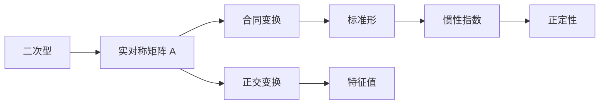

# 第 6 讲 二次型

原书范围：[[数学一/01-基础讲义/27张宇基础30讲线代.pdf#page=185|PDF 第 185 页]]至[[数学一/01-基础讲义/27张宇基础30讲线代.pdf#page=213|第 213 页]]。

## 核心地图

## 本讲先解决四个问题

1. 怎样把含 $x_ix_j$ 的二次多项式写成 $\boldsymbol x^TA\boldsymbol x$？
2. 怎样通过换元消掉交叉项，化成若干平方项之和？
3. 标准形、规范形、惯性指数分别记录什么？
4. 怎样判断二次型对所有非零向量是否恒为正？

总主线是

$$
\boxed{
f(\boldsymbol x)
\longrightarrow
A
\longrightarrow
\boldsymbol x=C\boldsymbol y
\longrightarrow
C^TAC
\longrightarrow
\text{标准形}
\longrightarrow
\text{惯性指数与正定性}
}.
$$

## 零基础准备：什么叫二次型

只含二次项的齐次多项式称为二次型。例如

$$
f(x_1,x_2)=2x_1^2+4x_1x_2+5x_2^2
$$

是二次型，因为每一项的总次数都是 2。

而

$$
x_1^2+x_2+1
$$

不是二次型，因为含有一次项 $x_2$ 和常数项 $1$。

二元二次型的一般形式为

$$
f(x_1,x_2)
=a_{11}x_1^2+2a_{12}x_1x_2+a_{22}x_2^2.
$$

它对应唯一的实对称矩阵

$$
A=
\begin{bmatrix}
a_{11}&a_{12}\\
a_{12}&a_{22}
\end{bmatrix},
$$

并且

$$
\boxed{
f(\boldsymbol x)=\boldsymbol x^TA\boldsymbol x
}.
$$

### 展开矩阵形式验证

$$
\begin{aligned}
\boldsymbol x^TA\boldsymbol x
&=
\begin{bmatrix}x_1&x_2\end{bmatrix}
\begin{bmatrix}
a_{11}&a_{12}\\
a_{12}&a_{22}
\end{bmatrix}
\begin{bmatrix}x_1\\x_2\end{bmatrix}\\
&=
\begin{bmatrix}
a_{11}x_1+a_{12}x_2&
a_{12}x_1+a_{22}x_2
\end{bmatrix}
\begin{bmatrix}x_1\\x_2\end{bmatrix}\\
&=a_{11}x_1^2+2a_{12}x_1x_2+a_{22}x_2^2.
\end{aligned}
$$

这就是交叉项系数要除以 2 填入矩阵的根本原因。

## 先从图形理解二次型

二次型

$$
f(\boldsymbol x)=\boldsymbol x^TA\boldsymbol x
$$

描述一个随方向变化的“弯曲程度”。在二维中，$f(x,y)=1$ 可能是椭圆、双曲线或退化图形：

- 所有方向都给正值，通常形成封闭椭圆，对应正定；
- 有的方向为正、有的为负，形成双曲型结构，对应不定；
- 某些非零方向取 0，图形可能退化，对应半正定或秩不足。

化标准形，就是通过换元找出图形真正的主轴方向，让交叉项消失。

## 1. 二次型与矩阵表示

$n$ 元二次型可写成

$$
f(\boldsymbol x)=\boldsymbol x^TA\boldsymbol x,
$$

其中 $A$ 取实对称矩阵。交叉项要平分：若二次型含 $2a_{ij}x_ix_j$，则矩阵的 $(i,j)$ 与 $(j,i)$ 元都是 $a_{ij}$。

### 为什么交叉项系数要除以 2

展开 $\boldsymbol x^TA\boldsymbol x$ 时，$a_{ij}x_ix_j$ 与对称位置的 $a_{ji}x_jx_i$ 各出现一次。实对称矩阵满足 $a_{ij}=a_{ji}$，两项合起来是

$$
2a_{ij}x_ix_j.
$$

因此原式交叉项系数为 4 时，矩阵两个对称位置都应填 2。

### 例 1：从表达式写矩阵

$$
f(x_1,x_2)=2x_1^2+4x_1x_2+5x_2^2.
$$

交叉项 $4x_1x_2=2a_{12}x_1x_2$，所以 $a_{12}=a_{21}=2$：

$$
A=\begin{bmatrix}2&2\\2&5\end{bmatrix},
\qquad
f=\begin{bmatrix}x_1&x_2\end{bmatrix}
A\begin{bmatrix}x_1\\x_2\end{bmatrix}.
$$

## 2. 合同变换与标准形

作可逆线性替换

$$
\boldsymbol x=C\boldsymbol y,
$$

则

$$
f=\boldsymbol y^T(C^TAC)\boldsymbol y.
$$

$A$ 与 $C^TAC$ 称为合同。合同保持正、负惯性指数，但一般不保持特征值。

标准形：

$$
f=d_1y_1^2+\cdots+d_ny_n^2.
$$

规范形进一步把非零系数化为 $1$ 或 $-1$：

$$
z_1^2+\cdots+z_p^2-z_{p+1}^2-\cdots-z_{p+q}^2.
$$

Sylvester 惯性定理保证 $p,q$ 与所选可逆变换无关。

### 为什么二次型使用合同变换

变量替换 $\boldsymbol x=C\boldsymbol y$ 同时出现在二次型左右两侧：

$$
\boldsymbol x^TA\boldsymbol x
=(C\boldsymbol y)^TA(C\boldsymbol y)
=\boldsymbol y^TC^TAC\boldsymbol y.
$$

所以自然出现 $C^TAC$。相似变换 $P^{-1}AP$ 来自线性映射换基，研究对象不同。

## 3. 配方法

配方法适合快速得到标准形，但变换必须可逆。

### 例 2：配方并判断惯性指数

化简

$$
f=x_1^2+4x_1x_2+3x_2^2.
$$

配方：

$$
f=(x_1+2x_2)^2-x_2^2.
$$

令

$$
y_1=x_1+2x_2,
\qquad y_2=x_2,
$$

变换可逆，得到规范形

$$
f=y_1^2-y_2^2.
$$

正惯性指数 $p=1$，负惯性指数 $q=1$，秩为 2；该二次型不正定也不负定。

## 4. 正交变换法

实对称矩阵必可正交对角化。取正交矩阵 $Q$ 使

$$
Q^TAQ=\Lambda,
$$

再令 $\boldsymbol x=Q\boldsymbol y$，则

$$
f=\lambda_1y_1^2+\cdots+\lambda_ny_n^2.
$$

这种方法同时给出标准形和正交变换。

### 例 3：正交变换化标准形

沿用例 1：

$$
A=\begin{bmatrix}2&2\\2&5\end{bmatrix}.
$$

特征多项式：

$$
|\lambda I-A|
=(\lambda-2)(\lambda-5)-4
=\lambda^2-7\lambda+6,
$$

故特征值为 $1,6$。

- 属于 $1$ 的特征向量可取 $(-2,1)^T$；
- 属于 $6$ 的特征向量可取 $(1,2)^T$。

二者已正交，单位化并按此顺序组成

$$
Q=\frac1{\sqrt5}
\begin{bmatrix}-2&1\\1&2\end{bmatrix}.
$$

令 $\boldsymbol x=Q\boldsymbol y$，则

$$
Q^TAQ=\begin{bmatrix}1&0\\0&6\end{bmatrix},
$$

所以

$$
f=y_1^2+6y_2^2.
$$

两个特征值均为正，故二次型正定。

## 5. 正定二次型

实对称矩阵 $A$ 正定，是指对任意非零 $\boldsymbol x$：

$$
\boldsymbol x^TA\boldsymbol x>0.
$$

等价条件：

- 所有特征值都大于 0；
- 正惯性指数为 $n$；
- 存在可逆 $C$ 使 $A=C^TC$；
- $A$ 的所有顺序主子式都大于 0（Sylvester 判据）。

注意是**顺序主子式**：左上角 $k$ 阶主子式。

### 三种正定判法怎么选

- 低阶矩阵且含参数：顺序主子式通常最快；
- 已求出特征值：直接看是否全部大于 0；
- 已化标准形：看所有平方项系数是否为正；
- 已知 $A=C^TC$ 且 $C$ 可逆：直接正定。

不能只检查 $|A|>0$。两个负特征值的乘积也为正，但矩阵不是正定。

### 例 4：含参数正定性

判断

$$
A=\begin{bmatrix}1&a\\a&2\end{bmatrix}
$$

何时正定。

由 Sylvester 判据：

$$
\Delta_1=1>0,
$$

$$
\Delta_2=|A|=2-a^2>0.
$$

因此

$$
|a|<\sqrt2.
$$

边界 $|a|=\sqrt2$ 时行列式为 0，只是半正定候选，绝不是正定。

## 6. 相似与合同不要混

| 问题 | 变换 | 典型目标 |
|---|---|---|
| 线性变换换基 | $P^{-1}AP$ | 相似对角化 |
| 二次型变量替换 | $C^TAC$ | 标准形、规范形 |
| 实对称矩阵用正交矩阵 | $Q^TAQ=Q^{-1}AQ$ | 两种形式恰好一致 |

正交矩阵下 $Q^{-1}=Q^T$，所以相似与合同形式相同；这是一种特殊重合，不能推广到一般可逆矩阵。

## 正定、半正定、不定怎样区分

对任意非零向量 $\boldsymbol x$，观察

$$
f(\boldsymbol x)=\boldsymbol x^TA\boldsymbol x
$$

的符号：

| 类型 | 定义 |
|---|---|
| 正定 | 对所有 $\boldsymbol x\ne0$，都有 $f(\boldsymbol x)>0$ |
| 半正定 | 对所有 $\boldsymbol x$，都有 $f(\boldsymbol x)\ge0$，但存在非零向量使其为 0 |
| 负定 | 对所有 $\boldsymbol x\ne0$，都有 $f(\boldsymbol x)<0$ |
| 半负定 | 对所有 $\boldsymbol x$，都有 $f(\boldsymbol x)\le0$，但存在非零向量使其为 0 |
| 不定 | 有的非零向量使 $f>0$，另一些使 $f<0$ |

例如：

$$
x_1^2+x_2^2
$$

正定；

$$
x_1^2
$$

半正定，因为 $(0,1)^T\ne0$ 时取值为 0；

$$
x_1^2-x_2^2
$$

不定，因为在 $(1,0)^T$ 上为正，在 $(0,1)^T$ 上为负。

## 二元二次型配方的通用公式

设

$$
f=ax^2+2bxy+cy^2,
\qquad a\ne0.
$$

先对 $x$ 配方：

$$
\begin{aligned}
f
&=a\left(x^2+2\frac ba xy\right)+cy^2\\
&=a\left(x+\frac ba y\right)^2
-\frac{b^2}{a}y^2+cy^2\\
&=a\left(x+\frac ba y\right)^2
+\frac{ac-b^2}{a}y^2.
\end{aligned}
$$

注意

$$
ac-b^2
=
\begin{vmatrix}
a&b\\
b&c
\end{vmatrix}
=|A|.
$$

所以

$$
\boxed{
f
=a\left(x+\frac ba y\right)^2
+\frac{|A|}{a}y^2
}.
$$

若希望 $f$ 正定，两个平方项系数都必须为正：

$$
a>0,
\qquad
\frac{|A|}{a}>0.
$$

因为 $a>0$，第二个条件等价于 $|A|>0$。于是二阶 Sylvester 判据自然出现：

$$
\boxed{
A=
\begin{bmatrix}
a&b\\
b&c
\end{bmatrix}
\text{ 正定}
\iff
a>0,\quad ac-b^2>0
}.
$$

## 惯性指数到底在数什么

二次型化为标准形

$$
f=d_1y_1^2+\cdots+d_ny_n^2
$$

后：

- 正系数个数记为 $p$，称正惯性指数；
- 负系数个数记为 $q$，称负惯性指数；
- 零系数个数为 $n-p-q$；
- 二次型的秩为

$$
\boxed{r(A)=p+q}.
$$

Sylvester 惯性定理说明：无论采用哪一种可逆线性替换，只要最终化成标准形，$p,q$ 都不会改变。

所以标准形中的具体系数可能不同，例如

$$
y_1^2-2y_2^2
$$

与

$$
3z_1^2-z_2^2
$$

系数不同，但正、负系数个数都是 $(1,1)$，规范形都可化为

$$
u_1^2-u_2^2.
$$

## Sylvester 正定判据逐阶理解

设 $A$ 为 $n$ 阶实对称矩阵，左上角 $k$ 阶顺序主子式记作

$$
\Delta_k.
$$

则

$$
\boxed{
A\text{ 正定}
\iff
\Delta_1>0,\Delta_2>0,\ldots,\Delta_n>0
}.
$$

三阶时要依次检查

$$
\Delta_1=a_{11}>0,
$$

$$
\Delta_2=
\begin{vmatrix}
a_{11}&a_{12}\\
a_{21}&a_{22}
\end{vmatrix}>0,
$$

$$
\Delta_3=|A|>0.
$$

不能只检查最后一个行列式，因为行列式只是所有特征值的乘积。两个负特征值相乘也可能得到正数。

## 本讲母公式

### 矩阵表示

$$
\boxed{
f(\boldsymbol x)=\boldsymbol x^TA\boldsymbol x,
\qquad A^T=A
}
$$

### 可逆变量替换与合同

$$
\boxed{
\boldsymbol x=C\boldsymbol y
\Rightarrow
f=\boldsymbol y^T(C^TAC)\boldsymbol y
}
$$

### 标准形与惯性指数

$$
\boxed{
f=d_1y_1^2+\cdots+d_ny_n^2,
\qquad
r(A)=p+q
}
$$

### 正交变换

$$
\boxed{
Q^TAQ=\Lambda
\Rightarrow
f=\lambda_1y_1^2+\cdots+\lambda_ny_n^2
}
$$

### 正定等价条件

$$
\boxed{
A\text{ 正定}
\iff
\lambda_i>0\ (\forall i)
\iff
\Delta_k>0\ (k=1,\ldots,n)
}
$$

## 本讲检测题与完整答案

### 检测 1：由二次型写矩阵

写出

$$
f(x_1,x_2,x_3)
=2x_1^2+3x_2^2+x_3^2
+4x_1x_2-2x_1x_3+6x_2x_3
$$

对应的实对称矩阵。

> [!success]- 完整答案
>
> 平方项系数直接放在主对角线：
>
> $$
> a_{11}=2,\qquad a_{22}=3,\qquad a_{33}=1.
> $$
>
> 交叉项系数平分到两个对称位置：
>
> $$
> a_{12}=a_{21}=2,
> $$
>
> $$
> a_{13}=a_{31}=-1,
> $$
>
> $$
> a_{23}=a_{32}=3.
> $$
>
> 所以
>
> $$
> \boxed{
> A=
> \begin{bmatrix}
> 2&2&-1\\
> 2&3&3\\
> -1&3&1
> \end{bmatrix}
> }.
> $$

### 检测 2：配方并求惯性指数

将

$$
f=x_1^2+2x_1x_2-3x_2^2
$$

化为标准形，并求正、负惯性指数。

> [!success]- 完整答案
>
> 对 $x_1$ 配方：
>
> $$
> \begin{aligned}
> f
> &=(x_1+x_2)^2-x_2^2-3x_2^2\\
> &=(x_1+x_2)^2-4x_2^2.
> \end{aligned}
> $$
>
> 令
>
> $$
> y_1=x_1+x_2,
> \qquad
> y_2=x_2,
> $$
>
> 得到标准形
>
> $$
> f=y_1^2-4y_2^2.
> $$
>
> 所以
>
> $$
> \boxed{p=1,\qquad q=1}.
> $$
>
> 该二次型不定。

### 检测 3：含参数正定

判断

$$
A=
\begin{bmatrix}
2&a\\
a&3
\end{bmatrix}
$$

何时正定。

> [!success]- 完整答案
>
> 由二阶 Sylvester 判据：
>
> $$
> \Delta_1=2>0,
> $$
>
> $$
> \Delta_2=6-a^2>0.
> $$
>
> 所以
>
> $$
> a^2<6,
> $$
>
> 即
>
> $$
> \boxed{-\sqrt6<a<\sqrt6}.
> $$
>
> 边界处行列式为零，不是正定。

### 检测 4：由特征值判断类型

实对称矩阵 $A$ 的特征值为 $-1,0,3$。判断二次型 $\boldsymbol x^TA\boldsymbol x$ 的类型及惯性指数。

> [!success]- 完整答案
>
> 正特征值有一个，负特征值有一个，零特征值有一个。因此
>
> $$
> p=1,\qquad q=1,\qquad r(A)=2.
> $$
>
> 因为同时有正、负特征值，所以存在方向使二次型为正，也存在方向使其为负：
>
> $$
> \boxed{\text{二次型不定}}.
> $$

### 检测 5：相似与合同

说明为什么一般的可逆变量替换 $\boldsymbol x=C\boldsymbol y$ 产生 $C^TAC$，而不是 $C^{-1}AC$。

> [!success]- 完整答案
>
> 直接代入：
>
> $$
> \begin{aligned}
> \boldsymbol x^TA\boldsymbol x
> &=(C\boldsymbol y)^TA(C\boldsymbol y)\\
> &=\boldsymbol y^TC^TAC\boldsymbol y.
> \end{aligned}
> $$
>
> 左侧的 $\boldsymbol x^T$ 代入后产生 $C^T$，右侧的 $\boldsymbol x$ 产生 $C$，所以自然得到合同变换 $C^TAC$。
>
> 只有当 $C$ 为正交矩阵时，$C^{-1}=C^T$，合同形式才与相似形式重合。

## 二次型题的执行流程

1. 平方项直接填对角线，交叉项系数除以 2 后对称填入。
2. 只要标准形可选配方法；要求正交变换时必须求实对称矩阵的特征向量。
3. 构造正交矩阵时，按特征值顺序排列单位特征向量。
4. 惯性指数只数标准形中正、负系数个数，不受合同变换选择影响。
5. 正定参数题优先写顺序主子式链，并要求严格大于 0。
6. 最后区分相似、合同，以及正交矩阵下二者形式重合的特殊情况。

## 现代补充：正定矩阵为何重要

若目标函数的 Hessian 矩阵正定，二次近似严格向上弯曲，对应严格局部极小；协方差矩阵至少半正定；最小二乘中满列秩的 $A$ 使 $A^TA$ 正定。现代优化、统计和机器学习大量依赖这一结构。

数值上通常使用 Cholesky 分解

$$
A=LL^T
$$

处理实对称正定系统，这是 LAPACK 等线性代数库的标准问题类别。

## 易错清单

- [ ] 交叉项系数没有除以 2 就填入对称矩阵。
- [ ] 把合同当相似，误以为合同保持特征值。
- [ ] 正交对角化时特征向量未单位化。
- [ ] 配方法引入的变量替换不可逆。
- [ ] 正定判据检查所有主子式而不是顺序主子式，或只检查行列式。
- [ ] 半正定与正定混淆；正定要求所有非零向量上严格大于 0。

上一讲 [[06-特征值与特征向量]] · 返回 [[00-线性代数总览]] · [[99-线性代数公式与易错点速查]]
